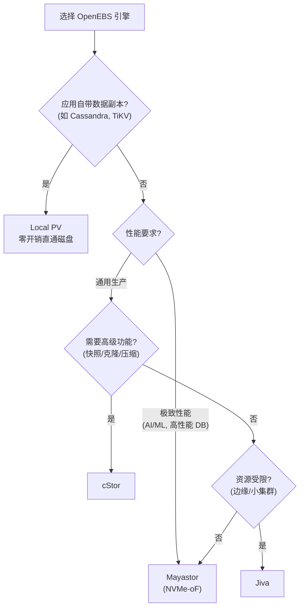
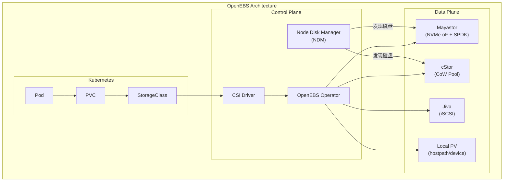
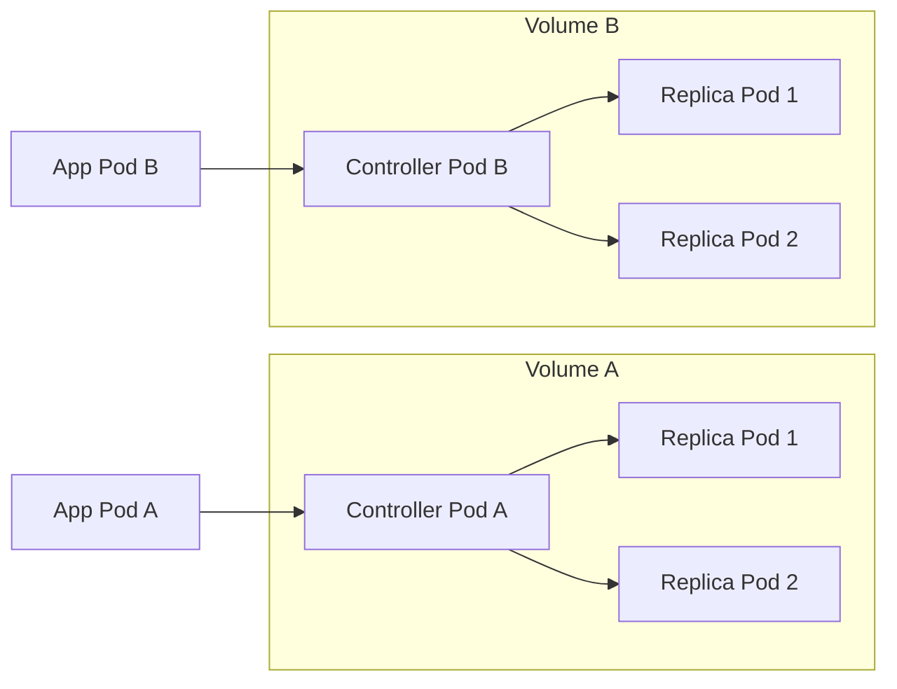

#kubernetes #csi #openebs

相关笔记：[[csi]] | [[longhorn]] | [[ceph-csi]] | [[k8s-interview]]

## OpenEBS 概述

OpenEBS 是 CNCF Graduated 项目，提供多种存储引擎以适配不同场景，是「云原生存储」理念的代表。其核心设计哲学是 **"Storage is just another workload"**（CAS - Container Attached Storage）。

## 存储引擎对比

| 引擎 | 底层 | 特点 | 适用场景 |
| --- | --- | --- | --- |
| **Mayastor** | NVMe-oF (NVMe over Fabrics) | 高性能、低延迟，使用 SPDK 用户态 I/O | AI/ML 训练、高性能数据库 |
| **cStor** | Copy-on-Write 存储池 | 支持快照、克隆、压缩 | 通用生产工作负载 |
| **Jiva** | iSCSI + 简单副本 | 最简单、资源占用少 | 小集群、边缘场景 |
| **Local PV (hostpath/device)** | 本地磁盘直通 | 零开销，最高性能 | 分布式数据库（自带副本的，如 Cassandra） |

### 引擎选择决策



## 架构



### CAS（Container Attached Storage）架构

OpenEBS 的每个 Volume 的存储控制器和副本都是独立的 Pod：



优势：
1. **故障隔离**：Volume A 的控制器故障不影响 Volume B
2. **Kubernetes Native**：完全用 CRD 管理，kubectl 即可运维
3. **无单点故障**：没有集中式的存储控制节点
4. **灵活选型**：同一集群可以混用不同引擎，按需分配

## 安装配置

### Mayastor（推荐生产引擎）

```bash
# 前置要求：节点支持 NVMe、已加载 nvme-tcp 内核模块
modprobe nvme-tcp

# 确认 HugePages 配置（Mayastor 需要）
echo 1024 > /sys/kernel/mm/hugepages/hugepages-2048kB/nr_hugepages

# 通过 Helm 安装
helm repo add openebs https://openebs.github.io/charts
helm install openebs openebs/openebs \
  --namespace openebs --create-namespace \
  --set mayastor.enabled=true
```

### 仅安装 Local PV（最简方式）

```bash
helm install openebs openebs/openebs \
  --namespace openebs --create-namespace \
  --set localprovisioner.enabled=true \
  --set mayastor.enabled=false
```

### StorageClass 示例

```yaml
# Mayastor StorageClass
apiVersion: storage.k8s.io/v1
kind: StorageClass
metadata:
  name: mayastor-3
provisioner: io.openebs.csi-mayastor
parameters:
  protocol: nvmf
  repl_count: "3"
  ioTimeout: "60"
allowVolumeExpansion: true
volumeBindingMode: WaitForFirstConsumer
---
# Local PV StorageClass
apiVersion: storage.k8s.io/v1
kind: StorageClass
metadata:
  name: openebs-hostpath
provisioner: openebs.io/local
parameters:
  basePath: "/var/openebs/local"
reclaimPolicy: Delete
volumeBindingMode: WaitForFirstConsumer
---
# PVC 示例
apiVersion: v1
kind: PersistentVolumeClaim
metadata:
  name: ai-training-data
spec:
  accessModes:
    - ReadWriteOnce
  storageClassName: mayastor-3
  resources:
    requests:
      storage: 100Gi
```

### 验证安装

```bash
# 查看 OpenEBS 组件
kubectl get pods -n openebs

# 查看 NDM 发现的磁盘
kubectl get blockdevices -n openebs

# 查看 CSI Driver
kubectl get csidrivers | grep openebs

# 查看 Mayastor Pool
kubectl get msp -n openebs
```

## 适用场景

| 场景 | 推荐引擎 | 说明 |
| --- | --- | --- |
| AI/ML 训练 | Mayastor | NVMe-oF 低延迟，高吞吐 |
| 高性能数据库 | Mayastor | 50K-80K IOPS |
| 分布式数据库（Cassandra, CockroachDB） | Local PV | 应用自带副本，不需要存储层再做副本 |
| 通用有状态应用 | cStor | 支持快照、克隆，功能全面 |
| 边缘/IoT 小集群 | Jiva | 资源占用最少，部署简单 |
| 开发测试 | Local PV (hostpath) | 零依赖，开箱即用 |

## OpenEBS vs 其他方案

| 维度 | OpenEBS Mayastor | Ceph RBD | Longhorn |
| --- | --- | --- | --- |
| 性能（SSD IOPS） | 50K-80K | 20K-40K | 10K-20K |
| 部署复杂度 | 中（需要 NVMe + HugePages） | 高（独立集群） | 低（Helm 一键） |
| 引擎选择 | 4 种可选 | RBD + CephFS | 仅块存储 |
| CNCF 状态 | Graduated | N/A（独立项目） | Incubating |
| 多引擎混用 | 支持 | 不支持 | 不支持 |

## 面试要点

### Q1: OpenEBS 的 CAS 架构是什么？有什么优势？

> [!question]- 参考答案（点击展开）
>
> CAS（Container Attached Storage）是 OpenEBS 的核心架构理念：每个 Volume 的控制器和副本都运行在独立的 Pod 中，而不是共享一个集中式的存储控制面。优势是故障隔离（某个 Volume 故障不影响其他），真正的 Kubernetes Native（用 CRD 和 kubectl 管理），以及灵活性（同一集群可以混用不同存储引擎）。

### Q2: Mayastor 为什么性能高？

> [!question]- 参考答案（点击展开）
>
> Mayastor 使用 NVMe-oF（NVMe over Fabrics）协议和 SPDK（Storage Performance Development Kit）用户态 I/O 框架。SPDK 绕过内核态存储栈，直接在用户态通过轮询方式访问 NVMe 设备，避免了中断和上下文切换的开销，延迟可以低到微秒级。

### Q3: OpenEBS 有哪些存储引擎？如何选择？

> [!question]- 参考答案（点击展开）
>
> 四种引擎：Mayastor（NVMe-oF 高性能）、cStor（CoW 通用生产）、Jiva（iSCSI 轻量级）、Local PV（本地直通）。选择依据：应用自带副本选 Local PV；需要极致性能选 Mayastor；需要快照克隆等功能选 cStor；资源受限选 Jiva。

### Q4: NDM（Node Disk Manager）的作用？

> [!question]- 参考答案（点击展开）
>
> NDM 以 DaemonSet 方式运行在每个节点上，自动发现节点上的裸磁盘和块设备，并以 BlockDevice CRD 的形式注册到 Kubernetes。Mayastor 和 cStor 引擎通过 NDM 发现的 BlockDevice 来创建存储池，实现自动化磁盘管理。
