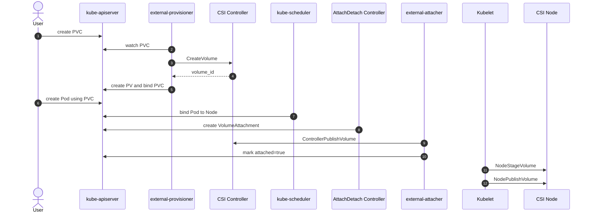

#kubernetes #storage #csi

相关笔记：[[csi]] | [[csi-source]] | [[csi-sidecars]] | [[csi-troubleshooting]] | [[cloud-provider-csi]] | [[k8s-interview]]

## 概述

Kubernetes volume 生命周期不是“PVC 创建后马上挂到 Pod”。完整路径跨越 apiserver、PV controller、scheduler、Attach/Detach controller、CSI sidecar、kubelet 和 CSI Node plugin。

抓住一句话：**PVC 解决声明，PV 解决绑定，scheduler 解决节点，VolumeAttachment 解决 attach，kubelet + CSI Node 解决 mount。**

## 核心对象

| 对象 | 作用 |
| --- | --- |
| StorageClass | 描述动态供给参数、provisioner、binding mode、reclaim policy |
| PVC | 用户声明需要什么存储 |
| PV | 集群实际可用的卷，动态或静态创建 |
| VolumeAttachment | 记录某个卷 attach 到某个节点的状态 |
| CSIDriver | 描述 CSI driver 能力与行为 |
| CSINode | 记录每个节点已注册的 CSI driver 与拓扑信息 |

## 动态供给流程



## Immediate vs WaitForFirstConsumer

StorageClass 的 `volumeBindingMode` 决定 PV 创建/绑定时机。

| 模式 | 行为 | 适用场景 |
| --- | --- | --- |
| `Immediate` | PVC 创建后立即供给和绑定 PV | 无拓扑约束的网络存储，如 NFS、部分 CephFS |
| `WaitForFirstConsumer` | 等 Pod 调度到节点后再供给 PV | 云盘、本地盘、需要 zone/rack 亲和的存储 |

`WaitForFirstConsumer` 的价值是避免“PV 在 zone-a，Pod 被调到 zone-b，结果无法 attach”。它把存储供给延后到调度器已选择节点之后。

## Attach 与 Mount 的区别

| 阶段 | 谁触发 | CSI RPC | 典型动作 |
| --- | --- | --- | --- |
| Attach | Attach/Detach controller + external-attacher | `ControllerPublishVolume` | 云盘 attach 到节点、准备设备 |
| Stage | kubelet | `NodeStageVolume` | 节点级一次性准备，mkfs/mount 到 staging path |
| Publish | kubelet | `NodePublishVolume` | bind mount 到具体 Pod 目录 |

Attach 是“卷和节点”的关系；Publish 是“卷和 Pod”的关系。

路径上可以这样理解：

```text
backend volume
  -> node device or network mount
  -> global staging path
  -> pod target path
```

## 回收策略

PV 的 `persistentVolumeReclaimPolicy` 决定 PVC 删除后的处理：

| 策略 | 行为 |
| --- | --- |
| `Delete` | 删除 PV 时由 provisioner 调 `DeleteVolume` 删除后端卷 |
| `Retain` | 保留后端卷，需要人工处理数据和 PV |

生产环境里，数据库类卷常会谨慎使用 `Retain` 或配套快照/备份策略，避免误删 PVC 直接删除底层数据。

## 扩容流程

前置：StorageClass `allowVolumeExpansion: true`。

流程：

1. 用户调大 PVC request storage。
2. external-resizer 调 `ControllerExpandVolume`。
3. 后端卷容量变大。
4. kubelet 调 `NodeExpandVolume`。
5. 文件系统容量变大。

如果看到 `FileSystemResizePending`，说明通常已经过了 Controller 阶段，卡在节点文件系统扩容。

## 删除流程

删除 Pod 不会删除 PVC；删除 PVC 也不一定删除底层卷，取决于 reclaim policy。

常见顺序：

1. Pod 删除后 kubelet 调 `NodeUnpublishVolume`。
2. 没有 Pod 使用该卷后调 `NodeUnstageVolume`。
3. Attach/Detach controller 删除 VolumeAttachment。
4. external-attacher 调 `ControllerUnpublishVolume`。
5. PVC/PV 删除时 external-provisioner 按 reclaim policy 调 `DeleteVolume`。

## 面试要点

### Q: PVC、PV、StorageClass 分别解决什么问题？

> [!question]- 参考答案（点击展开）
>
> PVC 是用户声明需求，PV 是集群里的实际卷，StorageClass 描述动态供给参数和 driver。PVC 通过 StorageClass 找到 provisioner，provisioner 创建后端卷并生成 PV，再绑定 PVC。

### Q: WaitForFirstConsumer 为什么重要？

> [!question]- 参考答案（点击展开）
>
> 它让 PV 创建延后到 Pod 调度后，存储系统可以在 Pod 所在 zone/rack 创建卷，避免云盘或本地盘因为拓扑不匹配而无法 attach。

### Q: NodeStageVolume 和 NodePublishVolume 的区别？

> [!question]- 参考答案（点击展开）
>
> Stage 是节点级、与 Pod 无关的一次性准备；Publish 是把已经 stage 的卷挂到具体 Pod 目录。Stage 通常做重操作，Publish 通常做 bind mount。
