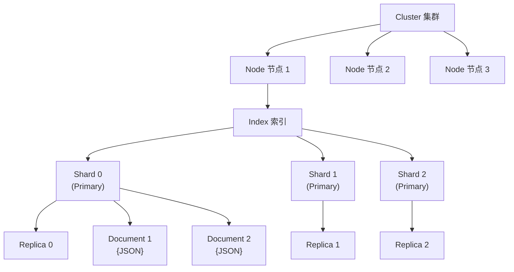

#elasticsearch

相关笔记：[[es-field-types]] | [[es-kibana-docker]]

> Elasticsearch 是一款基于 Lucene 的开源分布式搜索与分析引擎，提供近实时的全文检索、结构化搜索和数据分析能力。

## Elasticsearch 简介

Elasticsearch 被广泛用于**全文检索**、**结构化搜索**和**数据分析**：

- **Wikipedia** 使用 Elasticsearch 提供带高亮片段的全文搜索，以及 search-as-you-type 和 did-you-mean 建议
- **Stack Overflow** 将地理位置查询融入全文检索，使用 more-like-this 接口查找相关问答
- **GitHub** 使用 Elasticsearch 对 1300 亿行代码进行查询

结合 Kibana、Logstash、Beats 等开源产品，Elastic Stack（ELK）被广泛应用在大数据近实时分析领域，包括：**日志分析**、**指标监控**、**信息安全**等。

Elasticsearch 基于 RESTful Web API，使用 Java 语言开发，客户端支持 Java、C#、PHP、Python 等多种语言。

## 核心概念



| 概念 | 说明 |
|------|------|
| **Cluster（集群）** | 由一个唯一名称标识（默认 `elasticsearch`），相同集群名的节点自动组成集群 |
| **Node（节点）** | 存储数据，参与索引和搜索。默认以 UUID 前七字符命名，可自定义 |
| **Index（索引）** | 文档的集合，每个索引有唯一名称。类似关系型数据库中的"数据库" |
| **Document（文档）** | 被索引的一条数据，以 JSON 格式表示。类似关系型数据库中的"行" |
| **Shard（分片）** | 索引可以分成多个分片存储，每个分片是一个独立的"索引"，可分布在不同节点上 |
| **Replica（副本）** | 分片的备份，提供高可用和读取扩展能力 |

> **注意**：Type（类型）从 ES 6.0 起已废弃，一个索引中只存放一类数据。

### ES 与 MySQL 概念对比

![[es和mysql对比.png]]

| Elasticsearch | MySQL |
|--------------|-------|
| Index | Database |
| ~~Type~~（已废弃） | Table |
| Document | Row |
| Field | Column |
| Mapping | Schema |
| DSL (Query) | SQL |

## 安装部署

[[es-kibana-docker]]

## 基本操作示例

### 创建索引

```json
PUT /my_index
{
  "settings": {
    "number_of_shards": 3,
    "number_of_replicas": 1
  }
}
```

### 添加文档

```json
POST /my_index/_doc
{
  "title": "Elasticsearch 入门",
  "content": "这是一篇关于 ES 基础的文章",
  "created_at": "2024-01-01"
}
```

### 查询文档

```json
// match 全文检索
GET /my_index/_search
{
  "query": {
    "match": {
      "content": "ES 基础"
    }
  }
}

// term 精确匹配
GET /my_index/_search
{
  "query": {
    "term": {
      "title.keyword": "Elasticsearch 入门"
    }
  }
}
```

## ES 字段类型

[[es-field-types]]

## 面试要点

### 高频问题

**Q: Elasticsearch 是什么？为什么能做到近实时（NRT）搜索？**
A: ES 是基于 Lucene 的分布式搜索与分析引擎，提供全文检索、结构化搜索和数据分析能力。写入的文档先进入内存 buffer，每隔 `refresh_interval`（默认 1s）执行一次 refresh，将 buffer 中的数据写入一个新的 segment 并打开使其可被搜索，因此文档写入到可被搜索之间存在约 1 秒延迟，即"近实时"而非实时。

**Q: 请说明 Cluster / Node / Index / Shard / Replica 之间的关系。**
A: 相同 `cluster.name` 的 Node 自动组成一个 Cluster；Index 是文档的逻辑集合，物理上被切分为多个 primary shard 分布在不同 Node 上以实现水平扩展；每个 primary shard 可以有若干 replica shard 作为备份，提供高可用和读取扩展。ES 不会把 replica 和它对应的 primary 分配在同一个节点上，从而保证某节点宕机时数据不丢。

**Q: ES 和 MySQL 的概念如何对应？为什么不能完全等同？**
A: 对应关系是 Index→Database、Document→Row、Field→Column、Mapping→Schema、DSL→SQL（Type 已废弃，旧版对应 Table）。但两者定位不同：ES 面向全文检索与聚合分析，底层是倒排索引、最终一致、不支持跨文档事务和复杂 JOIN；MySQL 面向 OLTP，强一致、支持事务和外键。生产中常用 MySQL 做主存储、ES 做检索层。

**Q: Type 为什么在 ES 6.0 被废弃，7.0 彻底移除？**
A: 早期同一 Index 下不同 Type 的同名字段共享一份 Lucene mapping，类型不一致会冲突，且 Type 并非真正的物理隔离，容易让人误以为它类似关系库的 Table。从 6.0 起一个 Index 只存放一类数据、限制为单 Type，7.0 起 API 中用 `_doc` 端点占位并最终移除 Type 概念。

**Q: match 查询和 term 查询有什么区别？**
A: `match` 是全文检索，会先用 analyzer 对查询词做分词，再到倒排索引里匹配，适合 text 类型字段；`term` 是精确匹配，不分词，直接拿原始词项去比对，适合 keyword、数值、日期等字段。所以查 text 字段的精确值时通常要用 `字段名.keyword` 配合 term，否则会因分词与大小写处理而匹配不到。

**Q: 索引的分片数（number_of_shards）创建后能修改吗？为什么？**
A: primary shard 数量在创建索引时确定，之后不可直接修改，因为文档路由公式 `shard = hash(_routing) % number_of_primary_shards` 依赖 primary 分片总数，改变后会导致已有文档无法被正确定位。要调整只能通过 `_reindex` 重建索引或 `_split`/`_shrink` API。而 replica 数量（number_of_replicas）可以随时动态修改。

**Q: 文档写入 ES 后是如何路由并复制到分片的？**
A: 默认按 `shard_num = hash(_routing) % number_of_primary_shards` 计算，`_routing` 默认取文档 `_id`。写请求先到 primary shard 完成写入，再并行转发到该分片所有 in-sync 的 replica；primary 等待这些 in-sync replica 全部确认后才返回成功（写入开始前是否要求足够活跃分片由 `wait_for_active_shards` 控制，默认仅需 primary 即 1）。这也解释了为什么 primary 数量不能随意变更。

### 面试加分点

- 能讲清写入链路：内存 buffer + translog（先写 translog 保证宕机可恢复）→ refresh 生成可搜索 segment（默认 1s）→ flush 触发 Lucene commit 并清空 translog → 后台 segment merge 合并小段、清理标记删除的文档。
- 理解倒排索引（inverted index）原理：term → posting list 的映射，配合 FST 词典实现快速查找，这是全文检索高效的核心，区别于 MySQL B+Tree 的正排结构。
- 清楚 keyword 与 text 的取舍：text 会分词用于全文检索，keyword 不分词用于精确匹配、排序和聚合；常用 multi-field（`title` + `title.keyword`）同时支持两种用途。
- 了解 ELK/Elastic Stack 的协作：Beats/Logstash 采集与处理、Elasticsearch 存储检索、Kibana 可视化，是日志分析、指标监控、安全分析的主流方案。
- 知道分片数量规划经验：单分片大小建议控制在 10-50GB，避免"过度分片"带来的集群元数据和查询开销。
- 区分两类"一致性"：文档级数据复制是 primary 同步到 in-sync replica（非 quorum），靠 translog 保证持久性、属最终一致；而 ES 7+ 集群层面的主节点选举与元数据变更才采用基于多数派（quorum）的协调机制，二者不要混为一谈。
