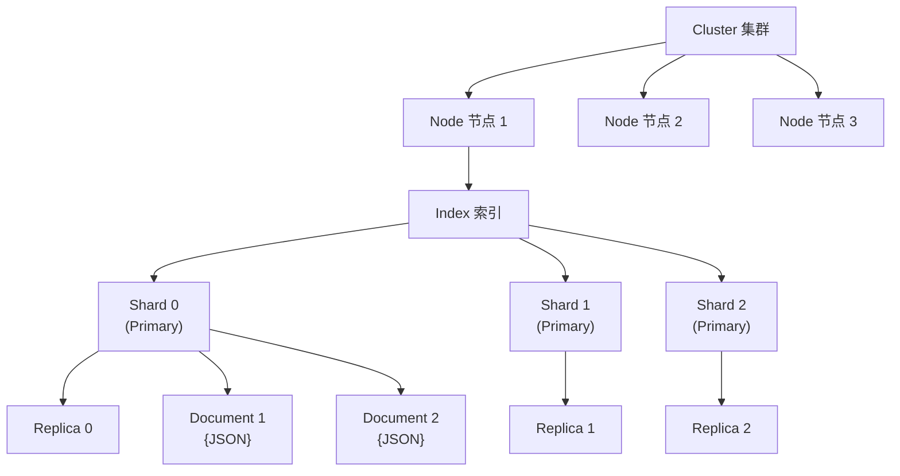

#elasticsearch

相关笔记：[[es-field-types]] | [[es-kibana-docker]]

> Elasticsearch 是一款基于 Lucene 的开源分布式搜索与分析引擎，提供近实时的全文检索、结构化搜索和数据分析能力。

## Elasticsearch 简介

Elasticsearch 被广泛用于**全文检索**、**结构化搜索**和**数据分析**：

- **Wikipedia** 使用 Elasticsearch 提供带高亮片段的全文搜索，以及 search-as-you-type 和 did-you-mean 建议
- **Stack Overflow** 将地理位置查询融入全文检索，使用 more-like-this 接口查找相关问答
- **GitHub** 使用 Elasticsearch 对 1300 亿行代码进行查询

结合 Kibana、Logstash、Beats 等开源产品，Elastic Stack（ELK）被广泛应用在大数据近实时分析领域，包括：**日志分析**、**指标监控**、**信息安全**等。

Elasticsearch 基于 RESTful Web API，使用 Java 语言开发，客户端支持 Java、C#、PHP、Python 等多种语言。

## 核心概念



| 概念 | 说明 |
|------|------|
| **Cluster（集群）** | 由一个唯一名称标识（默认 `elasticsearch`），相同集群名的节点自动组成集群 |
| **Node（节点）** | 存储数据，参与索引和搜索。默认以 UUID 前七字符命名，可自定义 |
| **Index（索引）** | 文档的集合，每个索引有唯一名称。类似关系型数据库中的"数据库" |
| **Document（文档）** | 被索引的一条数据，以 JSON 格式表示。类似关系型数据库中的"行" |
| **Shard（分片）** | 索引可以分成多个分片存储，每个分片是一个独立的"索引"，可分布在不同节点上 |
| **Replica（副本）** | 分片的备份，提供高可用和读取扩展能力 |

> **注意**：Type（类型）从 ES 6.0 起已废弃，一个索引中只存放一类数据。

### ES 与 MySQL 概念对比

![[es和mysql对比.png]]

| Elasticsearch | MySQL |
|--------------|-------|
| Index | Database |
| ~~Type~~（已废弃） | Table |
| Document | Row |
| Field | Column |
| Mapping | Schema |
| DSL (Query) | SQL |

## 安装部署

[[es-kibana-docker]]

## 基本操作示例

### 创建索引

```json
PUT /my_index
{
  "settings": {
    "number_of_shards": 3,
    "number_of_replicas": 1
  }
}
```

### 添加文档

```json
POST /my_index/_doc
{
  "title": "Elasticsearch 入门",
  "content": "这是一篇关于 ES 基础的文章",
  "created_at": "2024-01-01"
}
```

### 查询文档

```json
// match 全文检索
GET /my_index/_search
{
  "query": {
    "match": {
      "content": "ES 基础"
    }
  }
}

// term 精确匹配
GET /my_index/_search
{
  "query": {
    "term": {
      "title.keyword": "Elasticsearch 入门"
    }
  }
}
```

## ES 字段类型

[[es-field-types]]
