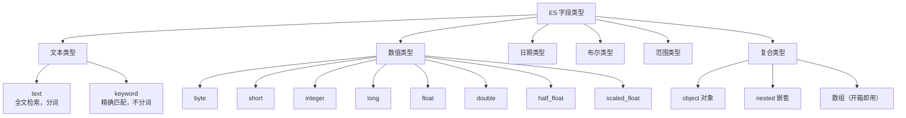
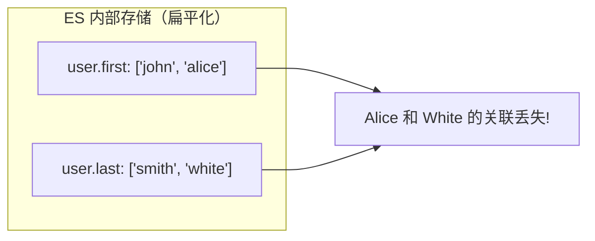

#elasticsearch

相关笔记：[[elasticsearch-basics]] | [[es-kibana-docker]]

## 字段类型概览

Elasticsearch 支持丰富的字段类型，合理选择字段类型对查询性能和存储效率至关重要。



## 1. 基本字段类型

### 1.1 text — 全文检索

`text` 类型用于需要**全文检索**的字段内容（文章、商品描述等）。

特点：
- 字段内容在保存时会被**分词器（Analyzer）分析并拆分成多个词项（Term）**
- 根据拆分后的词项生成倒排索引，检索时也会对关键字进行分词匹配
- **不能**直接用于排序、聚合操作
- 可能无法通过完整文本精确检索到

```json
PUT /articles
{
  "mappings": {
    "properties": {
      "content": {
        "type": "text",
        "analyzer": "ik_max_word"
      }
    }
  }
}
```

### 1.2 keyword — 精确匹配

`keyword` 类型适用于结构化字段（手机号、商品 id、用户 id、状态码等），默认最大长度 256。

特点：
- 字段内容**不会被分词**，根据原始文本直接生成倒排索引
- 可以通过原始文本**精确检索**
- 可用于**过滤、排序、聚合**操作

```json
// text vs keyword 对比
PUT /products
{
  "mappings": {
    "properties": {
      "description": { "type": "text" },
      "status": { "type": "keyword" },
      "product_id": { "type": "keyword" }
    }
  }
}
```

> **text vs keyword 选择原则**：需要分词搜索用 `text`，需要精确匹配/排序/聚合用 `keyword`。

### 1.3 日期类型 date

ES 中 `date` 类型默认支持两种格式：
- `strict_date_optional_time`：**yyyy-MM-dd'T'HH:mm:ss.SSSSSSZ** 或 **yyyy-MM-dd**
- `epoch_millis`：从 1970.1.1 零点到现在的毫秒数

如果要存储 `2020-12-01 20:10:15` 这种格式的日期，需要在创建索引时指定自定义格式：

```json
PUT /blog
{
  "mappings": {
    "properties": {
      "publishDate": {
        "type": "date",
        "format": "yyyy-MM-dd HH:mm:ss||yyyy-MM-dd||epoch_millis"
      }
    }
  }
}
```

> **注意**：如果不主动指定字段类型为 `date`，ES 默认使用 `text` 类型保存日期值。

### 1.4 布尔类型 boolean

`boolean` 类型只有 `true`、`false` 两个值。

### 1.5 数值类型

| 类型 | 取值范围 |
|------|---------|
| byte | -2^7 ~ 2^7-1 |
| short | -2^15 ~ 2^15-1 |
| integer | -2^31 ~ 2^31-1 |
| long | -2^63 ~ 2^63-1 |
| float | 32 位单精度 IEEE 754 浮点类型 |
| double | 64 位双精度 IEEE 754 浮点类型 |
| half_float | 16 位半精度 IEEE 754 浮点类型 |
| scaled_float | 缩放类型的浮点数 |

> 一般情况下优先使用范围小的类型以提高效率。

### 1.6 数组类型

ES 中没有专门的数组类型，但每个字段默认可以包含多个值（即开箱即用），要求多个值的类型必须一致：

```json
"label": ["Elasticsearch", "7.9.3版本"]
```

### 1.7 对象类型 object

JSON 对象中的字段值可以是另一个 JSON 对象，ES 自动处理为 object 类型。

### 1.8 范围类型

| 类型 | 范围 |
|------|------|
| integer_range | -2^31 ~ 2^31-1 |
| long_range | -2^63 ~ 2^63-1 |
| float_range | 32 位单精度 IEEE 754 浮点类型 |
| double_range | 64 位双精度 IEEE 754 浮点类型 |
| date_range | 自纪元以来的毫秒数（unsigned 64 位） |
| ip_range | IPv4、IPv6 的 IP 地址范围 |

```json
// 创建范围字段
PUT /blog
{
  "mappings": {
    "properties": {
      "reader_age_range": {
        "type": "integer_range"
      }
    }
  }
}

// 添加文档时指定范围值
POST /blog/_doc
{
  "reader_age_range": {
    "gte": 10,
    "lte": 50
  }
}
```

## 2. 数组类型与嵌套数据类型

### 2.1 对象数组的扁平化问题

ES 内部会将对象数组**展开为扁平结构**，导致对象内部字段之间的关联丢失。

```json
// 原始文档
PUT /my_index/_doc/1
{
  "group": "fans",
  "user": [
    { "first": "John", "last": "Smith" },
    { "first": "Alice", "last": "White" }
  ]
}
```



展开后的内部结构：
```json
{
  "group":       "fans",
  "user.first": ["alice", "john"],
  "user.last":  ["smith", "white"]
}
```

此时无法单独查询 "first 为 Alice 且 last 为 White" 的对象。

### 2.2 嵌套数据类型 nested

嵌套数据类型是**对象数据类型的特殊版本**，解决了对象数组的关联丢失问题：

- 数组中的每个对象被索引为**独立的隐藏文档**
- 对象之间保持独立，保留内部字段之间的关联
- 需要使用 **Nested Query** 进行查询

```json
// 创建嵌套字段映射
PUT /my_index
{
  "mappings": {
    "properties": {
      "group": { "type": "keyword" },
      "user": {
        "type": "nested",
        "properties": {
          "first": { "type": "keyword" },
          "last": { "type": "keyword" }
        }
      }
    }
  }
}

// 嵌套查询：精确查找 first=Alice AND last=White
GET /my_index/_search
{
  "query": {
    "nested": {
      "path": "user",
      "query": {
        "bool": {
          "must": [
            { "match": { "user.first": "Alice" } },
            { "match": { "user.last": "White" } }
          ]
        }
      }
    }
  }
}
```

> **注意**：每个索引默认最多创建 50 个嵌套字段，可通过 `index.mapping.nested_fields.limit` 修改。一个包含 100 个嵌套文档的文档实际上索引了 101 个文档。

### 2.3 嵌套类型的性能考量

嵌套类型的实现原理决定了其性能特征：

- **存储开销大**：嵌套文档以独立文档存入，一条嵌套文档底层实际存储 N 条数据
- **更新代价高**：更新时会"株连"更新所有相关嵌套文档
- **功能受限**：不支持聚合排序等高级功能

> ES 更适合**大宽表**模式。尽量将多张表的字段合并到一个索引中，规避嵌套类型的使用。

### 2.4 easy-es 中的嵌套类型

在 easy-es ORM 框架中使用嵌套类型：

```java
public class Document {
    // 省略其它字段...
    
    @IndexField(fieldType = FieldType.NESTED, nestedClass = User.class)
    private List<User> users;
}
```

> 务必指定 `fieldType = NESTED` 和 `nestedClass`，否则框架无法正常运行。

## 3. 完整示例

### 3.1 创建索引

```json
PUT /blog
{
  "mappings": {
    "properties": {
      "publishDate": {
        "type": "date",
        "format": "yyyy-MM-dd HH:mm:ss||yyyy-MM-dd||epoch_millis"
      },
      "reader_age_range": {
        "type": "integer_range"
      }
    }
  }
}
```

### 3.2 添加文档

```json
POST /blog/_doc
{
  "title": "Learn Elasticsearch",
  "publishDate": "2020-12-01 20:10:15",
  "isTop": true,
  "score": 4.5,
  "commentNum": 50,
  "label": ["Elasticsearch", "7.9.3版本"],
  "author": {
    "name": "shehuan",
    "github": "https://github.com/shehuan"
  },
  "reader_age_range": {
    "gte": 10,
    "lte": 50
  }
}
```

### 3.3 动态映射说明

上面只指定了 `publishDate` 和 `reader_age_range` 字段的类型，其它字段由 ES 通过**动态映射（Dynamic Mapping）** 自动推断。但动态映射可能推断不符合预期（如日期被识别为 text），建议根据实际情况主动指定字段类型。

### 3.4 查看 mapping 信息

```json
GET /blog/_mapping?pretty
```

未指定类型的字段（如 `title`），ES 会自动映射为 `text` 类型，同时添加一个 `keyword` 子字段：

![[`text`类型.png]]

这意味着可以使用 `title.keyword` 将 `title` 字段当做 `keyword` 类型使用（用于排序、聚合等）。
