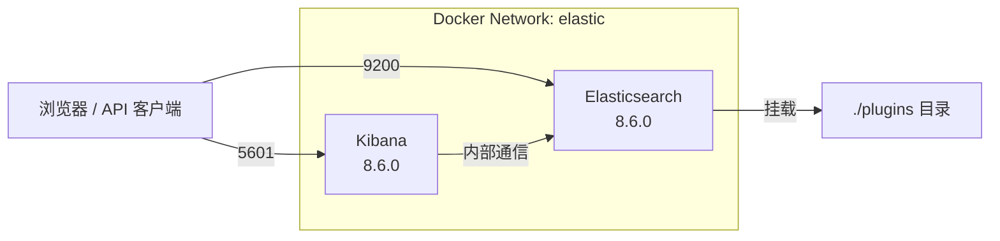

#elasticsearch #docker

相关笔记：[[elasticsearch-basics]] | [[es-field-types]]

## ES + Kibana Docker 部署

本文介绍使用 Docker Compose 快速搭建 Elasticsearch + Kibana 开发环境。

### 架构概览



## 部署步骤

### Step 1：创建 Docker 网络

```bash
docker network create elastic
```

### Step 2：docker-compose.yml（Elasticsearch）

```yaml
version: '3'
services:
  elasticsearch:
    image: docker.elastic.co/elasticsearch/elasticsearch:8.6.0
    container_name: elasticsearch
    networks:
      - elastic
    ports:
      - 9200:9200
    environment:
      - discovery.type=single-node
      - ES_JAVA_OPTS=-Xms1g -Xmx1g
      - xpack.security.enabled=false
    volumes:
      - ./plugins:/usr/share/elasticsearch/plugins
    stdin_open: true
    tty: true

networks:
  elastic:
    external: true
```

关键配置说明：

| 配置项 | 说明 |
|-------|------|
| `discovery.type=single-node` | 单节点模式，适合开发环境 |
| `ES_JAVA_OPTS=-Xms1g -Xmx1g` | JVM 堆内存设为 1GB，可根据机器配置调整 |
| `xpack.security.enabled=false` | 关闭安全认证，仅限开发环境使用 |
| `./plugins` 挂载 | 方便安装 IK 分词器等插件 |

### Step 3：启动 Elasticsearch

```bash
docker-compose up -d
```

### Step 4：启动 Kibana

```bash
docker run --name kibana \
  --net elastic \
  -p 5601:5601 \
  docker.elastic.co/kibana/kibana:8.6.0
```

> Kibana 版本需要与 Elasticsearch 版本一致。

### Step 5：验证部署

```bash
# 检查 ES 是否正常运行
curl http://localhost:9200

# 预期返回集群信息 JSON
# {
#   "name": "...",
#   "cluster_name": "docker-cluster",
#   "version": { "number": "8.6.0", ... }
# }
```

浏览器访问 `http://localhost:5601` 进入 Kibana 控制台。

## 常用插件安装

### IK 中文分词器

```bash
# 进入容器安装
docker exec -it elasticsearch bash
./bin/elasticsearch-plugin install https://get.infini.cloud/elasticsearch/analysis-ik/8.6.0

# 或者将解压后的 ik 插件放到 ./plugins 目录，重启容器
docker-compose restart
```

### 安装完成后验证分词效果

```json
POST /_analyze
{
  "analyzer": "ik_max_word",
  "text": "Elasticsearch 是一个分布式搜索引擎"
}
```

## 生产环境注意事项

- 务必开启 `xpack.security.enabled=true` 并配置认证
- 根据数据量合理设置分片数和副本数
- JVM 堆内存建议不超过物理内存的 50%，且不超过 32GB
- 使用 Docker Volume 持久化数据目录 `/usr/share/elasticsearch/data`

## 面试要点

### 高频问题

**Q: `discovery.type=single-node` 是做什么用的？生产环境为什么不能用？**
A: 它告诉 ES 跳过 master 选举和集群 bootstrap 检查，以单节点模式直接启动，适合本地开发。生产环境是多节点集群，需要通过 `discovery.seed_hosts` 和 `cluster.initial_master_nodes` 发现节点并选举 master，single-node 模式会禁用这些机制（节点只会把自己当作唯一 master），因此不可用于真正的集群。

**Q: 为什么 `ES_JAVA_OPTS` 要把 `-Xms` 和 `-Xmx` 设成相同值？堆内存上限为什么是 32GB？**
A: Xms（初始堆）和 Xmx（最大堆）设成相同值可避免运行时动态扩容/收缩带来的停顿，并让 JVM 在启动时一次性预留好堆空间。上限约 32GB 是因为 JVM 在堆小于约 32GB 时会启用 compressed ordinary object pointers（压缩指针），用 32 位引用配合 8 字节对齐来寻址对象，相当于在 64 位 JVM 上省内存；一旦超过这个阈值压缩指针失效，指针膨胀到 64 位，反而浪费内存、降低缓存效率，可用对象空间不增反降。同时堆不应超过物理内存的 50%，剩余内存留给操作系统的 page cache（Lucene 大量依赖文件系统缓存做查询）。

**Q: ES 8.x 默认开启了哪些安全特性？开发环境的 `xpack.security.enabled=false` 关闭了什么？**
A: 从 ES 8.0 起，security 默认开启，首次启动会自动生成 TLS 证书、为 `elastic` 用户生成密码、并要求通过 HTTPS 访问，Kibana 首次连接需要 enrollment token。开发环境设 `xpack.security.enabled=false` 后，会关闭认证、授权和 TLS，9200 端口可直接 HTTP 明文访问，省去配置成本，但绝不能用于生产。

**Q: Kibana 和 Elasticsearch 版本为什么必须一致？**
A: Kibana 与 ES 强耦合，依赖特定版本的内部 API 和 `.kibana` 系统索引结构。官方要求两者版本号匹配（Kibana 版本不能高于 ES，通常保持 major.minor 完全一致），版本不匹配 Kibana 会拒绝连接或启动报错。升级时通常先升 ES 再升 Kibana。

**Q: 为什么这套部署里要先 `docker network create elastic`，并在 compose 中用 `external: true`？**
A: 因为 Kibana 是用 `docker run --net elastic` 单独启动的，需要和 compose 启动的 ES 处于同一自定义网络，才能通过容器名做 DNS 解析互相通信。`external: true` 表示该网络在 compose 之外已存在，compose 只引用、不负责创建/销毁，从而让两个独立启动的容器共享同一网络（否则 compose 会创建带项目名前缀的独立网络，两者无法互通）。

**Q: IK 分词器有哪两种安装方式？`ik_max_word` 和 `ik_smart` 有什么区别？**
A: 一是进容器执行 `elasticsearch-plugin install <插件下载 URL>` 在线安装（IK 不在 Elastic 官方插件仓库，8.x 需指定与 ES 版本严格匹配的下载地址，如 infini.cloud 的发行包）；二是把解压后的插件目录放到挂载的 `./plugins` 目录后重启容器。两种方式装好都需重启 ES 生效。`ik_max_word` 做最细粒度切分，穷举所有可能的词组合，适合建索引以提高召回；`ik_smart` 做最粗粒度切分，一段文本只切一次，适合查询分词以提高精度。

**Q: 直接用 Docker 跑 ES，如何保证数据不丢失？**
A: ES 数据存在容器内的 `/usr/share/elasticsearch/data`，容器删除即丢失，必须用 Docker Volume 或 bind mount 把该目录持久化到宿主机。注意用 bind mount 时宿主机目录需有正确属主（ES 容器内以 uid 1000 运行），否则会因无写权限启动失败。

### 面试加分点

- ES 启动常因宿主机 `vm.max_map_count` 过低失败，需要 `sysctl -w vm.max_map_count=262144`，因为 Lucene 用 mmap（`mmapfs`/`hybridfs`）映射索引文件，Linux 默认值 65530 不够用。
- 关闭 swap 很重要，可通过 `bootstrap.memory_lock=true`（容器需配 `ulimits memlock` 为 unlimited）锁定堆内存，避免 JVM 堆被换出到磁盘导致 GC 和查询延迟剧增。
- single-node 模式下，主分片所在节点就是唯一节点，副本（replica）无处分配，索引会显示 yellow 健康状态——这是预期现象，不影响读写；要变 green 需把副本数设为 0 或加节点。
- 生产集群建议按节点角色拆分（master-eligible、data、ingest、coordinating），避免 master 节点因数据/查询压力影响集群稳定性；master-eligible 节点数应为奇数（如 3 个）以满足多数派（quorum）、避免脑裂。
- 主分片数（number_of_shards）一旦创建不可更改（只能 reindex 或用 split/shrink API），需在建索引前规划；单分片建议控制在 20-50GB，分片过多会增加集群 metadata 开销和 master 压力（副本数可随时动态调整）。
- `xpack.security.enabled=false` 仅适合隔离的开发网络，生产环境除开启 security 外，还应配合 TLS、API key、以及网络层（防火墙/不对外暴露 9300 transport 端口）做纵深防御。
