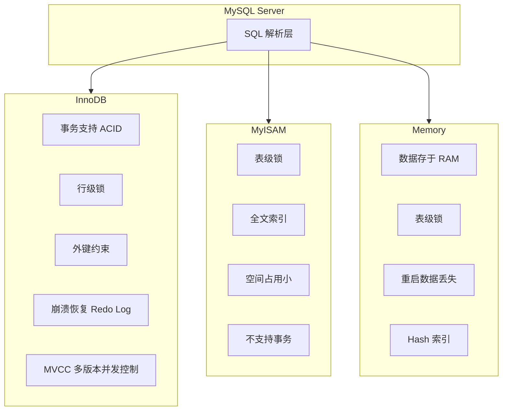

#mysql #存储引擎

相关笔记：[[mysql-index]]

## 存储引擎概览

MySQL 支持多种存储引擎，最常用的有 InnoDB、MyISAM 和 Memory。InnoDB 自 MySQL 5.5 起成为默认存储引擎。



## 三大引擎对比

| 特性 | InnoDB | MyISAM | Memory |
|------|--------|--------|--------|
| 事务支持 | 支持 ACID | 不支持 | 不支持 |
| 锁粒度 | 行级锁 | 表级锁 | 表级锁 |
| 外键 | 支持 | 不支持 | 不支持 |
| 崩溃恢复 | Redo Log 恢复 | 较弱，可能数据丢失 | 重启即丢失 |
| 全文索引 | 5.6+ 支持 | 支持 | 不支持 |
| 存储方式 | 磁盘 | 磁盘 | 内存 (RAM) |
| MVCC | 支持 | 不支持 | 不支持 |
| 适用场景 | 高并发读写、事务 | 读多写少、全文检索 | 临时数据、缓存表 |

## InnoDB

InnoDB 提供对事务的完整支持，包括 ACID 四大特性（原子性、一致性、隔离性、持久性）。

核心特性：
- **行级锁**：支持行级锁定，提高多用户并发操作的性能
- **外键约束**：支持外键，用来维护数据库引用完整性
- **崩溃恢复**：通过 Redo Log 进行崩溃恢复，保证数据持久性
- **MVCC**：多版本并发控制，实现高并发下的读写不阻塞

```sql
-- 查看当前默认存储引擎
SHOW VARIABLES LIKE 'default_storage_engine';

-- 查看表的存储引擎
SHOW TABLE STATUS LIKE 'table_name';

-- 创建 InnoDB 表
CREATE TABLE orders (
    id INT PRIMARY KEY AUTO_INCREMENT,
    user_id INT NOT NULL,
    amount DECIMAL(10,2),
    created_at DATETIME DEFAULT CURRENT_TIMESTAMP,
    FOREIGN KEY (user_id) REFERENCES users(id)
) ENGINE=InnoDB;
```

**适用场景**：读写操作频繁，需要事务支持的应用，如在线交易处理系统（OLTP）。

## MyISAM

MyISAM 结构简单，适合读密集型场景。

核心特性：
- **表级锁**：高并发写入时可能成为瓶颈
- **全文索引**：支持全文索引，可以快速进行文本搜索
- **空间占用小**：通常占用较少的存储空间和内存
- **崩溃恢复弱**：对崩溃恢复的支持不如 InnoDB，可能导致数据丢失或损坏

```sql
-- 创建 MyISAM 表
CREATE TABLE articles (
    id INT PRIMARY KEY AUTO_INCREMENT,
    title VARCHAR(255),
    content TEXT,
    FULLTEXT INDEX ft_content (content)
) ENGINE=MyISAM;
```

**适用场景**：读多写少，对事务完整性要求不高的应用，如博客系统、CMS。

## Memory

Memory 引擎将所有数据存储在 RAM 中，读写速度极快，但数据库重启或崩溃会导致数据丢失。

核心特性：
- **存储在内存**：读写速度极快
- **表级锁**：并发写入性能受限
- **Hash 索引**：默认使用 Hash 索引，等值查询性能优异
- **数据不持久**：重启后数据丢失

```sql
-- 创建 Memory 表
CREATE TABLE session_cache (
    session_id VARCHAR(64) PRIMARY KEY,
    user_id INT,
    data TEXT,
    expires_at DATETIME
) ENGINE=MEMORY;
```

**适用场景**：需要高速读写且可以容忍数据丢失的场景，如缓存、临时数据处理。

## 如何选择存储引擎

- 需要**事务支持**和**高并发读写** --> InnoDB（绝大多数场景的首选）
- 需要**高效全文搜索**且读多写少 --> MyISAM（但现代项目更推荐 InnoDB + Elasticsearch）
- 需要**极速临时存储**且可容忍数据丢失 --> Memory

## 面试要点

### 高频问题

**Q: InnoDB 和 MyISAM 的核心区别是什么？**

> [!question]- 参考答案（点击展开）
>
> 最本质的区别是 InnoDB 支持事务（ACID）、行级锁、外键和 MVCC，而 MyISAM 都不支持，只有表级锁。崩溃恢复上 InnoDB 通过 Redo Log（WAL）保证持久性、可做到 crash-safe，MyISAM 较弱、崩溃后可能丢数据或损坏。InnoDB 自 MySQL 5.5 起成为默认引擎，适合高并发 OLTP；MyISAM 适合读多写少场景。

**Q: 为什么 MySQL 5.5 之后默认引擎从 MyISAM 改成了 InnoDB？**

> [!question]- 参考答案（点击展开）
>
> 因为 InnoDB 提供事务支持、行级锁带来更高的并发写入能力，以及基于 Redo Log 的崩溃恢复能力，更符合现代业务对数据一致性和可靠性的要求。MyISAM 的表级锁在高并发写入时会成为瓶颈，且崩溃恢复弱、容易出现表损坏。

**Q: InnoDB 的行级锁相比 MyISAM 的表级锁有什么优势和代价？**

> [!question]- 参考答案（点击展开）
>
> 行级锁只锁住涉及的行，并发写入时不同事务可以操作不同的行而互不阻塞，大幅提升并发度。代价是锁的管理开销更大（需要维护更多锁信息）；而且 InnoDB 行锁是加在索引记录上的，当查询没有命中索引时会退化为锁住扫描到的每一行（效果近似全表加锁）。MyISAM 表级锁开销小但写并发差，读写互斥。

**Q: MVCC 是什么？InnoDB 为什么需要它？**

> [!question]- 参考答案（点击展开）
>
> MVCC（多版本并发控制）通过为数据保存多个版本，让读操作读取某个一致性快照而不必加锁，实现「读不阻塞写、写不阻塞读」。InnoDB 借助 undo log 构建历史版本链，配合 Read View 实现 RC/RR 隔离级别下的一致性读，避免大量加锁带来的性能损耗。MyISAM 没有 MVCC，读写之间只能靠表锁互斥。

**Q: Memory 引擎有什么特点？使用时要注意什么？**

> [!question]- 参考答案（点击展开）
>
> Memory 引擎把数据全部存在 RAM 中，读写极快，默认使用 Hash 索引（等值查询很快，但对范围查询和排序无优化，需要时可显式指定 BTREE 索引）。锁粒度是表级锁，并发写性能受限；且不支持 TEXT/BLOB 等大字段。最大风险是数据不持久，服务重启或崩溃后数据全部丢失，因此只能用于缓存、临时表等可容忍数据丢失的场景。

**Q: 如何查看和指定一张表的存储引擎？**

> [!question]- 参考答案（点击展开）
>
> 用 `SHOW VARIABLES LIKE 'default_storage_engine';` 查看默认引擎，用 `SHOW TABLE STATUS LIKE 'table_name';`（或查 `information_schema.TABLES`）查看具体表的引擎。建表时通过 `CREATE TABLE ... ENGINE=InnoDB;` 指定，已有表可用 `ALTER TABLE t ENGINE=InnoDB;` 转换引擎。

**Q: 现在还有哪些场景会选择 MyISAM？**

> [!question]- 参考答案（点击展开）
>
> 实际上现代项目已经很少用 MyISAM。它相对的优势是结构简单、空间占用小，以及历史上的全文索引支持；但 InnoDB 从 5.6 起也支持全文索引（FULLTEXT），而且全文检索更推荐交给 Elasticsearch。因此除了一些纯静态、读多写少的老系统，新项目基本统一用 InnoDB。

### 面试加分点

- 能区分「存储方式」差异：InnoDB 是聚簇索引（数据和主键索引存在一起，叶子节点即数据行），MyISAM 是非聚簇索引（索引和数据文件分离，叶子节点存数据行的地址），这直接影响主键查询和二级索引回表的性能。
- InnoDB 的崩溃恢复依赖 Redo Log（WAL 机制，先写日志再刷脏页）和 undo log（回滚与 MVCC 版本链），可以做到 crash-safe；而 MyISAM 崩溃后需要 `REPAIR TABLE` 修复，仍可能丢数据。
- 指出 InnoDB 行锁的实现是基于索引的：锁加在索引记录上，没有走索引时会退化为锁住扫描到的每一行；RR 隔离级别下还有 Next-Key Lock（记录锁 Record Lock + 间隙锁 Gap Lock）来防止幻读。
- 提到 `COUNT(*)` 的差异：MyISAM 把表的总行数单独存储，`SELECT COUNT(*)` 不带 WHERE 时是 O(1)；InnoDB 因 MVCC 不同事务可见的行数不同，需要实时统计、扫描索引，性能相对慢。
- 了解引擎选型在分布式/云原生场景的延伸：Memory 表可用作高速缓存层，但生产中更常用 Redis 替代；全文检索用 Elasticsearch 而非 MyISAM FULLTEXT，体现「专用组件做专用事」的架构思路。
