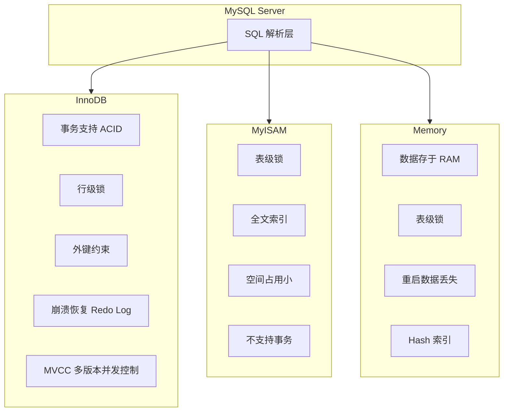

#mysql #存储引擎

相关笔记：[[mysql-index]]

## 存储引擎概览

MySQL 支持多种存储引擎，最常用的有 InnoDB、MyISAM 和 Memory。InnoDB 自 MySQL 5.5 起成为默认存储引擎。



## 三大引擎对比

| 特性 | InnoDB | MyISAM | Memory |
|------|--------|--------|--------|
| 事务支持 | 支持 ACID | 不支持 | 不支持 |
| 锁粒度 | 行级锁 | 表级锁 | 表级锁 |
| 外键 | 支持 | 不支持 | 不支持 |
| 崩溃恢复 | Redo Log 恢复 | 较弱，可能数据丢失 | 重启即丢失 |
| 全文索引 | 5.6+ 支持 | 支持 | 不支持 |
| 存储方式 | 磁盘 | 磁盘 | 内存 (RAM) |
| MVCC | 支持 | 不支持 | 不支持 |
| 适用场景 | 高并发读写、事务 | 读多写少、全文检索 | 临时数据、缓存表 |

## InnoDB

InnoDB 提供对事务的完整支持，包括 ACID 四大特性（原子性、一致性、隔离性、持久性）。

核心特性：
- **行级锁**：支持行级锁定，提高多用户并发操作的性能
- **外键约束**：支持外键，用来维护数据库引用完整性
- **崩溃恢复**：通过 Redo Log 进行崩溃恢复，保证数据持久性
- **MVCC**：多版本并发控制，实现高并发下的读写不阻塞

```sql
-- 查看当前默认存储引擎
SHOW VARIABLES LIKE 'default_storage_engine';

-- 查看表的存储引擎
SHOW TABLE STATUS LIKE 'table_name';

-- 创建 InnoDB 表
CREATE TABLE orders (
    id INT PRIMARY KEY AUTO_INCREMENT,
    user_id INT NOT NULL,
    amount DECIMAL(10,2),
    created_at DATETIME DEFAULT CURRENT_TIMESTAMP,
    FOREIGN KEY (user_id) REFERENCES users(id)
) ENGINE=InnoDB;
```

**适用场景**：读写操作频繁，需要事务支持的应用，如在线交易处理系统（OLTP）。

## MyISAM

MyISAM 结构简单，适合读密集型场景。

核心特性：
- **表级锁**：高并发写入时可能成为瓶颈
- **全文索引**：支持全文索引，可以快速进行文本搜索
- **空间占用小**：通常占用较少的存储空间和内存
- **崩溃恢复弱**：对崩溃恢复的支持不如 InnoDB，可能导致数据丢失或损坏

```sql
-- 创建 MyISAM 表
CREATE TABLE articles (
    id INT PRIMARY KEY AUTO_INCREMENT,
    title VARCHAR(255),
    content TEXT,
    FULLTEXT INDEX ft_content (content)
) ENGINE=MyISAM;
```

**适用场景**：读多写少，对事务完整性要求不高的应用，如博客系统、CMS。

## Memory

Memory 引擎将所有数据存储在 RAM 中，读写速度极快，但数据库重启或崩溃会导致数据丢失。

核心特性：
- **存储在内存**：读写速度极快
- **表级锁**：并发写入性能受限
- **Hash 索引**：默认使用 Hash 索引，等值查询性能优异
- **数据不持久**：重启后数据丢失

```sql
-- 创建 Memory 表
CREATE TABLE session_cache (
    session_id VARCHAR(64) PRIMARY KEY,
    user_id INT,
    data TEXT,
    expires_at DATETIME
) ENGINE=MEMORY;
```

**适用场景**：需要高速读写且可以容忍数据丢失的场景，如缓存、临时数据处理。

## 如何选择存储引擎

- 需要**事务支持**和**高并发读写** --> InnoDB（绝大多数场景的首选）
- 需要**高效全文搜索**且读多写少 --> MyISAM（但现代项目更推荐 InnoDB + Elasticsearch）
- 需要**极速临时存储**且可容忍数据丢失 --> Memory
