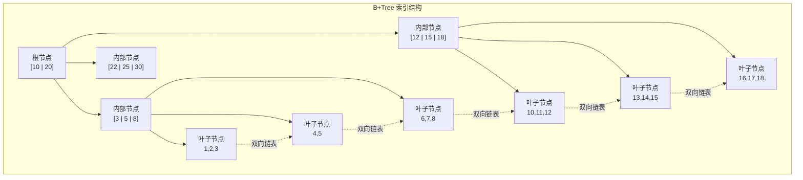
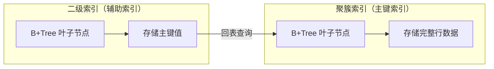
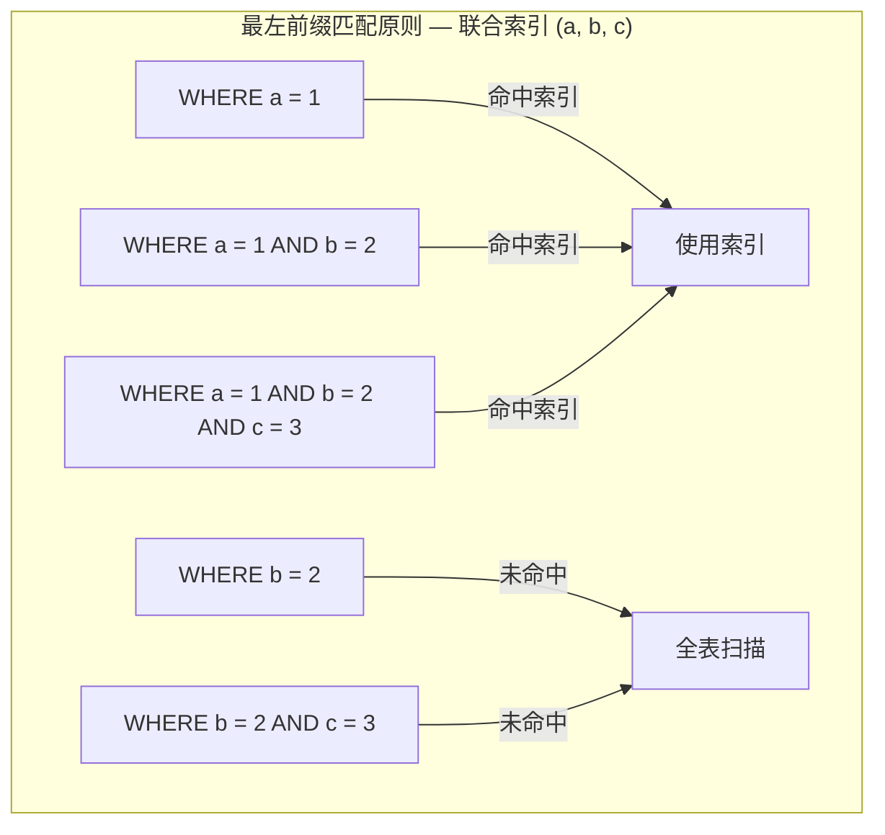

#mysql索引

相关笔记：[[mysql-engine]] | [[redis-data-types]]

## 索引分类概览

MySQL 索引可以从四个维度进行分类：

| 分类维度 | 索引类型 |
|---------|---------|
| 数据结构 | B+Tree 索引、Hash 索引、Full-text 索引 |
| 物理存储 | 聚簇索引（主键索引）、二级索引（辅助索引） |
| 字段特性 | 主键索引、唯一索引、普通索引、前缀索引 |
| 字段个数 | 单列索引、联合索引 |

## 按数据结构分类

![[存储引擎支持的索引类型.png]]

InnoDB 是 MySQL 5.5 之后的默认存储引擎，B+Tree 是 InnoDB 采用最多的索引类型。

### InnoDB 聚簇索引键的选择

InnoDB 在创建表时，会按以下优先级选择聚簇索引的索引键：

1. 如果有主键，使用主键作为聚簇索引的索引键（key）
2. 如果没有主键，选择第一个不包含 NULL 值的 UNIQUE 列
3. 以上都没有时，InnoDB 自动生成一个隐式自增 id 列作为索引键

其它索引都属于辅助索引（Secondary Index），也称为二级索引或非聚簇索引。**创建的主键索引和二级索引默认使用 B+Tree 索引**。

### B+Tree 索引结构



B+Tree 的特点：
- 非叶子节点只存储索引键，不存储数据，使得每个节点可以容纳更多键值，降低树的高度
- 所有数据都存储在叶子节点，且叶子节点通过双向链表相连，方便范围查询
- 查询时间复杂度稳定为 O(log n)

## 按物理存储分类

从物理存储的角度来看，索引分为聚簇索引（主键索引）和二级索引（辅助索引）。



两者的核心区别：
- **主键索引**：B+Tree 的叶子节点存放的是**实际数据**，所有完整的用户记录都在主键索引的叶子节点里
- **二级索引**：B+Tree 的叶子节点存放的是**主键值**，而不是实际数据

### 覆盖索引与回表

- **覆盖索引**：使用二级索引查询时，如果查询的数据能在二级索引里直接获取到，就不需要回表
- **回表**：如果查询的数据不在二级索引里，需要先从二级索引找到主键值，再通过主键索引检索完整数据

```sql
-- 覆盖索引示例：假设 (name, age) 是联合索引
-- 查询字段都在索引中，无需回表
SELECT name, age FROM users WHERE name = 'Alice';

-- 回表示例：email 不在联合索引中，需要回表
SELECT name, age, email FROM users WHERE name = 'Alice';
```

## 按字段特性分类

### 主键索引

主键索引建立在主键字段上，一张表最多只有一个主键索引，索引列的值不允许有空值。

```sql
CREATE TABLE table_name (
    id INT NOT NULL AUTO_INCREMENT,
    ....
    PRIMARY KEY (id) USING BTREE
);
```

### 唯一索引

唯一索引建立在 UNIQUE 字段上，一张表可以有多个唯一索引，索引列的值必须唯一，但允许有空值。

```sql
-- 建表时创建
CREATE TABLE table_name (
    ....
    UNIQUE KEY(index_column_1, index_column_2)
);

-- 建表后创建
CREATE UNIQUE INDEX index_name
ON table_name(index_column_1, index_column_2);
```

### 普通索引

普通索引建立在普通字段上，既不要求字段为主键，也不要求字段为 UNIQUE。

```sql
-- 建表时创建
CREATE TABLE table_name (
    ....
    INDEX(index_column_1, index_column_2)
);

-- 建表后创建
CREATE INDEX index_name
ON table_name(index_column_1, index_column_2);
```

### 前缀索引

前缀索引是指对字符类型字段的**前几个字符**建立的索引，而不是在整个字段上建立索引。前缀索引可以建立在 char、varchar、binary、varbinary 类型的列上。

使用前缀索引的目的是**减少索引占用的存储空间，提升查询效率**。

```sql
-- 建表时创建
CREATE TABLE table_name (
    column_list,
    INDEX(column_name(length))
);

-- 建表后创建
CREATE INDEX index_name
ON table_name(column_name(length));

-- 实际示例：对 email 字段的前 10 个字符建立索引
CREATE INDEX idx_email ON users(email(10));
```

## 按字段个数分类

- **单列索引**：建立在单列上的索引，比如主键索引
- **联合索引**（复合索引）：建立在多列上的索引

### 联合索引

通过将多个字段组合成一个索引，该索引称为联合索引。联合索引遵循**最左前缀匹配原则**。

```sql
-- 创建联合索引
CREATE INDEX index_product_no_name ON product(product_no, name);
```



联合索引的使用建议：
- 将**区分度高**的字段放在前面
- 将**查询频率高**的字段放在前面
- 尽量利用联合索引实现覆盖索引，减少回表次数
