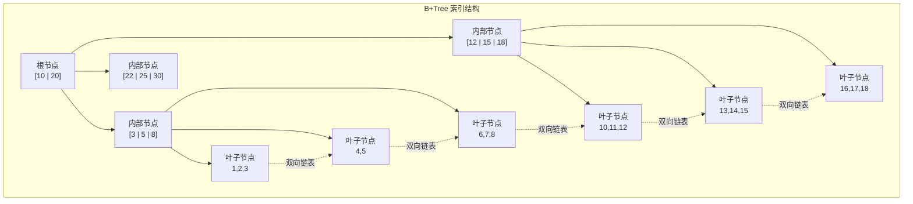
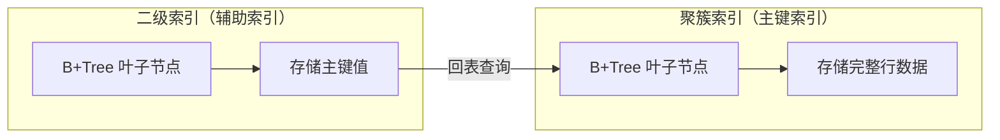
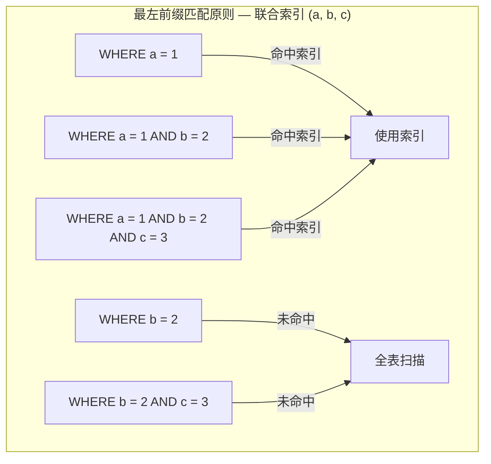

#mysql索引

相关笔记：[[mysql-engine]] | [[redis-data-types]]

## 索引分类概览

MySQL 索引可以从四个维度进行分类：

| 分类维度 | 索引类型 |
|---------|---------|
| 数据结构 | B+Tree 索引、Hash 索引、Full-text 索引 |
| 物理存储 | 聚簇索引（主键索引）、二级索引（辅助索引） |
| 字段特性 | 主键索引、唯一索引、普通索引、前缀索引 |
| 字段个数 | 单列索引、联合索引 |

## 按数据结构分类

![[存储引擎支持的索引类型.png]]

InnoDB 是 MySQL 5.5 之后的默认存储引擎，B+Tree 是 InnoDB 采用最多的索引类型。

### InnoDB 聚簇索引键的选择

InnoDB 在创建表时，会按以下优先级选择聚簇索引的索引键：

1. 如果有主键，使用主键作为聚簇索引的索引键（key）
2. 如果没有主键，选择第一个不包含 NULL 值的 UNIQUE 列
3. 以上都没有时，InnoDB 自动生成一个隐式自增 id 列作为索引键

其它索引都属于辅助索引（Secondary Index），也称为二级索引或非聚簇索引。**创建的主键索引和二级索引默认使用 B+Tree 索引**。

### B+Tree 索引结构



B+Tree 的特点：
- 非叶子节点只存储索引键，不存储数据，使得每个节点可以容纳更多键值，降低树的高度
- 所有数据都存储在叶子节点，且叶子节点通过双向链表相连，方便范围查询
- 查询时间复杂度稳定为 O(log n)

## 按物理存储分类

从物理存储的角度来看，索引分为聚簇索引（主键索引）和二级索引（辅助索引）。



两者的核心区别：
- **主键索引**：B+Tree 的叶子节点存放的是**实际数据**，所有完整的用户记录都在主键索引的叶子节点里
- **二级索引**：B+Tree 的叶子节点存放的是**主键值**，而不是实际数据

### 覆盖索引与回表

- **覆盖索引**：使用二级索引查询时，如果查询的数据能在二级索引里直接获取到，就不需要回表
- **回表**：如果查询的数据不在二级索引里，需要先从二级索引找到主键值，再通过主键索引检索完整数据

```sql
-- 覆盖索引示例：假设 (name, age) 是联合索引
-- 查询字段都在索引中，无需回表
SELECT name, age FROM users WHERE name = 'Alice';

-- 回表示例：email 不在联合索引中，需要回表
SELECT name, age, email FROM users WHERE name = 'Alice';
```

## 按字段特性分类

### 主键索引

主键索引建立在主键字段上，一张表最多只有一个主键索引，索引列的值不允许有空值。

```sql
CREATE TABLE table_name (
    id INT NOT NULL AUTO_INCREMENT,
    ....
    PRIMARY KEY (id) USING BTREE
);
```

### 唯一索引

唯一索引建立在 UNIQUE 字段上，一张表可以有多个唯一索引，索引列的值必须唯一，但允许有空值。

```sql
-- 建表时创建
CREATE TABLE table_name (
    ....
    UNIQUE KEY(index_column_1, index_column_2)
);

-- 建表后创建
CREATE UNIQUE INDEX index_name
ON table_name(index_column_1, index_column_2);
```

### 普通索引

普通索引建立在普通字段上，既不要求字段为主键，也不要求字段为 UNIQUE。

```sql
-- 建表时创建
CREATE TABLE table_name (
    ....
    INDEX(index_column_1, index_column_2)
);

-- 建表后创建
CREATE INDEX index_name
ON table_name(index_column_1, index_column_2);
```

### 前缀索引

前缀索引是指对字符类型字段的**前几个字符**建立的索引，而不是在整个字段上建立索引。前缀索引可以建立在 char、varchar、binary、varbinary 类型的列上。

使用前缀索引的目的是**减少索引占用的存储空间，提升查询效率**。

```sql
-- 建表时创建
CREATE TABLE table_name (
    column_list,
    INDEX(column_name(length))
);

-- 建表后创建
CREATE INDEX index_name
ON table_name(column_name(length));

-- 实际示例：对 email 字段的前 10 个字符建立索引
CREATE INDEX idx_email ON users(email(10));
```

## 按字段个数分类

- **单列索引**：建立在单列上的索引，比如主键索引
- **联合索引**（复合索引）：建立在多列上的索引

### 联合索引

通过将多个字段组合成一个索引，该索引称为联合索引。联合索引遵循**最左前缀匹配原则**。

```sql
-- 创建联合索引
CREATE INDEX index_product_no_name ON product(product_no, name);
```



联合索引的使用建议：
- 将**区分度高**的字段放在前面
- 将**查询频率高**的字段放在前面
- 尽量利用联合索引实现覆盖索引，减少回表次数

## 面试要点

### 高频问题

**Q: 为什么 InnoDB 使用 B+Tree 而不是 B-Tree 或红黑树作为索引结构？**
A: 红黑树是二叉树，数据量大时高度过高，导致磁盘 IO 次数多。B-Tree 每个节点（含非叶子节点）都存数据，单节点能容纳的键值更少，树更高；而 B+Tree 非叶子节点只存索引键、数据全在叶子节点，单节点扇出更大，三四层就能管理上千万行，磁盘 IO 通常只需 2-4 次。同时叶子节点用双向链表相连，天然支持高效的范围查询和顺序扫描。

**Q: 聚簇索引和二级索引有什么区别？什么是回表？**
A: 聚簇索引（主键索引）的叶子节点存放的是完整行数据，一张表只有一个；二级索引的叶子节点存放的是主键值而非行数据。当通过二级索引查询、但所需字段不全在该索引中时，需要先拿到主键值，再回到聚簇索引查找完整记录，这个二次查找的过程就叫回表。回表会带来额外的随机 IO，因此应尽量避免。

**Q: 什么是覆盖索引？如何利用它优化查询？**
A: 覆盖索引指查询所需的所有列都能从二级索引（包括其叶子节点存的主键值）中直接获取，无需回表。例如联合索引 `(name, age)`，执行 `SELECT name, age FROM users WHERE name='Alice'` 时数据全在索引里就属于覆盖索引（`EXPLAIN` 的 `Extra` 会显示 `Using index`）。优化手段是把高频查询的列纳入联合索引、避免 `SELECT *`，从而省去回表的随机 IO。

**Q: 联合索引的最左前缀匹配原则是什么？哪些情况会导致索引失效？**
A: 联合索引 `(a, b, c)` 按从左到右的顺序构建，查询必须从最左列开始连续匹配才能命中，如 `a`、`a AND b`、`a AND b AND c` 都能用上索引，而单独 `WHERE b` 或 `WHERE b AND c` 跳过了最左列则无法命中。此外，对索引列做函数运算/隐式类型转换、范围查询之后的列（`>`、`<`、`BETWEEN`、`LIKE 'xxx%'` 之后的列只能用于回表过滤而非索引定位）、`LIKE '%xxx'` 前导模糊匹配等也会导致索引（部分）失效。

**Q: 没有显式定义主键时，InnoDB 如何确定聚簇索引？**
A: InnoDB 按优先级选择聚簇索引键：1）有主键则用主键；2）没有主键则选第一个所有列均为 `NOT NULL` 的 UNIQUE 索引；3）两者都没有时，InnoDB 自动生成一个 6 字节的隐藏列 `DB_ROW_ID`（全局单调递增的 row id）作为聚簇索引键。这也是建议显式定义主键的原因，避免依赖这个不可控的隐式行 id。

**Q: 前缀索引是什么？有什么优缺点？**
A: 前缀索引指只对字符类型字段（char、varchar、binary、varbinary）的前 N 个字符建立索引，如 `CREATE INDEX idx_email ON users(email(10))`。优点是减小索引体积、节省存储、降低写入维护成本；缺点是前缀区分度可能不够导致过滤效果差、扫描行数变多，且无法用于覆盖索引、`ORDER BY` 和 `GROUP BY`。选取长度时通常用 `count(distinct left(col, n))/count(*)` 评估区分度来权衡。

**Q: 设计联合索引时字段顺序应如何安排？**
A: 总体原则是把区分度高（唯一值多）的字段放前面，让索引尽早过滤掉大量数据；其次把查询频率高、需要满足最左前缀的字段放前面；同时把等值条件放在范围条件之前（因为范围列之后的列无法再用于索引定位）。在条件允许时尽量让联合索引覆盖查询字段，实现覆盖索引以减少回表。

### 面试加分点

- B+Tree 一个节点（页）默认大小为 16KB，可估算树高：假设主键 8 字节加 6 字节指针，非叶子节点约存 1170 个键，叶子节点每条记录若 1KB 则存 16 条，三层 B+Tree 即可容纳约 1170×1170×16 ≈ 2000 万行，这也是为什么常说几次 IO 就能定位记录。
- 二级索引在 InnoDB 中存的是主键值而非物理地址，好处是行数据移动（如页分裂）时无需更新所有二级索引，代价是回表，这也解释了为什么主键不宜过长（过长会让每个二级索引都变大）。
- 区分覆盖索引与索引下推（ICP，Index Condition Pushdown，5.6 引入）：ICP 把 `WHERE` 中可由索引列判断的条件下推到存储引擎层，在二级索引上先过滤再回表，减少回表次数；可通过 `EXPLAIN` 的 `Extra` 列出现 `Using index condition` 识别。
- 自增主键 vs UUID/随机主键：自增主键顺序写入、页填充充分，减少页分裂和碎片；随机主键会导致频繁页分裂和随机 IO，写入性能差，这是高并发写场景的常见优化点。
- 可结合 `EXPLAIN` 的 `type`（const > eq_ref > ref > range > index > ALL，越靠左越优）、`key`、`rows`、`Extra`（`Using index` 表示覆盖索引，`Using filesort`/`Using temporary` 提示可优化）来判断索引是否被有效利用。
- InnoDB 的自适应哈希索引（AHI）会对热点页自动建立 hash 索引加速等值查询，但这是引擎内部行为，无法手动创建；Hash 索引不支持范围查询和排序，也是 InnoDB 默认仍用 B+Tree 的原因之一。
