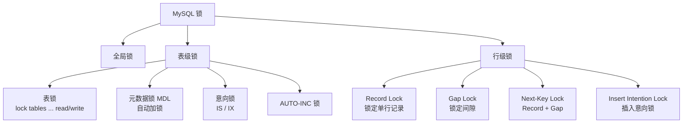
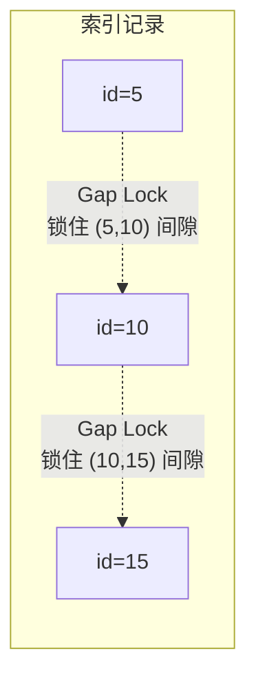
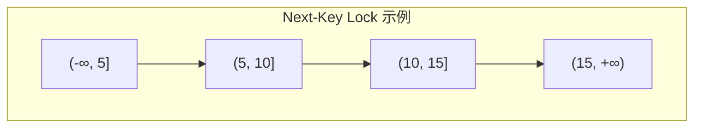
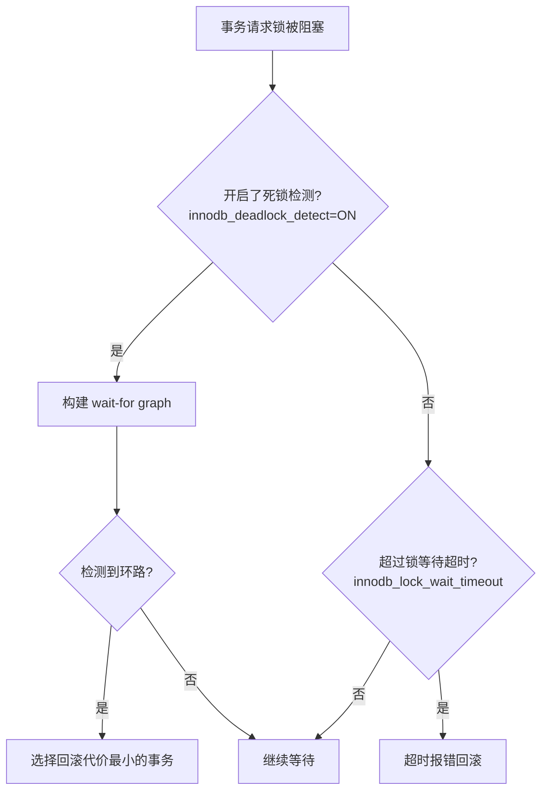

#mysql #lock

相关笔记：[[mysql-transaction]] | [[mysql-index]] | [[mysql-engine]]

## MySQL 锁机制

### 锁类型层级



### 全局锁

```sql
-- 加全局读锁（整个数据库只读）
FLUSH TABLES WITH READ LOCK;

-- 释放
UNLOCK TABLES;
```

典型使用场景：全库逻辑备份。但更推荐使用 `mysqldump --single-transaction`，利用 MVCC 实现一致性备份而无需加全局锁（仅适用于 InnoDB）。

### 表级锁

#### 表锁

```sql
-- 加表读锁（当前会话只读，其他会话也只读）
LOCK TABLES t READ;

-- 加表写锁（当前会话可读写，其他会话被阻塞）
LOCK TABLES t WRITE;

UNLOCK TABLES;
```

#### 元数据锁（MDL）

MDL 不需要显式使用，在访问表时自动加锁：

| 操作 | MDL 锁类型 | 说明 |
|------|-----------|------|
| SELECT / DML | MDL 读锁 | 并发 DML 不冲突 |
| DDL（ALTER TABLE 等） | MDL 写锁 | 与 MDL 读锁互斥 |

> 注意：长事务持有 MDL 读锁时，DDL 会被阻塞，并且后续所有 DML 也会排队，可能导致库挂掉。

#### 意向锁

| 锁类型 | 含义 | 加锁时机 |
|--------|------|----------|
| IS (Intention Shared) | 意向共享锁 | 事务要对某行加 S 锁前，先对表加 IS |
| IX (Intention Exclusive) | 意向排他锁 | 事务要对某行加 X 锁前，先对表加 IX |

意向锁的目的：让表级锁判断是否有行级锁冲突时，不必逐行扫描。

意向锁兼容性矩阵：

|  | IS | IX | S | X |
|--|----|----|---|---|
| IS | ✅ | ✅ | ✅ | ❌ |
| IX | ✅ | ✅ | ❌ | ❌ |
| S  | ✅ | ❌ | ✅ | ❌ |
| X  | ❌ | ❌ | ❌ | ❌ |

### 行级锁（InnoDB）

InnoDB 的行级锁是加在索引上的，如果查询没走索引，会退化为表锁。

#### Record Lock

锁住索引上的单条记录：

```sql
-- 对 id=1 的记录加 X 锁
SELECT * FROM t WHERE id = 1 FOR UPDATE;

-- 对 id=1 的记录加 S 锁
SELECT * FROM t WHERE id = 1 LOCK IN SHARE MODE;
```

#### Gap Lock

锁住索引记录之间的间隙，防止其他事务在间隙中插入新记录：



```sql
-- 假设表中 id 有 5, 10, 15
-- 以下查询会加 Gap Lock 锁住 (5, 10) 间隙
BEGIN;
SELECT * FROM t WHERE id = 8 FOR UPDATE;
-- 其他事务无法 INSERT id=6,7,8,9
```

> Gap Lock 仅在 RR 隔离级别下存在，RC 级别没有 Gap Lock。

#### Next-Key Lock

Next-Key Lock = Record Lock + Gap Lock，锁住记录本身及其前面的间隙。InnoDB 默认加锁单位是 Next-Key Lock。



加锁规则（重要）：

1. 加锁的基本单位是 Next-Key Lock，前开后闭区间
2. 查找过程中访问到的对象才会加锁
3. 唯一索引等值查询，Next-Key Lock 退化为 Record Lock
4. 索引等值查询向右遍历时最后一个不满足条件的值，Next-Key Lock 退化为 Gap Lock
5. 范围查询会访问到不满足条件的第一个值为止

#### Insert Intention Lock（插入意向锁）

是一种特殊的 Gap Lock，在 INSERT 操作等待 Gap Lock 释放时加的锁。多个事务可以同时持有同一个间隙的插入意向锁（只要插入的位置不同）。

### 死锁

#### 死锁产生条件

1. 互斥
2. 占有且等待
3. 不可强占
4. 循环等待

#### 死锁复现

```sql
-- Session A
BEGIN;
UPDATE t SET name = 'A' WHERE id = 1;  -- 获取 id=1 的 X 锁

-- Session B
BEGIN;
UPDATE t SET name = 'B' WHERE id = 2;  -- 获取 id=2 的 X 锁

-- Session A
UPDATE t SET name = 'A2' WHERE id = 2; -- 等待 id=2 的 X 锁（被 Session B 持有）

-- Session B
UPDATE t SET name = 'B2' WHERE id = 1; -- 等待 id=1 的 X 锁（被 Session A 持有）
-- 死锁！InnoDB 检测到后回滚代价较小的事务
```

#### 死锁检测与处理



```sql
-- 查看死锁检测配置
SHOW VARIABLES LIKE 'innodb_deadlock_detect';  -- 默认 ON
SHOW VARIABLES LIKE 'innodb_lock_wait_timeout'; -- 默认 50s

-- 查看最近一次死锁信息
SHOW ENGINE INNODB STATUS\G
```

### 乐观锁 vs 悲观锁

| 对比项 | 悲观锁 | 乐观锁 |
|--------|--------|--------|
| 思想 | 总是假设最坏情况，先加锁再操作 | 假设冲突少，提交时检测冲突 |
| 实现 | SELECT ... FOR UPDATE | 版本号 / CAS |
| 适用场景 | 写多读少，冲突频繁 | 读多写少，冲突较少 |
| 开销 | 加锁开销 | 重试开销 |

```sql
-- 悲观锁
BEGIN;
SELECT balance FROM accounts WHERE id = 1 FOR UPDATE;
UPDATE accounts SET balance = balance - 100 WHERE id = 1;
COMMIT;

-- 乐观锁（版本号方式）
SELECT balance, version FROM accounts WHERE id = 1;
-- 应用层处理...
UPDATE accounts SET balance = balance - 100, version = version + 1
WHERE id = 1 AND version = 5;
-- 如果 affected rows = 0，说明有冲突，需要重试
```

### 加锁分析示例

```sql
-- 表结构
CREATE TABLE t (
  id INT PRIMARY KEY,
  age INT,
  name VARCHAR(20),
  KEY idx_age (age)
) ENGINE=InnoDB;

-- 数据：(1,10,'a'), (5,20,'b'), (10,30,'c'), (15,40,'d')

-- 案例 1：唯一索引等值查询（命中）
SELECT * FROM t WHERE id = 5 FOR UPDATE;
-- 加锁：id=5 的 Record Lock

-- 案例 2：唯一索引等值查询（未命中）
SELECT * FROM t WHERE id = 7 FOR UPDATE;
-- 加锁：(5, 10) 的 Gap Lock

-- 案例 3：普通索引等值查询
SELECT * FROM t WHERE age = 20 FOR UPDATE;
-- 加锁：idx_age 上 (10,20] 的 Next-Key Lock + (20,30) 的 Gap Lock
--       + 主键索引 id=5 的 Record Lock

-- 案例 4：普通索引范围查询
SELECT * FROM t WHERE age >= 20 AND age < 40 FOR UPDATE;
-- 加锁：idx_age 上 (10,20], (20,30], (30,40] 的 Next-Key Lock
--       + 对应主键的 Record Lock
```

### 面试要点

1. **InnoDB 行锁加在哪里？** 加在索引上。没有索引的查询会锁全表（因为走了聚簇索引全扫描）。
2. **Gap Lock 的作用？** 防止幻读，阻止其他事务在间隙中插入新记录。只在 RR 级别下生效。
3. **什么情况下 Next-Key Lock 会退化？** 唯一索引等值查询命中时退化为 Record Lock；等值查询未命中时退化为 Gap Lock。
4. **如何减少死锁？** 按固定顺序访问资源、缩短事务、使用合理的索引减少锁范围、降低隔离级别（RC 无 Gap Lock）。
5. **MDL 锁为什么危险？** 长事务持有 MDL 读锁 → DDL 申请 MDL 写锁被阻塞 → 后续所有 DML 都排队 → 连接数耗尽。
