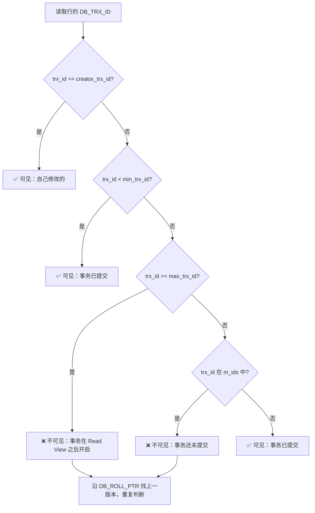

#mysql #transaction #mvcc

相关笔记：[[mysql-index]] | [[mysql-engine]] | [[mysql-lock]]

## MySQL 事务与 MVCC

### ACID 特性

| 特性 | 英文 | 含义 | 实现方式 |
|------|------|------|----------|
| 原子性 | Atomicity | 事务中的操作要么全部成功，要么全部回滚 | undo log |
| 一致性 | Consistency | 事务前后数据库从一个一致状态转换到另一个一致状态 | 由其他三个特性共同保证 |
| 隔离性 | Isolation | 并发事务之间互不影响 | MVCC + 锁 |
| 持久性 | Durability | 事务提交后数据永久保存 | redo log |

### 四种隔离级别

| 隔离级别 | 脏读 | 不可重复读 | 幻读 | 性能 | 实现方式 |
|----------|------|-----------|------|------|----------|
| Read Uncommitted | ✅ 可能 | ✅ 可能 | ✅ 可能 | 最高 | 无 MVCC，直接读最新数据 |
| Read Committed (RC) | ❌ 不会 | ✅ 可能 | ✅ 可能 | 高 | 每次 SELECT 生成新 Read View |
| Repeatable Read (RR) | ❌ 不会 | ❌ 不会 | ✅ 可能* | 中 | 事务首次 SELECT 生成 Read View |
| Serializable | ❌ 不会 | ❌ 不会 | ❌ 不会 | 最低 | 加锁串行执行 |

> *InnoDB 在 RR 级别通过 Next-Key Lock 在很大程度上解决了幻读问题。

### MVCC 实现原理

#### 隐藏列

InnoDB 为每行数据额外存储三个隐藏列：

| 隐藏列 | 大小 | 作用 |
|--------|------|------|
| `DB_TRX_ID` | 6 字节 | 最近修改该行的事务 ID |
| `DB_ROLL_PTR` | 7 字节 | 指向 undo log 中该行的上一个版本 |
| `DB_ROW_ID` | 6 字节 | 自增行 ID（无主键时作为隐藏主键） |

#### Undo Log 版本链

每次更新操作都会将旧版本写入 undo log，通过 `DB_ROLL_PTR` 串成一条版本链：


#### Read View 结构

Read View 包含四个关键字段：

| 字段 | 含义 |
|------|------|
| `m_ids` | 创建 Read View 时活跃（未提交）的事务 ID 列表 |
| `min_trx_id` | `m_ids` 中的最小值 |
| `max_trx_id` | 创建 Read View 时系统应分配的下一个事务 ID |
| `creator_trx_id` | 创建该 Read View 的事务 ID |

#### Read View 判断流程



### RC vs RR 下 Read View 的区别

| 对比项 | Read Committed (RC) | Repeatable Read (RR) |
|--------|--------------------|-----------------------|
| Read View 生成时机 | 每次 SELECT 都生成新的 Read View | 事务中第一次 SELECT 生成，后续复用 |
| 可见性 | 能看到其他事务已提交的最新数据 | 只能看到首次查询时已提交的数据快照 |
| 不可重复读 | 存在 | 不存在 |

### 幻读问题与 Next-Key Lock

幻读是指同一事务内，两次相同范围查询返回了不同的行数。InnoDB 在 RR 级别使用 Next-Key Lock（Record Lock + Gap Lock）来防止幻读：

- **Record Lock**：锁住索引记录本身
- **Gap Lock**：锁住索引记录之间的间隙
- **Next-Key Lock**：Record Lock + Gap Lock，锁住记录及其前面的间隙

> 注意：快照读（普通 SELECT）通过 MVCC 天然避免幻读；当前读（SELECT ... FOR UPDATE）需要 Next-Key Lock 解决幻读。

### SQL 示例

#### 查看和设置隔离级别

```sql
-- 查看当前隔离级别
SELECT @@transaction_isolation;

-- 设置会话隔离级别
SET SESSION TRANSACTION ISOLATION LEVEL REPEATABLE READ;
SET SESSION TRANSACTION ISOLATION LEVEL READ COMMITTED;
```

#### 脏读演示（Read Uncommitted）

```sql
-- Session A
SET SESSION TRANSACTION ISOLATION LEVEL READ UNCOMMITTED;
BEGIN;
UPDATE accounts SET balance = balance - 100 WHERE id = 1;
-- 不提交

-- Session B
SET SESSION TRANSACTION ISOLATION LEVEL READ UNCOMMITTED;
BEGIN;
SELECT balance FROM accounts WHERE id = 1;
-- 能读到 Session A 未提交的数据（脏读）
```

#### 不可重复读演示（Read Committed）

```sql
-- Session A
SET SESSION TRANSACTION ISOLATION LEVEL READ COMMITTED;
BEGIN;
SELECT balance FROM accounts WHERE id = 1;  -- 返回 1000

-- Session B
UPDATE accounts SET balance = 900 WHERE id = 1;
COMMIT;

-- Session A（继续）
SELECT balance FROM accounts WHERE id = 1;  -- 返回 900（不可重复读）
COMMIT;
```

#### Repeatable Read 演示

```sql
-- Session A
SET SESSION TRANSACTION ISOLATION LEVEL REPEATABLE READ;
BEGIN;
SELECT balance FROM accounts WHERE id = 1;  -- 返回 1000

-- Session B
UPDATE accounts SET balance = 900 WHERE id = 1;
COMMIT;

-- Session A（继续）
SELECT balance FROM accounts WHERE id = 1;  -- 仍然返回 1000（可重复读）
COMMIT;
```

#### 幻读演示

```sql
-- Session A（RR 级别）
BEGIN;
SELECT * FROM users WHERE age > 20;  -- 返回 3 行

-- Session B
INSERT INTO users (name, age) VALUES ('新用户', 25);
COMMIT;

-- Session A
SELECT * FROM users WHERE age > 20;          -- 快照读，仍然 3 行
SELECT * FROM users WHERE age > 20 FOR UPDATE; -- 当前读，返回 4 行（幻读）
```

### 面试要点

1. **MVCC 如何实现无锁读？** 通过 undo log 版本链 + Read View 可见性判断，SELECT 不需要加锁就能读到一致性快照。
2. **RC 和 RR 的核心区别？** Read View 的生成时机不同：RC 每次 SELECT 都生成新的，RR 整个事务复用第一次的。
3. **InnoDB RR 级别能完全避免幻读吗？** 快照读通过 MVCC 可以，当前读通过 Next-Key Lock 可以，但如果先快照读再当前读，仍然可能观察到"幻读"现象。
4. **undo log 什么时候清理？** 当没有活跃的 Read View 引用该版本时，purge 线程会清理 undo log。
5. **为什么 InnoDB 默认 RR 而不是 RC？** 历史原因——早期 MySQL 的 Statement 格式 binlog 在 RC 下会导致主从不一致。现在用 Row 格式 binlog 后，RC 也是安全的。
