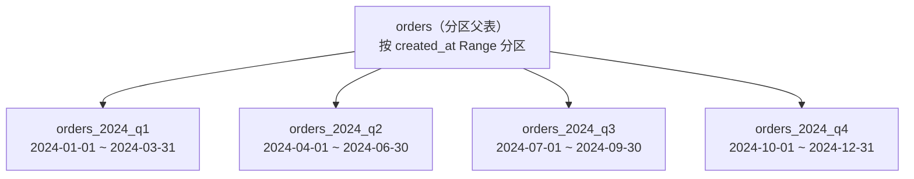
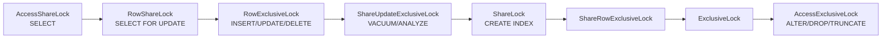
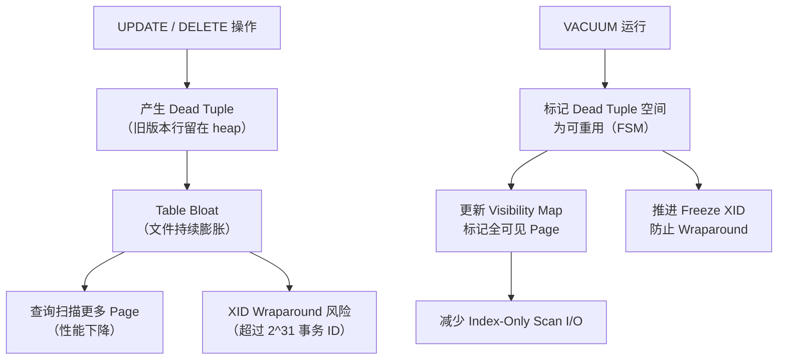
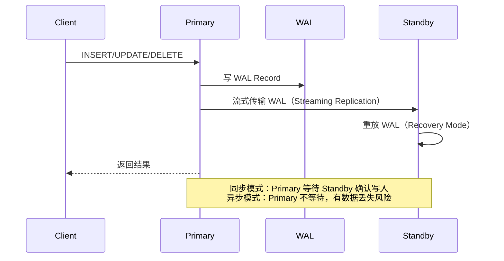
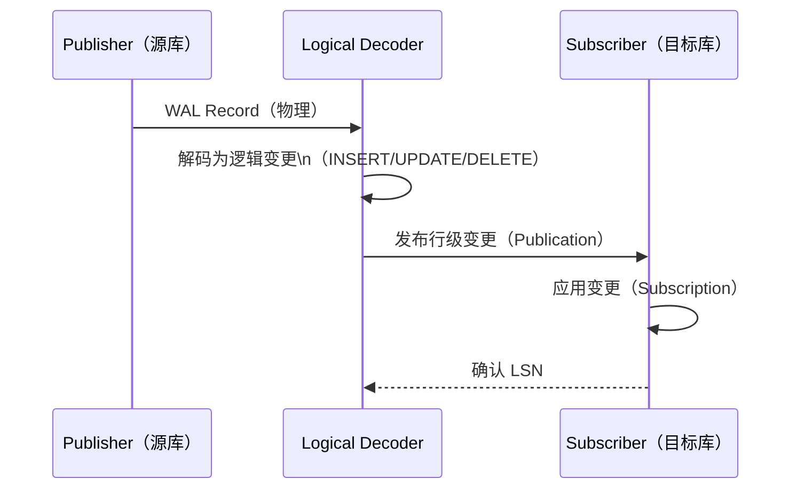
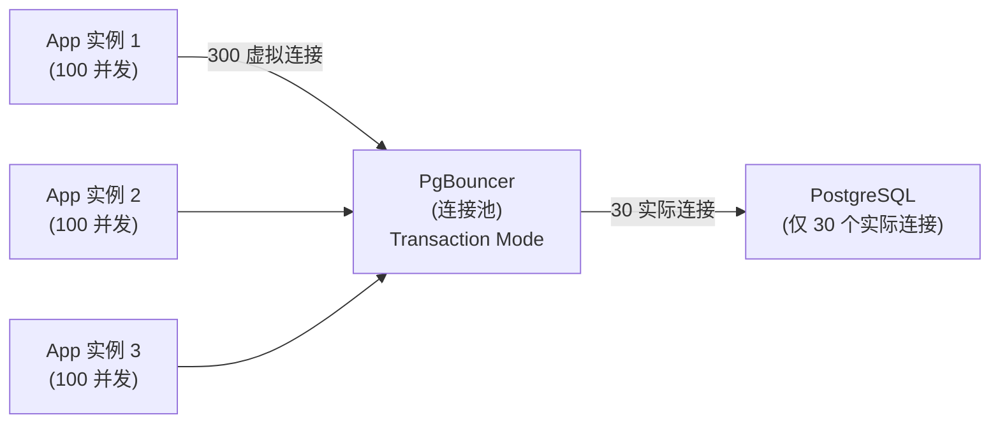

#postgresql #advanced

相关笔记：[[postgresql-basics]] | [[mysql-transaction]] | [[mysql-lock]]

# PostgreSQL 高级特性

## 高级查询：Window Function

Window Function（窗口函数）在**不折叠行**的情况下对分组/排序后的结果集进行计算，是复杂分析查询的核心工具。

### 语法结构

```sql
function_name(args) OVER (
    [PARTITION BY partition_expr]
    [ORDER BY sort_expr]
    [frame_clause]          -- ROWS / RANGE / GROUPS
)
```

### ROW_NUMBER / RANK / DENSE_RANK

```sql
-- 每个部门内按薪资排名，取各部门 Top 2
WITH ranked AS (
    SELECT
        name,
        dept,
        salary,
        ROW_NUMBER()  OVER (PARTITION BY dept ORDER BY salary DESC) AS row_num,
        RANK()        OVER (PARTITION BY dept ORDER BY salary DESC) AS rnk,
        DENSE_RANK()  OVER (PARTITION BY dept ORDER BY salary DESC) AS dense_rnk
    FROM employees
)
SELECT * FROM ranked WHERE row_num <= 2;

-- ROW_NUMBER：无重复，严格递增
-- RANK：并列后跳号（1,1,3）
-- DENSE_RANK：并列后不跳号（1,1,2）
```

### LAG / LEAD（前后行访问）

```sql
-- 计算每日销售额环比变化
SELECT
    sale_date,
    amount,
    LAG(amount, 1)  OVER (ORDER BY sale_date) AS prev_day,
    LEAD(amount, 1) OVER (ORDER BY sale_date) AS next_day,
    amount - LAG(amount, 1) OVER (ORDER BY sale_date) AS day_over_day
FROM daily_sales
ORDER BY sale_date;
```

### 聚合窗口函数（滑动窗口）

```sql
-- 7日滑动平均（ROWS BETWEEN）
SELECT
    sale_date,
    amount,
    AVG(amount) OVER (
        ORDER BY sale_date
        ROWS BETWEEN 6 PRECEDING AND CURRENT ROW
    ) AS ma7,
    SUM(amount) OVER (
        ORDER BY sale_date
        ROWS BETWEEN UNBOUNDED PRECEDING AND CURRENT ROW
    ) AS cumulative_sum
FROM daily_sales;
```

### LATERAL JOIN

`LATERAL` 允许右侧子查询引用左侧表的列，相当于对每一行执行一次子查询（类似编程中的 for-each）。

```sql
-- 查询每个用户最近 3 笔订单
SELECT u.id, u.name, o.order_id, o.amount, o.created_at
FROM users u
CROSS JOIN LATERAL (
    SELECT order_id, amount, created_at
    FROM orders
    WHERE user_id = u.id           -- 引用外部 u.id
    ORDER BY created_at DESC
    LIMIT 3
) o;

-- 使用 LEFT JOIN LATERAL 保留没有订单的用户
SELECT u.id, u.name, o.order_id
FROM users u
LEFT JOIN LATERAL (
    SELECT order_id
    FROM orders
    WHERE user_id = u.id
    ORDER BY created_at DESC
    LIMIT 1
) o ON true;
```

### Recursive CTE（递归公共表表达式）

```sql
-- 生成日期序列（1月全月）
WITH RECURSIVE date_series AS (
    SELECT '2024-01-01'::date AS dt
    UNION ALL
    SELECT dt + INTERVAL '1 day'
    FROM date_series
    WHERE dt < '2024-01-31'
)
SELECT dt FROM date_series;

-- 树形结构：找某节点的所有子孙节点
WITH RECURSIVE subtree AS (
    -- 锚点
    SELECT id, name, parent_id
    FROM categories
    WHERE id = 10              -- 起始节点

    UNION ALL

    -- 递归
    SELECT c.id, c.name, c.parent_id
    FROM categories c
    JOIN subtree s ON c.parent_id = s.id
)
SELECT * FROM subtree;
```

---

## 分区表（Table Partitioning）

PostgreSQL 10+ 提供**声明式分区**，将一张逻辑大表拆分为多个物理子表（partition）。

### 分区类型对比

| 分区类型 | 适用场景 | 路由方式 |
|---|---|---|
| **Range Partition** | 时间、连续数值（日志、订单） | 按列值范围分配到对应分区 |
| **List Partition** | 枚举值（地区、状态、租户 ID） | 按列的具体值列表分配 |
| **Hash Partition** | 均匀分散负载（无明显范围/枚举） | 按列值哈希取模分配 |



### Range Partition 示例

```sql
-- 创建分区父表
CREATE TABLE orders (
    id         BIGSERIAL,
    user_id    BIGINT NOT NULL,
    amount     NUMERIC(12,2),
    created_at TIMESTAMPTZ NOT NULL DEFAULT NOW()
) PARTITION BY RANGE (created_at);

-- 创建子分区
CREATE TABLE orders_2024_q1 PARTITION OF orders
    FOR VALUES FROM ('2024-01-01') TO ('2024-04-01');

CREATE TABLE orders_2024_q2 PARTITION OF orders
    FOR VALUES FROM ('2024-04-01') TO ('2024-07-01');

-- 为每个子分区单独建索引
CREATE INDEX ON orders_2024_q1 (user_id);
CREATE INDEX ON orders_2024_q2 (user_id);

-- 查询时自动 Partition Pruning（剪枝）
EXPLAIN SELECT * FROM orders WHERE created_at >= '2024-04-01' AND created_at < '2024-07-01';
-- 只扫描 orders_2024_q2，跳过其他分区
```

### List Partition 示例

```sql
CREATE TABLE customers (
    id     BIGSERIAL,
    region TEXT NOT NULL,
    name   TEXT
) PARTITION BY LIST (region);

CREATE TABLE customers_cn PARTITION OF customers FOR VALUES IN ('CN', 'HK', 'TW');
CREATE TABLE customers_us PARTITION OF customers FOR VALUES IN ('US', 'CA');
CREATE TABLE customers_eu PARTITION OF customers DEFAULT;  -- 默认分区
```

### Hash Partition 示例

```sql
CREATE TABLE user_events (
    id      BIGSERIAL,
    user_id BIGINT NOT NULL,
    event   TEXT
) PARTITION BY HASH (user_id);

CREATE TABLE user_events_0 PARTITION OF user_events FOR VALUES WITH (MODULUS 4, REMAINDER 0);
CREATE TABLE user_events_1 PARTITION OF user_events FOR VALUES WITH (MODULUS 4, REMAINDER 1);
CREATE TABLE user_events_2 PARTITION OF user_events FOR VALUES WITH (MODULUS 4, REMAINDER 2);
CREATE TABLE user_events_3 PARTITION OF user_events FOR VALUES WITH (MODULUS 4, REMAINDER 3);
```

---

## 锁机制

### 表级锁（8 种）

PostgreSQL 定义了 8 种表级锁，冲突关系形成一个矩阵：

| 锁模式 | 典型操作 | 冲突对象 |
|---|---|---|
| `AccessShareLock` | SELECT | AccessExclusiveLock |
| `RowShareLock` | SELECT FOR UPDATE/SHARE | ExclusiveLock, AccessExclusiveLock |
| `RowExclusiveLock` | INSERT/UPDATE/DELETE | ShareLock, ShareRowExclusiveLock, ExclusiveLock, AccessExclusiveLock |
| `ShareUpdateExclusiveLock` | VACUUM, ANALYZE, CREATE INDEX CONCURRENTLY | 自身及以上 |
| `ShareLock` | CREATE INDEX（非 CONCURRENTLY） | RowExclusiveLock 及以上 |
| `ShareRowExclusiveLock` | 某些触发器操作 | RowExclusiveLock 及以上 |
| `ExclusiveLock` | 某些系统级操作 | RowShareLock 及以上 |
| `AccessExclusiveLock` | ALTER TABLE, DROP, TRUNCATE, LOCK TABLE | 所有锁模式 |



### 行级锁

| 命令 | 行锁模式 |
|---|---|
| `SELECT FOR UPDATE` | 强行级锁，阻塞其他 `FOR UPDATE/SHARE` |
| `SELECT FOR NO KEY UPDATE` | 弱于 `FOR UPDATE`，不阻塞 `FOR KEY SHARE` |
| `SELECT FOR SHARE` | 共享行锁，允许多个事务同时持有 |
| `SELECT FOR KEY SHARE` | 最弱行锁，外键检查使用 |

```sql
-- 悲观锁：先锁定再修改
BEGIN;
SELECT * FROM accounts WHERE id = 1 FOR UPDATE;
UPDATE accounts SET balance = balance - 100 WHERE id = 1;
COMMIT;

-- 跳过被锁行（SKIP LOCKED）：用于并发任务队列
SELECT id, payload FROM tasks
WHERE status = 'pending'
ORDER BY created_at
LIMIT 10
FOR UPDATE SKIP LOCKED;
```

### 咨询锁（Advisory Lock）

Advisory Lock 是**应用层分布式锁**，与任何表数据无关，由应用自行定义语义。

```sql
-- 会话级咨询锁（事务提交后不释放，需手动释放）
SELECT pg_try_advisory_lock(12345);        -- 尝试获取，返回 bool
SELECT pg_advisory_unlock(12345);          -- 释放

-- 事务级咨询锁（事务结束自动释放）
BEGIN;
SELECT pg_try_advisory_xact_lock(12345);   -- 事务内有效
-- 做业务逻辑...
COMMIT;                                    -- 自动释放

-- 用字符串 key（hashtext 转 bigint）
SELECT pg_try_advisory_lock(hashtext('job:process:order_export'));
```

**典型用途**：防止定时任务重复执行、分布式唯一操作保护。

---

## VACUUM 与 Autovacuum 原理

### Dead Tuple 与 Table Bloat



### VACUUM 工作流程

1. 扫描表的所有 page，找到 dead tuple
2. 将 dead tuple 的空间标记到 **Free Space Map（FSM）**，供新行复用
3. 更新 **Visibility Map（VM）**，标记所有行都已对所有事务可见的 page
4. 对满足条件的旧行执行 **freeze**（将 xmin 替换为 `FrozenTransactionId`），推进 `relfrozenxid`

> `VACUUM FULL` = 重写整张表到新文件 + 归还 OS 磁盘空间，需要 `AccessExclusiveLock`，生产慎用。

### Autovacuum 关键参数

```sql
-- 查看当前 autovacuum 配置
SHOW autovacuum_vacuum_scale_factor;   -- 默认 0.2（表的 20% 行变动触发）
SHOW autovacuum_vacuum_threshold;      -- 默认 50（最少 50 行变动）

-- 触发条件：dead tuples > threshold + scale_factor * reltuples
-- 即：50 + 0.2 * 总行数

-- 对高频更新表降低阈值（表级覆盖）
ALTER TABLE orders SET (
    autovacuum_vacuum_scale_factor = 0.01,   -- 1% 变动即触发
    autovacuum_vacuum_threshold = 100
);

-- 查看各表 autovacuum 状态
SELECT schemaname, relname,
       n_dead_tup,
       n_live_tup,
       round(n_dead_tup::numeric / NULLIF(n_live_tup + n_dead_tup, 0) * 100, 2) AS dead_ratio,
       last_autovacuum,
       last_autoanalyze
FROM pg_stat_user_tables
ORDER BY n_dead_tup DESC
LIMIT 20;
```

### Freeze 与 XID Wraparound

```sql
-- 查看距离 wraparound 还有多少事务 ID
SELECT datname,
       age(datfrozenxid) AS xid_age,
       2147483647 - age(datfrozenxid) AS xids_remaining
FROM pg_database
ORDER BY xid_age DESC;

-- 当 age > autovacuum_freeze_max_age（默认 2 亿）时触发强制 VACUUM FREEZE
-- 当 age > vacuum_freeze_min_age + 1.5 亿 时 PostgreSQL 会拒绝新事务（进入 stop-the-world）
```

---

## 复制：逻辑复制 vs 流复制

### 流复制（Streaming Replication）

流复制基于 **WAL（Write-Ahead Log）**，将 Primary 的 WAL 流实时传输到 Standby，Standby 重放 WAL 以保持同步。



**特点**：
- 物理级别复制，**复制整个数据库实例**（所有数据库）
- Standby 以 **只读模式**对外提供查询
- 支持同步（synchronous）/ 异步（asynchronous）模式
- 用于 HA（高可用）主备切换、读写分离

```sql
-- primary: postgresql.conf
wal_level = replica          -- 最低开启流复制需要 replica
max_wal_senders = 5
wal_keep_size = 1GB

-- primary: pg_hba.conf
host replication replicator 10.0.0.2/32 md5

-- standby: recovery.conf（PG 12+ 改为 postgresql.conf）
primary_conninfo = 'host=10.0.0.1 user=replicator password=xxx'
hot_standby = on
```

### 逻辑复制（Logical Replication）

逻辑复制基于**逻辑解码（logical decoding）**，将 WAL 中的变更解析为行级别的 INSERT/UPDATE/DELETE 事件，按**表**订阅。



```sql
-- Publisher 端
ALTER SYSTEM SET wal_level = logical;
-- 重启后创建 Publication
CREATE PUBLICATION my_pub FOR TABLE orders, products;
-- 或发布全库
CREATE PUBLICATION all_tables FOR ALL TABLES;

-- Subscriber 端（另一个 PG 实例）
CREATE SUBSCRIPTION my_sub
    CONNECTION 'host=primary user=replicator dbname=mydb'
    PUBLICATION my_pub;

-- 查看订阅状态
SELECT * FROM pg_stat_subscription;
```

### 流复制 vs 逻辑复制对比

| 维度 | 流复制（Streaming） | 逻辑复制（Logical） |
|---|---|---|
| 复制粒度 | 物理 WAL，整个实例 | 逻辑行变更，指定表 |
| 目标版本 | 必须相同大版本 | 可以跨大版本（如 14→16） |
| 目标平台 | 必须相同 OS/架构 | 可以跨平台 |
| Standby 可写 | 否（只读） | 是（目标库可有自己数据） |
| DDL 同步 | 自动同步 | **不同步 DDL**，需手动 |
| 用途 | HA 主备、读写分离 | 跨版本迁移、CDC、部分同步 |
| 延迟 | 极低（秒级以内） | 略高（行级解码开销） |

---

## 连接池：PgBouncer

由于 PostgreSQL 的多进程模型，每个连接占用独立进程（约 5-10 MB 内存），高并发场景必须使用连接池。

### PgBouncer 工作模式

| 模式 | 连接复用时机 | 适用场景 |
|---|---|---|
| **Session mode** | 客户端断开才归还连接 | 使用了 session 级状态（prepared statements、set 变量） |
| **Transaction mode** | 事务结束即归还连接（推荐） | 无 session 状态依赖，连接复用率最高 |
| **Statement mode** | 每条语句结束归还（限制最多） | 仅单语句，不支持事务，几乎不用 |



### pgbouncer.ini 关键配置

```ini
[databases]
mydb = host=127.0.0.1 port=5432 dbname=mydb

[pgbouncer]
pool_mode = transaction          ; 推荐 transaction mode
max_client_conn = 1000           ; 最大客户端连接数
default_pool_size = 25           ; 每个 db/user 对的连接池大小
min_pool_size = 5                ; 预热连接数
reserve_pool_size = 5            ; 预留紧急连接
reserve_pool_timeout = 5         ; 等待预留连接超时（秒）
server_idle_timeout = 600        ; 空闲 server 连接超时（秒）
client_idle_timeout = 0          ; 客户端空闲超时（0=禁用）
```

### Transaction Mode 的限制

使用 transaction mode 时以下特性**不可用**：
- `SET` / `RESET` 会话变量
- Advisory Lock（`pg_advisory_lock`）
- Named Prepared Statements（需开启 `server_reset_query`）
- `LISTEN` / `NOTIFY`
- 游标（Cursor）跨事务使用

---

## 面试要点

### 1. 什么是 Table Bloat？如何排查和解决？

> [!question]- 参考答案（点击展开）
>
> **原因**：PostgreSQL MVCC 下 UPDATE/DELETE 留下 dead tuple，VACUUM 未能及时清理时表文件膨胀。
>
> **排查**：
> ```sql
> -- 查看 dead tuple 比例
> SELECT relname,
>        n_live_tup,
>        n_dead_tup,
>        round(n_dead_tup::numeric / NULLIF(n_live_tup + n_dead_tup, 0) * 100, 2) AS dead_pct,
>        pg_size_pretty(pg_total_relation_size(relid)) AS total_size
> FROM pg_stat_user_tables
> ORDER BY n_dead_tup DESC;
>
> -- 用 pgstattuple 扩展精确统计
> CREATE EXTENSION pgstattuple;
> SELECT * FROM pgstattuple('orders');
> ```
>
> **解决**：
> - 短期：`VACUUM ANALYZE table_name`
> - 彻底重写（生产低峰）：`VACUUM FULL table_name` 或 `CLUSTER table_name USING idx`
> - 在线重建（不锁表）：使用 `pg_repack` 工具
> - 根本治理：调低 `autovacuum_vacuum_scale_factor`，增加 `autovacuum_vacuum_cost_delay` 频率

### 2. VACUUM 关键参数调优

```sql
-- 全局参数（postgresql.conf）
autovacuum = on
autovacuum_max_workers = 3           -- autovacuum worker 进程数
autovacuum_naptime = 1min            -- 检查周期
autovacuum_vacuum_scale_factor = 0.2 -- 默认 20%，高频表建议 0.01~0.05
autovacuum_vacuum_cost_delay = 2ms   -- IO 节流延迟，设为 0 加速 vacuum（但占 IO）
autovacuum_vacuum_cost_limit = 200   -- 每次 vacuum 的 cost 上限
autovacuum_freeze_max_age = 200000000 -- freeze 触发阈值（2亿 XID）

-- 单表覆盖（高频更新表）
ALTER TABLE orders SET (
    autovacuum_vacuum_scale_factor = 0.01,
    autovacuum_vacuum_threshold = 100,
    autovacuum_vacuum_cost_delay = 0
);
```

### 3. 分区表选型指南

| 场景 | 推荐分区类型 | 原因 |
|---|---|---|
| 按时间归档（日志、订单历史） | **Range** | 查询通常带时间范围，剪枝效果最好 |
| 按枚举值隔离（地区、租户） | **List** | 每个分区数据边界清晰 |
| 均匀分散读写负载 | **Hash** | 无明显范围/枚举规律时自动均衡 |
| 混合需求（先按时间再按地区） | **Range + 子 List** | 多级分区 |

**注意事项**：
- 分区键必须包含在**主键**和**唯一约束**中
- 全局索引（跨分区）PG 目前不支持，需对每个子分区单独建索引
- `JOIN` 操作若两张表都是分区表，需开启 `enable_partitionwise_join = on`
- 子分区数量不宜过多（>1000 会影响查询规划性能）

### 4. 逻辑复制 vs 流复制如何选择？

> [!question]- 参考答案（点击展开）
>
> - **HA 主备切换、读写分离** → 流复制（低延迟、自动同步 DDL）
> - **跨大版本升级（如 PG 14 → PG 16）** → 逻辑复制（目标库可不同版本）
> - **CDC（变更数据捕获）/ 同步部分表到下游** → 逻辑复制（按表订阅）
> - **异构同步（PG → Kafka / PG → 其他 DB）** → 逻辑解码（pglogical / debezium）

### 5. PgBouncer Transaction Mode 的限制有哪些？

> [!question]- 参考答案（点击展开）
>
> Transaction mode 下，每个事务结束后连接归还连接池，以下**不可用**：
> 1. `SET` 会话变量（归还后被重置）
> 2. `pg_advisory_lock`（会话级锁随连接归还丢失）
> 3. Named prepared statements（需客户端库关闭或使用 `server_reset_query`）
> 4. `LISTEN/NOTIFY`
> 5. 跨事务游标
>
> **解决方案**：若业务必须用上述特性，切换为 **session mode**，或在应用层避免依赖。

### 6. 如何防止 XID Wraparound？

> [!question]- 参考答案（点击展开）
>
> 1. 确保 `autovacuum` 正常运行（监控 `pg_stat_user_tables.last_autovacuum`）
> 2. 监控 `age(datfrozenxid)`，超过 1.5 亿时告警
> 3. 对大表降低 `autovacuum_freeze_max_age`，提前触发 freeze
> 4. 避免长事务（长事务阻塞 autovacuum 推进 freeze）：监控 `pg_stat_activity` 中 `xact_start`
>
> ```sql
> -- 监控高风险数据库
> SELECT datname, age(datfrozenxid) AS xid_age
> FROM pg_database
> WHERE age(datfrozenxid) > 150000000  -- 1.5亿告警
> ORDER BY xid_age DESC;
>
> -- 监控阻塞 autovacuum 的长事务
> SELECT pid, now() - xact_start AS duration, query
> FROM pg_stat_activity
> WHERE xact_start IS NOT NULL
>   AND state != 'idle'
> ORDER BY duration DESC;
> ```

### 7. Window Function 与 GROUP BY 的区别？

> [!question]- 参考答案（点击展开）
>
> - `GROUP BY` 将多行**折叠**为一行，窗口函数**保留所有行**。
> - 窗口函数在 `WHERE`、`GROUP BY`、`HAVING` 之后执行，可以在同一 SELECT 中混用聚合与窗口函数。
> - 同一查询可以有多个不同 `OVER()` 子句的窗口函数，互不干扰。
