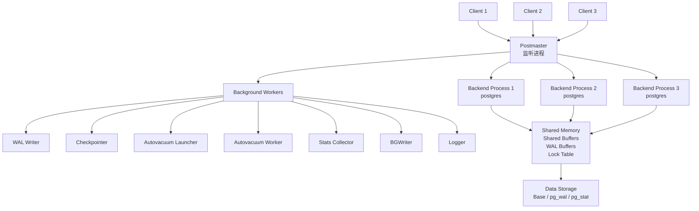
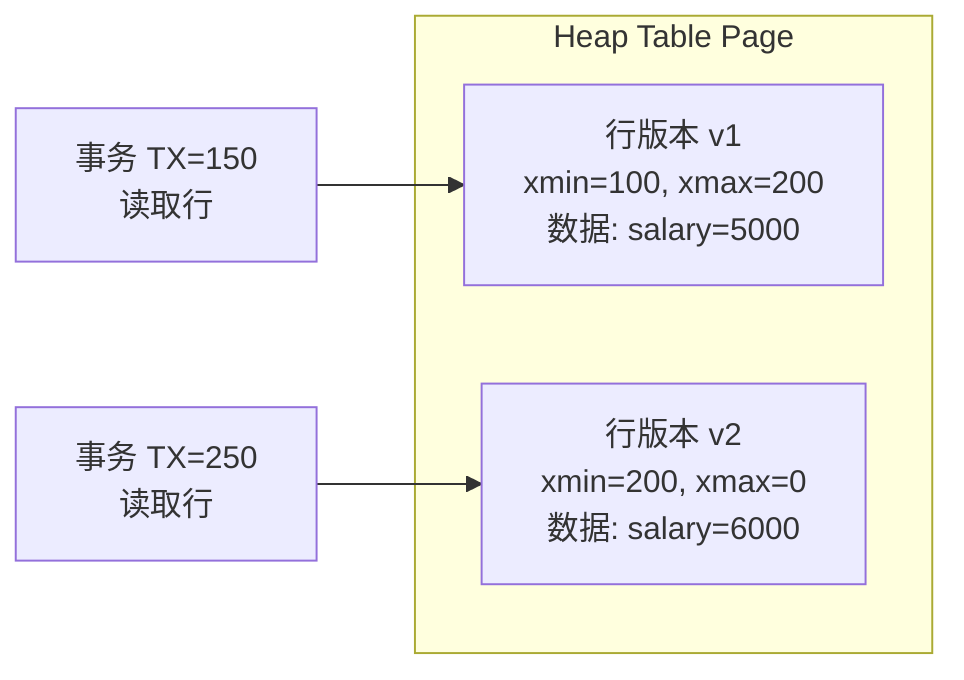

#postgresql #database

相关笔记：[[mysql-index]] | [[mysql-transaction]] | [[postgresql-advanced]]

# PostgreSQL 基础与核心原理

## 整体架构：多进程模型

PostgreSQL 使用**多进程（multi-process）**模型，每个客户端连接对应一个独立的 backend 进程；MySQL 使用**多线程（multi-thread）**模型。



### 关键进程说明

| 进程 | 职责 |
|---|---|
| Postmaster | 监听连接请求，fork backend 进程 |
| Backend (postgres) | 处理单个客户端的所有 SQL 请求 |
| WAL Writer | 将 WAL buffer 刷写到磁盘 |
| Checkpointer | 定期将 dirty page 落盘，更新检查点 |
| Autovacuum Launcher | 按需启动 Autovacuum Worker |
| BGWriter | 后台将 dirty buffer 写回磁盘，减少 backend 等待 |
| Stats Collector | 收集表、索引访问统计信息 |

### 多进程 vs 多线程对比

| 维度 | PostgreSQL（多进程） | MySQL（多线程） |
|---|---|---|
| 隔离性 | 进程级隔离，一个 crash 不影响其他连接 | 线程共享内存，崩溃可能影响整个实例 |
| 内存占用 | 每个连接独立进程，内存开销较大 | 线程共享内存，开销相对小 |
| 连接扩展 | 需要连接池（PgBouncer）缓解进程开销 | 可支撑更多并发连接 |
| 通信开销 | 进程间通过共享内存通信 | 线程直接共享地址空间 |

---

## MVCC 实现原理

### PostgreSQL MVCC：多版本行存储（xmin/xmax）

PostgreSQL 的 MVCC 将**所有历史版本的行都存储在主表（heap）**中，通过事务 ID（`xmin`/`xmax`）判断可见性，不依赖独立的 undo log。



- `xmin`：插入该行版本的事务 ID
- `xmax`：删除/更新该行版本的事务 ID（0 表示当前有效）
- UPDATE 实际上是 **INSERT 新版本 + 标记旧版本 xmax**

### MySQL MVCC：undo log 回滚段

MySQL InnoDB 的 MVCC 将最新版本存储在主表，**历史版本存储在 undo log** 中，通过 DB_TRX_ID + undo pointer 回溯历史版本。

### MVCC 对比

| 维度 | PostgreSQL | MySQL InnoDB |
|---|---|---|
| 旧版本存储位置 | 主表 heap 中（dead tuple） | undo log 回滚段 |
| 读取旧版本方式 | 扫描 heap，按 xmin/xmax 过滤 | 沿 undo pointer 链回溯 |
| 写放大 | UPDATE = INSERT + 标记删除，空间膨胀 | undo log 独立管理，主表更新 in-place |
| 空间回收 | 需要 VACUUM 清理 dead tuple | Purge 线程自动清理 undo log |
| 长事务影响 | dead tuple 无法回收，表膨胀（bloat） | undo log 不断增长，影响性能 |
| 隔离级别实现 | 基于 snapshot（xmin/xmax + snapshot） | 基于 ReadView + undo 链 |

---

## 数据类型特色

PostgreSQL 提供了远超标准 SQL 的丰富数据类型：

### JSONB

`JSONB` 以**二进制格式**存储 JSON，支持索引，查询效率远高于文本格式的 `JSON`。

```sql
-- 创建含 JSONB 列的表
CREATE TABLE products (
    id      SERIAL PRIMARY KEY,
    name    TEXT NOT NULL,
    attrs   JSONB
);

-- 插入 JSONB 数据
INSERT INTO products (name, attrs) VALUES
('MacBook Pro', '{"color": "silver", "ram": 16, "tags": ["laptop", "apple"]}'),
('iPhone 15',  '{"color": "black",  "ram": 6,  "tags": ["phone", "apple"]}');

-- 查询 JSONB 字段（->> 返回文本）
SELECT name, attrs->>'color' AS color FROM products;

-- 条件过滤
SELECT name FROM products WHERE attrs->>'color' = 'silver';

-- 包含查询（@> 操作符）
SELECT name FROM products WHERE attrs @> '{"color": "black"}';

-- 查询数组元素
SELECT name FROM products WHERE attrs->'tags' ? 'laptop';

-- 在 JSONB 上建 GIN 索引
CREATE INDEX idx_products_attrs ON products USING GIN (attrs);
```

### Array

```sql
-- 数组类型列
CREATE TABLE orders (
    id       SERIAL PRIMARY KEY,
    tags     TEXT[],
    scores   INT[]
);

INSERT INTO orders (tags, scores) VALUES
(ARRAY['urgent', 'vip'], ARRAY[90, 85, 92]),
('{normal,retail}',      '{70,75}');

-- 数组包含查询
SELECT * FROM orders WHERE tags @> ARRAY['vip'];

-- 数组元素查询（any）
SELECT * FROM orders WHERE 'urgent' = ANY(tags);

-- 数组长度、追加
SELECT array_length(scores, 1), array_append(tags, 'new') FROM orders;
```

### Range（范围类型）

```sql
-- 使用 tsrange 存储时间段
CREATE TABLE reservations (
    id       SERIAL PRIMARY KEY,
    room     TEXT,
    during   tsrange
);

INSERT INTO reservations (room, during) VALUES
('101', '[2024-01-10 09:00, 2024-01-10 12:00)'),
('102', '[2024-01-10 14:00, 2024-01-10 18:00)');

-- 查询某时刻有哪些预约（@> 包含）
SELECT room FROM reservations
WHERE during @> '2024-01-10 10:00'::timestamp;

-- 查询时间段是否有重叠（&& 操作符）
SELECT * FROM reservations
WHERE during && '[2024-01-10 11:00, 2024-01-10 15:00)'::tsrange;
```

### 其他特色类型

| 类型 | 说明 | 示例 |
|---|---|---|
| `UUID` | 128位唯一标识符 | `gen_random_uuid()` |
| `ENUM` | 用户自定义枚举类型 | `CREATE TYPE mood AS ENUM ('happy','sad')` |
| `HSTORE` | 键值对存储（扁平化 JSON） | `'color=>red, size=>M'::hstore` |
| `TSVECTOR` | 全文检索向量 | `to_tsvector('english', text_col)` |
| `CIDR/INET` | 网络地址类型 | `'192.168.1.0/24'::cidr` |
| `POINT/LINE/POLYGON` | 几何类型 | `POINT(1.0, 2.0)` |
| `Composite` | 用户自定义复合类型 | `CREATE TYPE address AS (city TEXT, zip TEXT)` |

---

## 索引类型

PostgreSQL 支持多种索引类型，适用于不同的查询场景：

| 索引类型 | 适用场景 | 不适用 |
|---|---|---|
| **B-Tree** | 等值、范围、排序（默认） | 全文检索、几何 |
| **Hash** | 等值查询（不支持范围） | 范围查询、排序 |
| **GIN** | 数组、JSONB、全文检索（多值列） | 单值等值查询 |
| **GiST** | 几何、全文检索、范围类型（可扩展） | 高基数等值查询 |
| **BRIN** | 超大表中物理顺序相关的列（时序数据） | 随机分布数据 |
| **Bloom** | 多列等值查询（概率过滤，允许假阳性） | 范围、排序查询 |

```sql
-- B-Tree（默认）
CREATE INDEX idx_btree ON orders (created_at);

-- Hash（仅等值）
CREATE INDEX idx_hash ON users USING HASH (email);

-- GIN（JSONB、数组）
CREATE INDEX idx_gin_attrs ON products USING GIN (attrs);
CREATE INDEX idx_gin_tags  ON orders   USING GIN (tags);

-- GiST（几何/范围）
CREATE INDEX idx_gist_loc ON places USING GIST (location);

-- BRIN（时序大表）
CREATE INDEX idx_brin_ts ON events USING BRIN (created_at) WITH (pages_per_range = 128);

-- 部分索引（Partial Index）——只索引未删除的行
CREATE INDEX idx_active_users ON users (email) WHERE deleted_at IS NULL;

-- 表达式索引
CREATE INDEX idx_lower_email ON users (lower(email));
```

---

## CTE（公共表表达式）示例

```sql
-- 递归 CTE：组织层级查询
WITH RECURSIVE org_tree AS (
    -- 锚点：顶层部门
    SELECT id, name, parent_id, 1 AS depth
    FROM departments
    WHERE parent_id IS NULL

    UNION ALL

    -- 递归：子部门
    SELECT d.id, d.name, d.parent_id, ot.depth + 1
    FROM departments d
    JOIN org_tree ot ON d.parent_id = ot.id
)
SELECT depth, name FROM org_tree ORDER BY depth, name;

-- 普通 CTE：分步骤处理逻辑
WITH
monthly_sales AS (
    SELECT date_trunc('month', order_date) AS month,
           SUM(amount) AS total
    FROM orders
    GROUP BY 1
),
ranked AS (
    SELECT month, total,
           RANK() OVER (ORDER BY total DESC) AS rnk
    FROM monthly_sales
)
SELECT month, total FROM ranked WHERE rnk <= 3;
```

---

## 常用管理命令

### psql 元命令

```bash
# 连接数据库
psql -h localhost -p 5432 -U postgres -d mydb

# 常用元命令
\l          -- 列出所有数据库
\c mydb     -- 切换数据库
\dt         -- 列出当前 schema 的所有表
\d orders   -- 查看表结构（含索引）
\di         -- 列出所有索引
\dn         -- 列出所有 schema
\du         -- 列出所有用户/角色
\x          -- 切换扩展显示模式
\timing     -- 显示查询耗时
\e          -- 用编辑器编辑上一条 SQL
\q          -- 退出
```

### 备份与恢复

```bash
# pg_dump：逻辑备份（单库）
pg_dump -h localhost -U postgres -d mydb -F c -f mydb.dump
pg_dump -h localhost -U postgres -d mydb -F p -f mydb.sql   # 纯 SQL 格式

# pg_dumpall：备份所有数据库（含角色）
pg_dumpall -h localhost -U postgres -f all.sql

# pg_restore：恢复
pg_restore -h localhost -U postgres -d mydb -F c mydb.dump
psql -h localhost -U postgres -d mydb -f mydb.sql

# pg_basebackup：物理备份（用于搭建备库）
pg_basebackup -h localhost -U replicator -D /var/lib/postgresql/backup -Fp -Xs -P
```

### VACUUM 与 ANALYZE

```sql
-- VACUUM：回收 dead tuple，不锁表（不归还 OS 磁盘空间）
VACUUM orders;

-- VACUUM FULL：重写整张表，归还磁盘空间（需要排他锁，慎用生产）
VACUUM FULL orders;

-- ANALYZE：更新统计信息，优化查询计划
ANALYZE orders;

-- 同时执行
VACUUM ANALYZE orders;

-- 查看表的 dead tuple 数量
SELECT relname, n_live_tup, n_dead_tup, last_vacuum, last_autovacuum
FROM pg_stat_user_tables
WHERE relname = 'orders';
```

---

## 建库建表示例

```sql
-- 创建数据库
CREATE DATABASE shop
    WITH OWNER = postgres
    ENCODING = 'UTF8'
    LC_COLLATE = 'en_US.UTF-8'
    LC_CTYPE = 'en_US.UTF-8'
    TEMPLATE = template0;

-- 创建 Schema
CREATE SCHEMA IF NOT EXISTS ecom;

-- 创建枚举类型
CREATE TYPE ecom.order_status AS ENUM ('pending', 'paid', 'shipped', 'cancelled');

-- 创建用户表
CREATE TABLE ecom.users (
    id         UUID PRIMARY KEY DEFAULT gen_random_uuid(),
    email      TEXT NOT NULL UNIQUE,
    name       TEXT NOT NULL,
    profile    JSONB,
    tags       TEXT[],
    created_at TIMESTAMPTZ NOT NULL DEFAULT NOW()
);

-- 创建订单表
CREATE TABLE ecom.orders (
    id          BIGSERIAL PRIMARY KEY,
    user_id     UUID NOT NULL REFERENCES ecom.users(id),
    status      ecom.order_status NOT NULL DEFAULT 'pending',
    amount      NUMERIC(12, 2) NOT NULL,
    meta        JSONB,
    created_at  TIMESTAMPTZ NOT NULL DEFAULT NOW()
);

-- 索引
CREATE INDEX idx_orders_user    ON ecom.orders (user_id);
CREATE INDEX idx_orders_status  ON ecom.orders (status) WHERE status != 'cancelled';
CREATE INDEX idx_users_profile  ON ecom.users  USING GIN (profile);
```

---

## PostgreSQL vs MySQL 综合对比

| 维度 | PostgreSQL | MySQL (InnoDB) |
|---|---|---|
| 协议与许可 | PostgreSQL License（宽松） | GPL / 商业双授权 |
| 进程模型 | 多进程 | 多线程 |
| MVCC 实现 | xmin/xmax，版本存 heap | ReadView + undo log |
| 事务隔离 | RC、RR、Serializable（SSI） | RC、RR（默认）、Serializable |
| JSON 支持 | JSONB（二进制，可索引） | JSON 列（MySQL 5.7+，索引受限） |
| 数组类型 | 原生支持 | 不支持，需 JSON 变通 |
| 全文检索 | 内置 tsvector/GIN | 内置 FULLTEXT（功能较弱） |
| 窗口函数 | 完整支持（SQL:2003） | MySQL 8.0+ 支持 |
| CTE | 支持（含 Writable CTE） | MySQL 8.0+ 支持 |
| 分区表 | 声明式分区（PG 10+） | 分区表（功能较弱） |
| 扩展生态 | PostGIS、TimescaleDB、pg_vector 等 | 相对有限 |
| 性能调优 | 参数多，灵活但复杂 | 相对简单，开箱即用 |
| 云托管 | RDS、Cloud SQL、Neon 等 | RDS、Aurora（生态最成熟） |
| 适合场景 | 复杂查询、GIS、分析、多样化数据类型 | OLTP、互联网高并发写入 |

---

## 面试要点

### 1. PostgreSQL 的多进程模型有什么优缺点？

**优点**：进程隔离，单个连接崩溃不影响其他连接；安全性高。  
**缺点**：每个连接消耗独立内存（约 5-10 MB），高并发时进程数多、内存压力大，需要使用 **PgBouncer** 等连接池。

### 2. MVCC 中 xmin/xmax 如何判断行的可见性？

事务启动时获取 snapshot（记录当前活跃事务 ID 集合）。对于一行数据：
- `xmin` 已提交 且 `xmin` < 当前事务 ID 且 `xmin` 不在 snapshot 的活跃列表 → 插入对当前事务可见
- `xmax` 为 0 或 `xmax` 未提交 或 `xmax` >= 当前事务 ID → 该行未被删除，对当前事务可见

### 3. JSONB 和 JSON 有什么区别？

|         | JSON     | JSONB      |
| ------- | -------- | ---------- |
| 存储格式    | 原始文本     | 二进制（解析后存储） |
| 写入速度    | 快（直接存文本） | 稍慢（需解析）    |
| 读取速度    | 慢（每次解析）  | 快（已解析）     |
| 索引支持    | 不支持 GIN  | 支持 GIN 索引  |
| 空白/顺序保留 | 保留       | 不保留        |
| 推荐场景    | 只存不查     | 需要查询、过滤    |

### 4. GIN 和 GiST 索引的区别？

- **GIN（Generalized Inverted Index）**：倒排索引，适合数组、JSONB、全文检索等多值列，查询快但构建慢、更新开销大。
- **GiST（Generalized Search Tree）**：通用搜索树框架，适合几何、范围、全文检索，支持有损存储，查询比 GIN 稍慢但更新快。

### 5. 为什么 PostgreSQL 需要 VACUUM？

因为 MVCC 机制下，UPDATE/DELETE 不会立即删除旧行版本，而是留下 **dead tuple**（已失效行）。若不清理：表文件持续膨胀（table bloat）、查询需要扫描更多 page、vacuum freeze 不推进会导致 **transaction ID wraparound** 风险。

### 6. B-Tree 和 BRIN 索引如何选择？

- 数据**物理顺序**与逻辑顺序高度相关（如时序日志、自增 ID）→ 优选 **BRIN**，极小体积。
- 数据随机分布或需要随机访问 → 优选 **B-Tree**。
- BRIN 不能精确定位，只能过滤 page 范围，假阳性由 heap 扫描再次过滤。
