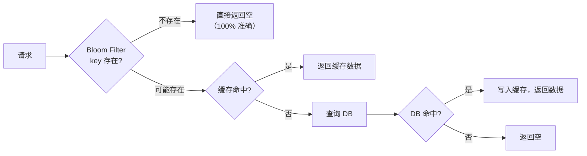
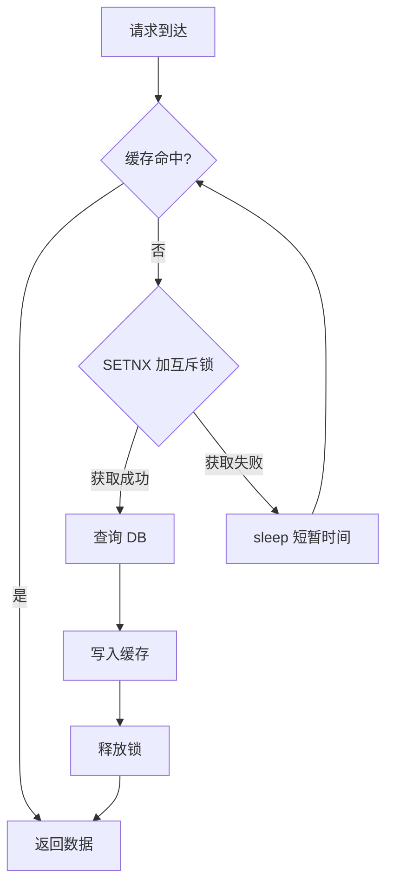
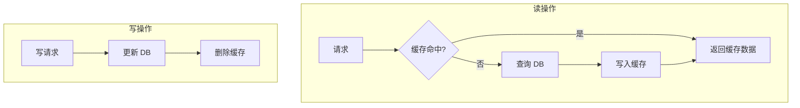
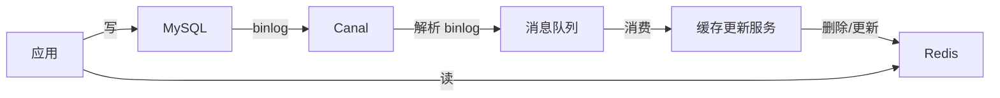

#redis #cache

相关笔记：[[redis-data-types]] | [[redis-cluster]]

## Redis 缓存问题

### 问题总览

| 问题 | 描述 | 核心原因 | 后果 |
|------|------|---------|------|
| 缓存穿透 | 查询不存在的数据，缓存和 DB 都没有 | 恶意攻击 / 非法参数 | 每次请求打到 DB |
| 缓存击穿 | 热点 key 过期瞬间，大量请求打到 DB | 热点 key 失效 | DB 瞬间压力暴增 |
| 缓存雪崩 | 大量 key 同时过期，或缓存服务宕机 | 过期时间集中 / 缓存故障 | DB 被压垮 |

---

### 缓存穿透

请求的数据在缓存和数据库中都不存在，每次请求都穿过缓存直达数据库。

#### 解决方案

**方案一：缓存空值**

```sql
-- 查询 DB 未命中时，缓存一个空值
SET user:999999 "" EX 60   -- 短过期时间，防止占用过多内存
```

缺点：浪费内存、短时间内数据不一致。

**方案二：Bloom Filter**

在缓存前增加布隆过滤器，先判断 key 是否可能存在：



Go 实现布隆过滤器示例：

```go
package cache

import (
	"context"
	"github.com/redis/go-redis/v9"
	"hash/fnv"
)

type BloomFilter struct {
	rdb    *redis.Client
	key    string
	size   uint64  // bit 数组大小
	hashes int     // hash 函数个数
}

func NewBloomFilter(rdb *redis.Client, key string, expectedItems int, falsePositiveRate float64) *BloomFilter {
	// 简化计算：size ≈ -n*ln(p) / (ln2)^2
	size := uint64(float64(expectedItems) * 10) // 约 1% 误判率
	hashes := 7
	return &BloomFilter{rdb: rdb, key: key, size: size, hashes: hashes}
}

func (bf *BloomFilter) Add(ctx context.Context, item string) error {
	pipe := bf.rdb.Pipeline()
	for i := 0; i < bf.hashes; i++ {
		offset := bf.hash(item, i)
		pipe.SetBit(ctx, bf.key, int64(offset), 1)
	}
	_, err := pipe.Exec(ctx)
	return err
}

func (bf *BloomFilter) Exists(ctx context.Context, item string) (bool, error) {
	pipe := bf.rdb.Pipeline()
	cmds := make([]*redis.IntCmd, bf.hashes)
	for i := 0; i < bf.hashes; i++ {
		offset := bf.hash(item, i)
		cmds[i] = pipe.GetBit(ctx, bf.key, int64(offset))
	}
	_, err := pipe.Exec(ctx)
	if err != nil {
		return false, err
	}
	for _, cmd := range cmds {
		if cmd.Val() == 0 {
			return false, nil // 一定不存在
		}
	}
	return true, nil // 可能存在（有误判率）
}

func (bf *BloomFilter) hash(item string, seed int) uint64 {
	h := fnv.New64a()
	h.Write([]byte(item))
	h.Write([]byte{byte(seed)})
	return h.Sum64() % bf.size
}
```

> 生产环境推荐使用 Redis 的 `BF.ADD` / `BF.EXISTS` 命令（RedisBloom 模块），或 Redisson 的布隆过滤器。

---

### 缓存击穿

某个热点 key 在过期的瞬间，大量并发请求同时穿过缓存打到数据库。

#### 解决方案

**方案一：互斥锁（Mutex Lock）**

只让一个请求去查 DB 并重建缓存，其他请求等待：



Go 实现：

```go
func GetWithMutex(ctx context.Context, rdb *redis.Client, key string, 
	loadFunc func() (string, error), ttl time.Duration) (string, error) {
	
	// 1. 先查缓存
	val, err := rdb.Get(ctx, key).Result()
	if err == nil {
		return val, nil
	}

	// 2. 缓存未命中，尝试获取互斥锁
	lockKey := "lock:" + key
	for {
		ok, err := rdb.SetNX(ctx, lockKey, "1", 10*time.Second).Result()
		if err != nil {
			return "", err
		}
		if ok {
			// 获取锁成功，查 DB
			defer rdb.Del(ctx, lockKey)
			
			// 双重检查
			val, err = rdb.Get(ctx, key).Result()
			if err == nil {
				return val, nil
			}
			
			val, err = loadFunc()
			if err != nil {
				return "", err
			}
			rdb.Set(ctx, key, val, ttl)
			return val, nil
		}
		// 获取锁失败，短暂等待后重试
		time.Sleep(50 * time.Millisecond)
	}
}
```

**方案二：逻辑过期（热点 key 永不过期）**

缓存不设 TTL，在 value 中存储逻辑过期时间。发现逻辑过期后，异步更新缓存：

```go
type CacheValue struct {
	Data      string `json:"data"`
	ExpireAt  int64  `json:"expire_at"` // 逻辑过期时间戳
}

func GetWithLogicalExpire(ctx context.Context, rdb *redis.Client, key string,
	loadFunc func() (string, error), ttl time.Duration) (string, error) {
	
	raw, err := rdb.Get(ctx, key).Result()
	if err != nil {
		return "", err
	}

	var cv CacheValue
	json.Unmarshal([]byte(raw), &cv)

	// 未过期，直接返回
	if time.Now().Unix() < cv.ExpireAt {
		return cv.Data, nil
	}

	// 逻辑过期，尝试异步刷新
	lockKey := "lock:" + key
	ok, _ := rdb.SetNX(ctx, lockKey, "1", 10*time.Second).Result()
	if ok {
		go func() {
			defer rdb.Del(context.Background(), lockKey)
			newData, err := loadFunc()
			if err != nil {
				return
			}
			newCV := CacheValue{Data: newData, ExpireAt: time.Now().Add(ttl).Unix()}
			b, _ := json.Marshal(newCV)
			rdb.Set(context.Background(), key, string(b), 0) // 不设 TTL
		}()
	}

	// 返回旧数据（允许短暂不一致）
	return cv.Data, nil
}
```

---

### 缓存雪崩

大量缓存 key 同时过期，或者缓存服务宕机，导致大量请求直接打到数据库。

#### 解决方案

| 方案 | 说明 |
|------|------|
| 随机过期时间 | `TTL = baseTTL + random(0, 300s)`，打散过期时间 |
| 多级缓存 | 本地缓存 (L1) + Redis (L2) + DB |
| 缓存预热 | 系统启动时主动加载热点数据 |
| 熔断降级 | 数据库压力过大时，降级返回默认值或错误 |
| 高可用部署 | Redis Sentinel / Cluster 避免单点故障 |

```go
// 随机过期时间
func SetWithRandomTTL(ctx context.Context, rdb *redis.Client, 
	key, value string, baseTTL time.Duration) error {
	jitter := time.Duration(rand.Intn(300)) * time.Second
	return rdb.Set(ctx, key, value, baseTTL+jitter).Err()
}
```

---

### 缓存一致性

#### Cache Aside Pattern（旁路缓存，最常用）



为什么是**删除缓存**而不是更新缓存？
- 更新缓存在并发场景下可能导致数据不一致（A 先更新 DB，B 后更新 DB 但先更新缓存 → 缓存存的是 A 的旧值）
- 删除缓存是幂等的，更简单可靠

为什么是先更新 DB 再删除缓存？
- 先删缓存再更新 DB：并发时，A 删缓存 → B 读 miss 查 DB 写入旧值 → A 更新 DB → 缓存中是旧值
- 先更新 DB 再删缓存：理论上也可能不一致，但概率极低（需要缓存刚好过期 + DB 写速度比 DB 读速度慢）

#### 延迟双删

为了进一步降低不一致的概率：

```go
func UpdateWithDoubleDelete(ctx context.Context, rdb *redis.Client, db *sql.DB,
	key string, updateFunc func() error) error {
	
	// 1. 先删缓存
	rdb.Del(ctx, key)
	
	// 2. 更新 DB
	if err := updateFunc(); err != nil {
		return err
	}
	
	// 3. 延迟再删一次缓存
	go func() {
		time.Sleep(500 * time.Millisecond) // 延迟时间 > 主从复制延迟
		rdb.Del(context.Background(), key)
	}()
	
	return nil
}
```

#### 缓存一致性方案对比

| 方案 | 一致性 | 复杂度 | 说明 |
|------|--------|--------|------|
| Cache Aside | 最终一致 | 低 | 先更新 DB，再删缓存 |
| 延迟双删 | 最终一致（更强） | 中 | Cache Aside + 延迟二次删除 |
| Read/Write Through | 强一致 | 高 | 缓存层代理所有读写 |
| Write Behind | 最终一致 | 高 | 只写缓存，异步刷 DB（高性能，弱一致） |
| 订阅 binlog | 最终一致 | 中 | 通过 Canal 等工具监听 binlog 更新缓存 |

#### 基于 Binlog 的方案



---

### 大 Key 问题

#### 什么是大 Key

| 数据类型 | 大 Key 标准 |
|---------|------------|
| String | value > 10KB |
| Hash / List / Set / ZSet | 元素数量 > 5000 或总大小 > 10MB |

#### 大 Key 的危害

- 内存不均匀（Cluster 模式下某个分片内存远大于其他分片）
- 阻塞主线程（大 key 的读写、删除都很慢）
- 网络带宽打满
- 过期删除阻塞（大 key 过期时同步删除，可能阻塞主线程数秒）

#### 解决方案

| 方案 | 说明 |
|------|------|
| 拆分 | 将大 Hash 拆分为多个小 Hash：`user:{id}:basic`, `user:{id}:detail` |
| 压缩 | 序列化压缩后存储（protobuf, msgpack, snappy） |
| 异步删除 | 使用 `UNLINK` 代替 `DEL`（Redis 4.0+，后台线程异步删除） |
| `lazyfree-lazy-expire yes` | 过期 key 异步删除 |

```bash
# 扫描大 key
redis-cli --bigkeys

# 更精确的扫描（采样分析）
redis-cli --memkeys

# 异步删除
UNLINK big_key_name
```

### 面试要点

1. **缓存穿透和缓存击穿的区别？**

   > [!question]- 参考答案（点击展开）
   >
   > 穿透是查询不存在的数据，击穿是热点 key 过期。穿透用布隆过滤器，击穿用互斥锁或逻辑过期。
2. **Cache Aside 为什么先更新 DB 再删缓存？**

   > [!question]- 参考答案（点击展开）
   >
   > 如果先删缓存再更新 DB，并发读请求会把旧值重新写入缓存。先更新 DB 再删缓存虽然理论上也有不一致窗口，但概率极低。
3. **为什么删缓存而不是更新缓存？**

   > [!question]- 参考答案（点击展开）
   >
   > 并发更新可能导致缓存值不是最新的（后更新 DB 的先更新了缓存）。删除是幂等操作，下次读时重建即可。
4. **布隆过滤器的缺点？**

   > [!question]- 参考答案（点击展开）
   >
   > 有误判率（false positive）、不能删除元素（标准布隆过滤器）、不能扩容。可以用 Counting Bloom Filter 支持删除。
5. **大 Key 删除为什么会阻塞？**

   > [!question]- 参考答案（点击展开）
   >
   > Redis 的 `DEL` 命令是同步的，删除包含大量元素的 key 需要逐个释放内存，耗时可达数秒。使用 `UNLINK` 异步删除解决。
