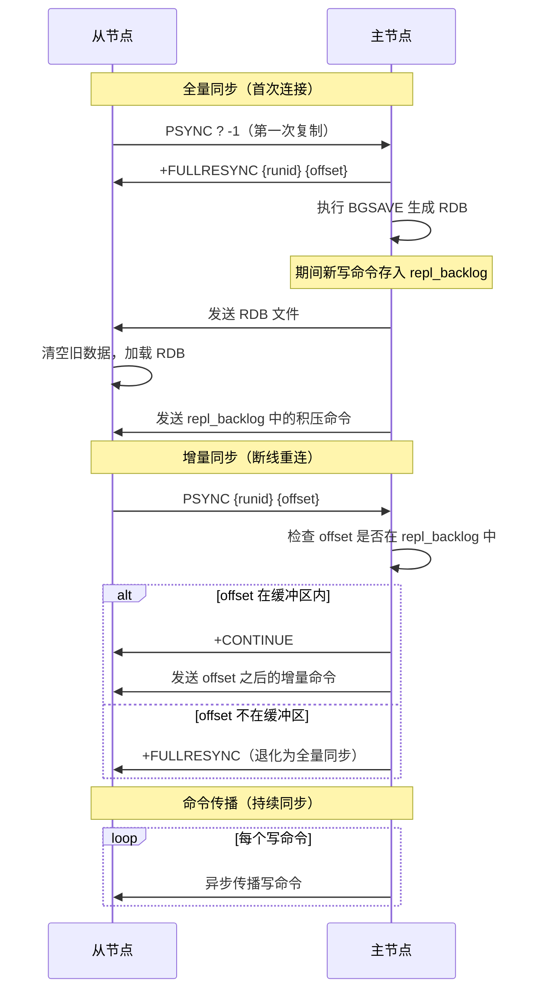
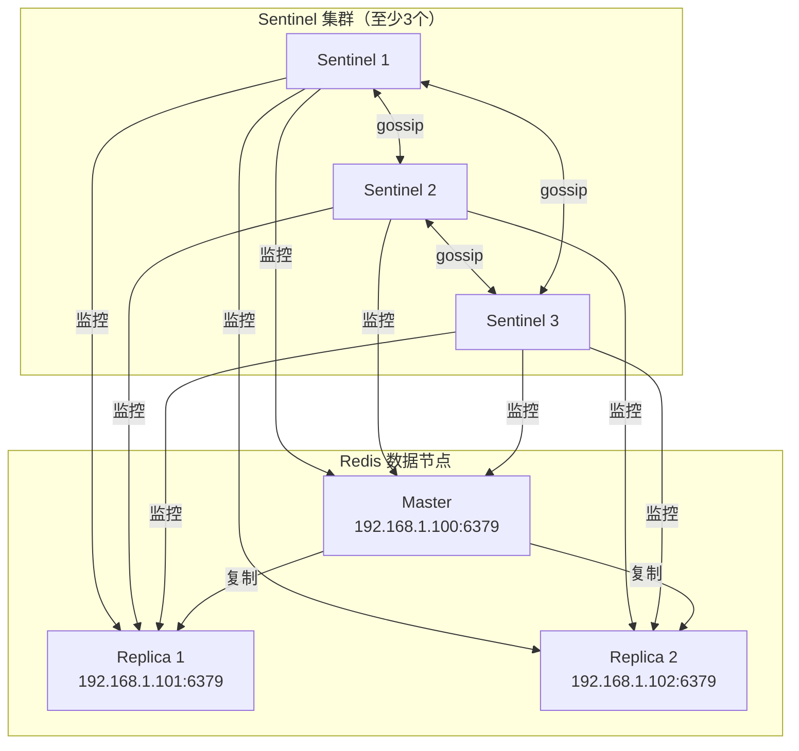
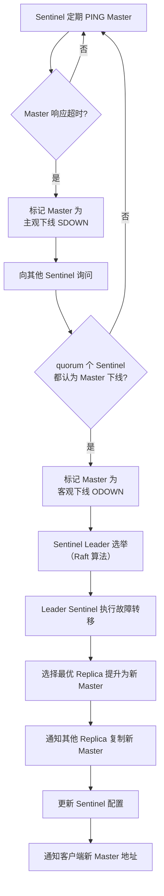
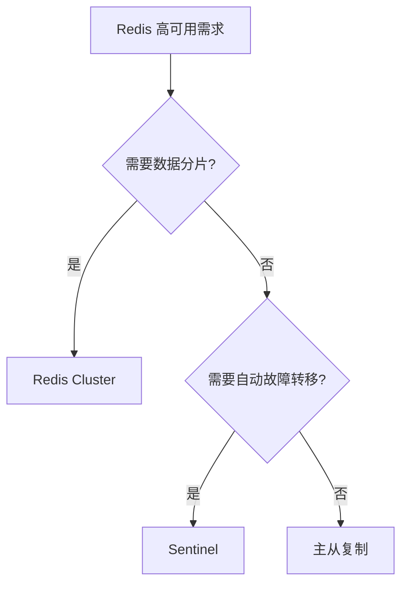

#redis #cluster #sentinel

相关笔记：[[redis-data-types]] | [[redis-persistence]] | [[redis-cache]]

## Redis 高可用

### 高可用方案对比

| 方案 | 写节点 | 自动故障转移 | 数据分片 | 适用场景 |
|------|--------|-------------|---------|---------|
| 主从复制 | 1 | ❌ | ❌ | 读写分离，小规模 |
| Sentinel 哨兵 | 1 | ✅ | ❌ | 中等规模，自动故障转移 |
| Redis Cluster | 多个 | ✅ | ✅ | 大规模，需要数据分片 |

---

### 主从复制

#### 复制流程



#### 关键配置

```bash
# 从节点配置
# redis.conf

# 设置主节点（Redis 5.0+）
replicaof 192.168.1.100 6379

# 旧版写法
# slaveof 192.168.1.100 6379

# 主节点密码
masterauth your_password

# 从节点只读（默认 yes）
replica-read-only yes

# 复制积压缓冲区大小（用于增量同步）
repl-backlog-size 1mb

# 无盘复制（主节点不生成 RDB 文件到磁盘，直接通过 socket 发送）
repl-diskless-sync yes
```

#### 主从复制的问题

- **异步复制**：主节点写入成功就返回客户端，从节点可能还没收到数据，主节点宕机会丢数据
- **无自动故障转移**：主节点挂了需要手动切换
- **写能力瓶颈**：所有写操作集中在主节点

---

### Sentinel 哨兵

Sentinel 是一个独立的进程，用于监控 Redis 主从集群，实现自动故障转移。

#### 架构



#### 故障转移流程



新 Master 选择策略（优先级从高到低）：

1. 排除不健康的 Replica（断线、响应慢）
2. `replica-priority` 最小的优先（值越小优先级越高，0 表示不参与选举）
3. 复制偏移量（offset）最大的优先（数据最新）
4. Run ID 最小的优先（兜底策略）

#### Sentinel 配置

```bash
# sentinel.conf

# 监控的主节点（最后的 2 是 quorum 值）
sentinel monitor mymaster 192.168.1.100 6379 2

# 主节点密码
sentinel auth-pass mymaster your_password

# 主观下线超时（毫秒）
sentinel down-after-milliseconds mymaster 30000

# 故障转移超时（毫秒）
sentinel failover-timeout mymaster 180000

# 同时同步的从节点数量
sentinel parallel-syncs mymaster 1
```

---

### Redis Cluster

Redis Cluster 提供数据分片 + 高可用能力，支持水平扩展。

#### 架构

```mermaid
graph TB
    subgraph "Redis Cluster"
        subgraph "分片 1<br/>Slot 0-5460"
            M1["Master 1"]
            S1a["Replica 1a"]
        end
        subgraph "分片 2<br/>Slot 5461-10922"
            M2["Master 2"]
            S2a["Replica 2a"]
        end
        subgraph "分片 3<br/>Slot 10923-16383"
            M3["Master 3"]
            S3a["Replica 3a"]
        end
    end

    M1 <-->|Gossip| M2
    M2 <-->|Gossip| M3
    M1 <-->|Gossip| M3

    M1 -->|复制| S1a
    M2 -->|复制| S2a
    M3 -->|复制| S3a

    Client["客户端"] -->|CRC16(key) % 16384| M1
    Client -->|CRC16(key) % 16384| M2
    Client -->|CRC16(key) % 16384| M3
```

#### Hash Slot 分配

Redis Cluster 将整个 key 空间划分为 **16384 个 slot**：

```
slot = CRC16(key) % 16384
```

- 每个 Master 节点负责一部分 slot
- 客户端根据 key 计算 slot，直接连接对应节点
- 如果连接的节点不负责该 slot，返回 `MOVED` 重定向

```bash
# 查看 Cluster 信息
CLUSTER INFO

# 查看节点分配的 slot
CLUSTER NODES

# 查看 key 对应的 slot
CLUSTER KEYSLOT mykey
```

#### Hash Tag

为了让相关的 key 分到同一个 slot，可以使用 hash tag：

```bash
# 以下两个 key 会分到同一个 slot（只计算 {} 内的 hash）
SET {user:1000}.name "张三"
SET {user:1000}.age 25
```

#### Gossip 协议

集群节点通过 Gossip 协议交换状态信息：

| 消息类型 | 说明 |
|---------|------|
| PING | 定期发送，携带自身状态和部分其他节点信息 |
| PONG | 回复 PING/MEET |
| MEET | 通知新节点加入集群 |
| FAIL | 广播某节点故障 |

#### 扩缩容

```bash
# 添加新的 Master 节点
redis-cli --cluster add-node 192.168.1.104:6379 192.168.1.100:6379

# 迁移 slot（reshard）
redis-cli --cluster reshard 192.168.1.100:6379
# 交互式选择要迁移的 slot 数量和目标节点

# 添加 Replica 节点
redis-cli --cluster add-node 192.168.1.105:6379 192.168.1.100:6379 \
  --cluster-slave --cluster-master-id <master-node-id>

# 删除节点（先迁移 slot）
redis-cli --cluster del-node 192.168.1.100:6379 <node-id>
```

#### Cluster 配置

```bash
# redis.conf

# 开启 Cluster 模式
cluster-enabled yes

# Cluster 配置文件（自动生成，不要手动编辑）
cluster-config-file nodes-6379.conf

# 节点超时时间（毫秒）
cluster-node-timeout 15000

# 当某个分片的 Master 和所有 Replica 都挂了，整个集群是否拒绝服务
cluster-require-full-coverage yes  # 建议生产环境设为 no
```

---

### 方案选择



| 规模 | 推荐方案 | 说明 |
|------|---------|------|
| 小型（<10G） | 主从复制 | 简单可靠，手动切换 |
| 中型（10-50G） | Sentinel | 自动故障转移，运维省心 |
| 大型（>50G） | Redis Cluster | 数据分片 + 高可用 |

### 面试要点

1. **主从复制是同步还是异步的？** 异步的。主节点写入成功就返回客户端，不等从节点确认。因此主节点宕机可能丢数据。可以配置 `min-replicas-to-write` 和 `min-replicas-max-lag` 做半同步。
2. **Sentinel 的 quorum 是什么？** 判定 Master 客观下线（ODOWN）所需的最少 Sentinel 同意数。通常设为 Sentinel 数量的一半加一。
3. **Redis Cluster 为什么是 16384 个 slot？** 够用且通信开销小。Gossip 消息中用 bitmap 表示 slot 分配，16384 bit = 2KB。如果 slot 太多，bitmap 太大影响网络效率。
4. **Cluster 模式的限制？** 不支持跨 slot 的多 key 操作（除非使用 hash tag）；不支持 SELECT 多数据库；客户端需要支持 Cluster 协议。
5. **脑裂问题怎么解决？** 配置 `min-replicas-to-write 1`，当 Master 发现没有足够的从节点连接时拒绝写入，避免脑裂后旧 Master 继续接受写入导致数据丢失。
