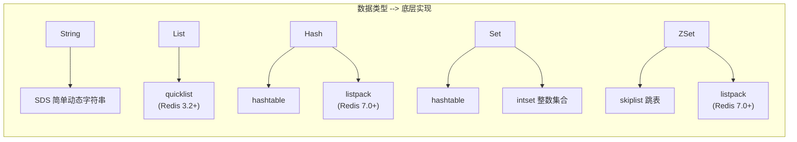
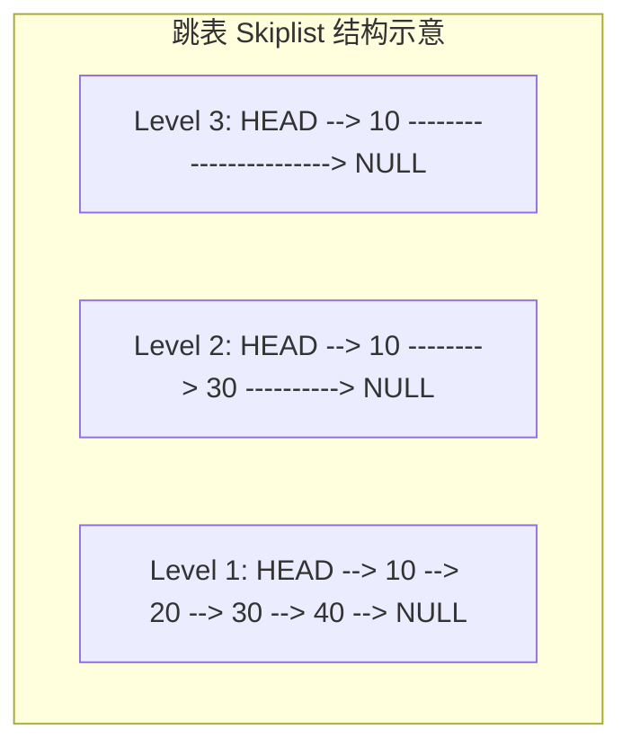

#redis

相关笔记：[[mysql-index]] | [[mysql-engine]]

## Redis 数据类型概览

![[redis数据类型.png]]

Redis 提供五种基本数据类型，每种类型底层有不同的数据结构实现：



| 类型 | 底层数据结构 | 典型使用场景 |
|------|------------|------------|
| String | SDS | 缓存、计数器、分布式锁 |
| List | quicklist | 消息队列、时间线 |
| Hash | hashtable / listpack | 对象存储、用户信息 |
| Set | hashtable / intset | 标签、共同好友、去重 |
| ZSet | skiplist / listpack | 排行榜、延迟队列 |

## String 类型

### 内部实现

String 类型的底层数据结构是 **SDS（Simple Dynamic String，简单动态字符串）**。SDS 相比 C 原生字符串的优势：

- **可以保存二进制数据**：SDS 使用 `len` 属性而不是空字符来判断字符串结束，因此能存放图片、音频、视频、压缩文件等二进制数据
- **获取字符串长度 O(1)**：C 字符串不记录自身长度，获取长度复杂度为 O(n)；SDS 用 `len` 属性记录长度，复杂度为 O(1)
- **API 安全，不会缓冲区溢出**：SDS 在拼接字符串前会检查空间是否满足要求，空间不够会自动扩容

### 常用命令

```bash
# 基本操作
SET key value
GET key

# 计数器
INCR counter
INCRBY counter 10

# 设置过期时间（秒）
SET key value EX 3600

# 分布式锁（NX = 不存在时才设置）
SET lock:order_123 "holder_id" NX EX 30
```

## List 类型

### 内部实现

List 类型的底层数据结构演进：

- **Redis 3.2 之前**：根据元素数量和大小在**压缩列表（ziplist）** 和**双向链表（linkedlist）** 之间切换
  - 元素个数 < 512 且每个元素值 < 64 字节时使用压缩列表
- **Redis 3.2+**：统一使用 **quicklist**（压缩列表 + 双向链表的结合体）

### 常用命令

```bash
# 左右推入
LPUSH mylist "a" "b" "c"
RPUSH mylist "x" "y"

# 弹出
LPOP mylist
RPOP mylist

# 范围查询
LRANGE mylist 0 -1

# 阻塞弹出（可用于简易消息队列）
BLPOP mylist 30
```

## Hash 类型

### 内部实现

Hash 类型的底层数据结构：

- 元素个数 < 512 且所有值 < 64 字节时：使用**压缩列表**（Redis 7.0 后改为 **listpack**）
- 否则使用**哈希表（hashtable）**

### 常用命令

```bash
# 设置字段
HSET user:1001 name "Alice" age 25 email "alice@example.com"

# 获取单个字段
HGET user:1001 name

# 获取所有字段
HGETALL user:1001

# 字段自增
HINCRBY user:1001 age 1
```

## Set 类型

### 内部实现

Set 类型的底层数据结构：

- 元素全部是整数且个数 < 512 时：使用**整数集合（intset）**
- 否则使用**哈希表（hashtable）**

### 常用命令

```bash
# 添加元素
SADD tags:post_1 "redis" "database" "nosql"

# 查看所有元素
SMEMBERS tags:post_1

# 集合运算
SINTER tags:post_1 tags:post_2    # 交集（共同标签）
SUNION tags:post_1 tags:post_2    # 并集
SDIFF tags:post_1 tags:post_2     # 差集

# 随机弹出
SPOP tags:post_1
```

## ZSet 类型（Sorted Set）

### 内部实现

ZSet 类型的底层数据结构：

- 元素个数 < 128 且每个元素值 < 64 字节时：使用**压缩列表**（Redis 7.0 后改为 **listpack**）
- 否则使用**跳表（skiplist）** + 哈希表



跳表通过多层索引实现 O(log n) 的查找复杂度，兼顾了有序性和高效查找。

### 常用命令

```bash
# 添加元素（score member）
ZADD leaderboard 100 "player_a" 200 "player_b" 150 "player_c"

# 按 score 升序获取排名
ZRANGE leaderboard 0 -1 WITHSCORES

# 按 score 降序获取 Top 3
ZREVRANGE leaderboard 0 2 WITHSCORES

# 获取某个 member 的排名（降序）
ZREVRANK leaderboard "player_b"

# 按 score 范围查询
ZRANGEBYSCORE leaderboard 100 200
```

## 版本演进总结

| 数据结构变更 | 版本 | 说明 |
|------------|------|------|
| quicklist 替代 ziplist + linkedlist | Redis 3.2 | List 类型底层统一 |
| listpack 替代 ziplist | Redis 7.0 | Hash、ZSet 底层更新 |

## 面试要点

### 高频问题

**Q: Redis 有哪些基本数据类型？它们的典型使用场景是什么？**
A: 五种基本类型：String（缓存、计数器、分布式锁）、List（消息队列、时间线）、Hash（对象存储、用户信息）、Set（标签、去重、共同好友）、ZSet（排行榜、延迟队列）。除此之外 Redis 还提供 Bitmap、HyperLogLog、Geo、Stream 等扩展类型，分别用于位统计、基数估算、地理位置和消息流。

**Q: 为什么 Redis 的 String 不直接用 C 字符串，而要自己实现 SDS？**
A: SDS 用 `len` 属性记录长度，获取长度是 O(1)（C 字符串需遍历到 `\0`，是 O(n)）；用 `len` 判断结尾而非空字符，因此能存放图片、音视频、压缩文件等二进制数据；拼接前会检查空间并自动扩容，避免缓冲区溢出。此外 SDS 还有空间预分配和惰性释放策略，减少内存重分配次数。

**Q: ZSet 底层是怎么实现的？为什么用跳表而不是红黑树？**
A: ZSet 在元素少（个数 < 128 且每个元素 < 64 字节）时用 listpack（Redis 7.0 前为 ziplist），否则用 skiplist + hashtable 组合：hashtable 用于 O(1) 按 member 查 score，skiplist 用于 O(log n) 的按 score 范围查询和排名。不用红黑树是因为跳表实现简单、范围查询（ZRANGE）天然友好，且无需复杂的旋转平衡操作。

**Q: List 底层从 ziplist+linkedlist 演进到 quicklist，解决了什么问题？**
A: Redis 3.2 之前在小数据用 ziplist（省内存但插入删除会引发连锁更新），大数据用 linkedlist（每个节点有前后指针，内存开销大）。Redis 3.2 引入的 quicklist 是双向链表 + ziplist 的结合体：每个链表节点是一个 ziplist，既控制了单个 ziplist 大小避免连锁更新放大，又减少了指针内存开销。（Redis 7.0 起 quicklist 的节点进一步由 ziplist 改为 listpack。）

**Q: listpack 是什么？为什么 Redis 7.0 要用它替代 ziplist？**
A: ziplist 的每个 entry 都记录前一个 entry 的长度（prevlen），当某个 entry 长度变化时可能引发后续 entry 的 prevlen 字段连锁扩容（级联更新），最坏 O(n²)。listpack 取消了 prevlen 设计，每个元素只记录自身长度，彻底避免连锁更新。Redis 7.0 用 listpack 替代了 Hash、ZSet 中的 ziplist，同时 quicklist 的节点也由 ziplist 改为 listpack。

**Q: intset 是什么？什么时候 Set 会从 intset 转成 hashtable？**
A: intset（整数集合）是 Set 在「元素全部是整数且个数 < 512」时使用的紧凑有序数组，按 int16/int32/int64 升级编码，省内存且支持二分查找。一旦插入非整数元素，或元素个数超过 `set-max-intset-entries`（默认 512），就会转码，且这个转换不可逆。注意：Redis 7.2 起非纯整数的小集合会先落到 listpack，超阈值后才转 hashtable；纯整数小集合仍走 intset。

**Q: 怎么用 Redis 数据类型实现一个排行榜？**
A: 用 ZSet，以分数为 score、玩家为 member：`ZADD` 写入，`ZREVRANGE leaderboard 0 9 WITHSCORES` 取 Top 10，`ZREVRANK` 查某玩家排名，`ZINCRBY` 累加分数。底层 skiplist 保证插入和范围查询都是 O(log n)，hashtable 保证按 member 查询 O(1)。

**Q: 用 Redis 实现分布式锁的核心命令是什么？有什么注意点？**
A: 用 `SET lock:key holder_id NX EX 30`，NX 保证仅在 key 不存在时加锁（互斥），EX 设置过期时间（单位秒）防止持有者宕机后死锁，value 写入唯一 holder_id 保证释放时只删自己的锁。释放需用 Lua 脚本「先比对 value 再删除」保证原子性。高可用场景：单实例可用 Redisson 看门狗自动续期，避免业务未完成锁就过期；多实例容灾可考虑 Redlock（向多个独立 Redis 节点加锁取多数）。

### 面试加分点

- 能说清「类型」与「编码（encoding）」的区别：同一个数据类型在不同数据量下会切换底层编码，可用 `OBJECT ENCODING key` 查看实际编码（如 int / embstr / raw / listpack / quicklist / intset / hashtable / skiplist）。
- String 的三种编码：长度 ≤ 44 字节用 `embstr`（SDS 与 redisObject 连续分配一次内存）、超过用 `raw`、纯整数用 `int`（共享 0~9999 的整数对象池）。
- 各编码转换的阈值由配置项控制：`hash-max-listpack-entries`/`hash-max-listpack-value`、`zset-max-listpack-entries`/`zset-max-listpack-value`、`set-max-intset-entries`、`set-max-listpack-entries`/`set-max-listpack-value`、`list-max-listpack-size`，且转换为大编码后通常不可逆。
- 理解连锁更新（cascade update）问题的本质，并能解释 listpack 取消 prevlen 字段后为何不再有此问题，这是 Redis 7.0 编码演进的核心动机。
- 能区分 ZSet 的两个底层结构各自的职责：hashtable 解决「member → score」的 O(1) 查询，skiplist 解决「按 score 排序、范围、排名」，二者数据共享、互补存在。
- Redis 7.2 起 Set 新增 listpack 编码：非纯整数的小集合（默认 ≤ 128 项且每项 ≤ 64 字节）先用 listpack，超阈值再转 hashtable，进一步节省小集合内存；纯整数集合仍优先用 intset。
