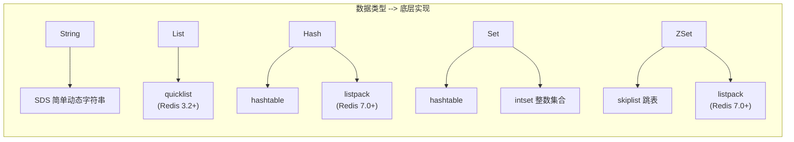
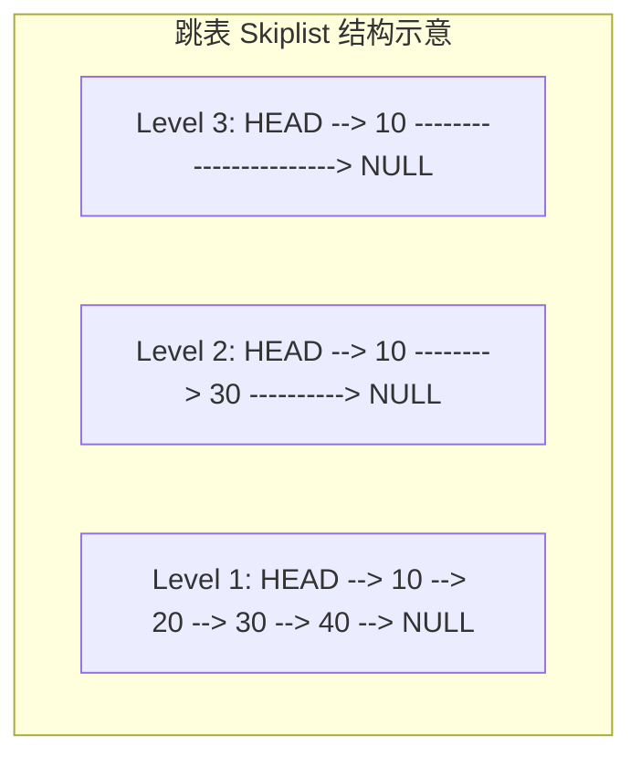

#redis

相关笔记：[[mysql-index]] | [[mysql-engine]]

## Redis 数据类型概览

![[redis数据类型.png]]

Redis 提供五种基本数据类型，每种类型底层有不同的数据结构实现：



| 类型 | 底层数据结构 | 典型使用场景 |
|------|------------|------------|
| String | SDS | 缓存、计数器、分布式锁 |
| List | quicklist | 消息队列、时间线 |
| Hash | hashtable / listpack | 对象存储、用户信息 |
| Set | hashtable / intset | 标签、共同好友、去重 |
| ZSet | skiplist / listpack | 排行榜、延迟队列 |

## String 类型

### 内部实现

String 类型的底层数据结构是 **SDS（Simple Dynamic String，简单动态字符串）**。SDS 相比 C 原生字符串的优势：

- **可以保存二进制数据**：SDS 使用 `len` 属性而不是空字符来判断字符串结束，因此能存放图片、音频、视频、压缩文件等二进制数据
- **获取字符串长度 O(1)**：C 字符串不记录自身长度，获取长度复杂度为 O(n)；SDS 用 `len` 属性记录长度，复杂度为 O(1)
- **API 安全，不会缓冲区溢出**：SDS 在拼接字符串前会检查空间是否满足要求，空间不够会自动扩容

### 常用命令

```bash
# 基本操作
SET key value
GET key

# 计数器
INCR counter
INCRBY counter 10

# 设置过期时间（秒）
SET key value EX 3600

# 分布式锁（NX = 不存在时才设置）
SET lock:order_123 "holder_id" NX EX 30
```

## List 类型

### 内部实现

List 类型的底层数据结构演进：

- **Redis 3.2 之前**：根据元素数量和大小在**压缩列表（ziplist）** 和**双向链表（linkedlist）** 之间切换
  - 元素个数 < 512 且每个元素值 < 64 字节时使用压缩列表
- **Redis 3.2+**：统一使用 **quicklist**（压缩列表 + 双向链表的结合体）

### 常用命令

```bash
# 左右推入
LPUSH mylist "a" "b" "c"
RPUSH mylist "x" "y"

# 弹出
LPOP mylist
RPOP mylist

# 范围查询
LRANGE mylist 0 -1

# 阻塞弹出（可用于简易消息队列）
BLPOP mylist 30
```

## Hash 类型

### 内部实现

Hash 类型的底层数据结构：

- 元素个数 < 512 且所有值 < 64 字节时：使用**压缩列表**（Redis 7.0 后改为 **listpack**）
- 否则使用**哈希表（hashtable）**

### 常用命令

```bash
# 设置字段
HSET user:1001 name "Alice" age 25 email "alice@example.com"

# 获取单个字段
HGET user:1001 name

# 获取所有字段
HGETALL user:1001

# 字段自增
HINCRBY user:1001 age 1
```

## Set 类型

### 内部实现

Set 类型的底层数据结构：

- 元素全部是整数且个数 < 512 时：使用**整数集合（intset）**
- 否则使用**哈希表（hashtable）**

### 常用命令

```bash
# 添加元素
SADD tags:post_1 "redis" "database" "nosql"

# 查看所有元素
SMEMBERS tags:post_1

# 集合运算
SINTER tags:post_1 tags:post_2    # 交集（共同标签）
SUNION tags:post_1 tags:post_2    # 并集
SDIFF tags:post_1 tags:post_2     # 差集

# 随机弹出
SPOP tags:post_1
```

## ZSet 类型（Sorted Set）

### 内部实现

ZSet 类型的底层数据结构：

- 元素个数 < 128 且每个元素值 < 64 字节时：使用**压缩列表**（Redis 7.0 后改为 **listpack**）
- 否则使用**跳表（skiplist）** + 哈希表



跳表通过多层索引实现 O(log n) 的查找复杂度，兼顾了有序性和高效查找。

### 常用命令

```bash
# 添加元素（score member）
ZADD leaderboard 100 "player_a" 200 "player_b" 150 "player_c"

# 按 score 升序获取排名
ZRANGE leaderboard 0 -1 WITHSCORES

# 按 score 降序获取 Top 3
ZREVRANGE leaderboard 0 2 WITHSCORES

# 获取某个 member 的排名（降序）
ZREVRANK leaderboard "player_b"

# 按 score 范围查询
ZRANGEBYSCORE leaderboard 100 200
```

## 版本演进总结

| 数据结构变更 | 版本 | 说明 |
|------------|------|------|
| quicklist 替代 ziplist + linkedlist | Redis 3.2 | List 类型底层统一 |
| listpack 替代 ziplist | Redis 7.0 | Hash、ZSet 底层更新 |
