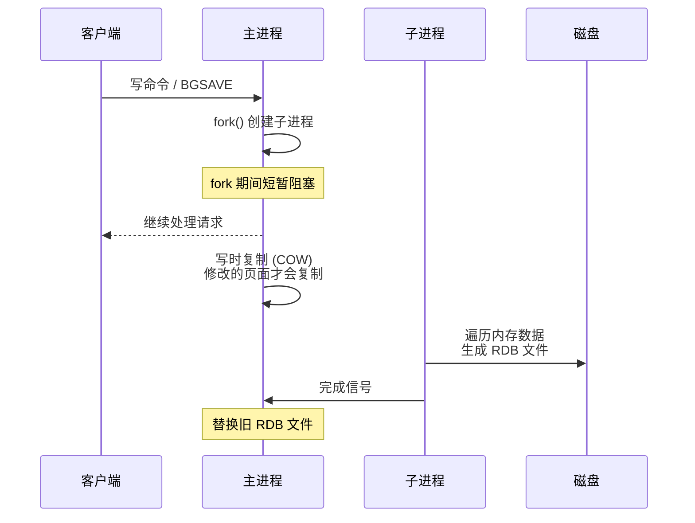
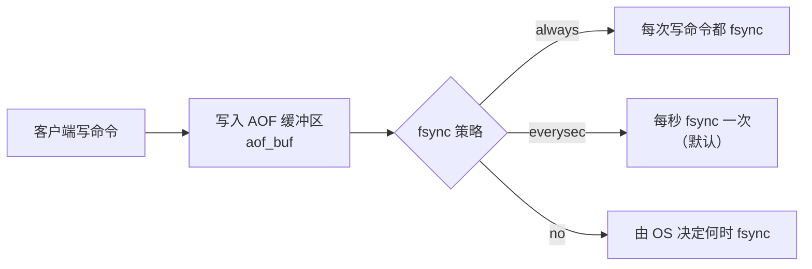
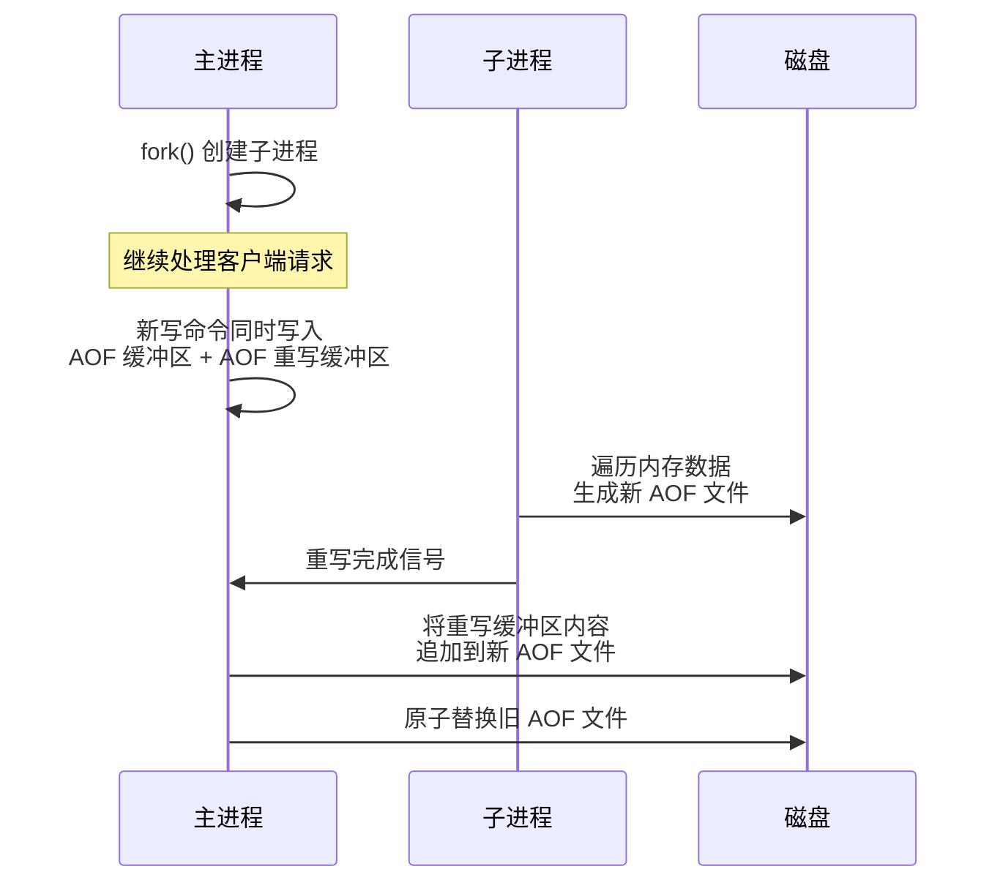
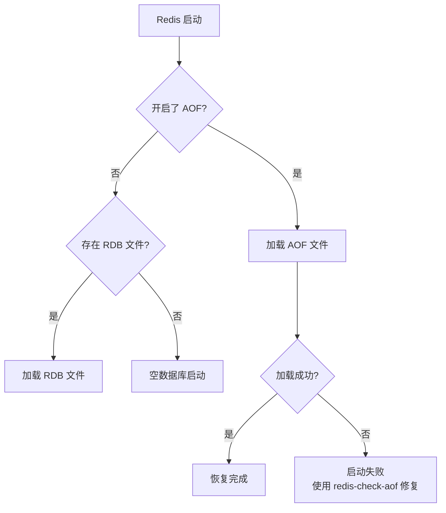

#redis #persistence

相关笔记：[[redis-data-types]] | [[redis-cluster]]

## Redis 持久化

### 持久化方案对比

| 对比项 | RDB | AOF | 混合持久化 |
|--------|-----|-----|-----------|
| 持久化内容 | 内存数据快照（二进制） | 写操作命令日志 | RDB 快照 + 增量 AOF |
| 文件大小 | 小（压缩二进制） | 大（文本命令） | 中等 |
| 恢复速度 | 快 | 慢（需要重放命令） | 快 |
| 数据安全性 | 可能丢失两次快照间的数据 | 最多丢 1 秒数据（everysec） | 兼顾两者优势 |
| 性能影响 | fork 时有短暂阻塞 | 追加写，影响较小 | fork + 追加写 |
| 适用版本 | 所有版本 | 所有版本 | Redis 4.0+ |

---

### RDB（Redis Database）

RDB 将某一时刻的全量内存数据以二进制快照的方式保存到磁盘（默认 `dump.rdb`）。

#### 触发方式

| 方式 | 命令 | 说明 |
|------|------|------|
| 手动同步 | `SAVE` | 阻塞主线程直到快照完成，生产环境禁用 |
| 手动异步 | `BGSAVE` | fork 子进程执行，主线程不阻塞 |
| 自动触发 | `save` 配置项 | 满足条件自动执行 BGSAVE |

#### BGSAVE 流程（fork + COW）



**Copy-On-Write（COW）机制：**
- fork 后父子进程共享同一份内存页
- 只有当父进程修改某个内存页时，OS 才会复制该页（写时复制）
- 这样子进程可以拿到 fork 时刻的一致性快照，而父进程可以继续处理写请求

#### RDB 配置

```bash
# redis.conf

# 自动触发条件（任一满足即触发 BGSAVE）
save 900 1      # 900 秒内至少 1 次修改
save 300 10     # 300 秒内至少 10 次修改
save 60 10000   # 60 秒内至少 10000 次修改

# 禁用 RDB
save ""

# RDB 文件名
dbfilename dump.rdb

# RDB 文件存放目录
dir /var/lib/redis

# RDB 压缩（使用 LZF 压缩）
rdbcompression yes

# RDB 校验
rdbchecksum yes
```

---

### AOF（Append Only File）

AOF 将每条写命令追加到文件末尾（默认 `appendonly.aof`），重启时重放所有命令恢复数据。

#### 写入流程



#### fsync 策略对比

| 策略 | 数据安全性 | 性能 | 说明 |
|------|-----------|------|------|
| `always` | 最高，不丢数据 | 最差 | 每次写操作都调用 fsync |
| `everysec` | 较高，最多丢 1 秒 | 较好 | 每秒调用一次 fsync（推荐） |
| `no` | 最低，取决于 OS | 最好 | Redis 不主动 fsync |

#### AOF 重写

随着时间推移，AOF 文件会越来越大。AOF 重写通过读取当前内存数据，生成最精简的命令集来替代旧文件。



重写触发条件：

```bash
# 当前 AOF 文件大小比上次重写后大 100% 时触发
auto-aof-rewrite-percentage 100

# AOF 文件最小重写大小
auto-aof-rewrite-min-size 64mb
```

重写效果示例：

```
# 重写前（6 条命令）
SET name "张三"
SET name "李四"
SET name "王五"
RPUSH list 1
RPUSH list 2
RPUSH list 3

# 重写后（2 条命令）
SET name "王五"
RPUSH list 1 2 3
```

#### AOF 配置

```bash
# redis.conf

# 开启 AOF
appendonly yes

# AOF 文件名
appendfilename "appendonly.aof"

# fsync 策略
appendfsync everysec

# AOF 重写期间是否暂停 fsync（避免磁盘 IO 竞争）
no-appendfsync-on-rewrite no

# 自动重写触发条件
auto-aof-rewrite-percentage 100
auto-aof-rewrite-min-size 64mb
```

---

### 混合持久化（Redis 4.0+）

AOF 重写时不再生成纯命令文件，而是前半部分为 RDB 格式的全量数据，后半部分为增量 AOF 命令。

```
[RDB 格式的全量数据] + [AOF 格式的增量命令]
```

优势：
- 加载速度快（RDB 部分直接加载）
- 数据更完整（AOF 增量部分补充 fork 后的新数据）

```bash
# 开启混合持久化（需要同时开启 AOF）
aof-use-rdb-preamble yes  # Redis 5.0+ 默认开启
```

---

### 数据恢复优先级



> AOF 优先级高于 RDB，因为 AOF 数据更完整。

---

### 生产环境建议

| 场景 | 推荐方案 |
|------|---------|
| 对数据安全要求极高 | AOF (everysec) + RDB 双开，或混合持久化 |
| 允许丢失几分钟数据 | 仅 RDB |
| 纯缓存场景 | 可以关闭持久化 |
| Redis 4.0+ | 推荐混合持久化 |

### 面试要点

1. **RDB 的 fork 有什么风险？** fork 本身会阻塞主线程（复制页表），如果 Redis 使用内存很大，fork 耗时会很长。另外 COW 在写入频繁时会导致内存翻倍。
2. **AOF 文件损坏怎么办？** 使用 `redis-check-aof --fix` 工具修复，它会截断最后一条不完整的命令。
3. **为什么 AOF 重写不直接修改旧文件？** 为了保证原子性，重写是生成新文件然后原子替换。如果直接修改旧文件，中途失败会导致数据不完整。
4. **everysec 策略真的最多丢 1 秒数据吗？** 理论上是，但如果 fsync 太慢（磁盘 IO 繁忙），可能丢 2 秒的数据。
5. **Redis 7.0 的 Multi Part AOF？** Redis 7.0 将 AOF 拆分为 base 文件（RDB/AOF 格式）+ 多个 incr 增量文件 + manifest 清单文件，解决了重写时的内存和 IO 开销。
