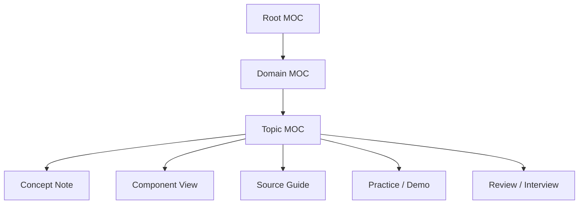

# Learning Notes 信息架构

## 设计目标

仓库只使用一个主分类轴：**知识领域**。内容的学习形式和深度作为领域内的次级视图，不再与领域目录平级竞争。

## 为什么重构

旧结构把路线、源码、组件、排障、Demo 和题库集中到一个跨领域目录；同一主题又在领域目录中存在概念页，造成两套导航、职责重复和首页过载。重构后：

- AI 内容归 `ai/`。
- Go 源码归 `go/internals/`。
- Kubernetes 的路线、组件、源码、排障、Demo 和题库归 `cloud-native/kubernetes/`。
- 已经按领域组织良好的算法、数据库和中间件不做无意义迁移。

## Canonical 内容与辅助视图

| 类型 | 回答的问题 | 是否承载 canonical 技术正文 |
| --- | --- | --- |
| 概念页 | 是什么、为什么、如何选择 | 是 |
| Component | 谁负责、输入输出、故障证据 | 是，但不重复逐函数源码 |
| Internals | 固定版本如何实现、调用链是什么 | 是，需注明版本边界 |
| Roadmap | 按什么顺序学、完成标准是什么 | 否，只组织链接与产出 |
| Demo | 如何运行、预期看到什么 | 代码与实验事实是 canonical |
| Interview | 如何复盘和表达 | 否，应链接前三类内容 |

## MOC 层级

- L0：根 `README.md`，只链接一级领域。
- L1：领域 `README.md`，链接主题入口。
- L2：主题 MOC，覆盖责任范围内的知识文件。

新增一篇普通笔记通常只更新最近的 L2/L1 MOC，不再同步根 README 和目录树说明。

## 全局不变量

1. 除 `README.md` 外，Markdown basename 全局唯一。
2. 图片 basename 全局唯一。
3. 所有 wikilink 和本地 Markdown 链接可唯一解析。
4. 所有知识内容能从根 README 经 MOC 到达。
5. 普通 Markdown 文件名使用英文小写 kebab-case。
6. 不存在空文件和无实质内容的 stub。

这些规则由 `scripts/validate_notes.py` 持续检查。

## 迁移记录

2026-08-13 完成领域化重构：旧跨领域学习目录被拆分到 `ai/`、`go/internals/` 和 `cloud-native/kubernetes/`。迁移尽量保留文件 basename，并整体移动 Kubernetes Demo 子树以保留内部相对关系。

| 旧职责 | 新归属 |
| --- | --- |
| AI 路线、推理与 Agent | `ai/{foundations,inference,agents}/` |
| LoRA、Post-training 与 RL | `ai/post-training/` |
| Go 源码专题 | `go/internals/` |
| Kubernetes 组件拆解 | `cloud-native/kubernetes/components/` |
| Kubernetes 源码导读 | `cloud-native/kubernetes/internals/` |
| Kubernetes 路线与进度 | `cloud-native/kubernetes/roadmaps/` |
| Kubernetes 网络/存储专题 | 对应 `networking/`、`storage/` |
| Kubernetes 可运行示例 | `cloud-native/kubernetes/demos/` |
| Kubernetes 题库 | `cloud-native/kubernetes/interview/` |

内容级消重遵循“保留更完整 canonical 页”的原则：独立的 Scheduler Assume 笔记已合入 `scheduler-deep-dive.md` 的 Assume/Bind 小节，所有入链改为章节锚点，不保留重定向 stub。
