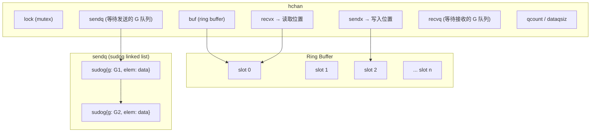
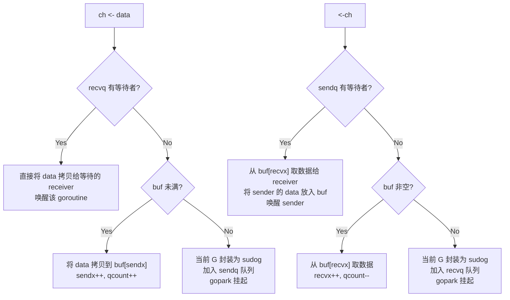

#go #channel #concurrency

相关笔记：[[gmp-model]] | [[context]] | [[gc]]

## Channel 底层实现

### hchan 结构体

Channel 在 runtime 中对应 `hchan` 结构体，位于 `runtime/chan.go`：

```go
type hchan struct {
    qcount   uint           // 当前队列中的元素数量
    dataqsiz uint           // 环形缓冲区大小（make 时指定的 cap）
    buf      unsafe.Pointer // 环形缓冲区指针
    elemsize uint16         // 元素大小
    closed   uint32         // 是否已关闭
    elemtype *_type         // 元素类型
    sendx    uint           // 发送索引（buf 中下一个写入位置）
    recvx    uint           // 接收索引（buf 中下一个读取位置）
    recvq    waitq          // 等待接收的 goroutine 队列（sudog 链表）
    sendq    waitq          // 等待发送的 goroutine 队列（sudog 链表）
    lock     mutex          // 互斥锁，保护所有字段
}
```



### 发送/接收流程

#### 有缓冲 Channel (Buffered)



#### 无缓冲 Channel (Unbuffered)

无缓冲 channel 的 `dataqsiz = 0`，没有 ring buffer。发送和接收必须配对：

- **发送时**：如果 recvq 有等待的 receiver，直接将数据拷贝到 receiver 的栈上（zero-copy 优化），唤醒 receiver
- **发送时无 receiver**：sender 挂起，加入 sendq
- **接收时**：如果 sendq 有等待的 sender，直接从 sender 的栈上拷贝数据，唤醒 sender
- **接收时无 sender**：receiver 挂起，加入 recvq

### select 多路复用实现原理

`select` 在编译期被转换为 `runtime.selectgo()` 调用：

```go
// runtime/select.go
func selectgo(cas0 *scase, order0 *uint16, pc0 *uintptr, nsends, nrecvs int, block bool) (int, bool)
```

核心流程：

1. **随机打乱 case 顺序**（pollorder），避免饥饿
2. **按 channel 地址排序**（lockorder），统一加锁顺序避免死锁
3. **第一轮遍历**：按 pollorder 检查每个 case 是否就绪，如果有就绪的直接执行
4. **无就绪 case**：将当前 goroutine 封装为 sudog 加入每个 channel 的 sendq/recvq
5. **gopark 挂起**，等待任意 channel 就绪
6. **被唤醒后**：从其他 channel 的等待队列中移除自己，执行就绪的 case

```go
// select 基本用法
select {
case msg := <-ch1:
    fmt.Println("received from ch1:", msg)
case ch2 <- data:
    fmt.Println("sent to ch2")
case <-time.After(3 * time.Second):
    fmt.Println("timeout")
default:
    fmt.Println("no channel ready")
}
```

### Channel 使用模式

#### Fan-out：一个生产者，多个消费者

```go
func fanOut(input <-chan int, workers int) []<-chan int {
    outputs := make([]<-chan int, workers)
    for i := 0; i < workers; i++ {
        out := make(chan int)
        outputs[i] = out
        go func() {
            defer close(out)
            for v := range input {
                out <- v * v // 每个 worker 独立处理
            }
        }()
    }
    return outputs
}
```

#### Fan-in：多个生产者，一个消费者

```go
func fanIn(channels ...<-chan int) <-chan int {
    out := make(chan int)
    var wg sync.WaitGroup
    for _, ch := range channels {
        wg.Add(1)
        go func(c <-chan int) {
            defer wg.Done()
            for v := range c {
                out <- v
            }
        }(ch)
    }
    go func() {
        wg.Wait()
        close(out)
    }()
    return out
}
```

#### Pipeline 模式

```go
func generator(nums ...int) <-chan int {
    out := make(chan int)
    go func() {
        defer close(out)
        for _, n := range nums {
            out <- n
        }
    }()
    return out
}

func square(in <-chan int) <-chan int {
    out := make(chan int)
    go func() {
        defer close(out)
        for n := range in {
            out <- n * n
        }
    }()
    return out
}

func main() {
    // pipeline: generator -> square -> print
    for v := range square(generator(1, 2, 3, 4)) {
        fmt.Println(v)
    }
}
```

#### Done Channel / Timeout Pattern

```go
func doWork(ctx context.Context) error {
    resultCh := make(chan string, 1)

    go func() {
        // 模拟耗时操作
        time.Sleep(2 * time.Second)
        resultCh <- "done"
    }()

    select {
    case result := <-resultCh:
        fmt.Println("result:", result)
        return nil
    case <-ctx.Done():
        return ctx.Err() // context 取消或超时
    }
}

func main() {
    ctx, cancel := context.WithTimeout(context.Background(), 3*time.Second)
    defer cancel()

    if err := doWork(ctx); err != nil {
        fmt.Println("error:", err)
    }
}
```

#### Graceful Shutdown

```go
func main() {
    quit := make(chan os.Signal, 1)
    signal.Notify(quit, syscall.SIGINT, syscall.SIGTERM)

    srv := &http.Server{Addr: ":8080"}

    go func() {
        if err := srv.ListenAndServe(); err != nil && err != http.ErrServerClosed {
            log.Fatalf("listen: %v", err)
        }
    }()

    <-quit // 阻塞等待信号
    log.Println("shutting down server...")

    ctx, cancel := context.WithTimeout(context.Background(), 5*time.Second)
    defer cancel()

    if err := srv.Shutdown(ctx); err != nil {
        log.Fatal("server forced to shutdown:", err)
    }
    log.Println("server exited")
}
```

### 常见坑

#### Goroutine 泄漏

```go
// 错误示例：没有 receiver，goroutine 永远阻塞
func leak() {
    ch := make(chan int)
    go func() {
        ch <- 42 // 永远阻塞，没有人接收
    }()
    // 函数返回，但 goroutine 无法退出 → 泄漏
}

// 正确做法：使用 context 或 done channel 控制生命周期
func noLeak(ctx context.Context) {
    ch := make(chan int, 1) // 或用 buffered channel
    go func() {
        select {
        case ch <- 42:
        case <-ctx.Done():
            return // context 取消时退出
        }
    }()
}
```

#### 死锁

```go
// 经典死锁：main goroutine 既发又收
func main() {
    ch := make(chan int)
    ch <- 1   // 阻塞，没有其他 goroutine 来接收
    fmt.Println(<-ch) // 永远到不了这里
    // fatal error: all goroutines are asleep - deadlock!
}
```

#### 向已关闭的 channel 发送数据会 panic

```go
ch := make(chan int)
close(ch)
ch <- 1 // panic: send on closed channel
```

#### 重复关闭 channel 会 panic

```go
ch := make(chan int)
close(ch)
close(ch) // panic: close of closed channel
```

### 面试要点

1. **hchan 核心字段**：buf（环形缓冲区）、sendx/recvx（收发索引）、sendq/recvq（等待队列，sudog 链表）、lock（互斥锁）
2. **有缓冲 vs 无缓冲**：有缓冲 channel 通过 ring buffer 解耦发送和接收；无缓冲 channel 要求收发同步配对，数据直接在 goroutine 栈之间拷贝
3. **select 实现**：随机打乱避免饥饿，按地址加锁避免死锁，两轮遍历（先检查就绪，再挂起等待）
4. **channel 操作总结表**：

| 操作 | nil channel | closed channel | 正常 channel |
|------|-------------|----------------|-------------|
| 发送 | 永久阻塞 | panic | 阻塞或成功 |
| 接收 | 永久阻塞 | 返回零值, false | 阻塞或成功 |
| 关闭 | panic | panic | 成功 |

5. **goroutine 泄漏排查**：使用 `runtime.NumGoroutine()` 监控，结合 pprof 的 goroutine profile
6. **channel vs mutex**：channel 适合传递数据所有权和协调流程；mutex 适合保护共享状态。口诀："Don't communicate by sharing memory; share memory by communicating."
