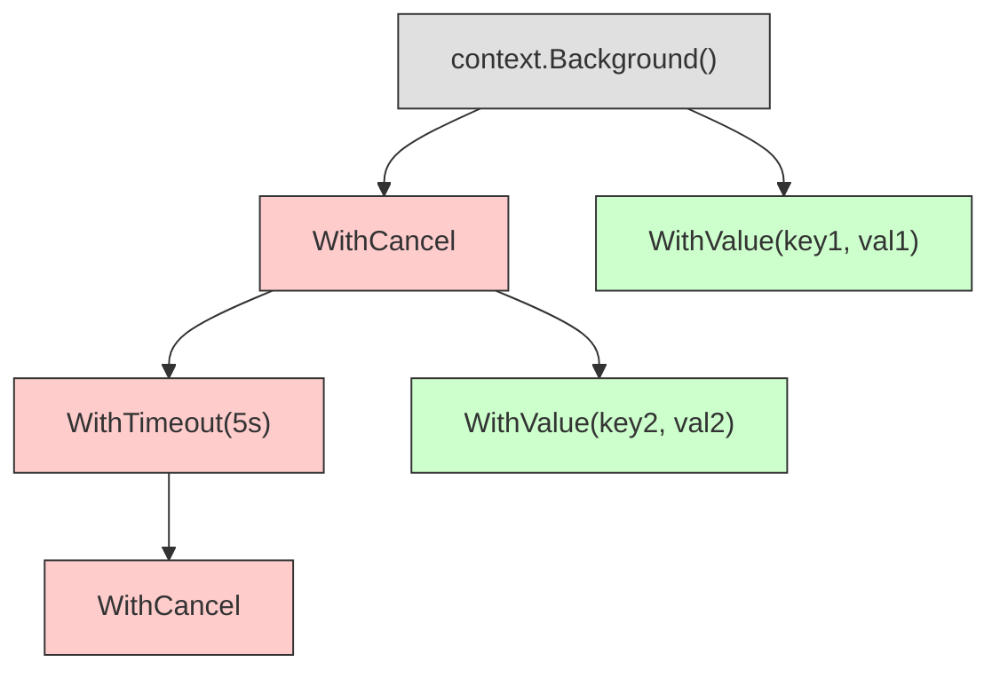
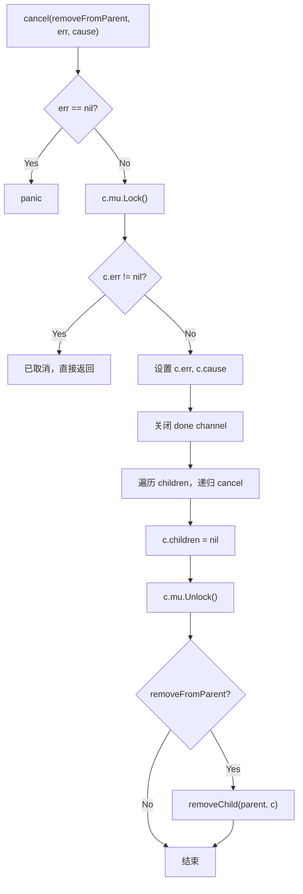

#go #context

相关笔记：[[gmp-model]] | [[gc]]

## Context 概述

`context.Context` 是 Go 1.7 引入标准库的核心同步工具，广泛用于控制 goroutine 生命周期、传递请求作用域数据和超时信号。标准库中 `os/exec`、`net`、`database/sql`、`runtime/pprof` 等包均已支持 Context。

Context 的核心特性：
- **并发安全**：可在多个 goroutine 间安全传播
- **树形结构**：通过 parent-child 关系构成树，子节点可继承父节点的属性并响应取消信号
- **接口类型**：底层实现均为指针类型，传播不影响功能和安全性

---

## Context 树形结构

所有 Context 值构成一棵树，树根是 `context.Background()` 返回的全局唯一根节点。根节点不可撤销、不携带数据，仅作为起点。



Context 包提供 4 个派生函数，第一个参数都是 `parent`：

| 函数 | 作用 |
|------|------|
| `WithCancel(parent)` | 创建可手动撤销的子 Context |
| `WithDeadline(parent, d)` | 创建到指定时间自动撤销的子 Context |
| `WithTimeout(parent, d)` | 创建经过指定时长后自动撤销的子 Context |
| `WithValue(parent, k, v)` | 创建携带 key-value 数据的子 Context |

---

## 源码分析（go1.23）

### 接口定义

```go
type Context interface {
    Deadline() (deadline time.Time, ok bool)
    Done() <-chan struct{}
    Err() error
    Value(key any) any
}
```

四个方法的语义：

| 方法 | 说明 |
|------|------|
| `Deadline()` | 返回截止时间和是否已设置 deadline 的 bool 值 |
| `Done()` | 返回一个 channel，Context 关闭后该 channel 被 close，用于 `select` 监听 |
| `Err()` | Context 关闭后返回关闭原因：`"context canceled"` 或 `"context deadline exceeded"` |
| `Value(key)` | 沿 Context 链向上查找 key 对应的 value |

### 典型使用模式

```go
func doWork(ctx context.Context) error {
    // 派生一个 5 秒超时的子 Context
    ctx, cancel := context.WithTimeout(ctx, 5*time.Second)
    defer cancel() // 确保资源释放

    select {
    case <-ctx.Done():
        return ctx.Err() // 超时或被取消
    case result := <-longRunningTask():
        return process(result)
    }
}
```

---

### emptyCtx — 空 Context

`emptyCtx` 是 Context 树的根节点实现，所有方法返回零值，仅作为其他 Context 的父节点。

```go
type emptyCtx struct{}

func (emptyCtx) Deadline() (deadline time.Time, ok bool) { return }
func (emptyCtx) Done() <-chan struct{}                     { return nil }
func (emptyCtx) Err() error                               { return nil }
func (emptyCtx) Value(key any) any                         { return nil }
```

Go 暴露两个函数创建空 Context：

```go
func Background() Context { return backgroundCtx{} }  // 主函数、初始化、顶层请求使用
func TODO() Context       { return todoCtx{} }         // 不确定用哪个 Context 时临时占位
```

---

### cancelCtx — 可撤销 Context

#### 数据结构

```go
type cancelCtx struct {
    Context

    mu       sync.Mutex            // 保护下面的字段
    done     atomic.Value          // chan struct{}，懒创建，首次 cancel 时关闭
    children map[canceler]struct{} // 所有可撤销的子 Context，cancel 时全部撤销
    err      error                 // 首次 cancel 时设置
    cause    error                 // 首次 cancel 时设置
}
```

`children` 记录了所有派生的可撤销子 Context。cancel 时会遍历 children **深度优先**地逐个取消。

#### Done() 实现 — 双重检查锁定

```go
func (c *cancelCtx) Done() <-chan struct{} {
    d := c.done.Load()
    if d != nil {
        return d.(chan struct{}) // fast path: channel 已创建
    }
    c.mu.Lock()
    defer c.mu.Unlock()
    d = c.done.Load()
    if d == nil {
        d = make(chan struct{})  // slow path: 加锁后创建
        c.done.Store(d)
    }
    return d.(chan struct{})
}
```

采用 **fast path + slow path** 模式：先无锁尝试读取，失败后加锁创建，经典的 double-checked locking。

#### Err() 实现

```go
func (c *cancelCtx) Err() error {
    c.mu.Lock()
    err := c.err
    c.mu.Unlock()
    return err
}
```

#### cancel() 实现 — 核心取消逻辑



源码：

```go
func (c *cancelCtx) cancel(removeFromParent bool, err, cause error) {
    if err == nil {
        panic("context: internal error: missing cancel error")
    }
    if cause == nil {
        cause = err
    }
    c.mu.Lock()
    if c.err != nil {
        c.mu.Unlock()
        return // already canceled
    }
    c.err = err
    c.cause = cause
    d, _ := c.done.Load().(chan struct{})
    if d == nil {
        c.done.Store(closedchan) // 未创建则直接存入已关闭的 channel
    } else {
        close(d)                 // 已创建则关闭
    }
    for child := range c.children {
        child.cancel(false, err, cause) // 递归取消所有子 Context
    }
    c.children = nil
    c.mu.Unlock()

    if removeFromParent {
        removeChild(c.Context, c) // 从父 Context 的 children 中移除自己
    }
}
```

关键点：
- 持有父锁的同时获取子锁（锁顺序固定为 parent → child），不会死锁
- 取消信号**深度优先**传播：先递归取消子节点，再释放自身锁

#### WithCancel() 实现

```go
func WithCancel(parent Context) (ctx Context, cancel CancelFunc) {
    c := withCancel(parent)
    return c, func() { c.cancel(true, Canceled, nil) }
}
```

内部逻辑：
1. 创建 `cancelCtx` 实例
2. 将新 Context 挂载到父节点的 `children`（如果父节点支持 cancel）
3. 如果所有祖先都不支持 cancel，则启动一个 goroutine 监听父节点的 `Done()` channel

---

### timerCtx — 定时撤销 Context

#### 数据结构

```go
type timerCtx struct {
    cancelCtx
    timer    *time.Timer // 定时器，到期自动 cancel
    deadline time.Time   // 截止时间
}
```

在 `cancelCtx` 基础上增加了 timer 和 deadline，衍生出 `WithDeadline()` 和 `WithTimeout()`。

- **deadline**：指定绝对截止时间，如 2024-01-01 00:00:00
- **timeout**：指定相对存活时长，如 30s 后到期

#### Deadline() 实现

```go
func (c *timerCtx) Deadline() (deadline time.Time, ok bool) {
    return c.deadline, true
}
```

#### cancel() 实现

```go
func (c *timerCtx) cancel(removeFromParent bool, err, cause error) {
    c.cancelCtx.cancel(false, err, cause) // 委托给 cancelCtx
    if removeFromParent {
        removeChild(c.cancelCtx.Context, c)
    }
    c.mu.Lock()
    if c.timer != nil {
        c.timer.Stop() // 额外停止定时器
        c.timer = nil
    }
    c.mu.Unlock()
}
```

关闭原因取决于触发方式：
- 手动 cancel → `"context canceled"`
- deadline 到期 → `"context deadline exceeded"`

#### WithDeadline() 实现

```go
func WithDeadlineCause(parent Context, d time.Time, cause error) (Context, CancelFunc) {
    if parent == nil {
        panic("cannot create context from nil parent")
    }
    // 父节点的 deadline 更早，新 deadline 无意义，退化为 WithCancel
    if cur, ok := parent.Deadline(); ok && cur.Before(d) {
        return WithCancel(parent)
    }
    c := &timerCtx{deadline: d}
    c.cancelCtx.propagateCancel(parent, c)
    dur := time.Until(d)
    if dur <= 0 {
        c.cancel(true, DeadlineExceeded, cause) // deadline 已过，立即取消
        return c, func() { c.cancel(false, Canceled, nil) }
    }
    c.mu.Lock()
    defer c.mu.Unlock()
    if c.err == nil {
        c.timer = time.AfterFunc(dur, func() {
            c.cancel(true, DeadlineExceeded, cause)
        })
    }
    return c, func() { c.cancel(true, Canceled, nil) }
}
```

关键逻辑：
1. 如果父节点 deadline 更早，新 deadline 无效，退化为 `WithCancel`
2. 如果 deadline 已过，立即取消
3. 否则启动定时器，到期自动 cancel

#### WithTimeout() 实现

`WithTimeout` 只是 `WithDeadline` 的语法糖：

```go
func WithTimeout(parent Context, timeout time.Duration) (Context, CancelFunc) {
    return WithDeadline(parent, time.Now().Add(timeout))
}
```

---

### valueCtx — 携带数据的 Context

#### 数据结构

```go
type valueCtx struct {
    Context
    key, val any
}
```

每个 `valueCtx` 只存储一个 key-value 对。

#### Value() 实现 — 链式查找

```go
func (c *valueCtx) Value(key any) any {
    if c.key == key {
        return c.val
    }
    return value(c.Context, key) // 递归向父节点查找
}
```

`value()` 函数沿 Context 链向上遍历，直到找到匹配的 key 或到达根节点返回 nil。子 Context 可以查到所有祖先的 value，但祖先看不到后代的 value。

#### WithValue() 实现

```go
func WithValue(parent Context, key, val any) Context {
    if parent == nil {
        panic("cannot create context from nil parent")
    }
    if key == nil {
        panic("nil key")
    }
    if !reflectlite.TypeOf(key).Comparable() {
        panic("key is not comparable")
    }
    return &valueCtx{parent, key, val}
}
```

注意：key 应使用自定义类型（通常是 `struct{}`），避免不同包之间的 key 冲突。

---

## 总结

```mermaid
classDiagram
    class Context {
        <<interface>>
        +Deadline() (time.Time, bool)
        +Done() chan struct{}
        +Err() error
        +Value(key any) any
    }
    class emptyCtx {
    }
    class cancelCtx {
        +mu sync.Mutex
        +done atomic.Value
        +children map
        +err error
        +cancel()
    }
    class timerCtx {
        +timer *time.Timer
        +deadline time.Time
        +cancel()
    }
    class valueCtx {
        +key any
        +val any
        +Value()
    }
    Context <|.. emptyCtx
    Context <|.. cancelCtx
    cancelCtx <|-- timerCtx
    Context <|.. valueCtx
```

| 类型 | 创建函数 | 用途 |
|------|----------|------|
| `emptyCtx` | `Background()` / `TODO()` | 根节点，不携带任何信息 |
| `cancelCtx` | `WithCancel()` | 手动取消，信号向子树传播 |
| `timerCtx` | `WithDeadline()` / `WithTimeout()` | 定时自动取消 |
| `valueCtx` | `WithValue()` | 传递请求作用域数据 |
