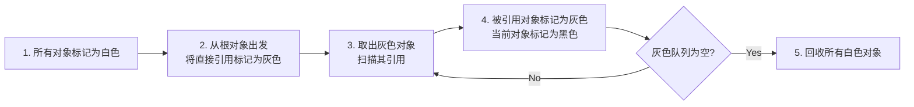
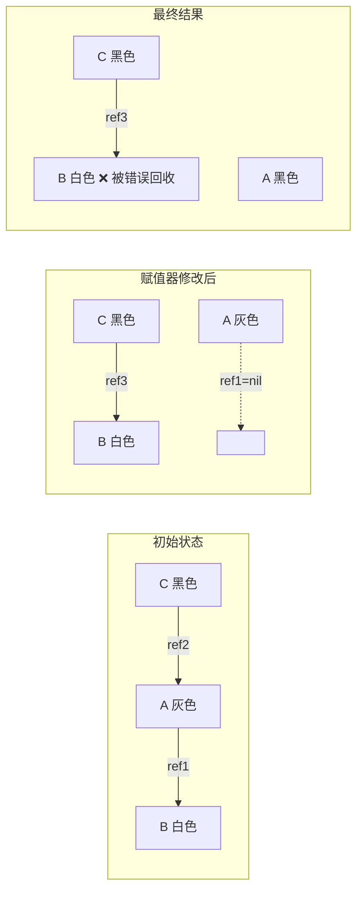
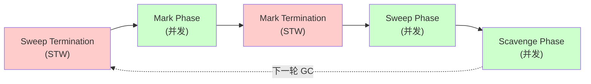

#gc

相关笔记：[[gmp-model]] | [[context]] | [[map-internals]]

## 概述

Go 语言采用 **并发三色标记清除（Concurrent Tri-color Mark and Sweep）** 算法进行垃圾回收。GC 与用户代码（赋值器 mutator）并发执行，通过写屏障（write barrier）保证标记正确性，尽量减少 STW（Stop The World）停顿时间。

---

## 三色标记法原理

三色标记法将堆上所有对象分为三种颜色：

| 颜色 | 含义 | 状态 |
|------|------|------|
| **白色** | 未被访问 | 可能是垃圾，回收结束后仍为白色的对象将被回收 |
| **灰色** | 已被访问，但引用未全部扫描 | 标记波面（wavefront），待继续扫描 |
| **黑色** | 已被访问，所有引用已扫描 | 确定存活，不会指向白色对象 |

![[对象以及波面之间的关系.png]]

### 标记流程



具体步骤：

1. 起初所有对象都是**白色**
2. 从**根对象**（root set）出发，将所有可达对象标记为**灰色**，放入待处理队列
3. 从队列中取出灰色对象，将其引用的对象标记为灰色，自身标记为**黑色**
4. 重复步骤 3，直到队列为空
5. 剩余的白色对象即为不可达的垃圾，回收之

![[three_color.gif]]

> **根对象（Root Set）** 是 GC 标记的起点，包括：
> 1. **全局变量**：编译期确定，贯穿程序整个生命周期
> 2. **执行栈**：每个 goroutine 的栈上变量及指向堆的指针
> 3. **寄存器**：CPU 寄存器中可能指向堆内存的指针值

---

## STW（Stop The World）

STW 指从暂停所有 goroutine 到恢复执行的时间窗口。在此期间"万物静止"，赋值器不会修改对象图。

GC 过程中有两次短暂的 STW：
- **标记开始前**：开启写屏障，准备并发标记
- **标记结束后**：确认标记完成，关闭写屏障

Go 的设计目标是将 STW 时间控制在**亚毫秒级别**。

---

## 并发标记的难点 — 对象丢失问题

在并发标记过程中，赋值器可能同时修改对象引用关系，导致**存活对象被错误回收**。

### 问题场景

| 时序 | 回收器 | 赋值器 | 说明 |
|------|--------|--------|------|
| 1 | shade(A, gray) | | 根对象的子节点 A 标记为灰色 |
| 2 | shade(C, black) | | C 的子节点都已扫描，C 标记为黑色 |
| 3 | | C.ref3 = C.ref2.ref1 | 赋值器将黑色对象 C 指向白色对象 B |
| 4 | | A.ref1 = nil | 赋值器移除灰色对象 A 对白色对象 B 的引用 |
| 5 | shade(A.ref1, gray) | | A.ref1 已为 nil，无事发生 |
| 6 | shade(A, black) | | A 标记为黑色，B 永远不会被扫描到 |



![[gc状态.png]]

**根本原因**：黑色对象新增了对白色对象的引用，同时白色对象失去了所有来自灰色对象的引用。回收器不会重新扫描黑色对象，导致白色对象 B 被遗漏。

### 解决方案 — 写屏障

为保证并发标记正确性，Go 使用**混合写屏障（Hybrid Write Barrier）**（Go 1.8+）：

- **插入屏障**（Dijkstra）：当黑色对象新增对白色对象的引用时，将白色对象标记为灰色
- **删除屏障**（Yuasa）：当灰色/白色对象的引用被删除时，将被引用对象标记为灰色

混合写屏障结合两者优势，消除了标记终止阶段对栈的重新扫描需求。

---

## Go GC 完整流程

当前版本（Go 1.21+）的 GC 以 STW 为界限分为五个阶段：

| 阶段 | 说明 | 赋值器状态 |
|------|------|-----------|
| **Sweep Termination** | 清扫终止，为并发标记做准备，启动写屏障 | STW |
| **Mark** | 并发扫描标记阶段，与赋值器并发执行 | 并发 |
| **Mark Termination** | 标记终止，确保标记完成，停止写屏障 | STW |
| **GC Off (Sweep)** | 内存清扫阶段，将垃圾内存归还到堆 | 并发 |
| **GC Off (Scavenge)** | 内存归还阶段，将多余内存归还给操作系统 | 并发 |



各阶段的触发函数：

![[gc过程.png]]

---

## GC 触发条件

Go GC 有三种触发方式：

1. **堆内存达到阈值**：默认当堆大小增长到上次 GC 后的 2 倍时触发（由 `GOGC` 环境变量控制，默认 100，即 100% 增长率）
2. **定时触发**：超过 2 分钟没有触发 GC，由 `sysmon` 监控线程强制触发
3. **手动触发**：调用 `runtime.GC()` 手动触发

```go
// 调整 GC 频率
// GOGC=200 表示堆增长到 200% 时触发（更低频率）
// GOGC=off 关闭 GC
import "runtime/debug"
debug.SetGCPercent(200)

// Go 1.19+ 可设置内存软上限
debug.SetMemoryLimit(1 << 30) // 1GB
```
