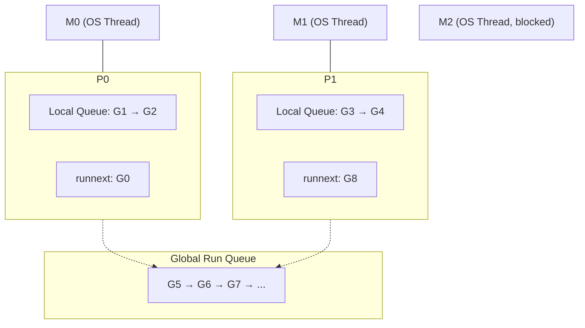
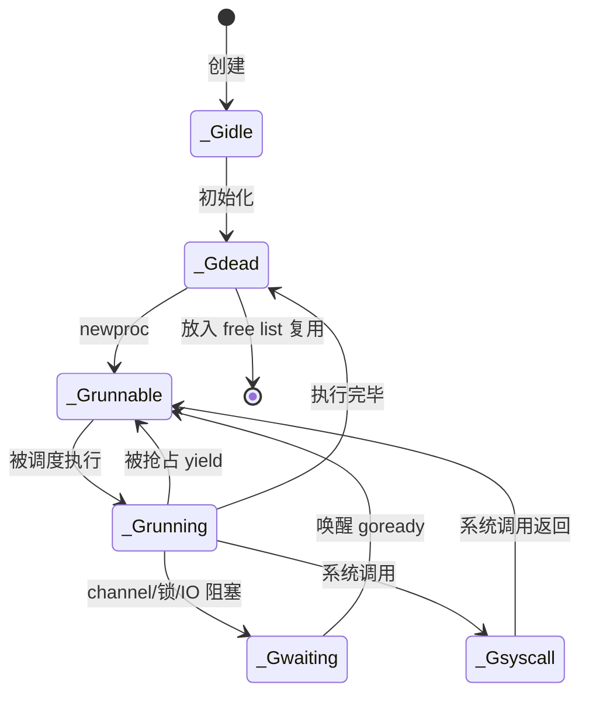
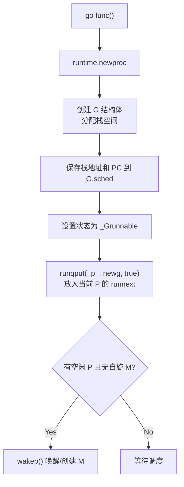
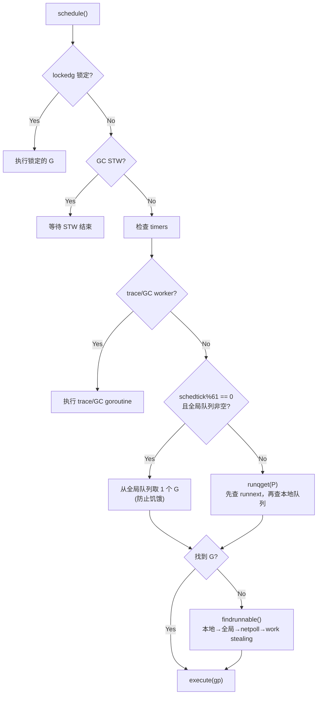

#go底层实现 #go #gmp调度模型

相关笔记：[[gc]] | [[context]] | [[p-runnext]]

## GMP 模型概述

Go 的 goroutine 调度基于 **GMP 模型**，是一种 M:N 调度方案——将 M 个 goroutine 映射到 N 个 OS 线程上执行。三个核心实体：

| 实体 | 全称 | 说明 |
|------|------|------|
| **G** | Goroutine | 用户态协程，包含栈、指令指针等执行上下文 |
| **M** | Machine | OS 线程，真正执行计算的实体 |
| **P** | Processor | 逻辑处理器，持有本地运行队列，是 G 和 M 之间的桥梁 |



![[gmp流程.png]]

---

## GMP 核心数据结构

### G（Goroutine）

goroutine 的运行时表示，包含栈信息、调度上下文和状态。

```go
type g struct {
    stack       stack          // 栈内存，包括上下界
    m           *m             // 当前绑定的 M
    sched       gobuf          // 调度上下文，切换时保存/恢复
    param       unsafe.Pointer // 用于传递参数，sleep 时其他 goroutine 可设置
    atomicstatus uint32        // goroutine 状态
    stackLock   uint32
    goid        int64          // goroutine ID
    waitsince   int64          // 阻塞开始的大致时间
    lockedm     *m             // 锁定到指定 M 上运行
}
```

`gobuf` 保存切换时的寄存器状态，是 goroutine 上下文切换的核心：

```go
type gobuf struct {
    sp   uintptr        // 栈指针
    pc   uintptr        // 程序计数器
    g    guintptr       // 所属 goroutine 指针（快速访问）
    ctxt unsafe.Pointer
    ret  sys.Uintreg
    lr   uintptr
    bp   uintptr        // frame pointer
}
```

#### Goroutine 状态机



---

### M（Machine）

M 代表一个 OS 线程，直接关联内核线程。M 必须持有一个 P 才能执行 G。

```go
type m struct {
    g0        *g            // 调度栈 goroutine（使用 OS 线程栈）
    gsignal   *g            // 信号处理 goroutine
    tls       [6]uintptr    // thread-local storage
    mstartfn  func()
    curg      *g            // 当前正在执行的 G
    p         puintptr      // 绑定的 P
    nextp     puintptr
    id        int32
    spinning  bool          // 是否处于自旋状态（寻找可运行的 G）
    blocked   bool          // 是否被阻塞
    inwb      bool          // 是否在执行写屏障
    park      note
    alllink   *m            // 链接到全局 allm 链表
    schedlink muintptr
    mcache    *mcache       // 内存缓存
    lockedg   *g            // 与此 M 锁定绑定的 G
    createstack [32]uintptr // 创建该线程的调用栈
}
```

关键字段：
- `g0`：带有调度栈的特殊 goroutine，栈分配在 **OS 线程栈**上（而非堆上），调度相关代码会切换到 g0 栈执行
- `curg`：当前正在 M 上执行的用户 goroutine
- `spinning`：自旋状态，表示 M 正在主动寻找可运行的 G

---

### P（Processor）

P 是逻辑处理器，持有 G 的本地运行队列和内存缓存等资源。M 必须绑定一个 P 才能执行 G。

```go
type p struct {
    lock      mutex
    id        int32
    status    uint32       // pidle/prunning/psyscall/pgcstop/pdead
    link      puintptr
    schedtick uint32       // 每调度一次加 1
    syscalltick uint32     // 每次系统调用加 1
    sysmontick sysmontick
    m         muintptr     // 绑定的 M（反向引用）
    mcache    *mcache

    // 本地运行队列（环形队列，容量 256）
    runqhead uint32
    runqtail uint32
    runq     [256]guintptr

    runnext  guintptr      // 下一个优先执行的 G（只能存一个）

    sudogcache []*sudog
    sudogbuf   [128]*sudog
    palloc     persistentAlloc
    pad        [sys.CacheLineSize]byte
}
```

---

## P 和 M 的数量

### P 的数量
- 由 `GOMAXPROCS` 环境变量或 `runtime.GOMAXPROCS()` 函数设置
- 默认等于 CPU 核心数
- 表示同时执行 goroutine 的最大并行度

### M 的数量
- 默认上限 **10000**（`runtime/debug.SetMaxThreads()` 可调整）
- M 阻塞时会创建新的 M 来保持 P 不空闲
- M 与 P 没有固定比例关系：即使 `GOMAXPROCS=1`，也可能创建多个 M

### 创建时机
- **P**：运行时初始化时根据 `GOMAXPROCS` 一次性创建
- **M**：当现有 M 全部阻塞而 P 上仍有可运行的 G 时，按需创建

---

## Goroutine 创建流程

调用 `go func()` 时，编译器将其转换为 `runtime.newproc`：



新创建的 goroutine 会被放入**当前 P 的 `runnext`**（而非队列尾部），获得优先调度权。详见 [[p-runnext]]。

---

## 调度策略

### 调度器 schedule() 的 G 查找优先级



**调度优先级（从高到低）**：
1. `P.runnext` — 最高优先级，通常是刚创建的 goroutine
2. `P.localrunq` — P 的本地队列，FIFO
3. `globalrunq` — 全局队列（每 61 次调度强制检查一次，防止饥饿）
4. `netpoll` — 网络轮询就绪的 goroutine
5. **Work Stealing** — 从其他 P 的本地队列偷取一半

### 三大调度策略

| 策略 | 说明 |
|------|------|
| **本地队列轮转** | P 周期性从本地队列取 G 执行，执行一段时间后放回队尾，取下一个 |
| **系统调用解绑** | G 进入系统调用时 M 阻塞，P 与 M 解绑，空闲 M 接管 P 继续执行其他 G |
| **Work Stealing** | P 本地队列空时，从其他 P 偷取一半 G 到自己的队列 |

---

## Goroutine 挂起场景

以下情况会导致 goroutine 被挂起（从 `_Grunning` 变为 `_Gwaiting`）：

| 场景 | 说明 |
|------|------|
| Channel 读写 | 对未初始化的 channel 读写，或 channel 阻塞 |
| select 阻塞 | 所有 case 都未就绪，或无 case |
| Mutex/锁竞争 | 等待互斥锁 |
| time.Sleep | 休眠 |
| IO 阻塞 | 网络请求等 IO 操作 |
| GC 相关 | 标记终止和标记阶段，清扫阶段 |
| 信号量 | 信号量处理 |

---

## 大量 Goroutine 调度示例

> 同时启动 10000 个 goroutine 会怎样？

1. 10000 个 G 按照 P 的数量尽量均匀分配到各 P 的本地队列（每个容量 256）
2. 本地队列满后，剩余 G 放入全局队列
3. 调度器按上述策略依次执行

---

## Goroutine 内存泄漏

### 常见原因

1. **Channel/Mutex 永久阻塞**：逻辑错误导致 goroutine 永远等待
2. **死循环**：业务逻辑进入无限循环，资源无法释放
3. **无限等待**：不断创建新 goroutine 进入长时间等待

### 排查与解决

```go
// 方法 1：使用 context 控制 goroutine 生命周期
func worker(ctx context.Context) {
    for {
        select {
        case <-ctx.Done():
            return // context 取消时退出
        case task := <-taskCh:
            process(task)
        }
    }
}

// 方法 2：使用 pprof 排查泄漏
import _ "net/http/pprof"
// 访问 /debug/pprof/goroutine?debug=1 查看所有 goroutine 栈
```

关键原则：**每个 goroutine 都必须有明确的退出机制**，推荐使用 `context.Context` 管理生命周期。
