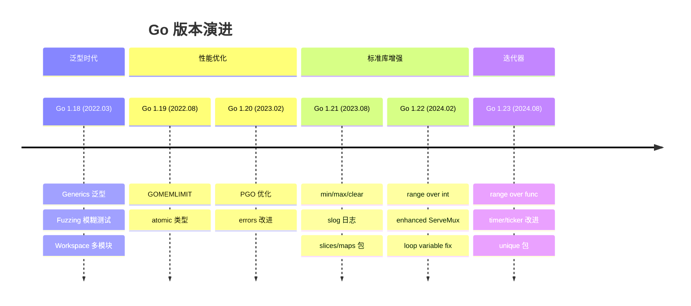
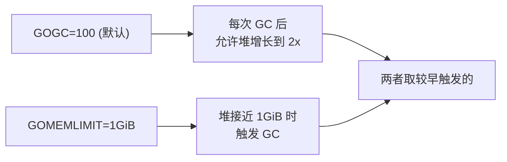

#go #版本

相关笔记：[[gmp-model]] | [[gc]] | [[context]]

## Go 版本新特性



---

### Go 1.18: Generics, Fuzzing, Workspace

#### Generics（泛型）

Go 1.18 引入了类型参数（Type Parameters），是 Go 语言最大的一次语法变化。

```go
// 类型约束 (type constraint)
type Number interface {
    ~int | ~int32 | ~int64 | ~float32 | ~float64
}

// 泛型函数
func Sum[T Number](nums []T) T {
    var total T
    for _, n := range nums {
        total += n
    }
    return total
}

// 泛型类型
type Stack[T any] struct {
    items []T
}

func (s *Stack[T]) Push(item T) {
    s.items = append(s.items, item)
}

func (s *Stack[T]) Pop() (T, bool) {
    if len(s.items) == 0 {
        var zero T
        return zero, false
    }
    item := s.items[len(s.items)-1]
    s.items = s.items[:len(s.items)-1]
    return item, true
}

func main() {
    // 泛型函数调用（类型推断）
    fmt.Println(Sum([]int{1, 2, 3}))         // 6
    fmt.Println(Sum([]float64{1.1, 2.2}))    // 3.3

    // 泛型类型使用
    s := &Stack[string]{}
    s.Push("hello")
    s.Push("world")
    v, _ := s.Pop()
    fmt.Println(v) // "world"
}
```

**constraints 包**（`golang.org/x/exp/constraints`）和内置约束：

```go
// 内置约束
any        // = interface{}，无约束
comparable // 支持 == 和 != 的类型

// ~ 表示底层类型（underlying type）
type MyInt int
// ~int 匹配 int 和所有底层类型为 int 的类型（如 MyInt）
```

#### Fuzzing（模糊测试）

```go
// 文件名必须以 _test.go 结尾
func FuzzParseJSON(f *testing.F) {
    // 提供种子语料库
    f.Add(`{"name": "alice"}`)
    f.Add(`{"age": 30}`)
    f.Add(`[]`)

    f.Fuzz(func(t *testing.T, input string) {
        var result map[string]interface{}
        err := json.Unmarshal([]byte(input), &result)
        if err != nil {
            return // 无效输入，跳过
        }
        // 反序列化后再序列化，验证一致性
        output, err := json.Marshal(result)
        if err != nil {
            t.Fatalf("marshal failed: %v", err)
        }
        _ = output
    })
}

// 运行：go test -fuzz=FuzzParseJSON -fuzztime=30s
```

#### Workspace（多模块工作区）

```bash
# 初始化 workspace
go work init ./module-a ./module-b

# go.work 文件
go 1.18

use (
    ./module-a
    ./module-b
)
```

解决了多模块本地开发时频繁修改 `go.mod` 的 `replace` 指令问题。

---

### Go 1.19: GC 调优, atomic 类型

#### GOMEMLIMIT（软内存上限）

```go
import "runtime/debug"

func init() {
    // 设置软内存上限为 1GB
    debug.SetMemoryLimit(1 << 30)
}

// 或通过环境变量
// GOMEMLIMIT=1GiB ./myapp
```

在设置 `GOMEMLIMIT` 的情况下，通常可以将 `GOGC` 设为更高的值（甚至 `off`），让 GC 主要由内存用量驱动而非分配速率。



#### atomic 类型

```go
import "sync/atomic"

// Go 1.19 前：使用函数
var counter int64
atomic.AddInt64(&counter, 1)

// Go 1.19+：使用类型，更安全
var counter atomic.Int64
counter.Add(1)
counter.Store(42)
v := counter.Load()

// 其他 atomic 类型
var flag atomic.Bool
var ptr atomic.Pointer[Config]
```

---

### Go 1.20: PGO, errors 改进

#### PGO（Profile-Guided Optimization）

```bash
# 1. 收集生产环境 CPU profile
curl http://localhost:6060/debug/pprof/profile?seconds=30 > default.pgo

# 2. 将 profile 放到 main package 目录
cp default.pgo ./cmd/myapp/

# 3. 编译时自动使用（Go 1.20 需 -pgo=auto，Go 1.21+ 默认开启）
go build -pgo=auto ./cmd/myapp

# 典型性能提升：2-7%（主要来自内联和去虚拟化决策）
```

PGO 优化原理：根据 profile 数据，编译器识别热路径（hot path）并做更激进的内联（inlining）和去虚拟化（devirtualization）。

#### errors 改进

```go
// Go 1.20: 支持多 error 包装
err := fmt.Errorf("db error: %w, cache error: %w", dbErr, cacheErr)

// errors.Join 合并多个 error
err := errors.Join(err1, err2, err3)

// errors.Is 和 errors.As 支持遍历多 error 树
if errors.Is(err, sql.ErrNoRows) {
    // 任一子 error 匹配即返回 true
}
```

---

### Go 1.21: min/max/clear, slog, slices/maps

#### 内置函数

```go
// min/max：支持任意 Ordered 类型，可变参数
a := min(3, 1, 4, 1, 5) // 1
b := max(3, 1, 4, 1, 5) // 5
s := min("alice", "bob") // "alice"

// clear：清空 map 或将 slice 元素置零
m := map[string]int{"a": 1, "b": 2}
clear(m) // m 变为空 map（len=0），但内存未释放

s := []int{1, 2, 3}
clear(s) // s = [0, 0, 0]，len 不变
```

#### slog（结构化日志）

```go
import "log/slog"

// 默认 text handler
slog.Info("user login",
    "user_id", 12345,
    "ip", "192.168.1.1",
)
// 输出: 2024/01/15 10:30:00 INFO user login user_id=12345 ip=192.168.1.1

// JSON handler
logger := slog.New(slog.NewJSONHandler(os.Stdout, &slog.HandlerOptions{
    Level: slog.LevelDebug,
}))
slog.SetDefault(logger)

slog.Info("request handled",
    slog.String("method", "GET"),
    slog.Int("status", 200),
    slog.Duration("latency", 42*time.Millisecond),
    slog.Group("user",
        slog.Int("id", 123),
        slog.String("name", "alice"),
    ),
)
// {"time":"...","level":"INFO","msg":"request handled",
//  "method":"GET","status":200,"latency":"42ms",
//  "user":{"id":123,"name":"alice"}}

// 带 context 的 logger
logger = logger.With("service", "api")
ctx := context.Background()
logger.InfoContext(ctx, "starting server", "port", 8080)
```

#### slices 和 maps 标准库包

```go
import (
    "slices"
    "maps"
)

// slices 包
s := []int{3, 1, 4, 1, 5}
slices.Sort(s)                    // [1, 1, 3, 4, 5]
slices.Contains(s, 4)             // true
idx, found := slices.BinarySearch(s, 3)  // idx=2, found=true
slices.Compact(s)                 // [1, 3, 4, 5] 去除相邻重复
slices.Reverse(s)                 // 原地反转
s2 := slices.Clone(s)            // 独立副本

// maps 包
m := map[string]int{"a": 1, "b": 2, "c": 3}
keys := maps.Keys(m)             // 迭代器（Go 1.23 后返回 iter.Seq）
maps.DeleteFunc(m, func(k string, v int) bool {
    return v < 2
})
m2 := maps.Clone(m)              // 浅拷贝
```

---

### Go 1.22: range over int, Enhanced Routing, Loop Variable Fix

#### range over int

```go
// Go 1.22 前
for i := 0; i < 10; i++ {
    fmt.Println(i)
}

// Go 1.22+
for i := range 10 {
    fmt.Println(i) // 0, 1, 2, ..., 9
}
```

#### Enhanced ServeMux（路由增强）

```go
mux := http.NewServeMux()

// 支持 HTTP method 前缀
mux.HandleFunc("GET /api/users", listUsers)
mux.HandleFunc("POST /api/users", createUser)

// 支持路径参数
mux.HandleFunc("GET /api/users/{id}", func(w http.ResponseWriter, r *http.Request) {
    id := r.PathValue("id")
    fmt.Fprintf(w, "user id: %s", id)
})

// 支持通配符
mux.HandleFunc("GET /files/{path...}", func(w http.ResponseWriter, r *http.Request) {
    path := r.PathValue("path")
    fmt.Fprintf(w, "file path: %s", path)
})

// 更精确的路由匹配优先级
mux.HandleFunc("GET /api/users/me", getCurrentUser)     // 优先匹配
mux.HandleFunc("GET /api/users/{id}", getUser)           // 其次
```

#### Loop Variable Fix

```go
// Go 1.22 前：循环变量在整个循环中共享一个地址
for _, v := range values {
    go func() {
        fmt.Println(v) // 全部打印最后一个值
    }()
}

// Go 1.22+：每次迭代创建新变量（per-iteration scope）
for _, v := range values {
    go func() {
        fmt.Println(v) // 正确打印每个值
    }()
}

// 不再需要 v := v 这种 workaround
```

---

### Go 1.23: Range over Func (Iterators), Timer/Ticker 改进

#### Range over Func（迭代器）

Go 1.23 允许 `for range` 遍历函数，函数签名需符合 `iter.Seq` 或 `iter.Seq2`：

```go
import "iter"

// iter.Seq[V] = func(yield func(V) bool)
// iter.Seq2[K, V] = func(yield func(K, V) bool)

// 自定义迭代器：生成斐波那契数列
func Fibonacci(n int) iter.Seq[int] {
    return func(yield func(int) bool) {
        a, b := 0, 1
        for i := 0; i < n; i++ {
            if !yield(a) {
                return // 调用方 break 时，yield 返回 false
            }
            a, b = b, a+b
        }
    }
}

func main() {
    for v := range Fibonacci(10) {
        fmt.Println(v) // 0, 1, 1, 2, 3, 5, 8, 13, 21, 34
    }
}

// 自定义 Seq2 迭代器：遍历二叉树
type TreeNode[T any] struct {
    Value       T
    Left, Right *TreeNode[T]
}

func (t *TreeNode[T]) InOrder() iter.Seq2[int, T] {
    return func(yield func(int, T) bool) {
        idx := 0
        var walk func(*TreeNode[T]) bool
        walk = func(n *TreeNode[T]) bool {
            if n == nil {
                return true
            }
            if !walk(n.Left) {
                return false
            }
            if !yield(idx, n.Value) {
                return false
            }
            idx++
            return walk(n.Right)
        }
        walk(t)
    }
}

// 使用
for i, v := range root.InOrder() {
    fmt.Printf("[%d] %v\n", i, v)
}
```

#### slices/maps 包与迭代器结合

```go
import "slices"

s := []int{3, 1, 4, 1, 5, 9}

// slices.All：返回 iter.Seq2[int, T]
for i, v := range slices.All(s) {
    fmt.Println(i, v)
}

// slices.Values：返回 iter.Seq[T]
for v := range slices.Values(s) {
    fmt.Println(v)
}

// slices.Collect：从迭代器收集为 slice
result := slices.Collect(Fibonacci(8))
// [0, 1, 1, 2, 3, 5, 8, 13]

// slices.SortedFunc + 自定义迭代器
sorted := slices.Sorted(maps.Keys(myMap))
```

#### Timer/Ticker 改进

```go
// Go 1.23 前：未 Stop 的 Timer/Ticker 可能泄漏
// Timer.Stop 返回后 C 中可能还有残留值

// Go 1.23+：Timer 和 Ticker 会被 GC 回收（即使没有 Stop）
// Timer.Reset 行为更一致

t := time.NewTimer(5 * time.Second)
defer t.Stop()

// Go 1.23: Stop 和 Reset 保证不会有旧值残留在 channel 中
// 不再需要排空 channel 的 workaround
t.Reset(3 * time.Second)
```

---

### 面试要点

1. **Generics 实现方式**：Go 采用 GC Shape Stenciling 混合方案。相同 GC shape（如所有指针类型）共享一份代码，通过 dict 传递类型信息；不同 shape（如 int vs string）生成不同的特化代码。比纯 monomorphization 省代码体积，比纯 type erasure 性能好
2. **GOMEMLIMIT vs GOGC**：GOGC 控制 GC 频率（基于增长比例），GOMEMLIMIT 控制内存上限（软限制）。两者互补：高 GOGC + GOMEMLIMIT 可以减少 GC 次数同时避免 OOM
3. **PGO 原理**：收集生产 profile → 编译器根据热路径做内联和去虚拟化 → 典型提升 2-7%
4. **range over func 设计**：yield 函数返回 bool 用于支持 break；配合 `iter.Seq`/`iter.Seq2` 类型约定，实现 pull-to-push 迭代模式
5. **Loop variable fix**：Go 1.22 将 for 循环变量从 per-loop 改为 per-iteration，修复了 Go 最常见的陷阱之一
6. **Enhanced ServeMux**：Go 1.22 的路由增强使得简单场景不再需要 gorilla/mux 或 chi 等第三方路由库
7. **slog 设计**：Handler 接口可定制输出格式，支持 Group 层级结构，性能优于 logrus/zap 的部分场景（零分配设计）
