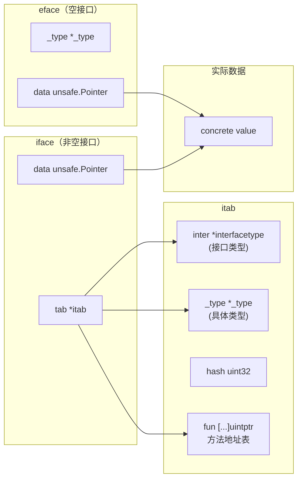
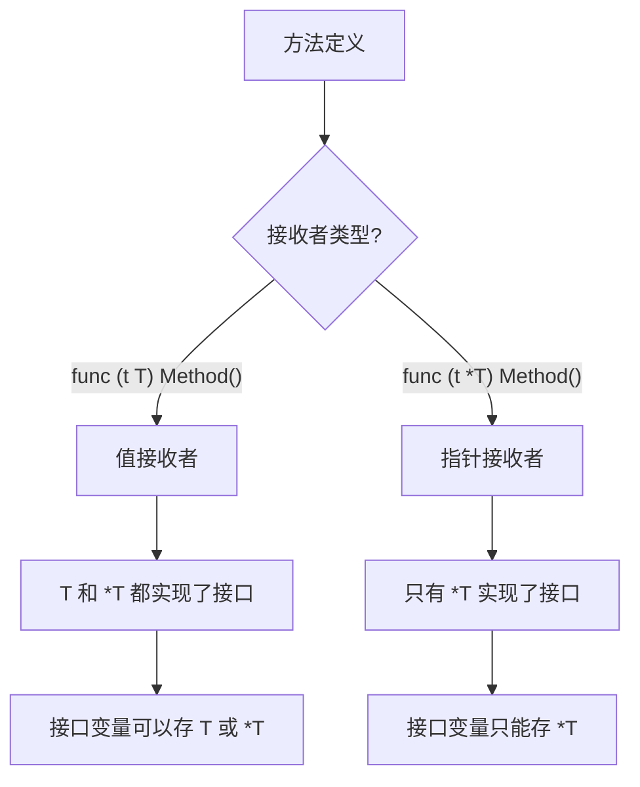

#go #interface #reflect

相关笔记：[[gmp-model]] | [[gc]] | [[channel]]

## Interface 与反射

### iface vs eface

Go 中接口分为两种底层表示，位于 `runtime/runtime2.go`：

- **eface**：空接口 `interface{}`（或 `any`），不包含方法
- **iface**：非空接口，包含方法集

```go
// 空接口 - empty interface
type eface struct {
    _type *_type          // 指向具体类型元数据
    data  unsafe.Pointer  // 指向实际数据
}

// 非空接口 - non-empty interface
type iface struct {
    tab  *itab            // 接口表（包含类型信息和方法地址）
    data unsafe.Pointer   // 指向实际数据
}

type itab struct {
    inter *interfacetype  // 接口的类型信息
    _type *_type          // 具体类型的类型信息
    hash  uint32          // _type.hash 的副本，用于快速类型断言
    _     [4]byte
    fun   [1]uintptr      // 方法地址表（变长数组，实际长度 = 接口方法数）
}
```



### _type 结构

`_type` 是 Go 类型系统的基石，每种类型在编译期生成一个 `_type`：

```go
type _type struct {
    size       uintptr  // 类型大小
    ptrdata    uintptr  // 含指针部分的大小（GC 用）
    hash       uint32   // 类型 hash，用于类型比较
    tflag      tflag
    align      uint8    // 内存对齐
    fieldAlign uint8
    kind       uint8    // 类型种类（int, string, struct, ptr, ...）
    equal      func(unsafe.Pointer, unsafe.Pointer) bool // 比较函数
    gcdata     *byte    // GC 相关
    str        nameOff
    ptrToThis  typeOff
}
```

### itab 缓存机制

runtime 维护一个全局的 `itabTable`（hash table），缓存 `<interface type, concrete type>` 到 `*itab` 的映射。类型断言和接口转换时先查缓存，命中则 O(1)。

### 类型断言底层

```go
var i interface{} = "hello"

// 类型断言 - 编译为 runtime.assertE2T / assertI2T
s := i.(string)

// comma-ok 模式 - 不会 panic
s, ok := i.(string)
```

类型断言的核心流程：
1. 检查 `_type.hash` 是否匹配目标类型的 hash
2. 匹配则直接返回 data 指针指向的值
3. 不匹配：单返回值形式 panic，comma-ok 形式返回零值和 false

### Type Switch 底层

```go
// type switch 编译为一系列 if-else 类型断言
switch v := i.(type) {
case string:
    fmt.Println("string:", v)
case int:
    fmt.Println("int:", v)
case fmt.Stringer:
    fmt.Println("Stringer:", v.String())
default:
    fmt.Println("unknown type")
}
```

编译器会根据 case 数量选择优化策略：少量 case 用线性比较，大量 case 用 hash 跳转表。

### 接口组合与隐式实现

```go
// 接口组合 - 小接口组合成大接口
type Reader interface {
    Read(p []byte) (n int, err error)
}

type Writer interface {
    Write(p []byte) (n int, err error)
}

type ReadWriter interface {
    Reader
    Writer
}

// 隐式实现 - 不需要 implements 关键字
type MyBuffer struct {
    data []byte
}

func (b *MyBuffer) Read(p []byte) (int, error) {
    copy(p, b.data)
    return len(b.data), nil
}

func (b *MyBuffer) Write(p []byte) (int, error) {
    b.data = append(b.data, p...)
    return len(p), nil
}

// MyBuffer 自动实现了 Reader, Writer, ReadWriter
var _ ReadWriter = (*MyBuffer)(nil) // 编译期接口检查
```

#### 值接收者 vs 指针接收者



### reflect 包核心

#### TypeOf 和 ValueOf

```go
import "reflect"

type User struct {
    Name string `json:"name" validate:"required"`
    Age  int    `json:"age" validate:"min=0"`
}

u := User{Name: "Alice", Age: 30}

// reflect.TypeOf - 获取类型信息（对应 _type）
t := reflect.TypeOf(u)
fmt.Println(t.Name())       // "User"
fmt.Println(t.Kind())       // struct
fmt.Println(t.NumField())   // 2

// reflect.ValueOf - 获取值信息（对应 data）
v := reflect.ValueOf(u)
fmt.Println(v.Field(0))     // "Alice"
fmt.Println(v.Field(1))     // 30
```

#### 遍历 Struct Fields 和 Tags

```go
func inspectStruct(v interface{}) {
    t := reflect.TypeOf(v)
    val := reflect.ValueOf(v)

    // 如果传入指针，取 Elem
    if t.Kind() == reflect.Ptr {
        t = t.Elem()
        val = val.Elem()
    }

    fmt.Printf("Type: %s\n", t.Name())
    for i := 0; i < t.NumField(); i++ {
        field := t.Field(i)
        value := val.Field(i)
        jsonTag := field.Tag.Get("json")
        validateTag := field.Tag.Get("validate")
        fmt.Printf("  %s (%s) = %v  json:%q validate:%q\n",
            field.Name, field.Type, value, jsonTag, validateTag)
    }
}

// 输出:
// Type: User
//   Name (string) = Alice  json:"name" validate:"required"
//   Age (int) = 30  json:"age" validate:"min=0"
```

#### 通过反射修改值

```go
func setField(obj interface{}, fieldName string, newValue interface{}) error {
    v := reflect.ValueOf(obj)
    if v.Kind() != reflect.Ptr || v.Elem().Kind() != reflect.Struct {
        return fmt.Errorf("expected pointer to struct")
    }

    field := v.Elem().FieldByName(fieldName)
    if !field.IsValid() {
        return fmt.Errorf("field %s not found", fieldName)
    }
    if !field.CanSet() {
        return fmt.Errorf("field %s cannot be set (unexported?)", fieldName)
    }

    val := reflect.ValueOf(newValue)
    if field.Type() != val.Type() {
        return fmt.Errorf("type mismatch: field is %s, got %s", field.Type(), val.Type())
    }

    field.Set(val)
    return nil
}

u := &User{Name: "Alice", Age: 30}
setField(u, "Name", "Bob")
fmt.Println(u.Name) // "Bob"
```

### 空接口 interface{} vs any

Go 1.18 引入 `any` 作为 `interface{}` 的别名：

```go
// 两者完全等价
type any = interface{}

// 推荐使用 any（更简洁）
func Print(v any) {
    fmt.Println(v)
}
```

### 多态示例

```go
type Shape interface {
    Area() float64
    Perimeter() float64
}

type Circle struct {
    Radius float64
}

func (c Circle) Area() float64 {
    return math.Pi * c.Radius * c.Radius
}

func (c Circle) Perimeter() float64 {
    return 2 * math.Pi * c.Radius
}

type Rectangle struct {
    Width, Height float64
}

func (r Rectangle) Area() float64 {
    return r.Width * r.Height
}

func (r Rectangle) Perimeter() float64 {
    return 2 * (r.Width + r.Height)
}

func printShapeInfo(s Shape) {
    // 动态分派：调用 itab.fun 中存储的方法地址
    fmt.Printf("Type: %T, Area: %.2f, Perimeter: %.2f\n",
        s, s.Area(), s.Perimeter())
}

func main() {
    shapes := []Shape{
        Circle{Radius: 5},
        Rectangle{Width: 3, Height: 4},
    }
    for _, s := range shapes {
        printShapeInfo(s)
    }
}
```

### 面试要点

1. **iface vs eface**：非空接口用 iface（含 itab 方法表），空接口用 eface（只有 _type 和 data）。赋值给接口时，小对象直接存 data 字段，大对象堆分配后存指针
2. **itab 缓存**：runtime 全局 hash table 缓存已计算的 itab，类型断言先查缓存，O(1) 命中
3. **nil interface 陷阱**：接口值为 nil 需要 tab 和 data 都为 nil。`(*T)(nil)` 赋给接口后，接口不为 nil（tab 非空）
4. **值接收者 vs 指针接收者**：值接收者的方法集属于 T 和 *T；指针接收者的方法集只属于 *T。接口匹配看方法集
5. **reflect 三定律**：(1) 从 interface 到 reflect 对象 (2) 从 reflect 对象到 interface (3) 修改 reflect 对象需要 settable（可寻址 + exported）
6. **reflect 性能**：reflect 调用比直接调用慢 1-2 个数量级，热路径避免使用。可用 `go:linkname` 或代码生成替代
7. **接口设计原则**：接口越小越好（Go proverb: "The bigger the interface, the weaker the abstraction"），标准库典型接口只有 1-3 个方法
