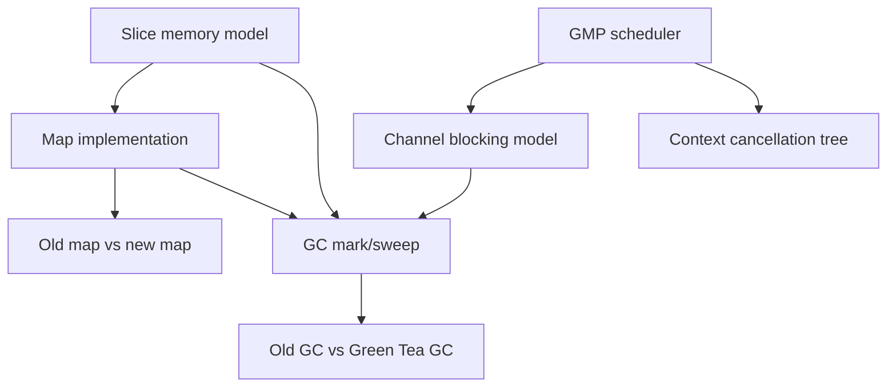

#go #runtime #internals

相关笔记：[[go-gmp-source]] | [[go-slice-source]] | [[go-map-source]] | [[go-channel-source]] | [[go-context-source]] | [[go-gc-source]] | [[go-map-old-vs-new]] | [[go-gc-old-vs-new]]

# Go Runtime 源码学习索引

## 概述

这组笔记放在 `go/internals/`，目标不是替代 `go/` 目录里的基础复习卡片，而是作为源码级深挖入口：围绕 Go runtime、标准库并发原语、内存模型、事故排查和面试追问建立一套可复用的阅读框架。

源码版本以本机环境为准：

```text
go version go1.26.1 darwin/arm64
GOROOT=/opt/homebrew/Cellar/go/1.26.1/libexec
```

涉及版本差异时，文档会显式区分：
- Go 1.24+ 的新 map：`internal/runtime/maps`，Swiss Table + extendible hashing。
- Go 1.25/1.26 源码中的 Green Tea GC：`goexperiment.greenteagc` 控制的新标记扫描实现。
- 旧 map / 旧 GC：以 Go 1.23 及更早的主流实现模型作为对照。

## 学习顺序



| 顺序 | 文件 | 源码入口 | 读完要能回答 |
|------|------|----------|--------------|
| 1 | [go-gmp-source](go-gmp-source.md) | `runtime/runtime2.go`, `runtime/proc.go` | `go f()` 如何变成可运行的 G？M 如何找活？P 的本地队列为什么重要？ |
| 2 | [go-channel-source](go-channel-source.md) | `runtime/chan.go`, `runtime/select.go` | send/recv/close 在有无缓冲时分别走哪条路径？阻塞 goroutine 如何被唤醒？ |
| 3 | [go-context-source](go-context-source.md) | `context/context.go` | cancel 如何沿树传播？什么时候会额外起 goroutine？为什么必须调用 cancel？ |
| 4 | [go-slice-source](go-slice-source.md) | `runtime/slice.go` | append 扩容怎么算？为什么切小片可能导致大数组不释放？ |
| 5 | [go-map-source](go-map-source.md) | `internal/runtime/maps/*`, `runtime/map.go` | 新 map 的 Group/Table/Directory 如何组织？lookup/assign/grow/iteration 怎么做？ |
| 6 | [go-gc-source](go-gc-source.md) | `runtime/mgc*.go`, `runtime/mbarrier.go` | 并发 GC 的阶段、屏障、assist、pacer、STW 边界是什么？ |
| 7 | [go-map-old-vs-new](go-map-old-vs-new.md) | `runtime/map.go` vs `internal/runtime/maps` | legacy bucket map 和 Swiss Table map 的设计差异是什么？ |
| 8 | [go-gc-old-vs-new](go-gc-old-vs-new.md) | `mgcmark_nogreenteagc.go` vs `mgcmark_greenteagc.go` | 传统 workbuf 扫描和 Green Tea span batching 差异在哪里？ |

## 阅读源码的方法

### 先读结构，再读热路径

Go runtime 源码读法不能从函数入口一路单步到底，否则很容易被平台分支、race/msan/asan、linkname 兼容逻辑打散。推荐顺序：

1. 先找到核心结构体，例如 `g`, `m`, `p`, `hchan`, `maps.Map`, `cancelCtx`。
2. 再找到编译器或标准库会调用的 runtime entrypoint，例如 `newproc`, `chansend`, `mapassign`, `growslice`。
3. 最后沿着热路径看锁、队列、状态机、GC barrier、panic 条件。

### 把语义和实现分开

Go 语言规范保证的是语义，例如 map 迭代顺序 unspecified、channel close 后 receive 得到零值、context cancel 是幂等的。runtime 实现可以换，例如 map 从 bucket/overflow 换成 Swiss Table，但语义通常不变。面试回答要先说语义，再说当前版本实现，最后说版本边界。

### 所有性能结论都要带限制条件

不要说“slice 扩容就是 2 倍”“map 查找就是 O(1)”“GC 无 STW”。更准确的说法是：
- slice 小容量近似 2 倍，超过阈值后平滑过渡到约 1.25 倍，并且受 allocator size class 影响。
- map 平均 O(1)，但 hash 冲突、扩容、迭代、删除 tombstone 都会改变局部成本。
- Go GC 是并发标记清扫，但仍有 sweep termination 和 mark termination 两个 STW 边界。

## 事故排查总入口

| 症状 | 优先看 | 常用命令 |
|------|--------|----------|
| goroutine 数持续上涨 | `go-channel-source`, `go-context-source`, `go-gmp-source` | `curl /debug/pprof/goroutine?debug=2`, `go tool pprof`, `go tool trace` |
| CPU 高但业务吞吐低 | `go-gmp-source`, `go-gc-source` | `GODEBUG=schedtrace=1000,scheddetail=1`, CPU profile, block profile |
| heap 居高不下 | `go-slice-source`, `go-map-source`, `go-gc-source` | `go tool pprof -alloc_space`, `go tool pprof -inuse_space`, `GODEBUG=gctrace=1` |
| map concurrent panic | `go-map-source` | race detector, goroutine dump, 审查共享 map 写路径 |
| channel deadlock / send on closed channel | `go-channel-source` | goroutine dump, block profile, `go test -race` |
| deadline/cancel 不生效 | `go-context-source` | trace request lifecycle, grep missing `cancel()` calls |

## 输出标准

每篇笔记遵循同一套结构：
- `## 概述`：一句话定位这个机制解决什么问题。
- `## 核心结构`：把源码结构体拆成字段语义。
- `## 核心链路`：用流程图说明最重要的 hot path。
- `## 源码导读`：列出关键函数、状态变化、panic/slow path。
- `## 事故排查`：把源码机制落到线上现象和命令。
- `## 面试要点`：给出可直接复述的问答。

## 面试要点

### Q: Go runtime 源码应该从哪里读？

> [!question]- 参考答案（点击展开）
>
> 先读结构体和状态机，再读热路径。GMP 从 `runtime2.go` 的 `g/m/p` 和 `proc.go` 的 `newproc/schedule/findRunnable/execute` 开始；channel 从 `hchan/chansend/chanrecv/closechan` 开始；map 从 Go 1.24+ 的 `internal/runtime/maps` 开始；GC 从 `mgc.go/mgcmark.go/mbarrier.go/mgcpacer.go` 开始。

### Q: 为什么要单独区分新 map 和旧 map？

> [!question]- 参考答案（点击展开）
>
> 因为 Go 1.24+ 的实现从 `hmap/bmap/overflow bucket` 切到了 Swiss Table 风格的 `Map/Table/Group/Control word/Directory`。语言语义基本不变，但局部性、查找方式、扩容粒度、源码入口和 unsafe/linkname 依赖风险都变了。

### Q: 为什么要单独区分旧 GC 和 Green Tea GC？

> [!question]- 参考答案（点击展开）
>
> Green Tea 改的是标记扫描的局部性：传统实现偏向对象级 workbuf 扫描，Green Tea 会延迟扫描并按 span 聚合对象，使用 marks/scans 两套标记位和 FIFO span queue。它不等于把 Go 变成分代/移动 GC，也不改变 Go GC 的基本并发标记清扫模型。

### Q: 面试回答源码时最容易犯什么错？

> [!question]- 参考答案（点击展开）
>
> 把旧版本实现当成当前实现、把语义当成实现、把平均复杂度当成绝对复杂度、把调优参数当成根因。回答时要明确版本、源码文件、核心结构、热路径、慢路径和排障手段。
