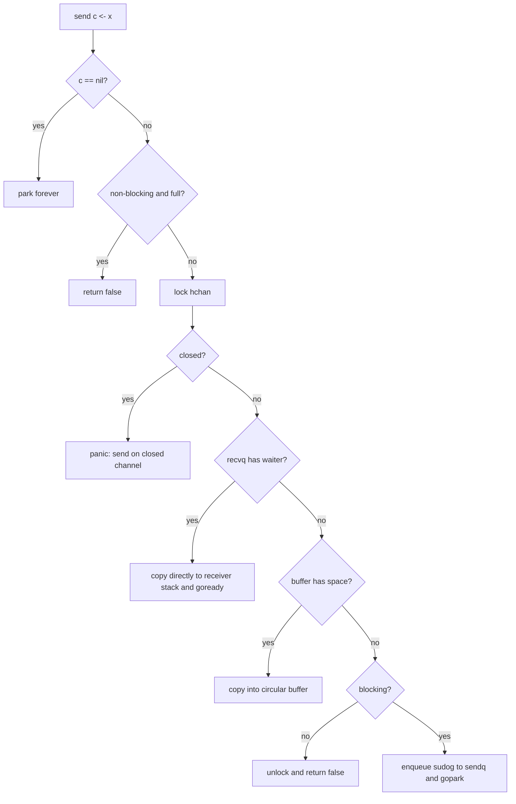

#go #runtime #concurrency

相关笔记：[[go-gmp-source]] | [[go-context-source]] | [[go-gc-source]] | [[channel]]

# Channel 源码导读

## 概述

channel 是 Go 在语言层提供的同步与通信原语。源码里它不是“神秘队列”，而是一个带锁的 `hchan`：
- 有缓冲时，内部维护 circular buffer。
- 无缓冲或缓冲不可用时，sender/receiver 会通过 `sudog` 挂到等待队列。
- send/recv/close 都会修改 goroutine 状态，并和 GMP 调度器交互。

源码入口：

```text
/opt/homebrew/Cellar/go/1.26.1/libexec/src/runtime/chan.go
/opt/homebrew/Cellar/go/1.26.1/libexec/src/runtime/select.go
```

## 核心结构

### hchan

```go
type hchan struct {
    qcount   uint
    dataqsiz uint
    buf      unsafe.Pointer
    elemsize uint16
    closed   uint32
    timer    *timer
    elemtype *_type
    sendx    uint
    recvx    uint
    recvq    waitq
    sendq    waitq
    lock     mutex
}
```

字段含义：
- `qcount`：缓冲区当前元素数。
- `dataqsiz`：缓冲区容量，0 表示无缓冲 channel。
- `buf`：指向 circular buffer。
- `closed`：是否已关闭。
- `elemtype/elemsize`：元素类型和大小，供 copy、clear、GC barrier 使用。
- `sendx/recvx`：环形队列写入/读取位置。
- `recvq/sendq`：等待接收/发送的 goroutine 队列，元素是 `sudog`。
- `lock`：保护 `hchan` 和挂在 channel 上的 `sudog`。

### waitq 与 sudog

```go
type waitq struct {
    first *sudog
    last  *sudog
}
```

`sudog` 是 runtime 用来表示“某个 G 正在等待某个同步对象”的结构。channel 中每个阻塞 sender/receiver 都会对应一个 `sudog`，里面记录：
- 等待的 G。
- 要发送或接收的元素地址。
- 是否来自 select。
- 被唤醒后是否成功。

## 核心不变量

`chan.go` 顶部注释给了两个关键不变量：

```text
At least one of c.sendq and c.recvq is empty.

For buffered channels:
c.qcount > 0 implies that c.recvq is empty.
c.qcount < c.dataqsiz implies that c.sendq is empty.
```

解释：
- 正常情况下不会同时有 sender 和 receiver 都在排队，因为双方可以直接配对完成。
- 对 buffered channel，如果 buffer 里有数据，receiver 不应该还在等。
- 如果 buffer 还有空位，sender 不应该还在等。

这些不变量能帮助判断源码分支为什么按当前顺序写。

## 核心链路



## 源码导读

### makechan

```go
func makechan(t *chantype, size int) *hchan
```

分配策略：
- `mem == 0`：只分配 `hchan`。
- 元素不含指针：`hchan` 和 buffer 一次性连续分配，GC 不扫描 buffer。
- 元素含指针：`hchan` 和 buffer 分开分配，buffer 带类型信息供 GC 扫描。

关键源码主线：

```go
switch {
case mem == 0:
    c = (*hchan)(mallocgc(hchanSize, nil, true))
    c.buf = c.raceaddr()
case !elem.Pointers():
    c = (*hchan)(mallocgc(hchanSize+mem, nil, true))
    c.buf = add(unsafe.Pointer(c), hchanSize)
default:
    c = new(hchan)
    c.buf = mallocgc(mem, elem, true)
}
```

### chansend

入口：

```go
func chansend(c *hchan, ep unsafe.Pointer, block bool, callerpc uintptr) bool
```

主要分支：

1. `c == nil`：阻塞 send 会永远 park；非阻塞 send 返回 false。
2. 非阻塞 fast path：未关闭且 full 时直接 false，不加锁。
3. 加锁后如果 `closed != 0`，panic。
4. 如果 `recvq` 有等待者，直接把值 copy 到 receiver，绕过 buffer。
5. 如果 buffer 有空位，copy 到 `sendx`，更新 `sendx/qcount`。
6. 如果不能阻塞，返回 false。
7. 否则构造 `sudog`，挂到 `sendq`，调用 `gopark`。

直接交付时的关键点：

```go
if sg := c.recvq.dequeue(); sg != nil {
    send(c, sg, ep, func() { unlock(&c.lock) }, 3)
    return true
}
```

无缓冲 channel 的 send/recv 本质是 sender 和 receiver 在锁保护下 rendezvous。

### chanrecv

接收路径与发送对称：

1. `c == nil`：阻塞 recv 永远 park；非阻塞 recv 返回 false。
2. fast path：非阻塞且 empty 时返回。
3. 加锁后检查 closed。
4. 如果有 waiting sender：
   - 无缓冲 channel：直接从 sender stack copy 到 receiver。
   - 有缓冲 channel 且 buffer 满：receiver 从 buffer 取一个，同时 sender 的值进入空出的 buffer slot。
5. 如果 buffer 有数据，取 `recvx`，清理 slot，更新 `recvx/qcount`。
6. 不能阻塞则返回。
7. 否则挂到 `recvq` 并 park。

close 后 receive 的语义：
- buffer 里还有数据：继续正常接收，`ok=true`。
- buffer 空且已关闭：返回零值，`ok=false`。

### closechan

```go
func closechan(c *hchan)
```

语义：
- close nil channel：panic。
- close 已关闭 channel：panic。
- close 后再 send：panic。
- close 后 recv：读完 buffer 后返回零值和 `ok=false`。

源码动作：
1. 加锁并设置 `closed=1`。
2. 唤醒所有 waiting receiver，给它们零值和 `success=false`。
3. 唤醒所有 waiting sender，让它们后续 panic。
4. 解锁后 `goready` 这些 G。

### select

`select` 在 `runtime/select.go`，核心点：
- case 会被打乱顺序，避免固定偏向。
- nil channel case 会被禁用。
- 有 ready case 时选择一个执行。
- 没有 ready case 且有 default，执行 default。
- 没有 ready case 且无 default，把当前 G 同时挂到多个 channel 的 waitq 上。
- 被某个 channel 唤醒后，需要从其他 channel waitq 中撤销。

这也是为什么 select 的实现远比单 channel send/recv 复杂：它要处理多 channel 注册、随机公平性、锁顺序、取消注册和被 close 唤醒。

## 深入：与 GC 和调度器的关系

### channel 会 park goroutine

阻塞 send/recv 最终会调用 `gopark`，当前 G 进入 waiting 状态。之后：
- M 解绑当前 G。
- M 继续执行调度循环找其他 runnable G。
- 对端 send/recv/close 成功后调用 `goready` 把 G 放回 runnable queue。

### 直接栈拷贝需要 barrier

无缓冲 channel 或直接配对时，可能出现一个 goroutine 写另一个 goroutine 栈的情况。源码中特别说明：

```go
func sendDirect(t *_type, sg *sudog, src unsafe.Pointer)
func recvDirect(t *_type, sg *sudog, dst unsafe.Pointer)
```

这类跨栈 copy 需要 `typeBitsBulkBarrier`，否则 GC 可能看不到指针关系。

## 事故排查

### deadlock

典型 panic：

```text
fatal error: all goroutines are asleep - deadlock!
```

常见根因：
- main goroutine 等待一个永远没人发送的 channel。
- sender 发送到无人接收的无缓冲 channel。
- buffered channel 写满后没有 consumer。
- consumer range channel，但 producer 没有 close。

排查：

```bash
curl -s 'http://127.0.0.1:6060/debug/pprof/goroutine?debug=2' > goroutine.txt
rg -n 'chan send|chan receive|select' goroutine.txt
```

### send on closed channel

根因通常是 ownership 不清晰。规则：
- 谁负责发送，谁负责 close。
- 多 producer 场景不要让任意 producer close shared channel。
- close 是广播“不会再有新值”，不是通知 receiver 停止的万能工具。

常见修复：
- 用 `context.Context` 广播取消。
- producer group 用 `sync.WaitGroup`，所有 producer 退出后由单独 goroutine close。
- 用 `errgroup` 管理生命周期。

### goroutine 泄漏

典型模式：

```go
func worker(ch <-chan Job) {
    for job := range ch {
        process(job)
    }
}
```

如果 `ch` 永不关闭且没有 context，worker 永久阻塞。

修复：

```go
func worker(ctx context.Context, ch <-chan Job) {
    for {
        select {
        case <-ctx.Done():
            return
        case job, ok := <-ch:
            if !ok {
                return
            }
            process(job)
        }
    }
}
```

### block profile

开启：

```go
runtime.SetBlockProfileRate(1)
```

查看：

```bash
go tool pprof http://127.0.0.1:6060/debug/pprof/block
```

适合定位长时间阻塞在 channel send/recv/select 的调用点。

## 面试要点

### Q: channel 底层结构是什么？

> [!question]- 参考答案（点击展开）
>
> channel 底层是 `hchan`，包含元素类型、缓冲区指针、缓冲区容量和计数、send/recv 环形索引、sendq/recvq 等待队列、closed 标志和 mutex。等待队列里的节点是 `sudog`，关联等待的 goroutine 和元素地址。

### Q: 无缓冲 channel 和有缓冲 channel 的 send 有什么区别？

> [!question]- 参考答案（点击展开）
>
> 无缓冲 channel 必须找到 receiver 才能完成，值通常直接从 sender copy 到 receiver。缓冲 channel 如果 buffer 有空间，就 copy 到 circular buffer；buffer 满才阻塞 sender。两者如果对端已等待，都可能直接配对并唤醒对端。

### Q: nil channel 的行为是什么？

> [!question]- 参考答案（点击展开）
>
> 对 nil channel 的阻塞 send/recv 会永久阻塞；非阻塞 select 中 nil channel case 等价于禁用。这个特性常用于动态打开/关闭 select case。

### Q: close channel 后 receive/send 分别怎样？

> [!question]- 参考答案（点击展开）
>
> close 后 send 会 panic。receive 会先读完 buffer 中已有元素，之后返回元素零值且 `ok=false`。close nil channel 或重复 close 都会 panic。

### Q: 为什么多 producer 关闭同一个 channel 容易出事故？

> [!question]- 参考答案（点击展开）
>
> close 表示“不会再有任何 sender 发送”。多 producer 下任意一个 producer 都无法单独知道其他 producer 是否还会发送，所以容易触发 send on closed channel。应该由拥有完整发送生命周期的一方统一 close。

### Q: channel 阻塞如何和 GMP 调度器交互？

> [!question]- 参考答案（点击展开）
>
> 阻塞 send/recv 会把当前 G 包装成 `sudog` 挂到 channel waitq，然后 `gopark`。M 继续调度其他 G。对端操作或 close 时调用 `goready` 把等待 G 放回 runnable queue。

### Q: 怎么排查 channel 相关线上问题？

> [!question]- 参考答案（点击展开）
>
> 先抓 goroutine profile，按 `chan send`、`chan receive`、`select` 聚合堆栈；再结合 block profile 看阻塞时间；最后审查 channel ownership、close 责任、buffer 容量、context 退出路径。
