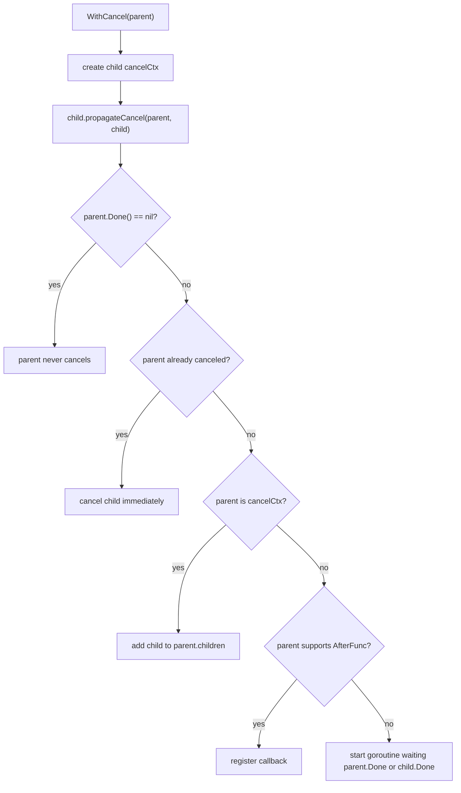

#go #concurrency #stdlib

相关笔记：[[go-channel-source]] | [[go-gmp-source]] | [[go-gc-source]] | [[context]]

# Context 源码导读

## 概述

`context.Context` 不是 runtime 包的一部分，但它是 Go 服务端并发控制的事实标准：用一棵取消树把 request scope、deadline、cancel cause 和 value 传递到 goroutine、RPC、数据库、消息队列等边界。

源码入口：

```text
/opt/homebrew/Cellar/go/1.26.1/libexec/src/context/context.go
```

核心问题：
- `WithCancel` 如何把 child 挂到 parent？
- parent cancel 后如何传播到所有 children？
- 什么时候 cancel 传播不需要新 goroutine，什么时候需要？
- 为什么必须调用返回的 `cancel`？

## 核心接口

```go
type Context interface {
    Deadline() (deadline time.Time, ok bool)
    Done() <-chan struct{}
    Err() error
    Value(key any) any
}
```

语义：
- `Deadline`：是否有截止时间。
- `Done`：取消或超时后关闭的 channel。
- `Err`：取消原因，通常是 `context.Canceled` 或 `context.DeadlineExceeded`。
- `Value`：只用于 request-scoped metadata，不应当作为可选参数传递机制。

## 核心结构

### emptyCtx

`Background()` 和 `TODO()` 的底层是不可取消、无 deadline、无 value 的根 context。它们的 `Done()` 返回 nil。

nil `Done` 很重要：表示永远不会取消，select 中监听 nil channel 会永久阻塞，因此传播逻辑会特殊处理。

### valueCtx

`WithValue` 创建 value 链表。查找 value 时会从当前 context 沿 parent 一层层向上找。

因此：
- value 层级太深会增加查找成本。
- key 应该使用不可导出的自定义类型，避免冲突。
- 不要把大对象、可变对象、可选参数塞进 context。

### cancelCtx

核心结构：

```go
type cancelCtx struct {
    Context

    mu       sync.Mutex
    done     atomic.Value
    children map[canceler]struct{}
    err      atomic.Value
    cause    error
}
```

关键字段：
- `Context` 是 parent。
- `done` 是 lazy 创建的 `chan struct{}`，第一次调用 `Done()` 才创建。
- `children` 保存直接子节点。
- `err` 是首次取消原因，atomic 读优化热路径。
- `cause` 是 `WithCancelCause`/`WithDeadlineCause` 的原因。

### timerCtx

`WithDeadline` 和 `WithTimeout` 使用 `timerCtx`：

```go
type timerCtx struct {
    cancelCtx
    timer *time.Timer
    deadline time.Time
}
```

它既是 cancel tree 的一个节点，也持有 timer。手动调用 cancel 可以停止 timer 并从 parent children 中移除自己。

## 核心链路



## 源码导读

### Done 是 lazy 的

```go
func (c *cancelCtx) Done() <-chan struct{} {
    d := c.done.Load()
    if d != nil {
        return d.(chan struct{})
    }
    c.mu.Lock()
    defer c.mu.Unlock()
    d = c.done.Load()
    if d == nil {
        d = make(chan struct{})
        c.done.Store(d)
    }
    return d.(chan struct{})
}
```

设计动机：
- 很多 context 被创建但从未监听 `Done()`。
- lazy 创建可以减少 channel 分配。
- cancel 时如果还没创建 done，会存入全局已关闭 channel `closedchan`。

### Err 用 atomic 优化

```go
func (c *cancelCtx) Err() error {
    if err := c.err.Load(); err != nil {
        <-c.Done()
        return err.(error)
    }
    return nil
}
```

`Err()` 可能在热路径被频繁调用，atomic load 比 mutex 便宜。看到非 nil err 后再等待 Done 关闭，保证 `Err` 和 `Done` 的可见性顺序。

### propagateCancel

`propagateCancel` 是整个包最值得读的函数：

```go
func (c *cancelCtx) propagateCancel(parent Context, child canceler)
```

主线：
1. 保存 parent：`c.Context = parent`。
2. 如果 `parent.Done() == nil`，说明 parent 永不取消，直接返回。
3. 如果 parent 已经取消，立刻 cancel child。
4. 如果能找到 parent 的 `*cancelCtx`，把 child 加入 `parent.children`。
5. 如果 parent 支持 `AfterFunc`，注册一个取消回调。
6. 否则启动一个 goroutine 等待 parent 或 child done。

最重要的性能点：当 parent 是标准库派生出来的 cancel context 时，不会为每个 child 创建 goroutine，而是维护 parent -> children map。

### cancel

```go
func (c *cancelCtx) cancel(removeFromParent bool, err, cause error)
```

主线：
1. 如果已经取消，直接返回，保证幂等。
2. 设置 `err` 和 `cause`。
3. 关闭 done channel；如果 done 还没创建，存入 `closedchan`。
4. 遍历 children，递归 cancel。
5. 清空 children，释放引用。
6. 如果 `removeFromParent`，从 parent 的 children map 中移除自己。

这解释了为什么要调用 cancel：不是只为了通知下游，也是为了从 parent 中摘掉 child、停止 timer、释放引用。

### WithDeadline / WithTimeout

`WithTimeout(parent, d)` 本质是 `WithDeadline(parent, time.Now().Add(d))`。

`WithDeadlineCause` 的关键逻辑：
- 如果 parent deadline 更早，直接退化为 `WithCancel(parent)`。
- 如果 deadline 已经过期，立即 cancel。
- 否则创建 timer，到期时调用 cancel。

调用方必须 `defer cancel()`：

```go
ctx, cancel := context.WithTimeout(parent, time.Second)
defer cancel()
```

即使正常返回，也要 cancel，这样 timer 和 parent-child 关系能及时释放。

### WithCancelCause / Cause

`WithCancelCause` 允许保留更具体的业务错误：

```go
ctx, cancel := context.WithCancelCause(parent)
cancel(errors.New("upstream quota exceeded"))
err := context.Cause(ctx)
```

注意：
- `ctx.Err()` 仍然返回标准错误。
- `context.Cause(ctx)` 返回更具体的 cause。
- cause 适合跨 goroutine 传递可观测错误原因。

### WithoutCancel

`WithoutCancel(parent)` 返回一个指向 parent 的 context，但：
- 无 deadline。
- `Done()` 为 nil。
- `Err()` 为 nil。
- `Cause()` 为 nil。

适合明确要脱离 request cancel 的后台任务，但要谨慎使用。它会切断取消传播，如果后台任务没有自己的 deadline，可能制造泄漏。

## 事故排查

### 忘记 cancel 导致资源泄漏

典型代码：

```go
ctx, cancel := context.WithTimeout(parent, time.Second)
_ = cancel
return client.Call(ctx)
```

问题：
- timer 可能等到超时才释放。
- child 仍挂在 parent children map。
- parent 链路持有的 value 可能被延长生命周期。

修复：

```go
ctx, cancel := context.WithTimeout(parent, time.Second)
defer cancel()
return client.Call(ctx)
```

排查：

```bash
rg -n 'WithCancel|WithTimeout|WithDeadline|WithCancelCause|WithTimeoutCause' --glob '*.go'
```

重点看是否所有路径都调用了 cancel。

### deadline 没传到底层

症状：
- 上游请求已经超时，下游 DB/RPC 仍然执行。
- goroutine profile 中大量 I/O 调用堆积。

排查：
- 检查函数签名是否把 `ctx context.Context` 作为第一个参数传下去。
- DB 使用 `QueryContext/ExecContext`，HTTP 使用 `NewRequestWithContext`。
- 避免中途用 `context.Background()` 断链。

### context value 滥用

问题：
- 把可选参数塞进 context，导致依赖关系不透明。
- value 持有大对象，增加 retention。
- key 使用 string，跨包冲突。

推荐：

```go
type traceIDKey struct{}

func WithTraceID(ctx context.Context, traceID string) context.Context {
    return context.WithValue(ctx, traceIDKey{}, traceID)
}
```

### 取消风暴

parent cancel 会递归 cancel 所有 child。如果一个 parent 下挂了大量 child，cancel 会在持锁和递归传播上产生明显成本。高并发服务要避免把过多长生命周期任务都挂在同一个 request context 下。

## 面试要点

### Q: Context 的核心作用是什么？

A: Context 用来在 API 边界传递 request scope 的取消、deadline 和少量 metadata。它解决的是 goroutine 生命周期和跨调用链取消传播，不是通用参数包。

### Q: `WithCancel` 的 child 是怎么被 parent 取消的？

A: `WithCancel` 创建 `cancelCtx` 后调用 `propagateCancel`。如果 parent 是标准库 cancel context，child 会被加入 parent 的 `children` map；parent cancel 时遍历 children 递归取消。如果 parent 不是可识别的 cancel context，可能注册 `AfterFunc` 或启动 goroutine 监听 parent.Done。

### Q: 为什么必须调用 cancel？

A: cancel 不只是关闭 Done。它还会从 parent 的 children map 中移除当前节点、停止 timer、释放 children 引用、设置 err/cause。忘记 cancel 会延长 timer、value 和 child context 的生命周期。

### Q: `Done()` 为什么 lazy 创建？

A: 很多 context 从未被 select 监听。如果每次 `WithCancel` 都创建 channel，会有不必要分配。`cancelCtx.Done()` 首次调用才创建 channel；如果取消时还没创建，就直接存入一个复用的 closed channel。

### Q: `Err()` 和 `Cause()` 的区别是什么？

A: `Err()` 返回标准状态错误，通常是 `context.Canceled` 或 `context.DeadlineExceeded`。`Cause()` 返回取消时设置的具体业务原因，适合诊断和跨 goroutine 传播更细的错误。

### Q: 什么时候 context 会额外创建 goroutine？

A: 当 parent 有 Done，但不是标准库能识别的 `cancelCtx`，也不支持 `AfterFunc` 时，`propagateCancel` 会启动 goroutine 等待 parent.Done 或 child.Done。标准库派生的 context 通常通过 children map 传播，不需要每个 child 一个 goroutine。

### Q: `WithoutCancel` 有什么风险？

A: 它会切断 parent 的取消和 deadline。适合少数确实要脱离 request 生命周期的后台任务，但必须自己设置新的 deadline 或退出条件，否则容易制造 goroutine 泄漏。
