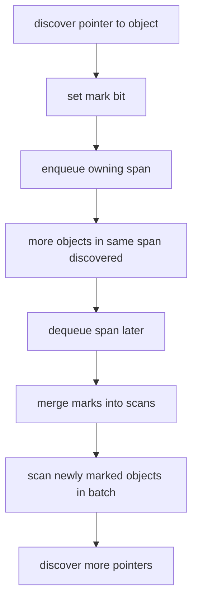

#go #runtime #gc

相关笔记：[[go-gc-source]] | [[go-gmp-source]] | [[go-slice-source]] | [[go-map-source]] | [[gc]]

# Go GC 新旧实现对比

## 概述

这里的“旧 GC / 新 GC”特指 Go 当前源码中的传统标记扫描路径和 Green Tea GC 标记扫描路径，不是说 Go 从“完全 STW GC”变成“并发 GC”的那段早期历史。

在 Go 1.26.1 源码里，两个文件通过 build tag 互斥：

```text
/opt/homebrew/Cellar/go/1.26.1/libexec/src/runtime/mgcmark_nogreenteagc.go
/opt/homebrew/Cellar/go/1.26.1/libexec/src/runtime/mgcmark_greenteagc.go
```

对应：

```go
//go:build !goexperiment.greenteagc
//go:build goexperiment.greenteagc
```

实验开关定义在：

```text
/opt/homebrew/Cellar/go/1.26.1/libexec/src/internal/goexperiment/flags.go
```

```go
// GreenTeaGC enables the Green Tea GC implementation.
GreenTeaGC bool
```

## 共同基础：没有变的部分

无论是否启用 Green Tea，Go GC 的大框架仍然是：
- concurrent mark-sweep。
- non-generational。
- non-moving。
- 有 write barrier。
- 有 sweep termination 和 mark termination STW。
- 有 pacer 和 mutator assist。
- 与 GMP/P 本地 GC work cache 深度绑定。

Green Tea 主要改变的是“标记阶段如何组织待扫描对象以提高 locality”，不是改变 Go GC 的语义模型。

## 旧路径：传统 object workbuf 扫描

`mgcmark_nogreenteagc.go` 的核心特征：

```go
//go:build !goexperiment.greenteagc

func tryDeferToSpanScan(p uintptr, gcw *gcWork) bool {
    return false
}

func gcUsesSpanInlineMarkBits(_ uintptr) bool {
    return false
}
```

解释：
- 不启用 Green Tea 时，不会把对象 defer 到 span scan。
- 不使用 span inline mark bits。
- mark worker 主要围绕 `gcWork`、workbuf、object scan 推进。

传统路径可以简化为：

```text
discover object pointer
mark object
push object into work queue
worker pops object
scan object fields
discover more object pointers
```

优势：
- 模型直接。
- 和 Go 现有 GC 架构匹配多年。
- 行为容易推理。

问题：
- 对象扫描顺序不一定有良好局部性。
- 小对象很多且分布在相同 span 时，可能重复触碰 span/object metadata。
- workbuf LIFO 风格不一定利于把同一 span 中的对象聚合起来扫。

## 新路径：Green Tea GC

`mgcmark_greenteagc.go` 顶部注释给出了核心思想：

```text
achieve better locality during mark/scan by delaying scanning
accumulate objects to scan within the same span
scan the objects that have accumulated on the span all together
```

### 核心结构：spanInlineMarkBits

```go
type spanInlineMarkBits struct {
    scans [63]uint8
    owned spanScanOwnership
    marks [63]uint8
    class spanClass
}
```

关键点：
- `marks` 表示对象已经被发现。
- `scans` 表示对象已经被扫描。
- 两套 bitset 的差集决定哪些对象需要扫描。
- `owned` 控制某个 worker 是否拥有这个 span 的扫描权。
- `class` 保存 size class，后续可做 size-class-specific 优化。

### 延迟扫描与 span queue

Green Tea 的基本流程：



它把“发现对象”和“扫描对象”拆开：
- 发现对象时，先 mark，并把 span 放入 FIFO span queue。
- 同一 span 中后续被发现的对象可以积累。
- 真正扫描 span 时，一批对象一起扫。

这样做的收益：
- 更可能访问相邻对象。
- amortize object metadata 访问成本。
- 为 prefetch 和 SIMD 风格优化创造空间。
- 对大量小对象场景更友好。

### FIFO span queue

源码注释强调 FIFO 比 workbuf 的 LIFO 更适合积累同 span 对象：

```text
We track these spans in work queues with a FIFO policy,
unlike workbufs which have a LIFO policy.
```

直觉：
- LIFO 更像深度优先，容易马上扫刚发现的对象。
- FIFO 给同一 span 留出时间积累更多 mark。
- 等 span 出队时，批量扫描更有效。

## 对比表

| 维度 | 传统 GC mark path | Green Tea GC |
|------|-------------------|--------------|
| build tag | `!goexperiment.greenteagc` | `goexperiment.greenteagc` |
| 扫描单位 | object 为主 | span 中对象批量扫描 |
| 标记结构 | 常规 mark bits | marks + scans inline bits |
| 队列策略 | workbuf，偏 LIFO | span queue，FIFO |
| 局部性 | 取决于对象发现顺序 | 主动按 span 聚合 |
| 目标 | 正确完成并发标记 | 在正确基础上提升 locality |
| 是否分代 | 否 | 否 |
| 是否移动对象 | 否 | 否 |
| 是否取消 STW | 否 | 否 |

## 怎么启用和验证

如果当前 Go 版本支持该 experiment，可以用：

```bash
GOEXPERIMENT=greenteagc go test ./...
GOEXPERIMENT=greenteagc go test -run '^$' -bench . -benchmem ./...
```

对比基线：

```bash
GOEXPERIMENT=nogreenteagc go test -run '^$' -bench . -benchmem ./...
```

是否可用以本机 `go tool compile -help`、`go env GOEXPERIMENT` 和 `src/internal/goexperiment` 为准。不要在生产中只因为“新”就直接打开实验特性，必须有压测和回滚方案。

## 观察指标

### gctrace

```bash
GODEBUG=gctrace=1 GOEXPERIMENT=greenteagc ./server
```

看：
- GC CPU 是否下降。
- mark 阶段是否缩短。
- assist 是否减少。
- heap goal 和 live heap 是否稳定。
- pause time 是否变化。

### runtime/metrics

重点对比：

```text
/gc/scan/heap:bytes
/gc/scan/stack:bytes
/gc/pauses:seconds
/gc/cycles/total:gc-cycles
/gc/heap/live:bytes
/cpu/classes/gc/mark/assist:cpu-seconds
/cpu/classes/gc/mark/dedicated:cpu-seconds
/cpu/classes/gc/mark/idle:cpu-seconds
```

### workload 类型

Green Tea 更值得关注的 workload：
- 大量小对象。
- 指针密集对象图。
- 对象在 span 内有较好聚集。
- GC mark CPU 明显。
- assist 影响延迟。

可能收益不明显的 workload：
- 大对象为主。
- 非指针对象为主，例如大块 `[]byte`。
- 分配率低，GC 本来不是瓶颈。
- 性能瓶颈在锁、I/O、系统调用或业务 CPU。

## 事故排查角度

### 不能把 Green Tea 当成泄漏修复

如果 heap live 持续增长，Green Tea 不能解决对象仍然可达的问题。先用 heap profile 找 retention：

```bash
go tool pprof -inuse_space http://127.0.0.1:6060/debug/pprof/heap
```

常见真正根因：
- map/cache 无淘汰。
- slice 子切片持有大数组。
- goroutine 泄漏持有 request 对象。
- context value 持有大对象。

### 不能把 Green Tea 当成延迟万能药

如果 p99 高来自锁竞争、channel 阻塞、syscall、网络慢，GC 标记局部性优化不会解决。先用 trace 和 profiles 拆清楚：

```bash
go test -run TestHotPath -trace trace.out
go tool trace trace.out
```

### 实验特性上线清单

上线前至少做：
- 同一 commit、同一机器、同一流量模型 A/B。
- 记录 `GOGC/GOMEMLIMIT/GOMAXPROCS`。
- 对比 CPU、RSS、heap live、GC pause、assist CPU、p50/p99。
- 压测回归 map/slice/channel-heavy 场景。
- 准备关闭 experiment 的回滚包。

## 面试要点

### Q: Green Tea GC 是什么？

A: Green Tea 是 Go 源码中的一个 GC 标记扫描实现实验，目标是提升 mark/scan locality。它通过延迟扫描，把同一 span 内被发现的对象积累起来，再批量扫描，并使用 marks/scans 两套 bitset 和 FIFO span queue。

### Q: Green Tea 是否意味着 Go 变成分代 GC？

A: 不是。Green Tea 不等于 generational GC，也不是 moving GC。Go GC 的主框架仍是并发、非分代、非移动 mark-sweep。

### Q: 传统 mark path 和 Green Tea 的核心差异是什么？

A: 传统 path 更偏对象级 workbuf 扫描，发现对象后放入 work queue，worker 取对象扫描。Green Tea 把对象归到 span，发现对象时先 mark 并 enqueue span，后续按 span 批量扫描，改善局部性。

### Q: Green Tea 为什么可能降低 GC CPU？

A: 批量扫描同一 span 中的对象可以提高 cache locality，减少重复访问对象元数据的成本，也为 prefetch 和 size-class-specific 优化提供机会。尤其是小对象、指针密集 workload 更可能受益。

### Q: Green Tea 会消除 STW 吗？

A: 不会。Go GC 仍有 sweep termination 和 mark termination 等 STW 边界。Green Tea 主要影响并发标记扫描路径，不是取消 STW。

### Q: 怎么判断是否应该尝试 Green Tea？

A: 先确认瓶颈确实在 GC mark/assist，而不是业务 CPU、锁、I/O 或内存泄漏。然后用同一 workload A/B 对比 `gctrace`、runtime/metrics、pprof、trace 和业务 p99。实验特性上线必须可回滚。

### Q: 如果 heap live 持续增长，Green Tea 有帮助吗？

A: 没有本质帮助。heap live 增长说明对象仍然可达，需要找 retention root，例如 map/cache、slice backing array、goroutine leak、context value。GC 实现优化不能替代生命周期治理。
