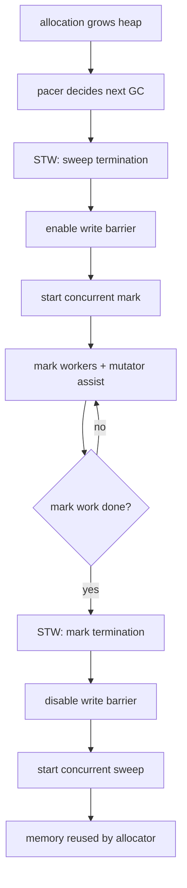

#go #runtime #gc

相关笔记：[[go-gc-old-vs-new]] | [[go-slice-source]] | [[go-map-source]] | [[go-gmp-source]] | [[gc]]

# Go GC 源码导读

## 概述

Go 的 GC 主线是并发、非分代、非移动的 mark-sweep collector。它的目标不是让 STW 彻底消失，而是在可控 CPU 开销下，把 STW 控制在很短的阶段，并通过 pacer、write barrier、mutator assist 把并发标记推进到目标速度。

源码入口：

```text
/opt/homebrew/Cellar/go/1.26.1/libexec/src/runtime/mgc.go
/opt/homebrew/Cellar/go/1.26.1/libexec/src/runtime/mgcmark.go
/opt/homebrew/Cellar/go/1.26.1/libexec/src/runtime/mgcsweep.go
/opt/homebrew/Cellar/go/1.26.1/libexec/src/runtime/mgcpacer.go
/opt/homebrew/Cellar/go/1.26.1/libexec/src/runtime/mbarrier.go
/opt/homebrew/Cellar/go/1.26.1/libexec/src/runtime/mheap.go
/opt/homebrew/Cellar/go/1.26.1/libexec/src/runtime/mspan.go
```

Green Tea GC 相关：

```text
/opt/homebrew/Cellar/go/1.26.1/libexec/src/runtime/mgcmark_greenteagc.go
/opt/homebrew/Cellar/go/1.26.1/libexec/src/runtime/mgcmark_nogreenteagc.go
/opt/homebrew/Cellar/go/1.26.1/libexec/src/internal/goexperiment/flags.go
```

## 核心概念

### 三色抽象

```text
white: not known reachable
grey:  known reachable, not fully scanned
black: known reachable, scanned
```

Go 的实现不一定显式保存“颜色对象”，但三色抽象帮助理解并发标记：
- 从 root 出发，把可达对象标记出来。
- mutator 并发运行时，写屏障维持三色不变量。
- 标记结束后，未标记对象会在 sweep 阶段回收。

### root

常见 root：
- goroutine stacks。
- global variables。
- runtime metadata。
- finalizer/special records。
- register state。

stack scanning 是 GC 成本的重要来源。goroutine 很多、栈很深、栈上指针多，都会增加 scan work。

### heap / span / object

Go allocator 把 heap 切成 spans，span 属于某个 size class 或大对象。GC 标记通常会围绕 object bitmap、span metadata、heap bitmap 进行。

这也是为什么 Green Tea GC 会尝试按 span 聚合扫描：对象在同一 span 里通常更有局部性。

## 核心链路



## 源码导读

### mgc.go：GC 周期状态机

`runtime/mgc.go` 是读 GC 的总入口。重点关注：
- `gcStart`：启动一个 GC cycle。
- `gcMarkDone`：标记工作接近完成时进入 mark termination。
- `gcMarkTermination`：STW 收尾、关闭 barrier、切换到 sweep。
- `gcBgMarkWorker`：后台标记 worker。

GC 周期大致是：

```text
_GCoff
  -> _GCmark
  -> _GCmarktermination
  -> _GCoff with concurrent sweep
```

### mgcmark.go：标记工作

关键函数：

```go
func gcDrain(gcw *gcWork, flags gcDrainFlags)
func gcDrainN(gcw *gcWork, scanWork int64) int64
func scanobject(b uintptr, gcw *gcWork)
```

`gcDrain` 是 mark worker 的核心循环。它会从 work buffer 或 span queue 中取对象，扫描对象里的指针，把新发现的对象继续标记/入队。

GC worker 类型：
- dedicated worker：专职标记。
- fractional worker：按比例使用 CPU。
- idle worker：P 空闲时帮忙标记。
- mutator assist：分配太快的 goroutine 自己帮忙做标记。

### mbarrier.go：write barrier

并发标记时，mutator 仍在修改指针。如果没有 write barrier，GC 可能漏标对象。

Go 使用 hybrid write barrier 思路，简化理解：
- 写入指针时，barrier 会把相关对象 shade。
- 确保不会出现 black object 指向 white object 而 GC 不知道的情况。
- stack 在某些阶段可以视为 grey，减少 stack write barrier 成本。

源码入口：

```text
runtime/mbarrier.go
runtime/mbitmap.go
```

### mgcpacer.go：pacer

pacer 决定什么时候启动下一轮 GC，以及本轮 GC 应该以多快速度推进。

关键输入：
- live heap。
- heap goal。
- allocation rate。
- mark work estimate。
- `GOGC`。
- `GOMEMLIMIT`。

直觉：

```text
heap goal ~= live heap * (1 + GOGC/100)
```

但在现代 Go 中，soft memory limit、pacer 估算误差、scavenge、assist ratio 都会影响最终行为。

### mutator assist

如果程序分配太快，后台 mark worker 跟不上，分配 goroutine 会被要求做一部分 GC work，这就是 assist。

线上表现：
- p99 latency 抬高。
- CPU profile 中 runtime GC 相关函数上升。
- `gctrace` 中 assist 相关时间明显。

本质是用 mutator 的时间偿还它制造的 GC work debt。

## Green Tea GC 在哪里

Go 1.26.1 源码中有两个互斥文件：

```text
mgcmark_nogreenteagc.go     //go:build !goexperiment.greenteagc
mgcmark_greenteagc.go       //go:build goexperiment.greenteagc
```

`internal/goexperiment/flags.go` 中有：

```go
// GreenTeaGC enables the Green Tea GC implementation.
GreenTeaGC bool
```

Green Tea 的主要变化是 mark/scan 的局部性，详细对比见 [[go-gc-old-vs-new]]。这里要记住：它不是把 Go 改成分代 GC，也不是移动 GC；它主要改变并发标记阶段的对象组织和扫描方式。

## 事故排查

### GODEBUG=gctrace

启动：

```bash
GODEBUG=gctrace=1 ./server
```

一行 gctrace 通常包含：
- GC 序号。
- 距进程启动时间。
- STW / concurrent mark / mark termination 等阶段时间。
- heap before/after/goal。
- P 数量。

判断方向：
- GC 频率高：分配率高、`GOGC` 太低、live heap 小但 churn 大。
- heap goal 持续上涨：live set 真在增长，或有 retention/leak。
- STW 高：root/stack 扫描、mark termination、系统压力。
- CPU 高：mark worker、assist、sweep、write barrier 成本。

### pprof heap

命令：

```bash
go tool pprof -http=:0 http://127.0.0.1:6060/debug/pprof/heap
go tool pprof -alloc_space http://127.0.0.1:6060/debug/pprof/heap
go tool pprof -inuse_space http://127.0.0.1:6060/debug/pprof/heap
```

解释：
- `alloc_space` 看累计分配，适合找 churn。
- `inuse_space` 看当前存活，适合找 retention/leak。
- `alloc_objects` 看对象数量，适合找小对象风暴。

### runtime/metrics

关键指标：

```text
/gc/cycles/total:gc-cycles
/gc/heap/live:bytes
/gc/heap/goal:bytes
/gc/heap/objects:objects
/gc/pauses:seconds
/gc/scan/heap:bytes
/gc/scan/stack:bytes
/memory/classes/heap/free:bytes
/memory/classes/heap/released:bytes
```

服务内采集这些指标，比只看 RSS 更可靠。RSS 包含 Go heap、stacks、mspan/mcache、scavenged but not released memory、cgo、mmap 等，不等于 live heap。

### GOGC 和 GOMEMLIMIT

`GOGC` 控制 heap goal 相对 live heap 的增长比例：

```bash
GOGC=100 ./server
GOGC=50 ./server
GOGC=200 ./server
```

经验：
- 降低 `GOGC`：更频繁 GC，更低 heap，更高 CPU。
- 提高 `GOGC`：更少 GC，更高 heap，可能更低 CPU。
- `GOMEMLIMIT` 是 soft limit，不是 cgroup hard limit。容器里建议显式设置，留出 non-Go heap 和系统余量。

示例：

```bash
GOMEMLIMIT=3GiB ./server
```

### 常见根因

| 症状 | 可能根因 | 排查文件 |
|------|----------|----------|
| GC CPU 高 | 小对象分配风暴、pointer-rich objects、assist 增多 | CPU profile + alloc_space |
| heap 不降 | map/cache retention、slice 子切片持大数组、goroutine stack 持引用 | heap inuse + goroutine |
| STW 偏高 | goroutine 太多、stack scan 高、root 多、系统调度抖动 | gctrace + runtime/metrics |
| RSS 高但 heap live 不高 | scavenger 未及时归还、cgo/mmap、stack、fragmentation | memory classes |

## 面试要点

### Q: Go GC 是什么类型？

A: Go 主线 GC 是并发、非分代、非移动的 mark-sweep collector。它有短 STW 阶段，但大部分标记和清扫与 mutator 并发执行。

### Q: Go GC 的主要阶段是什么？

A: 大致是 sweep termination STW、开启 write barrier、并发 mark、mark termination STW、关闭 barrier、并发 sweep。pacer 决定启动时机和标记速度，mutator assist 负责在分配太快时帮忙还 GC work debt。

### Q: write barrier 解决什么问题？

A: 并发标记期间 mutator 仍在修改指针。write barrier 确保新写入或被覆盖的指针不会让可达对象从 GC 视野中丢失，维持三色不变量。

### Q: 为什么分配太快会影响请求延迟？

A: 分配太快会让 GC 标记跟不上 heap growth，runtime 会让分配 goroutine 执行 mutator assist。assist 消耗业务 goroutine 时间，可能直接抬高请求延迟。

### Q: `GOGC` 调大一定更好吗？

A: 不一定。调大 `GOGC` 会减少 GC 频率、降低 GC CPU，但 live heap 和 RSS 可能上升，容器里可能触发 OOM。调小则降低 heap 但增加 GC CPU 和 assist 风险。

### Q: 怎么判断是内存泄漏还是正常缓存？

A: 看 live heap 是否随流量稳定后仍单调增长；看 heap profile 的 inuse 持有者；看 cache 是否有 size/TTL；对比 GC 后 heap live。如果是缓存，通常能解释 key/value 生命周期；如果是泄漏，常表现为不可控增长且 owner 不清晰。

### Q: Green Tea GC 改变了什么？

A: 它改变并发标记阶段的扫描组织方式：把对象按 span 聚合，延迟扫描以提升局部性，并使用 marks/scans 两套标记位和 FIFO span queue。它不改变 Go GC 的基本 mark-sweep 语义。
