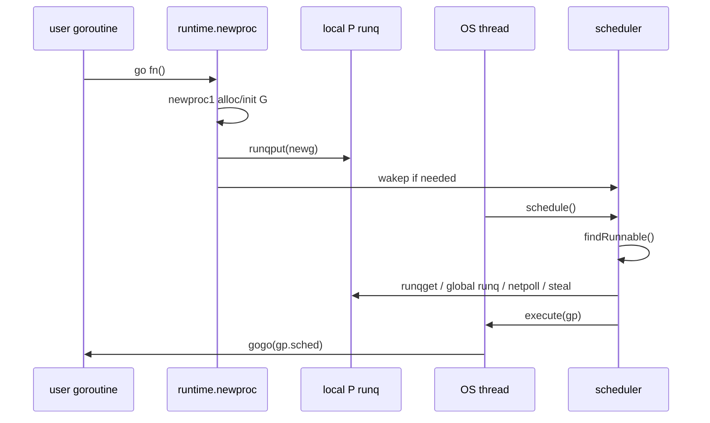

#go #runtime #scheduler

相关笔记：[[go-channel-source]] | [[go-context-source]] | [[go-gc-source]] | [[gmp-model]] | [[p-runnext]]

# GMP 调度器源码导读

## 概述

GMP 是 Go runtime 把大量 goroutine 映射到少量 OS thread 的调度模型：
- `G` 是 goroutine，保存栈、调度上下文、等待原因、状态。
- `M` 是 machine，对应 OS thread，负责真正执行代码。
- `P` 是 processor，保存运行 Go 代码所需的本地资源和 runnable queue，数量受 `GOMAXPROCS` 控制。

源码入口：

```text
/opt/homebrew/Cellar/go/1.26.1/libexec/src/runtime/runtime2.go
/opt/homebrew/Cellar/go/1.26.1/libexec/src/runtime/proc.go
```

## 核心结构

### G：可调度实体

`runtime/runtime2.go` 中的 `g` 很大，读的时候先抓主线字段：

```go
type g struct {
    stack       stack
    stackguard0 uintptr
    _panic      *_panic
    _defer      *_defer
    m           *m
    sched       gobuf
    atomicstatus atomic.Uint32
    goid        uint64
    waitreason  waitReason
    schedlink   guintptr
}
```

关键点：
- `stack` 是 goroutine 的用户栈，Go 栈可增长。
- `sched` 保存被切走时的 PC/SP/BP 等上下文，恢复运行时会用到。
- `atomicstatus` 是调度状态机核心，例如 runnable、running、waiting、syscall。
- `m` 指向当前执行它的 M。
- `schedlink` 用于把 G 串进 run queue、free list 等内部队列。

### M：OS thread 的抽象

```go
type m struct {
    g0      *g
    curg    *g
    p       puintptr
    nextp   puintptr
    oldp    puintptr
    spinning bool
    lockedg guintptr
}
```

关键点：
- `g0` 是 M 自己的调度栈，runtime 调度、栈增长、系统调用边界通常在 g0 上执行。
- `curg` 是当前正在执行的用户 G。
- `p` 是当前绑定的 P；没有 P 的 M 不能执行 Go 用户代码。
- `spinning` 表示这个 M 正在主动找活，影响是否唤醒新 M，避免过度创建线程。
- `lockedg` 支持 `runtime.LockOSThread`。

### P：调度资源与本地队列

```go
type p struct {
    id          int32
    status      uint32
    m           muintptr
    runqhead    uint32
    runqtail    uint32
    runq        [256]guintptr
    runnext     guintptr
    gcw         gcWork
}
```

关键点：
- `runq` 是 P 本地 runnable queue，减少全局锁竞争。
- `runnext` 是一个特殊 fast lane，常用于让新唤醒的 G 尽快运行，但过度使用会影响公平性。
- `gcw` 是每个 P 的 GC work cache，调度器和 GC 紧密耦合。
- P 还持有 timer、defer pool、sudog cache、mcache 等本地资源。

## 核心链路



## 源码导读

### go 语句如何创建 G

入口在 `runtime/proc.go`：

```go
func newproc(fn *funcval)
func newproc1(fn *funcval, callergp *g, callerpc uintptr, parked bool, waitreason waitReason) *g
```

阅读重点：
1. `go f()` 会被编译器 lowering 到 runtime 的 `newproc`。
2. `newproc1` 分配或复用一个 `g`，初始化栈、入口 PC、父子追踪信息。
3. 新 G 进入当前 P 的本地队列，必要时 `wakep` 唤醒或创建 M。

伪代码主线：

```go
func newproc(fn *funcval) {
    gp := getg()
    pc := sys.GetCallerPC()
    systemstack(func() {
        newg := newproc1(fn, gp, pc, false, waitReasonZero)
        pp := getg().m.p.ptr()
        runqput(pp, newg, true)
        if mainStarted {
            wakep()
        }
    })
}
```

这里用 `systemstack` 是因为调度器操作应该在 g0 栈上执行，避免用户栈移动和调度逻辑互相干扰。

### M 如何寻找可运行 G

核心函数：

```go
func schedule()
func findRunnable() (gp *g, inheritTime, tryWakeP bool)
func execute(gp *g, inheritTime bool)
```

`schedule` 是 M 的主循环入口。它不会直接盲目扫描所有 G，而是让 `findRunnable` 按优先级找活：

1. 当前 P 的 `runnext`。
2. 当前 P 的 local runq。
3. global runq。
4. network poller 已就绪的 G。
5. timer 到期。
6. GC mark worker。
7. 从其他 P work stealing。
8. 没活时 park 当前 M。

`execute` 做的事情很关键：
- 把 G 状态从 runnable 改成 running。
- 绑定 `gp.m = mp`、`mp.curg = gp`。
- 更新调度统计和 tracing。
- 通过 `gogo(&gp.sched)` 跳回用户 G 的栈和 PC。

### 本地队列、全局队列和 work stealing

核心函数：

```go
func runqput(pp *p, gp *g, next bool)
func runqget(pp *p) (gp *g, inheritTime bool)
func runqsteal(pp, p2 *p, stealRunNextG bool) *g
```

设计动机：
- 常规创建/唤醒优先进入当前 P 的本地队列，降低全局锁竞争。
- 本地队列满时，会把一批 G 转移到全局队列。
- 某个 P 没活时，从其他 P 偷取一半左右的 runnable G，提升负载均衡。
- `runnext` 可以让一个 G 被优先执行，但调度器会做公平性限制。

一个典型事故是“某些 P 很忙，某些 P 很闲”。这时要看是否有：
- 长时间运行且不可抢占的 CPU loop。
- 大量 cgo/syscall 导致 P 频繁解绑。
- `GOMAXPROCS` 配置和容器 CPU quota 不匹配。
- 单个热点 goroutine 持有锁导致其他 G 都阻塞。

### syscall 与阻塞

Go 调度器要处理两类阻塞：
- Go runtime 可见的阻塞：channel、mutex、netpoll、timer，可以把 G park，M 继续找其他 G。
- OS 级阻塞：syscall/cgo 可能让 M 卡住，runtime 需要把 P 从 M 上解绑，交给其他 M 继续执行 Go 代码。

核心思想：

```text
G enters syscall
M may block in kernel
P is detached and reused by another M
G exits syscall
runtime tries to reacquire a P
```

这就是为什么大量阻塞 syscall 不一定直接卡死所有 goroutine，但会增加线程数量、调度延迟和上下文切换成本。

### 抢占

Go 早期主要依赖协作式抢占，现代 Go 有异步抢占。源码中可以关注：

```text
runtime/preempt.go
runtime/proc.go
runtime/stack.go
```

关键点：
- `sysmon` 会观察长时间运行的 G，并设置抢占信号。
- 函数序言、栈检查、异步信号都可能成为抢占点。
- 仍然要避免写无函数调用、无安全点、长时间持锁的 tight loop。

## 事故排查

### goroutine 爆炸

常见根因：
- channel send/recv 永久阻塞。
- context 没有 cancel，子 goroutine 无退出路径。
- worker pool 无上限。
- timer/ticker 没 stop，长期泄漏。

命令：

```bash
curl -s 'http://127.0.0.1:6060/debug/pprof/goroutine?debug=2' > goroutine.txt
rg -n 'chan send|chan receive|select|context|time\\.Ticker' goroutine.txt
```

判断方式：
- 如果大量 goroutine 堆在同一行 `chan send`，优先查 consumer 是否退出。
- 如果堆在 `<-ctx.Done()` 之外的 I/O，查 deadline 是否传到底层。
- 如果很多 goroutine 在 `time.Sleep` 或 ticker loop，查生命周期管理。

### 调度延迟高

命令：

```bash
GODEBUG=schedtrace=1000,scheddetail=1 ./server
```

重点看：
- `gomaxprocs` 是否符合容器 CPU。
- `idleprocs` 是否长期为 0。
- `threads` 是否异常高。
- runnable goroutine 是否持续堆积。
- 是否有大量 syscall/cgo。

### CPU 高但吞吐低

排查顺序：
1. CPU profile 看热点是不是业务循环、锁竞争、runtime 调度、GC。
2. block profile 看 goroutine 是否大量阻塞在 channel/mutex。
3. mutex profile 看锁持有时间。
4. trace 看 runnable latency 和 network poller。

命令：

```bash
go test ./... -run '^$' -bench . -cpuprofile cpu.out
go tool pprof cpu.out
go test ./... -run TestHotPath -trace trace.out
go tool trace trace.out
```

## 面试要点

### Q: GMP 中 G、M、P 分别是什么？

> [!question]- 参考答案（点击展开）
>
> G 是 goroutine 的调度实体，M 是 OS thread，P 是执行 Go 代码需要的 processor 资源和本地队列。M 必须绑定 P 才能运行 Go 代码，G 会在 P 的本地队列、全局队列、netpoll、timer、GC worker 等来源之间流转。

### Q: `go f()` 之后发生了什么？

> [!question]- 参考答案（点击展开）
>
> 编译器把 `go f()` lowering 到 `runtime.newproc`。runtime 在 g0 栈上调用 `newproc1` 初始化一个 G，把它放入当前 P 的本地队列，必要时唤醒 M。某个 M 后续在 `schedule -> findRunnable -> execute` 中取到这个 G，再通过 `gogo` 恢复到 G 的栈和入口 PC 执行。

### Q: 为什么需要 P 的本地 run queue？

> [!question]- 参考答案（点击展开）
>
> 如果所有 goroutine 都放全局队列，每次创建、唤醒、调度都要抢全局锁。P 的本地队列把大多数操作局部化，降低锁竞争；本地队列满或负载不均时，再通过全局队列和 work stealing 平衡。

### Q: work stealing 解决什么问题？

> [!question]- 参考答案（点击展开）
>
> 当某个 P 没有 runnable G，而其他 P 的本地队列积压时，空闲 P 会尝试从其他 P 偷一批 G。这样避免某些线程闲着、某些线程排队过长，提高整体吞吐和公平性。

### Q: goroutine 阻塞为什么不一定阻塞 OS thread？

> [!question]- 参考答案（点击展开）
>
> channel、mutex、netpoll、timer 等 runtime 可见阻塞会 park 当前 G，M 可以继续执行其他 G。只有 syscall/cgo 这类 OS 级阻塞可能卡住 M，此时 runtime 会尽量解绑 P，让其他 M 继续使用这个 P 跑 Go 代码。

### Q: 什么情况下调度器会成为性能瓶颈？

> [!question]- 参考答案（点击展开）
>
> 大量 goroutine 高频创建销毁、海量 runnable G、channel/mutex 热点、频繁 syscall/cgo、`GOMAXPROCS` 和 CPU quota 不匹配、长时间不可抢占 CPU loop，都可能造成调度延迟或线程膨胀。

### Q: 怎么排查 goroutine 泄漏？

> [!question]- 参考答案（点击展开）
>
> 先抓 goroutine profile，看堆栈聚集点；再按阻塞类型分类：channel send/receive、select、context、timer、I/O。结合业务 owner 找到缺失的 cancel、未关闭的 channel、无界 worker 或未 stop 的 ticker。
