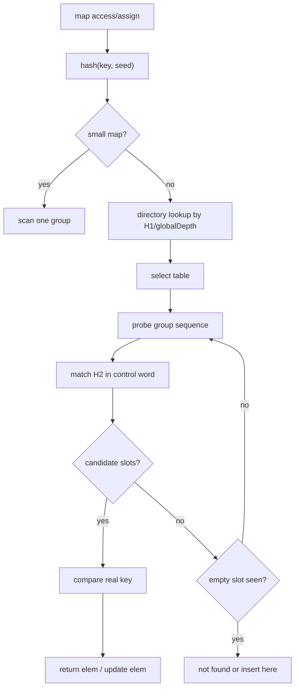

#go #runtime #map

相关笔记：[[go-map-old-vs-new]] | [[go-slice-source]] | [[go-gc-source]] | [[map-internals]]

# Map 源码导读

## 概述

Go 1.24+ 的 map 实现已经不是传统 `hmap/bmap/overflow bucket` 主线，而是迁移到了 `internal/runtime/maps`：整体设计基于 Swiss Table，并结合 Go 自己的迭代语义、写并发检测、小 map 优化和可增量增长需求。

源码入口：

```text
/opt/homebrew/Cellar/go/1.26.1/libexec/src/runtime/map.go
/opt/homebrew/Cellar/go/1.26.1/libexec/src/runtime/map_fast32.go
/opt/homebrew/Cellar/go/1.26.1/libexec/src/runtime/map_fast64.go
/opt/homebrew/Cellar/go/1.26.1/libexec/src/runtime/map_faststr.go
/opt/homebrew/Cellar/go/1.26.1/libexec/src/internal/runtime/maps/map.go
/opt/homebrew/Cellar/go/1.26.1/libexec/src/internal/runtime/maps/table.go
/opt/homebrew/Cellar/go/1.26.1/libexec/src/internal/runtime/maps/group.go
```

## 核心结构

### 术语

`internal/runtime/maps/map.go` 顶部注释定义了当前实现的核心术语：

| 术语 | 含义 |
|------|------|
| Slot | 一个 key/element pair 的存储位置 |
| Group | 8 个 slot 加一个 control word |
| Control word | 8 字节元数据，每个 byte 表示对应 slot 的状态和 H2 hash |
| H1 | hash 的高位，用于 group/table probe |
| H2 | hash 的低 7 位，用于 group 内快速过滤 |
| Table | 一个完整的 Swiss Table hash table |
| Map | 顶层 map，包含 0 个或多个 table |
| Directory | table 指针数组，用 hash 高位选择 table |

### Map

```go
type Map struct {
    used       uint64
    seed       uintptr
    dirPtr     unsafe.Pointer
    dirLen     int
    globalDepth uint8
    globalShift uint8
    writing    uint8
    tombstonePossible bool
    clearSeq   uint64
}
```

关键字段：
- `used` 是元素数，`len(m)` 依赖它，因此必须放在结构体第一个字段。
- `seed` 是每个 map 独立的 hash seed，减少 hash collision attack 和固定迭代模式。
- `dirPtr/dirLen` 是 table directory；小 map 时可直接指向单个 group。
- `globalDepth/globalShift` 控制 directory lookup 使用多少 hash 高位。
- `writing` 用于检测并发写，多个 writer 会触发 fatal。
- `tombstonePossible` 帮助优化没有 tombstone 的情况。
- `clearSeq` 用于迭代期间检测 clear。

### table

```go
type table struct {
    used       uint16
    capacity   uint16
    growthLeft uint16
    localDepth uint8
    index      int
    groups     groupsReference
}
```

关键字段：
- `used` 是该 table 内的已使用 slot 数。
- `capacity` 是 slot 总数，必须是 2 的幂并按 group 对齐。
- `growthLeft` 是还能插入多少 slot 才需要 rehash。
- `localDepth` 是 extendible hashing 中这个 table 自己的深度。
- `index` 是 table 在 directory 中第一次出现的位置。
- `groups` 指向 group 数组。

### control word

`group.go` 定义了 slot 状态：

```go
const (
    ctrlEmpty   ctrl = 0b10000000
    ctrlDeleted ctrl = 0b11111110
)
```

full slot 的最高位为 0，低 7 位保存 H2：

```text
empty:   1 0 0 0 0 0 0 0
deleted: 1 1 1 1 1 1 1 0
full:    0 h h h h h h h
```

查找时可以把输入 key 的 H2 和一个 group 的 8 个 control byte 并行比较，先快速过滤候选 slot，再做真正的 key equality。H2 只有 7 位，所以会有 false positive，但最终一定会比较 key。

## 核心链路



## 源码导读

### runtime/map.go 现在主要是 wrapper

当前版本的 `runtime/map.go` 会导入：

```go
import "internal/runtime/maps"
```

并通过 linkname 暴露编译器和反射需要的入口：

```go
func mapaccess1(t *abi.MapType, m *maps.Map, key unsafe.Pointer) unsafe.Pointer
func mapaccess2(t *abi.MapType, m *maps.Map, key unsafe.Pointer) (unsafe.Pointer, bool)
func mapassign(t *abi.MapType, m *maps.Map, key unsafe.Pointer) unsafe.Pointer
```

也就是说，真正的查找、插入、删除、迭代逻辑在 `internal/runtime/maps` 中。

### small map optimization

`NewMap` 中有一个重要分支：

```go
if hint <= abi.MapGroupSlots {
    return m
}
```

含义：
- `abi.MapGroupSlots` 当前是 8。
- 小 map 可以直接放在一个 group 中。
- 如果 make hint 小于等于 8，不急着分配完整 table。
- 第一次 assignment 时再按需要初始化 group。

这也是为什么非常小的 map 和较大的 map 行为成本不同。

### lookup

lookup 主线：

1. 用 map 的 `seed` 计算 key hash。
2. 拆成 H1 和 H2。
3. 小 map 直接扫描 group。
4. 大 map 用 H1 的高位在 directory 中选 table。
5. 在 table 内按 quadratic probing 找 group。
6. 每个 group 先用 control word 匹配 H2。
7. 对 H2 命中的 slot 做真正 key equality。
8. 遇到 empty slot 表示 key 不存在。

为什么要 H2：
- 直接比较 key 可能很贵，例如 string key。
- H2 可以用位运算一次筛掉一个 group 中大多数不可能的 slot。
- H2 false positive 概率约为 1/128，但 false positive 后还有 key equality 兜底。

### assign

assign 比 lookup 多几件事：

1. 检测并发写：`writing` 标志会在写期间切换。
2. 找到已有 key 时返回 elem pointer，由调用方写入 value。
3. 找不到 key 时优先复用 tombstone，否则使用 empty slot。
4. 如果 `growthLeft` 不够，触发 table grow 或 split。
5. 插入 key/value 时要考虑是否含指针，走对应 typed memory 操作和 write barrier。

语言层：

```go
m[k] = v
```

runtime 层接近：

```go
elem := mapassign(mapType, mapPtr, &k)
typedmemmove(elemType, elem, &v)
```

这也是为什么 map 的 value 不能直接取地址：插入和扩容可能移动存储位置，runtime 只在赋值这一刻暴露内部 slot pointer。

### delete 与 tombstone

开放寻址表删除时不能随便把 slot 标记为 empty。原因是 probe sequence 遇到 empty 就停止，如果中间删除成 empty，后面的 key 会查不到。

因此当前实现会用 tombstone：
- 如果删除位置后续 probe 仍可能依赖它，就标记 deleted。
- 插入时优先复用 deleted。
- tombstone 太多会影响查找，rehash/grow 时清理。

### grow：为什么需要多个 table

Swiss Table 的 probe sequence 依赖 group 数量。table 扩容时，旧 slot 必须按新容量重新排列。为了避免一次扩容整个巨大 map，Go 在顶层 Map 中引入多个 table：

```text
Map
  directory
    00 -> table A
    01 -> table A
    10 -> table B
    11 -> table C
```

使用 extendible hashing：
- `globalDepth` 表示 directory 用多少 hash bit。
- `localDepth` 表示 table 自己的深度。
- 小 table grow 时可以原地替换成更大 table。
- table 超过 `maxTableCapacity` 后 split 成两个 table。
- 如果 `localDepth == globalDepth`，split 时需要扩大 directory。

当前源码中：

```go
const maxTableCapacity = 1024
```

这个值限制单次 grow 的最大搬迁规模，降低尾延迟。

### iteration

Go map 迭代语义比很多语言宽松但实现复杂：
- 迭代顺序 unspecified，runtime 会显式随机化。
- 迭代期间新增 entry 可能出现，也可能不出现。
- 迭代期间删除未访问 entry，不应该再返回。
- 同一个 entry 不能返回两次。
- 迭代期间 value 更新，需要尽量返回最新值。

当前实现为了满足这些语义，在 grow 期间可能继续遍历旧 table，同时回到新 table 查询 key 的最新状态。面试不需要背所有细节，但要知道“map 迭代复杂是因为 grow + mutation + 不重复返回 + 最新值语义叠加”。

## 事故排查

### concurrent map writes

典型 panic：

```text
fatal error: concurrent map writes
fatal error: concurrent map read and map write
```

根因：
- 普通 map 不是并发安全容器。
- runtime 的 `writing` 标志只能检测一部分并发写/读写错误，不是同步机制。
- 即使没有 panic，也可能是数据竞争，必须用 race detector 查。

排查：

```bash
go test ./... -race
rg -n 'map\\[|sync\\.Map|RWMutex' .
```

修复策略：
- 单 owner goroutine + channel 串行化。
- `sync.RWMutex` 保护普通 map。
- 读多写少且 key 生命周期稳定时考虑 copy-on-write。
- key 独立、生命周期长、需要 lock-free-ish API 时才考虑 `sync.Map`。

### map 内存不降

可能原因：
- map grow 后容量不会因为 delete 自动缩小。
- tombstone 和 table 容量可能保留。
- key/value 持有大对象指针。
- map 长生命周期导致对象一直可达。

排查：

```bash
go tool pprof -http=:0 http://127.0.0.1:6060/debug/pprof/heap
go tool pprof -inuse_space http://127.0.0.1:6060/debug/pprof/heap
```

修复：
- 周期性重建 map：创建新 map，把仍需保留的 entry copy 过去。
- value 不直接持有大对象，改为 ID 或弱生命周期缓存。
- 对 cache 增加 size/TTL/eviction。

### string key 热点

症状：
- CPU profile 中 hash/string compare 成本高。
- map access 处于热路径。

优化方向：
- 避免在热路径构造临时 string。
- 预先 intern 或映射成 integer ID。
- 减少复合 key 序列化。
- 用结构体 key 时确保字段都是可比较且布局合理。

## 面试要点

### Q: 当前 Go map 的底层还是 hmap/bmap 吗？

A: Go 1.24+ 当前实现主线已经迁到 `internal/runtime/maps`，使用 Swiss Table 风格的 `Map/Table/Group/Control word/Directory`。`runtime/map.go` 更多是 wrapper 和 linkname 入口。旧的 `hmap/bmap/overflow bucket` 是 Go 1.23 及更早的经典实现模型。

### Q: Swiss Table 的核心优化是什么？

A: 每个 group 有 8 个 slot 和 8 字节 control word。control byte 保存 slot 状态和 hash 低 7 位 H2。lookup 时先用位运算在一个 group 内并行比较 8 个 H2，快速筛候选 slot，再做真正 key equality，减少随机访问和无谓 key 比较。

### Q: 新 map 为什么还需要 directory 和多个 table？

A: 单个 Swiss Table 扩容时要重排整个 table。为了控制单次 grow 成本，Go 把大 map 拆成多个 table，并用 extendible hashing 的 directory 选择 table。这样可以按 table 局部 grow 或 split，降低尾延迟。

### Q: map 删除为什么需要 tombstone？

A: 开放寻址 probe 遇到 empty 就停止。如果删除中间 slot 时直接置 empty，后续冲突链上的 key 会查不到。tombstone 表示这里曾经有元素，probe 需要继续；插入可复用 tombstone，rehash/grow 时清理。

### Q: 为什么不能取 map value 的地址？

A: map 内部 slot 可能因为 grow、split、rehash 移动；runtime 只在 `mapassign` 返回时短暂暴露 elem pointer 给赋值路径。语言层禁止对 `m[k]` 取地址，避免持有悬空内部指针。

### Q: map 并发读写为什么危险？

A: 普通 map 没有并发同步。写入期间可能改变控制字、slot、table/directory、grow 状态；并发读写会破坏这些不变量。runtime 会检测部分并发写并 fatal，但这不是数据竞争保护，正确做法是加锁、串行 owner 或换并发容器。

### Q: 删除大量 key 后 map 会自动缩容吗？

A: 普通 map 不会因为 delete 自动缩容。容量、table、tombstone 和持有的 key/value 对象可能继续保留。长生命周期大 map 需要重建或设计 eviction。
