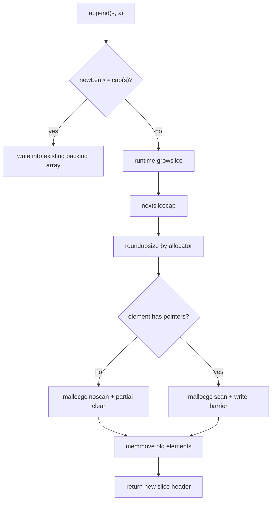

#go #runtime #memory

相关笔记：[[go-gmp-source]] | [[go-map-source]] | [[go-gc-source]] | [[slice]]

# Slice 源码导读

## 概述

slice 是 Go 中最常见的动态序列结构。它本身不是数组，而是一个三字段 header：指向底层数组的指针、长度、容量。理解 slice 的关键不是背 API，而是看清楚：
- header 复制是值复制，底层数组可能共享。
- `append` 可能原地写，也可能触发 `growslice` 分配新数组。
- 扩容容量会受增长公式和 allocator size class 共同影响。
- 指针元素和非指针元素走不同的清零与 GC barrier 路径。

源码入口：

```text
/opt/homebrew/Cellar/go/1.26.1/libexec/src/runtime/slice.go
```

## 核心结构

`runtime/slice.go` 中的内部表示：

```go
type slice struct {
    array unsafe.Pointer
    len   int
    cap   int
}
```

对应到语言层：

```go
s := make([]int, 3, 8)
```

可以理解为：

```text
slice header
+-------+-----+-----+
| array | len | cap |
+-------+-----+-----+
    |
    v
backing array: [0][0][0][?][?][?][?][?]
```

## 核心链路



## 源码导读

### make slice

入口：

```go
func makeslice(et *_type, len, cap int) unsafe.Pointer {
    mem, overflow := math.MulUintptr(et.Size_, uintptr(cap))
    if overflow || mem > maxAlloc || len < 0 || len > cap {
        panicmakeslicelen()
    }
    return mallocgc(mem, et, true)
}
```

重点：
- `len > cap` 会 panic。
- 分配大小是 `element size * cap`。
- 对含指针元素，allocator 需要知道类型，GC 才能扫描。
- `make([]T, len)` 的 cap 默认等于 len。

### append 扩容入口

核心函数：

```go
func growslice(oldPtr unsafe.Pointer, newLen, oldCap, num int, et *_type) slice
```

源码注释说明了调用约定：
- `newLen = oldLen + num`。
- `oldCap` 是原容量。
- 返回新的 `array/len/cap`。
- `[0, oldLen)` 会 copy 到新数组。
- `[oldLen, newLen)` 由调用方写入。
- `[newLen, newCap)` 会清零。

这也是为什么 `append` 的编译器 lowering 很重要：调用 `growslice` 后，编译器生成的代码会继续把新增元素写进返回的新数组。

### 扩容容量怎么算

Go 1.26.1 源码中的 `nextslicecap` 主线：

```go
func nextslicecap(newLen, oldCap int) int {
    newcap := oldCap
    doublecap := newcap + newcap
    if newLen > doublecap {
        return newLen
    }

    const threshold = 256
    if oldCap < threshold {
        return doublecap
    }
    for {
        newcap += (newcap + 3*threshold) >> 2
        if uint(newcap) >= uint(newLen) {
            break
        }
    }
    if newcap <= 0 {
        return newLen
    }
    return newcap
}
```

准确说法：
- 如果一次 append 后的 `newLen` 超过 `2 * oldCap`，直接用 `newLen`。
- `oldCap < 256` 时近似 2 倍增长。
- `oldCap >= 256` 后平滑过渡到约 1.25 倍增长。
- 最终 cap 还会被 `roundupsize` 调整到 allocator size class，因此实际 cap 可能大于公式结果。

不要在面试里说“slice 永远 2 倍扩容”或“1024 后 1.25 倍”。那是旧版本常见说法，不适合当前源码。

### 指针元素和非指针元素

`growslice` 中有分支：

```go
if !et.Pointers() {
    p = mallocgc(capmem, nil, false)
    memclrNoHeapPointers(add(p, newlenmem), capmem-newlenmem)
} else {
    p = mallocgc(capmem, et, true)
    if lenmem > 0 && writeBarrier.enabled {
        bulkBarrierPreWriteSrcOnly(uintptr(p), uintptr(oldPtr), lenmem-et.Size_+et.PtrBytes, et)
    }
}
memmove(p, oldPtr, lenmem)
```

含义：
- 非指针元素用 noscan allocation，GC 不需要扫描这段数组。
- 非指针元素可以只清理 append 不会覆盖的尾部区域。
- 指针元素必须分配为可扫描对象，并且在 write barrier 开启时做 bulk barrier。
- 这就是为什么 `[]byte`、`[]int` 和 `[]*T` 对 GC 压力不一样。

### 零大小元素

源码特殊处理：

```go
if et.Size_ == 0 {
    return slice{unsafe.Pointer(&zerobase), newLen, newLen}
}
```

`[]struct{}` 这类零大小元素不会为每个元素分配真实空间，但 len/cap 语义仍然成立。

## 深入：共享底层数组

### header 复制不是深拷贝

```go
a := []int{1, 2, 3, 4}
b := a[:2]
b[0] = 100
fmt.Println(a[0]) // 100
```

`a` 和 `b` 是两个 slice header，但指向同一个 backing array。对元素的修改会互相可见。

### append 是否影响原 slice 取决于容量

```go
a := []int{1, 2, 3, 4}
b := a[:2]
b = append(b, 99)
fmt.Println(a) // [1 2 99 4]
```

因为 `b` 的 cap 足够，append 直接写入原 backing array 的第 3 个位置。

如果要阻断共享，常用写法：

```go
b := append([]int(nil), a[:2]...)
```

或 Go 1.21+：

```go
b := slices.Clone(a[:2])
```

## 事故排查

### 小切片引用大数组导致内存不释放

典型问题：

```go
func head(buf []byte) []byte {
    return buf[:10]
}
```

如果 `buf` 是几十 MB，返回的 10 bytes slice 仍然持有整个 backing array，GC 不能回收大数组。

修复：

```go
func head(buf []byte) []byte {
    out := make([]byte, 10)
    copy(out, buf[:10])
    return out
}
```

排查：

```bash
go tool pprof -http=:0 http://127.0.0.1:6060/debug/pprof/heap
go tool pprof -alloc_space http://127.0.0.1:6060/debug/pprof/heap
```

重点看大对象分配点和 retained heap。

### append 造成数据串写

常见于复用 buffer 或把子 slice 传给下游：

```go
func build(prefix []byte) []byte {
    x := prefix[:0]
    x = append(x, "new"...)
    return x
}
```

如果调用方仍然使用 `prefix`，可能看到被覆盖的数据。修复方式是明确 ownership：要么约定函数会复用入参，要么 clone。

### 频繁扩容导致 CPU 和分配上升

症状：
- alloc/op 很高。
- heap profile 中 `runtime.growslice` 或调用点明显。
- GC 次数增加。

优化：

```go
items := make([]Item, 0, expected)
```

不要盲目预分配巨大容量。容量估算过大会增加 RSS 和 GC 扫描成本，尤其是 `[]*T`。

## 面试要点

### Q: slice 的底层结构是什么？

> [!question]- 参考答案（点击展开）
>
> slice 是三字段 header：`array unsafe.Pointer`、`len int`、`cap int`。header 按值传递，但底层数组可能共享，所以修改元素会影响其他共享同一 backing array 的 slice。

### Q: append 一定会分配新数组吗？

> [!question]- 参考答案（点击展开）
>
> 不一定。`newLen <= cap` 时直接写入原 backing array；容量不够才调用 `runtime.growslice` 分配新数组、复制旧元素并返回新 header。

### Q: 当前 Go 的 slice 扩容规则是什么？

> [!question]- 参考答案（点击展开）
>
> Go 1.26.1 中 `nextslicecap` 以 256 为阈值，小容量近似 2 倍；大容量用 `newcap += (newcap + 3*threshold) >> 2` 平滑过渡到约 1.25 倍；最后还会被 allocator size class round up，所以实际 cap 不一定等于公式值。

### Q: `[]byte` 和 `[]*T` 对 GC 有什么区别？

> [!question]- 参考答案（点击展开）
>
> `[]byte` 不含指针，runtime 可以用 noscan allocation，GC 不扫描元素；`[]*T` 含指针，分配时需要类型信息，GC 要扫描，扩容复制时还可能触发 bulk write barrier。

### Q: 为什么小切片会导致大内存不释放？

> [!question]- 参考答案（点击展开）
>
> slice header 的 `array` 指针仍然指向大 backing array，只要小切片存活，整个数组都被视为可达。需要 copy/clone 出一个新的小数组来断开引用。

### Q: 怎么判断 slice 是否是内存问题根因？

> [!question]- 参考答案（点击展开）
>
> 看 heap profile 的 allocation site 和 retained heap。如果某些函数只返回小 slice 但持有大 buffer，或 `runtime.growslice` 相关调用点分配很高，就需要检查子切片逃逸、append ownership、预分配策略。
