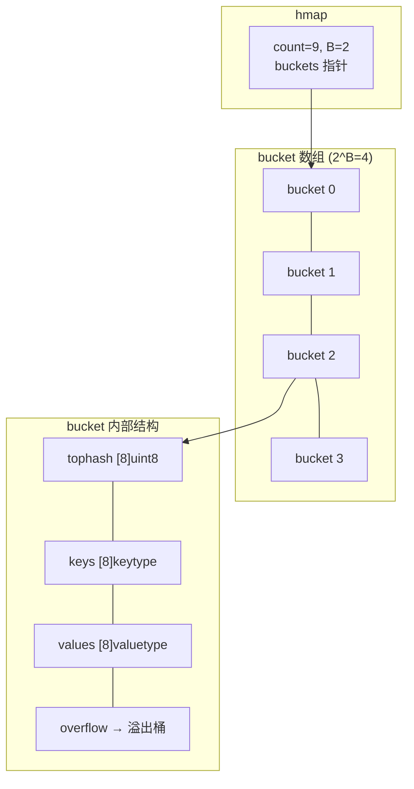
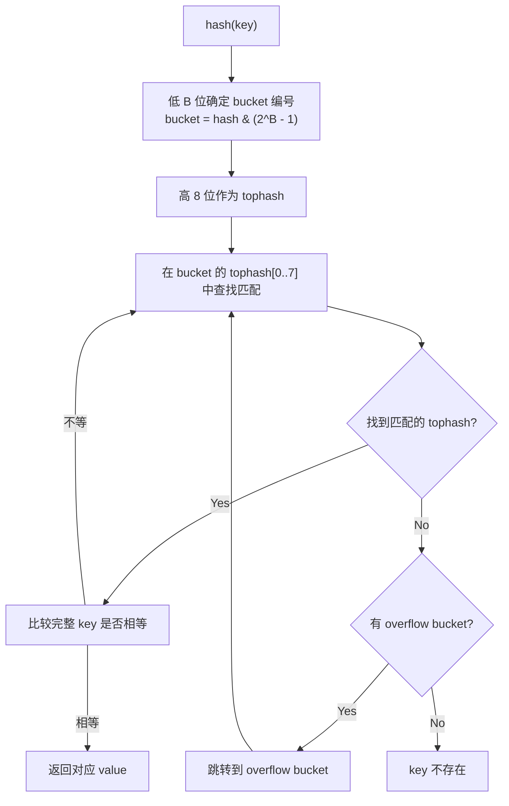
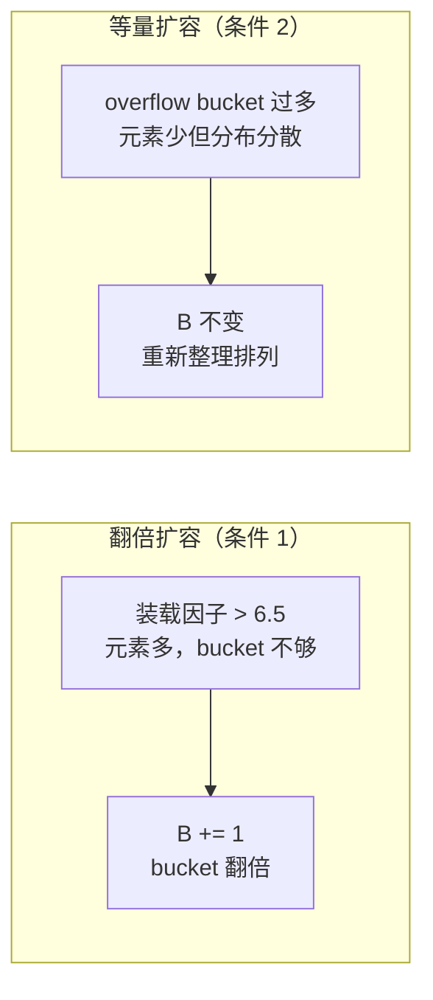

#map

相关笔记：[[gc]] | [[gmp-model]]

## 概述

Go 的 `map` 是基于 **hash table** 实现的无序键值对集合。底层使用 **拉链法**（桶 + 溢出桶）解决哈希冲突，支持**渐进式扩容**以避免一次性搬迁带来的性能抖动。

---

## Map 内存模型

### hmap 结构体

`hmap` 是 map 的运行时表示（header）：

```go
type hmap struct {
    count     int            // 元素个数，len(map) 直接返回此值
    flags     uint8          // 并发读写检测标志
    B         uint8          // buckets 数量的对数，即 buckets = 2^B
    noverflow uint16         // overflow bucket 的近似数
    hash0     uint32         // 哈希种子
    buckets    unsafe.Pointer // 指向 bucket 数组，大小 2^B
    oldbuckets unsafe.Pointer // 扩容时指向旧 bucket 数组
    nevacuate  uintptr       // 扩容进度：小于此值的 bucket 已迁移完成
    extra      *mapextra     // 可选字段
}
```

### bmap 结构体（桶）

每个 bucket 在运行时的实际内存布局：

```go
// 编译期间的实际结构（非源码中的简化版本）
type bmap struct {
    topbits  [8]uint8     // 每个 key 的 hash 高 8 位
    keys     [8]keytype   // 8 个 key
    values   [8]valuetype // 8 个 value
    pad      uintptr
    overflow uintptr      // 指向溢出桶
}
```

每个桶最多存储 **8 个 key-value 对**，同一个桶中的 key 拥有相同的 hash 低位。



![[map.png]]

### mapextra

当 key 和 value 都不含指针且 size < 128 字节时，bmap 标记为不含指针（避免 GC 扫描）。此时 overflow 指针移到 `mapextra` 中：

```go
type mapextra struct {
    overflow    [2]*[]*bmap // [0] 当前 buckets 的溢出桶，[1] 旧 buckets 的溢出桶
    nextOverflow *bmap      // 预分配的空闲溢出桶
}
```

---

## Key 定位过程



![[mapkey定位.png]]

具体步骤：
1. 计算 key 的 hash 值
2. 用 hash 的**低 B 位**确定 bucket 编号
3. 用 hash 的**高 8 位**作为 tophash，在 bucket 的 `tophash[0..7]` 中查找
4. tophash 匹配后，再比较完整 key 是否相等
5. 未找到则沿 overflow 链继续查找

![[bmap.png]]

---

## Map 扩容机制

### 装载因子

```go
loadFactor := count / (2^B)
```

`count` 是元素个数，`2^B` 是 bucket 数量。

### 扩容触发条件

| 条件 | 触发时机 | 扩容策略 |
|------|----------|----------|
| **装载因子 > 6.5** | bucket 快满，查找效率下降 | **翻倍扩容**：B += 1，bucket 数量翻倍 |
| **overflow bucket 过多** | bucket 利用率低，数据分散 | **等量扩容**：bucket 数量不变，重新整理数据 |

overflow bucket 过多的判定：
- B < 15 时：overflow bucket 数 > 2^B
- B >= 15 时：overflow bucket 数 > 2^15

### 两种扩容策略对比



**翻倍扩容**：元素太多、bucket 不够。将 B 加 1，bucket 数量变为原来的 2 倍，然后渐进式搬迁。

**等量扩容**：bucket 数量够，但由于频繁插入删除导致数据分布在大量 overflow bucket 中。开辟同样大小的新 bucket 空间，将数据重新紧凑排列，提高利用率。

### 渐进式扩容

Go map 扩容采用**渐进式搬迁（incremental evacuation）**策略：

- 扩容时不会一次性搬迁所有 key-value
- 每次 map 操作（读/写/删除）最多搬迁 **2 个 bucket**
- `oldbuckets` 指向旧 bucket，`nevacuate` 记录搬迁进度
- 搬迁完成前，读操作需要同时检查新旧两个 bucket

```go
// 伪代码：map 写入时触发搬迁
func mapassign(t *maptype, h *hmap, key unsafe.Pointer) unsafe.Pointer {
    // ... 省略其他逻辑
    if h.growing() {
        growWork(t, h, bucket) // 搬迁当前 bucket 和一个额外 bucket
    }
    // ... 写入逻辑
}
```

---

## 使用注意事项

### 并发不安全

map 不是并发安全的，多 goroutine 同时读写会触发 `fatal error: concurrent map read and map write`：

```go
// 错误示例：并发写 map
m := make(map[string]int)
go func() { m["a"] = 1 }()
go func() { m["b"] = 2 }() // fatal error!

// 正确做法 1：使用 sync.Mutex
var mu sync.Mutex
mu.Lock()
m["a"] = 1
mu.Unlock()

// 正确做法 2：使用 sync.Map（适合读多写少场景）
var sm sync.Map
sm.Store("a", 1)
val, ok := sm.Load("a")
```

### 遍历无序

map 的遍历顺序是随机的（Go 故意加入了随机性），不要依赖遍历顺序。

### 不可取址

map 中的元素不可取地址（`&m[key]` 编译错误），因为扩容可能导致元素搬迁，地址失效。

## 面试要点

### 高频问题

**Q: Go 的 map 底层是怎么实现的？**
A: 基于 hash table，核心结构是 `hmap`（header），其 `buckets` 指向一个 bucket 数组，数组长度为 `2^B`。每个 bucket（`bmap`）最多存 8 个 key-value，通过**拉链法**（overflow 溢出桶）解决哈希冲突。`hmap` 中 `count` 记录元素个数，`len(map)` 直接返回它。（注：Go 1.24 起底层已改为 Swiss Table 实现，见加分点，但这套 hmap/bmap 模型仍是理解 map 的基础。）

**Q: 一次 key 查找的完整过程是怎样的？**
A: 先对 key 计算 hash，用 hash 的**低 B 位**确定 bucket 编号（`hash & (2^B - 1)`），用**高 8 位**作为 tophash 在 bucket 的 `tophash[0..7]` 中快速比对；tophash 命中后再比较完整 key 是否相等，避免直接做开销大的全 key 比较。当前 bucket 找不到则沿 overflow 链继续查找；若处于扩容中，还需到 `oldbuckets` 对应的旧桶查找。

**Q: 为什么 bmap 里要单独存一个 tophash（hash 高 8 位）？**
A: tophash 是一个快速过滤器。查找时先逐个比对 8 个 uint8 的 tophash，只有高位匹配才进一步比较完整 key，能跳过绝大多数不匹配的槽位，显著减少昂贵的 key 比较次数。tophash 还会复用一段特殊低值（`emptyRest`/`emptyOne` 表示槽位空闲，`evacuatedX`/`evacuatedY`/`evacuatedEmpty` 表示该槽已迁移）来标记槽位状态。

**Q: map 什么时候扩容？有哪两种扩容？**
A: 两种触发条件：（1）**装载因子 > 6.5**（`count / 2^B`），说明元素过多、桶不够，触发**翻倍扩容**，`B += 1`，bucket 数量翻倍；（2）**overflow bucket 过多**（B<15 时数量 > `2^B`，B>=15 时 > `2^15`），说明频繁增删导致数据稀疏分散，触发**等量扩容**，B 不变、重新紧凑排列以提高利用率。

**Q: 什么是渐进式扩容（incremental evacuation）？为什么要这样设计？**
A: 扩容时不一次性搬迁全部数据，而是把搬迁分摊到后续的每次写/删操作中，每次 `growWork` 最多搬迁 2 个 bucket（当前命中的桶 + `nevacuate` 处的一个桶）。这样避免一次性 rehash 造成的延迟尖峰（latency spike）。注意 map 搬迁并不触发 STW，它只是把单次大开销均摊成多次小开销。`oldbuckets` 指向旧桶，`nevacuate` 记录进度；扩容未完成时，读操作要同时检查新旧桶。

**Q: 为什么 map 元素不可取地址（`&m[key]` 报错）？**
A: 因为扩容时会发生渐进式搬迁，元素的内存位置会改变，如果允许取址，搬迁后该指针就会悬空指向旧位置。Go 在编译期直接禁止对 map 元素取址来杜绝这个问题；如需可变的元素，可用 `map[K]*V` 存指针，或先取值修改再写回。

**Q: map 是并发安全的吗？并发读写会发生什么？**
A: 不安全。运行时通过 `hmap.flags` 做并发读写检测，一旦检测到会直接 `fatal error: concurrent map read and map write`，注意这是 fatal error，**无法被 recover 捕获**。解决方案：读写都加 `sync.Mutex/RWMutex`，或在读多写少场景用 `sync.Map`。

**Q: 为什么 map 的遍历是无序的？**
A: Go 故意在遍历时引入随机性——每次 `range` 会随机选择起始 bucket 和起始槽位。这样做是为了防止开发者依赖某个固定遍历顺序而写出脆弱代码（同时扩容搬迁本身也会改变物理顺序）。需要有序输出时应把 key 取出单独排序。

### 面试加分点

- 能说清 **mapextra 优化**：当 key/value 都不含指针（且 size < 128 字节，因此 bucket 类型整体无指针）时，bmap 被判定为不含指针类型，overflow 指针被移到 `mapextra` 中单独持有。这样 GC 扫描时可以跳过整个 bucket 数组，只需顺着 `mapextra` 维持溢出桶存活，减少 GC 标记压力。
- 理解 **B 值含义**：`B` 是 bucket 数量的对数，bucket 数 = `2^B`；正因为是 2 的幂，定位 bucket 才能用 `hash & (2^B - 1)` 的位运算代替取模，速度更快。
- 能区分**等量扩容 vs 翻倍扩容的本质**：翻倍扩容解决的是"装得太满"（装载因子 > 6.5），等量扩容解决的是"删得太碎"（overflow 桶里有大量空洞），后者不增加桶数只做内存整理。
- 了解 `sync.Map` 的适用边界：它用 read/dirty 双 map + 原子操作实现，适合**读多写少 / key 集合稳定**的场景；写多或 key 频繁变化时性能反而不如 `Mutex + 普通 map`。
- 知道读 map 时 key 不存在会返回 value 的**零值**，可用 comma-ok（`v, ok := m[k]`）区分"key 不存在"与"value 恰好是零值"；删除用 `delete(m, k)`，对不存在的 key 删除是安全的无操作。
- 补充：**Go 1.24（2025 年初发布）起 map 的底层实现已切换为基于 Swiss Table 的设计**（开放寻址 + group 内 SIMD 式探测，更高的内存与缓存效率），上面描述的拉链式 hmap/bmap 是 1.24 之前的经典实现。面试中点明这一版本演进、并说清两套实现的取舍是加分项。
