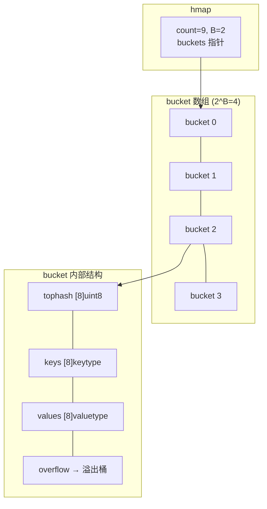
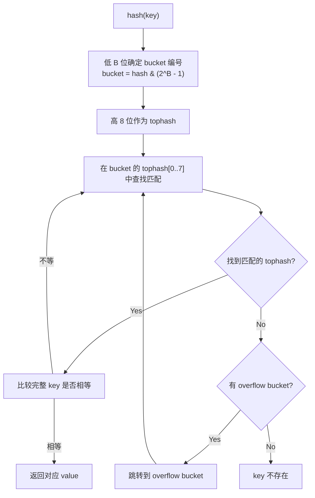
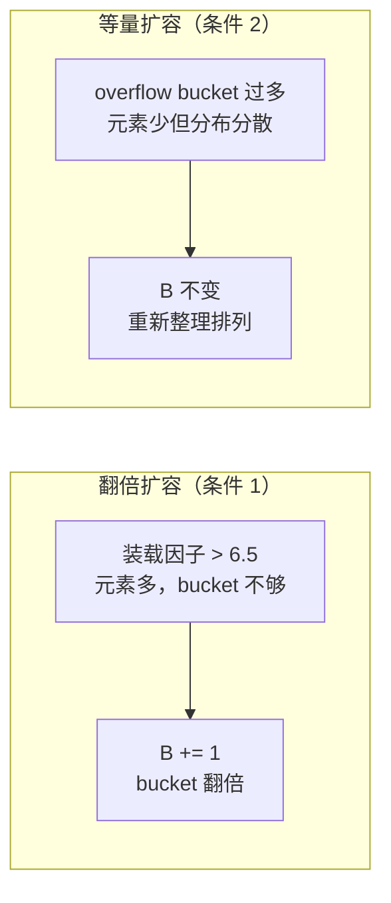

#map

相关笔记：[[gc]] | [[gmp-model]]

## 概述

Go 的 `map` 是基于 **hash table** 实现的无序键值对集合。底层使用 **拉链法**（桶 + 溢出桶）解决哈希冲突，支持**渐进式扩容**以避免一次性搬迁带来的性能抖动。

---

## Map 内存模型

### hmap 结构体

`hmap` 是 map 的运行时表示（header）：

```go
type hmap struct {
    count     int            // 元素个数，len(map) 直接返回此值
    flags     uint8          // 并发读写检测标志
    B         uint8          // buckets 数量的对数，即 buckets = 2^B
    noverflow uint16         // overflow bucket 的近似数
    hash0     uint32         // 哈希种子
    buckets    unsafe.Pointer // 指向 bucket 数组，大小 2^B
    oldbuckets unsafe.Pointer // 扩容时指向旧 bucket 数组
    nevacuate  uintptr       // 扩容进度：小于此值的 bucket 已迁移完成
    extra      *mapextra     // 可选字段
}
```

### bmap 结构体（桶）

每个 bucket 在运行时的实际内存布局：

```go
// 编译期间的实际结构（非源码中的简化版本）
type bmap struct {
    topbits  [8]uint8     // 每个 key 的 hash 高 8 位
    keys     [8]keytype   // 8 个 key
    values   [8]valuetype // 8 个 value
    pad      uintptr
    overflow uintptr      // 指向溢出桶
}
```

每个桶最多存储 **8 个 key-value 对**，同一个桶中的 key 拥有相同的 hash 低位。



![[map.png]]

### mapextra

当 key 和 value 都不含指针且 size < 128 字节时，bmap 标记为不含指针（避免 GC 扫描）。此时 overflow 指针移到 `mapextra` 中：

```go
type mapextra struct {
    overflow    [2]*[]*bmap // [0] 当前 buckets 的溢出桶，[1] 旧 buckets 的溢出桶
    nextOverflow *bmap      // 预分配的空闲溢出桶
}
```

---

## Key 定位过程



![[mapkey定位.png]]

具体步骤：
1. 计算 key 的 hash 值
2. 用 hash 的**低 B 位**确定 bucket 编号
3. 用 hash 的**高 8 位**作为 tophash，在 bucket 的 `tophash[0..7]` 中查找
4. tophash 匹配后，再比较完整 key 是否相等
5. 未找到则沿 overflow 链继续查找

![[bmap.png]]

---

## Map 扩容机制

### 装载因子

```go
loadFactor := count / (2^B)
```

`count` 是元素个数，`2^B` 是 bucket 数量。

### 扩容触发条件

| 条件 | 触发时机 | 扩容策略 |
|------|----------|----------|
| **装载因子 > 6.5** | bucket 快满，查找效率下降 | **翻倍扩容**：B += 1，bucket 数量翻倍 |
| **overflow bucket 过多** | bucket 利用率低，数据分散 | **等量扩容**：bucket 数量不变，重新整理数据 |

overflow bucket 过多的判定：
- B < 15 时：overflow bucket 数 > 2^B
- B >= 15 时：overflow bucket 数 > 2^15

### 两种扩容策略对比



**翻倍扩容**：元素太多、bucket 不够。将 B 加 1，bucket 数量变为原来的 2 倍，然后渐进式搬迁。

**等量扩容**：bucket 数量够，但由于频繁插入删除导致数据分布在大量 overflow bucket 中。开辟同样大小的新 bucket 空间，将数据重新紧凑排列，提高利用率。

### 渐进式扩容

Go map 扩容采用**渐进式搬迁（incremental evacuation）**策略：

- 扩容时不会一次性搬迁所有 key-value
- 每次 map 操作（读/写/删除）最多搬迁 **2 个 bucket**
- `oldbuckets` 指向旧 bucket，`nevacuate` 记录搬迁进度
- 搬迁完成前，读操作需要同时检查新旧两个 bucket

```go
// 伪代码：map 写入时触发搬迁
func mapassign(t *maptype, h *hmap, key unsafe.Pointer) unsafe.Pointer {
    // ... 省略其他逻辑
    if h.growing() {
        growWork(t, h, bucket) // 搬迁当前 bucket 和一个额外 bucket
    }
    // ... 写入逻辑
}
```

---

## 使用注意事项

### 并发不安全

map 不是并发安全的，多 goroutine 同时读写会触发 `fatal error: concurrent map read and map write`：

```go
// 错误示例：并发写 map
m := make(map[string]int)
go func() { m["a"] = 1 }()
go func() { m["b"] = 2 }() // fatal error!

// 正确做法 1：使用 sync.Mutex
var mu sync.Mutex
mu.Lock()
m["a"] = 1
mu.Unlock()

// 正确做法 2：使用 sync.Map（适合读多写少场景）
var sm sync.Map
sm.Store("a", 1)
val, ok := sm.Load("a")
```

### 遍历无序

map 的遍历顺序是随机的（Go 故意加入了随机性），不要依赖遍历顺序。

### 不可取址

map 中的元素不可取地址（`&m[key]` 编译错误），因为扩容可能导致元素搬迁，地址失效。
