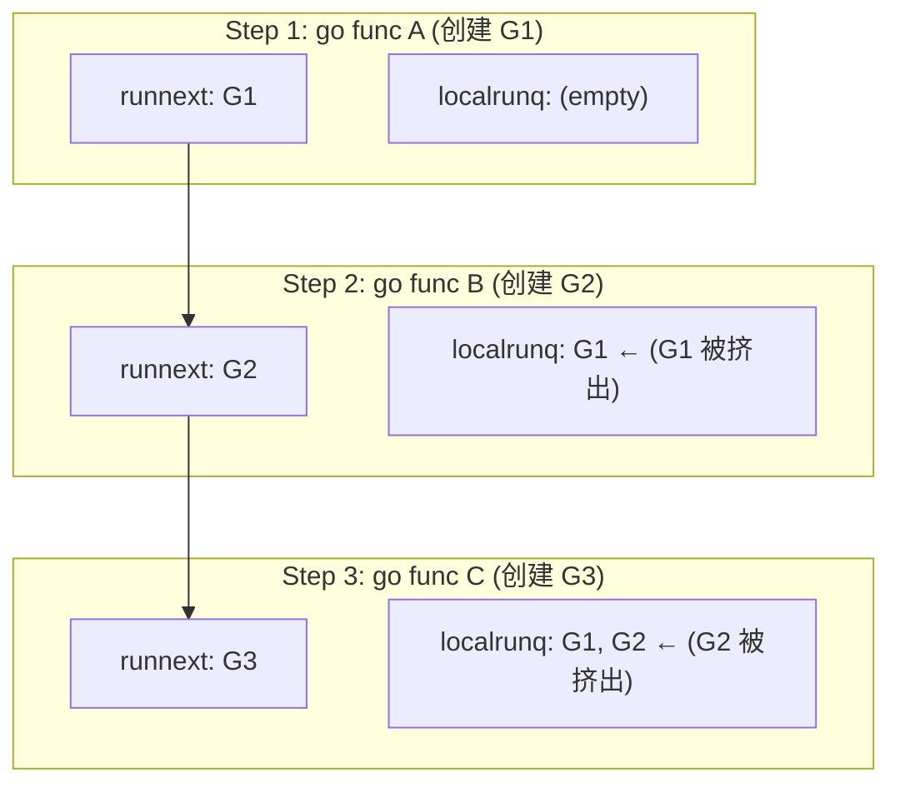
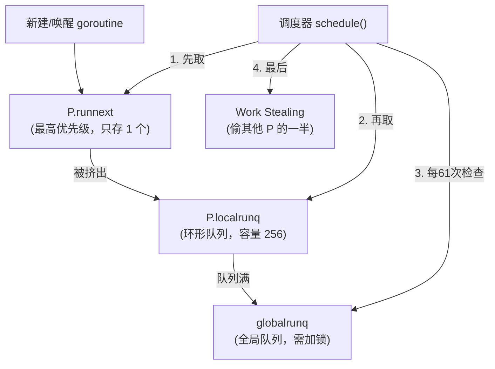

#go #gmp调度模型

相关笔记：[[gmp-model]] | [[context]]

## P.runnext 机制

`P.runnext` 是 Go 调度器中的一个重要优化：每个 P 上有一个特殊的 `runnext` 字段，存储**下一个优先执行的 goroutine**。它的优先级高于 P 的本地队列和全局队列。

### 调度优先级

```
P.runnext > P.localrunq > globalrunq
```

---

## 问题引入

以下代码的输出是什么？

```go
package main

import (
    "fmt"
    "runtime"
    "sync"
)

func main() {
    runtime.GOMAXPROCS(1) // 单线程
    wg := &sync.WaitGroup{}
    wg.Add(3)

    go func() { fmt.Println("A"); wg.Done() }()  // G1
    go func() { fmt.Println("B"); wg.Done() }()  // G2
    go func() { fmt.Println("C"); wg.Done() }()  // G3

    wg.Wait()
}
```

输出（稳定）：

```
C
A
B
```

为什么不是 A、B、C 的顺序？这涉及 `P.runnext` 的工作原理。

---

## go 关键字的底层实现

`go func()` 在编译期被转换为 `runtime.newproc`：

```go
// runtime/proc.go
func newproc1(fn *funcval, argp unsafe.Pointer, narg int32,
    callergp *g, callerpc uintptr) {

    _g_ := getg()
    _p_ := _g_.m.p.ptr()
    newg := gfget(_p_)

    casgstatus(newg, _Gdead, _Grunnable)
    newg.goid = int64(_p_.goidcache)

    // 关键：第三个参数 next=true，放入 P.runnext
    runqput(_p_, newg, true)

    if atomic.Load(&sched.npidle) != 0 && atomic.Load(&sched.nmspinning) == 0 && mainStarted {
        wakep()
    }
    releasem(_g_.m)
}
```

注意 `runqput(_p_, newg, true)` 的第三个参数 `next=true`，表示新 goroutine 会被放入 `P.runnext`。

---

## runqput 源码分析

```go
// runtime/proc.go
func runqput(_p_ *p, gp *g, next bool) {
    if next {
    retryNext:
        oldnext := _p_.runnext
        // CAS 将新 G 放入 runnext，与旧值交换
        if !_p_.runnext.cas(oldnext, guintptr(unsafe.Pointer(gp))) {
            goto retryNext
        }
        if oldnext == 0 {
            return // runnext 之前为空，直接返回
        }
        // runnext 之前不为空，被挤出的旧 G 需要放入本地队列
        gp = oldnext.ptr()
    }

    // 将 gp 放入本地队列尾部
    // 如果 next=false，gp 是新创建的 goroutine
    // 如果 next=true，gp 是从 runnext 被挤出的旧 goroutine
retry:
    h := atomic.LoadAcq(&_p_.runqhead)
    t := _p_.runqtail
    if t-h < uint32(len(_p_.runq)) {
        _p_.runq[t%uint32(len(_p_.runq))].set(gp)
        atomic.StoreRel(&_p_.runqtail, t+1)
        return
    }
    // 本地队列已满，放入全局队列
    if runqputslow(_p_, gp, h, t) {
        return
    }
    goto retry
}
```

核心逻辑：
1. 新 goroutine 通过 CAS 操作放入 `P.runnext`
2. 如果 `runnext` 已有旧值，旧值被**挤出**到本地队列尾部
3. 本地队列满时，溢出到全局队列

---

## 执行顺序推导



| 步骤 | 操作 | runnext | 本地队列 |
|------|------|---------|----------|
| 1 | 创建 G1（打印 A） | G1 | [] |
| 2 | 创建 G2（打印 B） | G2 | [G1] （G1 被挤出） |
| 3 | 创建 G3（打印 C） | G3 | [G1, G2] （G2 被挤出） |

### 调度顺序

调度器获取 G 的顺序（`runqget` 函数）：

1. **先取 `runnext`** → G3（打印 C）
2. **再从本地队列头部取** → G1（打印 A）
3. **继续取** → G2（打印 B）

所以输出是 `C → A → B`。

---

## runqget 源码

```go
func runqget(_p_ *p) (gp *g, inheritTime bool) {
    // 优先从 runnext 获取
    for {
        next := _p_.runnext
        if next == 0 {
            break
        }
        if _p_.runnext.cas(next, 0) {
            return next.ptr(), true
        }
    }
    // runnext 为空，从本地队列 FIFO 获取
    for {
        h := atomic.LoadAcq(&_p_.runqhead)
        t := _p_.runqtail
        if t == h {
            return nil, false
        }
        gp := _p_.runq[h%uint32(len(_p_.runq))].ptr()
        if atomic.CasRel(&_p_.runqhead, h, h+1) {
            return gp, false
        }
    }
}
```

---

## Go 1.13 的特殊情况

在 Go 1.13 中，以下代码输出 `A B C` 而非 `C A B`：

```go
func main() {
    runtime.GOMAXPROCS(1)
    go func() { fmt.Println("A") }()
    go func() { fmt.Println("B") }()
    go func() { fmt.Println("C") }()
    time.Sleep(time.Second)
}
```

原因：Go 1.13 中 `time.Sleep` 会隐式启动一个 `timerproc` goroutine（用于监控 timer bucket），这个额外的 goroutine 会影响 `runnext` 的状态，改变最终的执行顺序。

Go 1.14+ 将 timer 检查移入了 `schedule()` 函数，不再启动额外的 goroutine，因此该问题不再存在。

---

## 哪些场景会使用 P.runnext

以下情况 goroutine 会被放入 `P.runnext`（获得"插队"权）：

| 场景 | 说明 |
|------|------|
| `go func()` | 新创建的 goroutine |
| `goready()` | 被唤醒的 goroutine（如 channel 接收方） |
| `newproc` | runtime 内部创建 goroutine |

设计意图：**刚创建或刚被唤醒的 goroutine 通常有更高的时间局部性**，优先执行可以减少调度延迟、提高缓存命中率。

---

## 总结



## 面试要点

### 高频问题

**Q: 什么是 P.runnext？它在 Go 调度器中的优先级如何？**
A: `P.runnext` 是每个 P 上的一个特殊字段，只能存放**一个** goroutine，代表「下一个优先执行的 G」。它的调度优先级最高，顺序为 `P.runnext > P.localrunq > globalrunq`。设计目的是让刚创建或刚被唤醒的 goroutine 优先执行，利用时间局部性减少调度延迟、提升 cache 命中率。

**Q: 单 P（GOMAXPROCS(1)）下连续 go A、B、C 三个打印，输出为什么是 C A B 而不是 A B C？**
A: `go func()` 在底层走 `newproc → newproc1 → runqput(_p_, newg, true)`，`next=true` 会把新 G 放入 `runnext`。创建 G2 时 G1 被挤到本地队列尾，创建 G3 时 G2 也被挤到本地队列尾，最终 `runnext=G3`、`localrunq=[G1,G2]`。调度时先取 runnext 得 C，再从本地队列 FIFO 取 A、B，因此输出 `C A B`。

**Q: runqput 中 next=true 时，被挤出的旧 goroutine 如何处理？**
A: `runqput` 用 CAS 把新 G 写入 `runnext` 并换出旧值 `oldnext`；若 `oldnext==0`（runnext 原本为空）直接返回，否则把被挤出的旧 G 放入本地队列尾部。本地队列（环形数组 `runq [256]guintptr`，容量 256）满时通过 `runqputslow` 把约一半 G 批量转移到全局队列。

**Q: 调度器从 P 取 G 的完整顺序是怎样的？**
A: `runqget` 先用 CAS 尝试取 `runnext`（命中则返回，且 `inheritTime=true` 继承时间片）；runnext 为空时从本地队列头部 FIFO 取。整体 `schedule()` 还包括：每 61 次调度检查一次全局队列（避免全局队列饥饿），本地和全局都没有时执行 Work Stealing，从其他 P 偷走约一半的 G。

**Q: 哪些场景会把 goroutine 放进 P.runnext？**
A: 本质上都是通过 `runqput(..., next=true)`，主要两类来源：一是 `go func()` 新建 goroutine（编译为 `newproc → newproc1`，runtime 内部 `newproc` 创建 G 也是同一条路径）；二是 `goready()`（即 `ready()`）唤醒被阻塞的 goroutine（如 channel 接收方就绪）。共同点是这些 G 通常有更好的时间局部性，优先执行收益最大。

**Q: 为什么 Go 1.13 下用 time.Sleep 的同款代码输出是 A B C 而 1.14+ 是 C A B？**
A: Go 1.13 中 `time.Sleep` 会隐式启动一个 `timerproc` goroutine 来监控 timer bucket，这个额外 G 的创建会扰动 `runnext` 状态，从而改变最终执行顺序。Go 1.14+ 把 timer 改为按 P 管理（`p.timers`），并将 timer 检查（`checkTimers`）合入 `schedule()`，配合 netpoller 设置最近 timer 的唤醒时间，不再启动独立的 `timerproc` goroutine，因此恢复为稳定的 `C A B`。

**Q: runnext 的存在会不会破坏调度公平性？Go 如何避免饥饿？**
A: runnext 只缓存一个 G 且取出后立即清空，不会无限插队；同时 `runqget` 取 runnext 时返回 `inheritTime=true`，让它继承当前时间片、不递增 `schedtick`，而非额外获得完整时间片，避免被频繁唤醒的 G 长期霸占 P。再叠加每 61 次调度强制查全局队列和 sysmon 的抢占（运行超 10ms 触发），整体仍保持公平。

### 面试加分点

- 能区分 `runqput(next=true/false)` 两条路径：`next=false` 直接把新 G 入本地队列尾，`next=true` 走 runnext 并处理挤出逻辑，最后两者复用同一段 `retry:` 入队代码。
- 指出 runnext 用 CAS（`runnext.cas`）而非加锁，因为本地队列是 P 私有的、几乎无竞争，CAS 主要防的是其他 P 偷取（steal）时的并发访问。
- 理解 `inheritTime` 的意义：从 runnext 取出的 G 继承时间片、不递增调度计数，配合每 61 次查全局队列共同保障公平性。
- 能把 runnext 与 work stealing 联系起来：`runqsteal` 走 `runqgrab`，通常**不偷** runnext（仅当源 P 本地队列为空且 `stealRunNextG` 为真时才在短暂等待后偷取），保护了 runnext 的局部性语义。
- 延伸到 GMP 全貌：runnext 是「快速路径」优化的一环，与 localrunq（无锁）、globalrunq（加锁）、netpoller 共同构成多级 runqueue，体现了「热路径无锁、冷路径降级」的设计思想。
