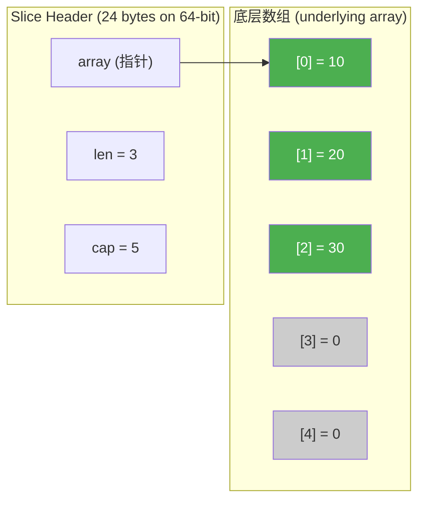
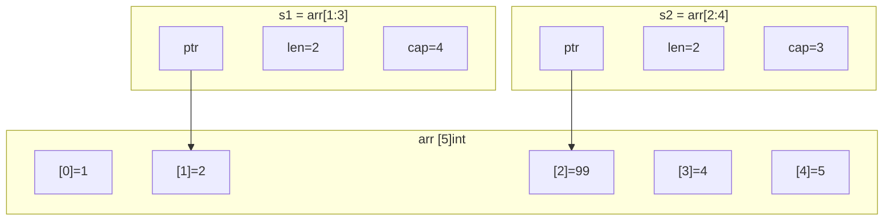
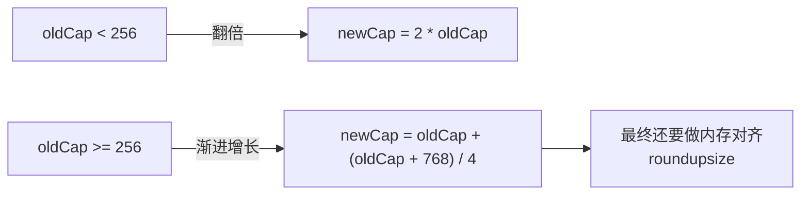

#go #slice

相关笔记：[[map-internals]] | [[gc]]

## Slice 底层实现

### SliceHeader 结构

Slice 在 runtime 中对应 `slice` 结构体（对外暴露为 `reflect.SliceHeader`）：

```go
// runtime/slice.go
type slice struct {
    array unsafe.Pointer // 指向底层数组的指针
    len   int            // 当前长度
    cap   int            // 容量（底层数组从 array 开始的可用长度）
}

// reflect/value.go（已废弃，Go 1.20+ 推荐 unsafe.Slice）
type SliceHeader struct {
    Data uintptr
    Len  int
    Cap  int
}
```



### Slice 与 Array 的关系

```go
// array：固定长度，值类型
arr := [5]int{1, 2, 3, 4, 5}

// slice：动态长度，引用类型（指向底层数组）
s1 := arr[1:3]  // len=2, cap=4, 共享 arr 的内存
s2 := arr[2:4]  // len=2, cap=3, 也共享 arr 的内存

// s1 和 s2 共享底层数组 arr
s1[1] = 99
fmt.Println(arr) // [1 2 99 4 5] ← arr 也被修改了
fmt.Println(s2)  // [99 4]       ← s2 也受影响
```



### 扩容策略

#### Go 1.18 之前

```go
// 旧策略（runtime/slice.go growslice）
if newCap > doubleCap {
    newCap = newCap
} else if oldCap < 1024 {
    newCap = doubleCap      // 小于 1024：翻倍
} else {
    newCap = oldCap + oldCap/4  // >= 1024：每次增长 25%
}
```

#### Go 1.18+ 新策略

```go
// 新策略：平滑过渡，避免 1024 处的跳变
if newCap > doubleCap {
    newCap = newCap
} else if oldCap < 256 {
    newCap = doubleCap      // 小于 256：翻倍
} else {
    newCap = oldCap + (oldCap + 3*256) / 4  // 渐进增长
    // 当 oldCap 很大时，增长率趋近 25%
    // 当 oldCap 较小时，增长率接近翻倍
}
```



**注意**：最终容量还会经过 `roundupsize` 内存对齐，所以实际容量可能比计算值大。

### 扩容验证代码

```go
func main() {
    var s []int
    prevCap := cap(s)
    for i := 0; i < 2000; i++ {
        s = append(s, i)
        if cap(s) != prevCap {
            fmt.Printf("len=%-4d cap: %-4d → %-4d (growth: %.2fx)\n",
                len(s), prevCap, cap(s), float64(cap(s))/float64(max(prevCap, 1)))
            prevCap = cap(s)
        }
    }
}

// 部分输出（Go 1.22）:
// len=1    cap: 0    → 1    (growth: 1.00x)
// len=2    cap: 1    → 2    (growth: 2.00x)
// len=3    cap: 2    → 4    (growth: 2.00x)
// len=5    cap: 4    → 8    (growth: 2.00x)
// len=9    cap: 8    → 16   (growth: 2.00x)
// ...
// len=257  cap: 256  → 512  (growth: 2.00x)
// len=513  cap: 512  → 848  (growth: 1.66x)  ← 过渡区间
// len=849  cap: 848  → 1280 (growth: 1.51x)
// len=1281 cap: 1280 → 1792 (growth: 1.40x)
```

### 常见陷阱

#### 陷阱一：共享底层数组

```go
func main() {
    original := []int{1, 2, 3, 4, 5}
    sub := original[1:3] // sub = [2, 3], 共享底层数组

    // 修改 sub 会影响 original
    sub[0] = 99
    fmt.Println(original) // [1 99 3 4 5]

    // append 可能影响 original（如果 cap 够用）
    sub = append(sub, 100)
    fmt.Println(original) // [1 99 3 100 5] ← original[3] 被覆盖！
}
```

#### 陷阱二：append 的返回值必须接收

```go
func modifySlice(s []int) {
    s = append(s, 100) // 如果触发扩容，s 指向新数组
    // 调用者的 slice 不会改变！
}

func main() {
    s := []int{1, 2, 3}
    modifySlice(s)
    fmt.Println(s) // [1 2 3] ← 没变
}
```

#### 陷阱三：for range 中的闭包（Go 1.22 前）

```go
// Go 1.21 及之前：循环变量被共享
s := []int{1, 2, 3}
var fns []func()
for _, v := range s {
    fns = append(fns, func() {
        fmt.Println(v) // 全部打印 3（最后一个值）
    })
}

// Go 1.22+：每次迭代创建新变量，问题已修复
```

### 安全操作

#### copy vs append

```go
// copy：独立副本，不共享底层数组
func safeCopy(src []int) []int {
    dst := make([]int, len(src))
    copy(dst, src)
    return dst
}

// append(nil, src...) 也能创建独立副本
func safeCopy2(src []int) []int {
    return append([]int(nil), src...)
}

// slices.Clone (Go 1.21+)
import "slices"
dst := slices.Clone(src)
```

#### 使用三索引切片限制 cap

```go
original := []int{1, 2, 3, 4, 5}

// 三索引切片：s[low:high:max]，cap = max - low
sub := original[1:3:3] // len=2, cap=2

// 现在 append 必定触发扩容，不会影响 original
sub = append(sub, 100)
fmt.Println(original) // [1 2 3 4 5] ← 不受影响
```

#### 安全删除元素

```go
// 删除索引 i 处的元素（保持顺序）
func removeOrdered[T any](s []T, i int) []T {
    return append(s[:i], s[i+1:]...)
}

// 删除索引 i 处的元素（不保持顺序，O(1)）
func removeUnordered[T any](s []T, i int) []T {
    s[i] = s[len(s)-1]
    return s[:len(s)-1]
}

// 避免内存泄漏：如果元素是指针或包含指针
func removeOrderedClean[T any](s []T, i int) []T {
    copy(s[i:], s[i+1:])
    var zero T
    s[len(s)-1] = zero // 清除最后一个元素，帮助 GC
    return s[:len(s)-1]
}
```

### 面试要点

1. **SliceHeader 三要素**：pointer（底层数组指针）、len（长度）、cap（容量）。Slice 是引用类型，赋值和传参只拷贝 header（24 bytes），不拷贝底层数组
2. **扩容策略变化**：Go 1.18 前以 1024 为分界（翻倍 / +25%）；Go 1.18+ 以 256 为分界，采用渐进增长公式，避免跳变。最终还要做 `roundupsize` 内存对齐
3. **共享底层数组**：切片操作（`s[i:j]`）产生的新 slice 与原 slice 共享底层数组，修改会相互影响。使用 `copy` 或三索引切片 `s[i:j:k]` 来避免
4. **append 语义**：append 可能触发扩容（分配新数组并拷贝），也可能原地操作。函数内 append 后的 slice 必须通过返回值传出
5. **nil slice vs empty slice**：`var s []int`（nil，len=0，cap=0）vs `s := []int{}`（非 nil，len=0，cap=0）。`json.Marshal` 时 nil → `null`，empty → `[]`
6. **内存泄漏**：大 slice 切一小段后，底层大数组无法被 GC。解决方案：`copy` 到新 slice
