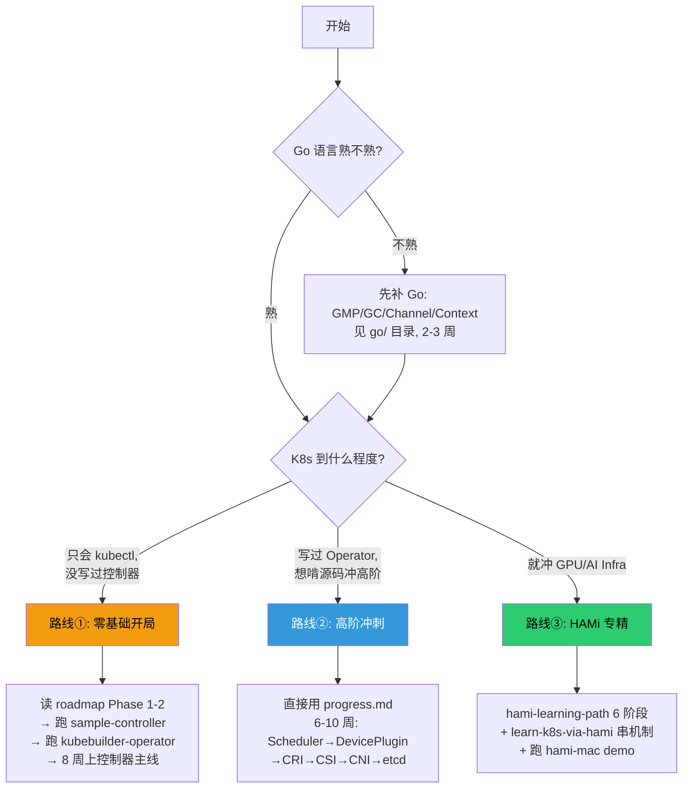

#kubernetes #学习计划 #导航

> **这是 `learning-plan/` 的唯一入口。** 先读这一篇，它会告诉你「你该走哪条路径」，不要一上来就乱点。

## learning-plan 里有什么

```
learning-plan/
├── START-HERE.md              ← 你在这里
├── k8s-development-roadmap.md  地图：K8s 开发岗 12 主题全景
├── progress.md                打卡表：6 周高阶冲刺计划
├── hami-learning-path.md       专题路径：HAMi GPU 虚拟化 6 阶段
├── 源码导读 ×9（见下表）
└── demos/ ×9                   可运行 demo（见下表）
```

## 四份「路线类」文档的关系（别搞混）

很多人打开 learning-plan 看到四份计划类文档就懵了。它们**不是并列的四选一**，而是**地图 / 打卡表 / 专题**三种不同角色：

| 文档 | 角色 | 什么时候用 |
| :--- | :--- | :--- |
| [[k8s-development-roadmap]] | **地图**（12 主题全景 + 4 阶段 4-6 月计划） | 想知道「K8s 开发岗到底要学什么」时通读一遍，之后当字典查 |
| [[progress.md\|progress]] | **打卡表**（6 周高阶冲刺，每项可勾选） | 已经决定开学、要逐日推进时，每天对着它打勾 |
| [[hami-learning-path]] | **专题路径**（只讲 HAMi GPU 虚拟化，6 阶段） | 目标是 GPU/AI Infra 方向、想深挖 HAMi 时 |
| [[learn-k8s-via-hami]] | **专题路径的变体**（用 HAMi 当线索反向串 K8s 12 机制） | K8s 基础不牢，想借一个具体项目把零散机制串起来时 |

一句话：**roadmap 是「学什么」，progress 是「怎么逐日推进」，hami-* 两篇是「如果你走 GPU 方向」的专门加餐。**

## 你该走哪条路？（决策图）



### 路线①：零基础开局（K8s 只会用，没碰过源码）

1. Go 不熟先补 `go/` 目录的笔记（GMP / GC / Channel / Context），约 2-3 周
2. 通读 [[k8s-development-roadmap]] 的 **Phase 1-2**
3. 跑 [[demo-sample-controller]] → [[demo-kubebuilder-operator]]，把「Informer → Controller → Operator」打通
4. 预计 8 周能上「控制器开发」主线，之后再切到路线②的高阶部分

### 路线②：高阶冲刺（写过 Operator，要啃源码）

1. 直接打开 [[progress.md|progress]]，按 6 周（在职建议 8-10 周，见下）逐日打卡
2. 顺序：Scheduler → Device Plugin/GPU → CRI → CSI → CNI → etcd
3. 每个主题「读源码导读 + 跑 demo + 白板默写」三件套

### 路线③：HAMi / GPU 专精

1. [[hami-learning-path]] 的 6 阶段（先决条件 → 跑集群 → webhook → extender → device-plugin → libvgpu）
2. 配合 [[hami-source]]（源码导读）+ [[demo-hami-mac]]（Mac 可跑 demo）
3. K8s 基础弱的话，先用 [[learn-k8s-via-hami]] 把 12 个机制串一遍

## 9 篇源码导读 + 9 个 demo 对照表

| 主题 | 源码导读 | 配套 demo | demo 在 Mac 上能跑吗 |
| :--- | :--- | :--- | :--- |
| client-go | [[client-go-source]] | [[demo-sample-controller]] | ✅ 先 `go mod tidy` |
| controller-runtime | [[controller-runtime-source]] | [[demo-kubebuilder-operator]] | ✅ 先 `go mod tidy` |
| kube-scheduler | [[scheduler-framework-source]] | [[demo-scheduler-plugin]] | ⚠️ 需手填 go.mod replace（见其 README） |
| kubelet + CRI | [[kubelet-cri-source]] | [[demo-device-plugin]] | ✅ 先 `go mod tidy` |
| CSI | [[csi-source]] | [[demo-csi-hostpath]] | ⚠️ 需 `GOOS=linux go build`（用了 Linux-only 系统调用） |
| CNI | [[cni-source]] | [[demo-cni-bridge]] | ✅ bash 实现，`./run-in-docker.sh` 需 docker |
| GPU 调度 | [[gpu-scheduling-source]] | [[demo-fake-gpu]] | ✅ 先 `go mod tidy` |
| HAMi GPU 虚拟化 | [[hami-source]] | [[demo-hami-mac]] | ✅ 直接编过；libvgpu hook 部分需 docker |
| etcd | [[etcd-source]] | [[demo-raftexample-walkthrough]] | ✅ etcd-client-demo 先 `go mod tidy` |

> **demo 通用前置**：除 hami-mac 外，多数 demo 首次构建要先 `cd <demo> && go mod tidy` 补全 go.sum。每个 demo 的 README 有具体步骤。
> **源码行号说明**：7 篇导读（client-go / controller-runtime / scheduler / kubelet-cri / csi / gpu-scheduling / etcd）含基于本地 `~/github/kubernetes`、`~/github/etcd` 的真实文件路径 + 行号；[[cni-source]] 与 [[hami-source]] 因对应仓库（containernetworking、Project-HAMi）不在本地，只给目录 + 函数名定位，clone 后可补行号。

## 关于学习时长的诚实说明

[[progress.md|progress]] 标的是「6 周」，但那是**全职、每天 4-6 小时投入的下限**。现实参考：

| 你的情况 | 实际预期 |
| :--- | :--- |
| 全职脱产、每天 4-6h | 6-8 周 |
| 在职、每天 1.5-2h + 周末 | 10-14 周 |
| 在职、只有碎片时间 | 4-6 个月，且要接受会有断档 |

特别提醒：**progress.md 里「CSI 1 周」「etcd 源码 1 周」是偏紧的**。etcd 的 raft 实现真要读懂，单独给 2 周都不算多。按表走如果某周没完成，是表太乐观，不是你太慢——往后顺延即可，别因此否定自己。

## 这套路线的边界（先知道它「不教什么」）

这套 learning-plan 是**研发向、源码向**的，专攻「K8s 内部机制 + 扩展开发」。它**不覆盖**以下内容，如果你的目标岗位偏 SRE / 平台运维，这些要另外补：

- 线上排障（Pod 起不来 / Node NotReady 的定位套路）
- 可观测性（Prometheus / Grafana / 日志体系）
- 交付与运维（Helm / GitOps / ArgoCD / CI 流水线）
- 生产事故复盘与容量规划

→ 适合目标：**K8s 研发岗、Operator/调度/CSI/CNI 开发、云原生中间件、AI Infra**。

## 下一步

- 不确定走哪条 → 回到上面的决策图
- 已确定路线② → 打开 [[progress.md|progress]] 勾第一项
- 已确定路线③ → 打开 [[hami-learning-path]]
- 想先看全景 → 通读 [[k8s-development-roadmap]]
