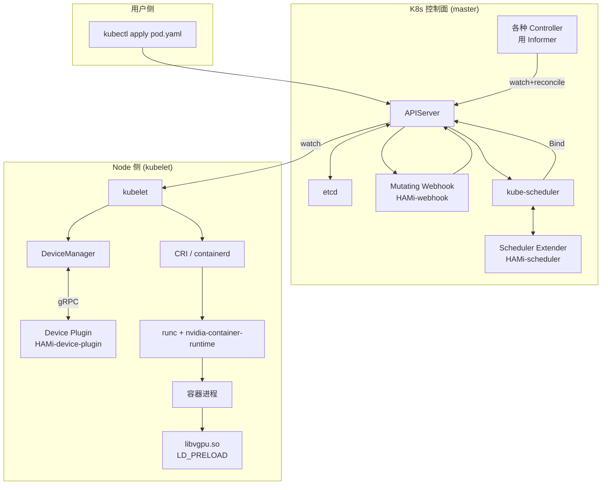

#kubernetes #gpu #hami #学习计划 #总结

相关笔记：[[hami-learning-path]] | [[hami-source]] | [[demo-hami-mac]] | [[demo-fake-gpu]] | [[k8s-development-roadmap]] | [[gpu-scheduling-source]] | [[scheduler-framework-source]] | [[kubelet-cri-source]] | [[controller-runtime-source]] | [[client-go-source]] | [[informer]] | [[kubernetes-basics]]

## 为什么用 HAMi 做主线

学 Kubernetes 最容易踩的坑：**对着官方文档背概念，看完一脸"原来如此"，过两周全忘**。原因是 K8s 的每个机制（APIServer / Informer / Scheduler / kubelet / Device Plugin / Webhook / CRI / containerd）单独看都很抽象，没东西把它们串起来。

**HAMi 是一个天然的串联线索**：用户写一行 `nvidia.com/gpu: 1` 的 Pod，背后 9 个 K8s 核心组件依次工作，少一个都跑不通。把这条链路自己跑一遍 + 自己造一个 fake 版的 HAMi（[[demo-hami-mac]]）+ 自己写 hook（[libvgpu-hook-demo](libvgpu-hook-demo/README.md)），等于把 K8s 控制面 + kubelet + 容器运行时 + Linux 动态链接 一口气过了一遍。

> **本文用法**：把它当**学习清单 + 路线**用。每个章节有"动手"和"读源码"两段；动手段是必做（不动手永远学不会），读源码段是要面试 / 进 K8s 团队的人深入。

> **前置**：熟悉 Linux 基础、写过任意 Go 代码、用过 `kubectl`、知道什么是 Pod / Deployment。如果这些不熟，先回头补 [[kubernetes-basics]]。

## 学习地图：一行 yaml 背后的 K8s



下面这张表，**每一行就是一个学习关卡**。学完所有关卡，你对 K8s 的理解会比 80% 的 "用过 K8s 的人" 都深。

| # | K8s 机制 | HAMi 里它在干什么 | 你要做什么 | 配套笔记 |
| --- | --- | --- | --- | --- |
| 1 | kubectl + APIServer | 把 Pod yaml 转 REST + 写 etcd | 跑通最小 demo | [[kubernetes-basics]] |
| 2 | etcd | 存 Pod / Node / 资源对象 | 看一眼 raw key | [[etcd-source]] |
| 3 | Informer + List-Watch | Controller 怎么"知道"对象变化 | 写 20 行 Informer demo | [[informer]] [[client-go-source]] |
| 4 | Controller 模式 | reconcile loop 怎么收敛状态 | 读 sample-controller | [[demo-sample-controller]] |
| 5 | Operator + Controller-Runtime | 把 Controller 工程化 | 读 kubebuilder demo | [[demo-kubebuilder-operator]] [[controller-runtime-source]] |
| 6 | Mutating Webhook | HAMi 改写 Pod resources / 注 annotation | 写一个最小 webhook | [[controller-runtime-source]] |
| 7 | Scheduler Framework | kube-scheduler 怎么选 Node | 读 scheduler-plugin demo | [[demo-scheduler-plugin]] [[scheduler-framework-source]] |
| 8 | Scheduler Extender | HAMi-scheduler 怎么过滤 vGPU | 看 HAMi extender 源码 | [[scheduler-framework-source]] |
| 9 | Device Plugin | HAMi 上报 vGPU + Allocate 注入 env | 跑 [[demo-hami-mac]] | [[gpu-scheduling-source]] [[kubelet-cri-source]] |
| 10 | kubelet + DeviceManager | 调 Allocate, 把 env 合并进 CRI | 看 kubelet 日志 | [[kubelet-cri-source]] |
| 11 | CRI + containerd + runc | 真正起容器, 注入 env | docker 跑一遍 | [[oci-runtime]] |
| 12 | LD_PRELOAD + libvgpu.so | 容器内 hook CUDA API | 跑 malloc-limit demo | [libvgpu-hook-demo](libvgpu-hook-demo/README.md) |

---

## 第 1 关：跑通 [[demo-hami-mac]]（半天）

**目标**：让你的 Mac 第一次出现"K8s 给容器分 GPU"的现象 —— 即使 GPU 是假的。

```bash
cd learning-plan/demos/hami-mac
go mod tidy && go build ./...
docker build -t learning-notes/hami-mac:latest .

kind create cluster --name hami-mac
kind load docker-image learning-notes/hami-mac:latest --name hami-mac
kubectl apply -f daemonset.yaml
kubectl apply -f pod-hami-consumer.yaml
kubectl logs hami-consumer
```

**关键观察**：

1. `kubectl describe node | grep nvidia.com/gpu` 出现 `40` —— 这是 1 卡 × 10 切片 × 4 物理卡。
2. `kubectl logs hami-consumer` 看到 `LD_PRELOAD=/usr/local/vgpu/libvgpu.so` + `CUDA_DEVICE_MEMORY_LIMIT_0=3000m`。

**反思题（不答出来不能进下一关）**：
- 你 `kubectl apply` 那一刻，yaml 文件去了哪儿？
- `nvidia.com/gpu: 40` 这个数字是谁写到 Node 上的？
- 容器里那串 `LD_PRELOAD=...` 是谁注入的？kubelet？containerd？runc？

如果答不出，继续下面的关卡。

---

## 第 2 关：APIServer + etcd（1 天）

**HAMi 里的位置**：用户 `kubectl apply pod.yaml` → APIServer 校验 → 写 etcd。整个 K8s 的"事实源"就是 etcd。

**动手**：

```bash
# 1) 在 kind 集群里直接看 etcd 的原始 key
kubectl -n kube-system exec etcd-hami-mac-control-plane -- \
  etcdctl --endpoints=https://127.0.0.1:2379 \
  --cert=/etc/kubernetes/pki/etcd/peer.crt \
  --key=/etc/kubernetes/pki/etcd/peer.key \
  --cacert=/etc/kubernetes/pki/etcd/ca.crt \
  get /registry/pods/default/hami-consumer --print-value-only | head -c 500

# 2) 看 APIServer 注册了哪些 group/version
kubectl api-resources | grep -E 'nodes|pods'
```

**关键概念**：
- **GroupVersionResource (GVR)** 与 **GroupVersionKind (GVK)**：`pods` 是资源（小写复数），`Pod` 是 Kind。
- **storage backend**：APIServer 操作 etcd 用的是 `clientv3`，每种 GVK 一个 key 前缀。
- **乐观锁**：每个对象有 `resourceVersion`，并发更新靠 CAS。

**读源码（可选）**：[[etcd-source]] 第 1-3 节。

---

## 第 3 关：Informer + List-Watch（2-3 天，最关键的一关）

**HAMi 里的位置**：HAMi-scheduler 起来后，要持续知道集群里有哪些 Node、哪些 GPU Pod —— 它用 Informer 监听 APIServer。

**为什么这关最关键**：K8s 几乎所有 Controller / Operator / 自定义组件，**底层都是 Informer**。不懂 Informer 就不懂 K8s。

**动手**：写 20 行 Informer 监听 Node：

```go
// 见 [[demo-sample-controller]] 同款骨架
factory := informers.NewSharedInformerFactory(client, 30*time.Second)
nodeInformer := factory.Core().V1().Nodes()
nodeInformer.Informer().AddEventHandler(cache.ResourceEventHandlerFuncs{
    AddFunc: func(obj any) {
        n := obj.(*corev1.Node)
        if cap, ok := n.Status.Capacity["nvidia.com/gpu"]; ok {
            log.Printf("Node %s has %s vGPUs", n.Name, cap.String())
        }
    },
})
factory.Start(stopCh)
factory.WaitForCacheSync(stopCh)
```

跑起来，删除你的 hami-mac plugin daemonset，看日志怎么变。

**关键机制**（必须能默写）：
- **List-Watch**：先全量 list 一次，再 watch 增量。
- **DeltaFIFO**：增量事件队列。
- **Indexer**：本地缓存（thread-safe store），任何 Get/List 都从这里拿，不直接打 APIServer。
- **Reflector**：把 APIServer 的 watch 事件塞进 DeltaFIFO。
- **EventHandler**：业务逻辑入口（Add/Update/Delete）。

**读源码**：[[client-go-source]] 第 2-5 节 + [[informer]]。

---

## 第 4 关：Controller 模式（2 天）

**HAMi 里的位置**：HAMi 没有自定义 CRD，但 HAMi-scheduler 的 in-memory cache 用 annotation reconcile 是同样的"Controller 思维"。

**动手**：跑 [[demo-sample-controller]]。这个 demo 实现了一个 CRD（Foo）+ 一个 Controller（监听 Foo 创建对应 Deployment）。它就是 K8s 官方教学项目，把 Informer + workqueue + reconcile 三件套讲到最透。

**关键概念**：
- **Reconcile loop**：拿到对象 → 算"期望状态 vs 实际状态" → 调 API 缩小差距。
- **Workqueue**：rate-limited 队列，重试用。
- **OwnerReference + GC**：父对象删了，子对象自动删。

**读源码**：[[demo-sample-controller]] 的 walkthrough。

---

## 第 5 关：Operator + controller-runtime（3 天）

**HAMi 里的位置**：HAMi-webhook 用的就是 controller-runtime 的 webhook 框架。

**动手**：跑 [[demo-kubebuilder-operator]]。这是 kubebuilder 生成的最小 Operator，把第 4 关的"裸 Controller"工程化。

**关键概念**：
- **Manager**：controller-runtime 的进程入口，管 Informer Cache、Webhook Server、Leader Election。
- **Reconciler 接口**：`Reconcile(ctx, req) (Result, error)`。
- **Owns / Watches / For**：声明监听哪些资源。
- **Builder 模式**：链式注册。

**读源码**：[[controller-runtime-source]] 第 1-7 节。

---

## 第 6 关：Mutating Webhook（2 天）

**HAMi 里的位置**：用户写的 Pod 只声明 `nvidia.com/gpu: 1`，但 HAMi 需要 `nvidia.com/gpumem`、`nvidia.com/gpucores` 等更细的信息 —— HAMi-webhook 在 Pod 创建时改写，补全默认值、注 annotation。

**动手**：自己写一个 mutating webhook，给所有带 `nvidia.com/gpu` 的 Pod 注入一个 annotation `myorg/gpu-injected=true`。controller-runtime 把 cert 自动签好，10 分钟能跑通。

```go
mgr.GetWebhookServer().Register("/mutate-v1-pod", &webhook.Admission{Handler: &podMutator{}})
```

**关键概念**：
- **AdmissionReview**：APIServer 与 webhook 通信的请求 / 响应格式。
- **JSONPatch**：webhook 返回 patch 列表，APIServer 应用 patch。
- **MutatingWebhookConfiguration**：声明 webhook URL + 哪些资源触发 + failurePolicy。
- **failurePolicy=Fail vs Ignore**：HAMi 默认 Fail —— webhook 挂了所有 GPU Pod 创建失败。

**读源码**：[[controller-runtime-source]] 第 8 节 + 看真实 HAMi 的 `pkg/scheduler/webhook.go`。

---

## 第 7 关：Scheduler Framework（2-3 天）

**HAMi 里的位置**：HAMi 没改 kube-scheduler 本体，但要看懂 extender 你得先懂 framework。

**动手**：跑 [[demo-scheduler-plugin]]。这是一个自定义 scheduler plugin（实现 Filter / Score），编译进 kube-scheduler 跑。

**关键扩展点**（按 Pod 调度的时间顺序）：
- **QueueSort**：决定排队顺序。
- **PreFilter / Filter**：硬性过滤节点。
- **PostFilter**：抢占。
- **PreScore / Score / NormalizeScore**：打分。
- **Reserve / Permit**：预订资源 + 等待外部信号。
- **PreBind / Bind / PostBind**：真正下手。

**读源码**：[[scheduler-framework-source]] 第 1-8 节。

---

## 第 8 关：Scheduler Extender（1-2 天）

**HAMi 里的位置**：HAMi-scheduler 就是 vanilla kube-scheduler + 一个 HTTP extender。

**为什么 HAMi 用 extender 而不是 framework plugin**：
- 不用重新编译 kube-scheduler
- 可独立部署 / 升级 / 重启
- 性能损失（一次 HTTP 调用 ~ms）对 GPU Pod 可接受
- 缺点：扩展点少（只有 Filter / Bind），扩展性不如 framework plugin

**动手**：看 HAMi 的 `pkg/scheduler/routes/` HTTP handler，30 分钟读完核心 Filter 函数。

**读源码**：[[scheduler-framework-source]] 第 9 节末尾 + HAMi `pkg/scheduler/`。

---

## 第 9 关：Device Plugin（核心实操，2 天）

**HAMi 里的位置**：HAMi-device-plugin 是这个学习路径的"集大成"—— 它把 Webhook + Scheduler 决定的事，最终落到容器里。

**动手**：
1. 先跑 [[demo-fake-gpu]]，理解 Device Plugin 最基础的 Allocate / ListAndWatch。
2. 再跑 [[demo-hami-mac]]，理解"1 卡切 N 份 + Allocate 注 LD_PRELOAD/CUDA_DEVICE_*_LIMIT"。
3. 改造 [[demo-hami-mac]]：把切片数从 10 改成 4，重新部署看 `nvidia.com/gpu` capacity 怎么变。

**关键概念**：
- **Extended Resource**：自定义资源名，必须 `requests == limits`，整数。
- **Device Plugin gRPC**：插件向 kubelet 注册的 4 个 RPC：`ListAndWatch` / `Allocate` / `GetDevicePluginOptions` / `PreStartContainer`。
- **kubelet 反向 dial**：插件起 socket → 告诉 kubelet → kubelet 反向连插件 socket 调 RPC。
- **Allocate 返回什么**：Envs / Mounts / Devices / Annotations。NVIDIA 和 HAMi 都只用 Envs（详见 [[gpu-scheduling-source]] 「为什么 Allocate 不直接 mount /dev/nvidiaX」）。

**读源码**：[[kubelet-cri-source]] 第 3 节 + [[gpu-scheduling-source]] 第 2-4 节。

---

## 第 10 关：kubelet 与 DeviceManager（1 天）

**HAMi 里的位置**：plugin 的 Allocate 返回 envs 后，kubelet 把这些 envs 合并到下一步的 CRI CreateContainer 请求里。

**动手**：

```bash
kubectl logs -n kube-system $(kubectl get pod -n kube-system -l app=hami-mac-plugin -o name) | grep Allocate
docker exec -it hami-mac-control-plane crictl inspect $(docker exec hami-mac-control-plane crictl ps -q --name app) | jq '.info.runtimeSpec.process.env'
```

会看到 plugin Allocate 注入的 `LD_PRELOAD` / `CUDA_DEVICE_MEMORY_LIMIT_0` 出现在 OCI runtime spec 里。

**关键流程**（必须能默写）：
```
kubelet SyncLoop -> syncPod -> containerManager.Allocate
    -> DeviceManager.Allocate (kubelet 侧, 从池子选 deviceID)
    -> gRPC 到 device-plugin Allocate (插件侧, 返回 envs)
kubelet 把 envs 合进 PodSandbox 的 container config
-> CRI CreateContainer (containerd)
-> runc spec 加 env
-> 容器进程能 echo
```

**读源码**：[[kubelet-cri-source]] 第 4-5 节。

---

## 第 11 关：CRI + containerd + runc（半天）

**HAMi 里的位置**：在真实部署里，`NVIDIA_VISIBLE_DEVICES` env 由 nvidia-container-runtime 的 prestart hook 读，hook 据此把 `/dev/nvidia0` 与 driver 库 bind-mount 进容器。Mac 上没这环节。

**动手**：

```bash
# 在 kind 节点（其实是 docker 容器）里看 containerd 在干什么
docker exec hami-mac-control-plane crictl ps
docker exec hami-mac-control-plane crictl inspect <container-id>
```

**关键概念**：
- **CRI（Container Runtime Interface）**：kubelet 与 container runtime 的 gRPC 协议。`RunPodSandbox` / `CreateContainer` / `StartContainer`。
- **OCI Runtime Spec**：runc 接受的 JSON 格式，描述 root fs / mounts / env / namespaces / cgroups。
- **prestart hook**：OCI 生命周期钩子，nvidia-container-runtime 就是 runc 之上加 hook 实现 GPU 注入。

**读源码**：[[oci-runtime]]。

---

## 第 12 关：LD_PRELOAD 与 libvgpu.so（2 天）

**HAMi 里的位置**：HAMi 真正的护城河 —— 软件层 GPU 隔离。

**动手**：跑 [libvgpu-hook-demo](libvgpu-hook-demo/README.md) 那个 50 行 C 的 malloc hook。看到 `[hook] DENY malloc(...) (simulated cuMemAlloc OOM)` 那行，你就理解了 HAMi 是怎么"骗"应用看到 3GB 显存的。

**关键链条**：
```
容器启动 -> ld.so 加载 LD_PRELOAD 指向的 libvgpu.so
         -> libvgpu constructor 读 CUDA_DEVICE_MEMORY_LIMIT_X env
         -> libvgpu dlsym(RTLD_NEXT, "cuMemAlloc") 拿真 API
         -> 业务 app 调 cuMemAlloc -> 进 libvgpu 假版本
         -> 超额返回 CUDA_ERROR_OUT_OF_MEMORY
```

**读资料**：HAMi-core 仓库的 `src/memory/` 和 `src/utilization/`。

---

## 一条建议的学习节奏（4-6 周）

| 周次 | 关卡 | 周末小目标 |
| --- | --- | --- |
| 1 | 1, 2, 11 | 跑通 demo, 看 etcd 原始 key, 看容器里 env |
| 2 | 3, 4 | 写出 Informer demo, 跑 sample-controller |
| 3 | 5, 6 | 跑 kubebuilder demo, 自己写一个 mutating webhook |
| 4 | 7, 8 | 跑 scheduler-plugin, 读完 HAMi extender Filter |
| 5 | 9, 10 | 跑 hami-mac demo, 自己改造切片数 / 默认配额 |
| 6 | 12 + 串讲 | 跑 malloc hook, 然后给自己白板讲一遍端到端 |

## 学完能做什么

- **面试**：K8s SRE / 平台 / Operator / 调度 / CRI 开发岗常见问题全覆盖。
- **工作**：能给公司接 HAMi、改 HAMi、为新硬件（昇腾 / 寒武纪）写 device plugin。
- **开源**：HAMi 还没迁 DRA，是个 contribute 切入点（[[gpu-scheduling-source]] DRA 章节）。

## 自检：哪些问题你应该能答

- 一个 GPU Pod 从 `kubectl apply` 到容器内 `env` 能看到 `CUDA_DEVICE_MEMORY_LIMIT_0`，**经过哪些组件、哪些 gRPC / HTTP 调用**？（应该能画出 [[hami-learning-path]] 开头那张图）
- HAMi 为什么不用 framework plugin，而用 extender？
- 如果 HAMi-webhook 挂了，会发生什么？
- 如果 HAMi-scheduler 挂了，存量 GPU Pod 还能跑吗？新 GPU Pod 还能调度吗？
- 一张物理卡上跑 4 个 Pod，每个声明 `nvidia.com/gpumem: 3000`，HAMi 怎么保证它们互不超额？
- 容器进程能 `LD_PRELOAD=/dev/null` 绕过 libvgpu 吗？（提示：可以！这是 HAMi 的弱隔离边界，详见 HAMi issue 讨论）
- DRA 出来后 HAMi 还有意义吗？

最后一句话：**K8s 不是看会的，是跑会的**。这篇文档列的每个动手项都跑一遍，比读 10 本 K8s 书都管用。
