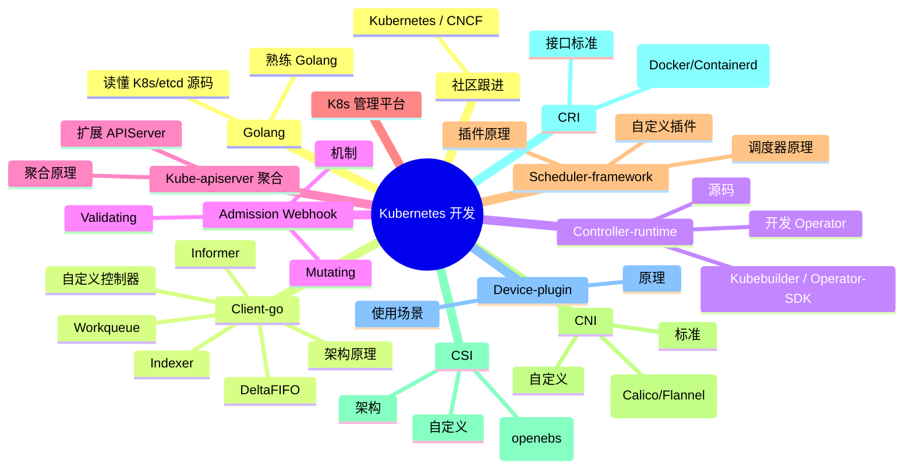
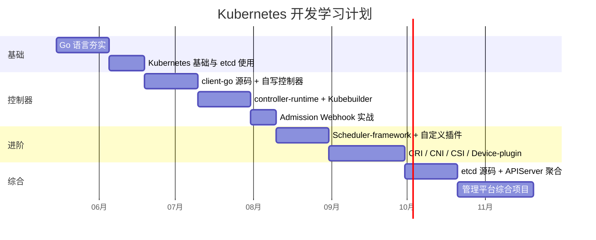

#kubernetes #学习计划 #源码导读

相关笔记：[[client-go-source]] | [[controller-runtime-source]] | [[scheduler-framework-source]] | [[kubelet-cri-source]] | [[etcd-source]] | [[kubebuilder]] | [[operator-pattern]] | [[k8s-interview]]

## 概述

本笔记基于「Kubernetes 开发」学习路线图，把通往 Kubernetes 开发岗（控制器/调度器/平台/CSI/CNI/CRI/Device Plugin）所需的能力拆成 12 个主题，给出每个主题的子目标、推荐顺序、关键源码切入点、配套笔记，以及一份可执行的阶段化学习计划。配合 `learning-plan/` 目录下 9 篇源码导读笔记（client-go、controller-runtime、kube-scheduler、kubelet+CRI+Device-plugin、CSI、CNI、GPU 调度、HAMi GPU 虚拟化、etcd），形成「路线图 → 源码 → 面试」的闭环。

## 学习路线图

## 12 个主题分解

### 1. Golang — 基础底座

**目标**：熟练掌握 Go 语言，能流畅阅读 Kubernetes、etcd、controller-runtime 等大型项目源码。

| 子目标 | 推荐切入点 | 配套笔记 |
| --- | --- | --- |
| 调度模型 | runtime 调度器 GMP | [[gmp-model]]、[[p-runnext]] |
| 内存/GC | 三色标记、写屏障 | [[gc]] |
| 并发原语 | channel、context、sync | [[channel]]、[[context]] |
| 类型系统 | interface 内部结构 | [[interface]] |
| 数据结构 | slice、map 扩容 | [[slice]]、[[map-internals]] |
| 版本特性 | 1.18 泛型、1.21+ | [[go-versions]] |

**衡量标准**：能徒手画出 GMP/GC 流程图、能解释 `select` 编译期处理、能看懂 `runtime` 包中的协作式抢占代码。

### 2. Client-go — 控制器开发地基

**目标**：吃透 Informer 机制，能脱离脚手架手写一个 sample-controller。

| 子目标 | 源码位置 | 配套笔记 |
| --- | --- | --- |
| Client-go 架构 | `kubernetes/client-go` 各 client | [[client-go-source]] |
| DeltaFIFO | `tools/cache/delta_fifo.go` | [[client-go-source]] |
| Indexer / ThreadSafeStore | `tools/cache/thread_safe_store.go` | [[client-go-source]] |
| Informer / SharedInformer | `tools/cache/shared_informer.go` | [[informer]]、[[client-go-source]] |
| Workqueue | `util/workqueue/*.go` | [[client-go-source]] |
| 自定义控制器骨架 | `sample-controller` 项目 | [[client-go-source]] |

**衡量标准**：能画出 `Reflector → DeltaFIFO → Indexer → Workqueue → syncHandler` 的完整数据流，能解释 `Resync`、`HasSynced`、`Workqueue dirty/processing` 的设计动机。

### 3. Controller-runtime — Operator 开发框架

**目标**：从 Kubebuilder 脚手架出发，理解 controller-runtime 的 Manager / Cache / Builder / Reconciler，能独立开发生产级 Operator。

| 子目标 | 源码位置 | 配套笔记 |
| --- | --- | --- |
| Manager / Runnable | `pkg/manager` | [[controller-runtime-source]] |
| Controller / Reconciler | `pkg/internal/controller` | [[controller-runtime-source]] |
| Builder / Source / Predicate | `pkg/builder`、`pkg/source` | [[controller-runtime-source]] |
| Cache / Client（split client） | `pkg/cache`、`pkg/client` | [[controller-runtime-source]] |
| Kubebuilder 实战 | kubebuilder 脚手架 | [[kubebuilder]]、[[operator-pattern]] |

**衡量标准**：能解释 `For` / `Owns` / `Watches` 的差异、`Reconcile` 返回 `error`/`RequeueAfter` 的语义差异、`MaxConcurrentReconciles` 为什么不会破坏同 key 串行性。

### 4. Admission Webhook — 准入控制

**目标**：理解 Mutating/Validating Webhook 在 apiserver 写路径上的位置，能用 controller-runtime 开发并安全部署 Webhook。

| 子目标 | 关键点 | 配套笔记 |
| --- | --- | --- |
| Admission 机制 | apiserver 写路径：认证 → 鉴权 → Mutating → schema → Validating → 持久化 | [[controller-runtime-source]] |
| ValidatingAdmissionWebhook | `CustomValidator`、JSON Patch | [[controller-runtime-source]] |
| MutatingAdmissionWebhook | `CustomDefaulter`、注入 sidecar/默认值 | [[controller-runtime-source]] |
| 生产化 | cert-manager 自动签发、`failurePolicy` 与 `namespaceSelector` | [[controller-runtime-source]] |

**衡量标准**：能解释为什么 `failurePolicy: Fail` 必须配合 `namespaceSelector` 排除 `kube-system`，能定位"Webhook Pod 自己起不来"的死锁场景。

### 5. Kube-apiserver 聚合（可选）

**目标**：理解 APIService 聚合层与 CRD 的差异，能开发独立的扩展 APIServer（aggregated APIServer）。

- 学习 `apiextensions-apiserver`（CRD 实现）和 `sample-apiserver` 项目结构
- 理解 `APIService` 资源、Kube-aggregator 路由分发
- 何时该用 CRD vs 聚合 APIServer：自定义存储/复杂校验/子资源行为 → 聚合 APIServer；简单声明式资源 → CRD

**衡量标准**：能在 30 分钟内基于 `sample-apiserver` 跑起一个 aggregated APIServer，并解释和 CRD 的取舍。

### 6. Kubernetes 管理平台

**目标**：把前 5 项能力组合落地为一个面向租户的多集群/资源管理平台。

- 多集群：Karmada、Clusternet、Cluster API
- 多租户：ResourceQuota、LimitRange、HierarchicalNamespace
- 平台能力：可视化、审计、计费、镜像分发、统一日志
- 参考：Rancher、KubeSphere、OpenShift 的架构

**衡量标准**：能画出一个生产平台的分层架构（接入层 / 控制层 / 集群层），并解释每层为什么用对应组件。

### 7. Scheduler-framework — 调度器扩展

**目标**：理解 kube-scheduler 的调度循环、Scheduling Framework 11 个扩展点，能开发并部署自定义调度插件。

| 子目标 | 源码位置 | 配套笔记 |
| --- | --- | --- |
| 调度器整体结构 | `pkg/scheduler/scheduler.go` | [[scheduler-deep-dive]]、[[scheduler-framework-source]] |
| 11 个扩展点 | `pkg/scheduler/framework/interface.go` | [[scheduler-framework-source]] |
| 调度队列 | activeQ / backoffQ / unschedulableQ | [[scheduler-framework-source]] |
| assume 机制 | `pkg/scheduler/internal/cache` | [[scheduler-assume]] |
| 自定义插件 | `app.WithPlugin` | [[scheduler-framework-source]] |

**衡量标准**：能默写完整扩展点顺序（PreFilter → Filter → PreScore → Score → Reserve → Permit → PreBind → Bind → PostBind），能解释 `CycleState` 与 `Snapshot` 的设计、`percentageOfNodesToScore` 的取舍。

### 8. CNI — 容器网络

**目标**：理解 CNI 标准与主流插件的实现差异，能开发自定义 CNI 插件。

| 子目标 | 关键点 | 配套笔记 |
| --- | --- | --- |
| CNI 标准 | `ADD/DEL/CHECK`、二进制 + JSON 协议 | [[cni]]、[[cni-source]] |
| libcni / conflist | 插件链、prevResult chain、fork+exec | [[cni-source]] |
| Calico | BGP / IPIP / VXLAN、Felix、IPAM | [[calico]] |
| Flannel | overlay 简单实现 | [[flannel]] |
| Cilium | eBPF 数据面 | [[cilium]] |
| 其他 | Weave、Multus（多网卡） | [[weave]]、[[multus]] |
| Service / 网络模型 | iptables/ipvs、Pod-Pod 通信 | [[service]]、[[network-model]] |

**衡量标准**：能在一台机器上手写一个最简 CNI 插件实现 `ADD/DEL`，能解释 Calico BGP 路由与 Flannel VXLAN 转发的差异。

**配套**：源码导读 [[cni-source]]（CNI 协议 / libcni / bridge 插件 / Calico·Cilium·Flannel 数据面入口）+ 可运行 demo [[demo-cni-bridge]]（100 行 bash 实现 bridge 插件，Mac 上 `./run-in-docker.sh` 一键跑）。

### 9. CSI — 容器存储

**目标**：理解 CSI 三大 service 和 sidecar 模型，能开发自定义 CSI 插件。

| 子目标 | 关键点 | 配套笔记 |
| --- | --- | --- |
| CSI 架构 | Identity / Controller / Node service | [[csi]] |
| Sidecar 体系 | external-provisioner、external-attacher、node-driver-registrar | [[csi]] |
| 主流实现 | Ceph-CSI、Longhorn、OpenEBS、NFS | [[ceph-csi]]、[[longhorn]]、[[openebs]]、[[nfs-csi]] |
| 云厂商 | AWS EBS、GCE PD、阿里云盘 | [[cloud-provider-csi]] |

**衡量标准**：能画出 PVC → Provision → Attach → Mount 的完整时序图，知道每个步骤由哪个 sidecar 调哪个 CSI RPC。

### 10. CRI — 容器运行时接口

**目标**：理解 CRI gRPC 标准与主流运行时（containerd、CRI-O）的实现，能定位 kubelet ↔ runtime 链路的问题。

| 子目标 | 关键点 | 配套笔记 |
| --- | --- | --- |
| CRI 接口 | RuntimeService / ImageService | [[kubelet-cri-source]] |
| containerd | CRI plugin、containerd-shim | [[kubelet-cri-source]]、[[oci-runtime]] |
| dockershim 移除 | 历史与影响 | [[kubelet-cri-source]] |
| OCI Runtime | runc、镜像规范 | [[oci-runtime]] |

**衡量标准**：能画出 `kubelet → CRI → containerd → containerd-shim → runc` 的完整链路，能解释 Sandbox / Pause 容器的作用。

### 11. Device Plugin — 异构资源

**目标**：理解 Device Plugin 框架，能为新硬件（GPU、FPGA、RDMA、NPU）开发设备插件。

| 子目标 | 关键点 | 配套笔记 |
| --- | --- | --- |
| 注册流程 | `kubelet.sock`、Register RPC | [[kubelet-cri-source]] |
| 上报与分配 | `ListAndWatch`、`Allocate` | [[kubelet-cri-source]] |
| GPU 实战 | NVIDIA device plugin、Topology Manager | [[gpu-scheduling]] |

**衡量标准**：能解释 Scheduler 与 kubelet 在 GPU 分配中的分工，能解决 kubelet 重启后插件失联的问题（fsnotify 重新注册）。

**进阶 GPU 共享**：原生 Device Plugin 只能整卡分，看 [[hami-learning-path]]（学习路径）+ [[hami-source]]（源码导读）—— HAMi（CNCF Sandbox）的 GPU 虚拟化方案，把 device-plugin + scheduler-extender + webhook + LD_PRELOAD 的 libvgpu.so 串起来实现显存/算力级切分；配套可运行 demo [[demo-hami-mac]]。

### 12. 社区跟进 — 持续输入

- **Kubernetes**：订阅 `kubernetes-sigs` 各 SIG（SIG-Scheduling / SIG-Node / SIG-Storage / SIG-Network）的周会纪要与 KEP（Kubernetes Enhancement Proposal）
- **CNCF**：CNCF Landscape 关注项目毕业状态、CNCF TOC 公开会议
- **关键 KEP**：1.28+ 的 `In-place Pod Resize`、`KubeletInUserNamespace`、`DRA`（Dynamic Resource Allocation 取代/增强 Device Plugin）
- **博客 / Newsletter**：Kubernetes Blog、Last Week in Kubernetes Development、Cloud Native Now

## 阶段化学习计划（建议 4-6 个月）

### Phase 1：基础（4-5 周）
1. 复习 Go：GMP、GC、Channel、Context、Interface
2. 跑通 minikube / kind 集群，操作 etcdctl，熟悉 kubectl 全部子命令
3. 读完 [[kubernetes-basics]]、[[etcd]]、[[oci-runtime]]、[[informer]]

### Phase 2：控制器（7-8 周）
1. 通读 [[client-go-source]]，配合 client-go 源码逐文件看 `tools/cache`、`util/workqueue`
2. 手写一个 sample-controller（不用 Kubebuilder，从零拼装 Informer + Workqueue + syncHandler）
3. 通读 [[controller-runtime-source]]，用 Kubebuilder 实现一个 CRD + Reconciler（推荐：MysqlBackup、AppDeploy）
4. 给项目加 Validating + Mutating Webhook，集成 cert-manager
5. 阅读 [[kubebuilder]]、[[operator-pattern]]

### Phase 3：进阶模块（7-8 周）
1. 通读 [[scheduler-framework-source]]，开发一个自定义 Score 插件并部署为 secondary scheduler
2. CNI：跑 [[demo-cni-bridge]] 手写最简 bridge 插件；读 [[cni-source]]、[[cni]]、[[calico]]、[[cilium]]
3. CSI：基于 csi-driver-host-path 改造一个本地 CSI 插件；读 [[csi-source]]、[[csi]]、[[openebs]]
4. CRI / Device Plugin：实现一个 fake-device-plugin 注册到 kubelet；读 [[kubelet-cri-source]]、[[gpu-scheduling]]

### Phase 4：综合（7-8 周）
1. 通读 [[etcd-source]]，跑通 raftexample，理解 raft Ready 循环
2. 基于 sample-apiserver 实现一个聚合 APIServer
3. 综合项目：搭一个小型多集群/多租户平台，集成自己写的 Operator + Webhook + 调度插件
4. 同步开始刷 [[k8s-interview]]，把上面所有面试要点过 3 遍

## 源码导读索引

每篇都包含三层：① 概念与架构；② 真实源码片段；③ 手写简化复现，配套有可直接 `go run` 的 demo。其中第 ② 层的源码定位精度分两档：**7 篇**（client-go / controller-runtime / kube-scheduler / kubelet+CRI / CSI / GPU 调度 / etcd）基于本地 `~/github/kubernetes`、`~/github/etcd` 源码，带**文件路径 + 行号**；**2 篇**（[[cni-source]] / [[hami-source]]）因对应仓库（containernetworking、Project-HAMi）不在本地，只给**目录 + 函数名**定位，clone 后可补行号。

| 源码 | 笔记 | 配套 demo | 关键模块 |
| --- | --- | --- | --- |
| client-go | [[client-go-source]] | [[demo-sample-controller]] | Reflector / DeltaFIFO / Indexer / SharedInformer / Workqueue |
| controller-runtime | [[controller-runtime-source]] | [[demo-kubebuilder-operator]] | Manager / Controller / Reconciler / Cache / Builder / Webhook |
| kube-scheduler | [[scheduler-framework-source]] | [[demo-scheduler-plugin]] | Scheduler / Framework / SchedulingQueue / CycleState |
| kubelet + CRI | [[kubelet-cri-source]] | [[demo-device-plugin]] | SyncLoop / PLEG / CRI / Device Plugin |
| CSI | [[csi-source]] | [[demo-csi-hostpath]] | pkg/volume/csi / sidecars / Identity-Controller-Node |
| CNI | [[cni-source]] | [[demo-cni-bridge]] | CNI 协议 / libcni / bridge·host-local / Calico·Cilium·Flannel 数据面 |
| GPU 调度 | [[gpu-scheduling-source]] | [[demo-fake-gpu]] | Scheduler ↔ DeviceManager ↔ Device Plugin / DRA |
| HAMi GPU 虚拟化 | [[hami-source]] | [[demo-hami-mac]] | webhook / scheduler-extender / device-plugin / libvgpu.so CUDA hook |
| etcd | [[etcd-source]] | [[demo-raftexample-walkthrough]] | raft / WAL / MVCC / Watch / Lease |

## 面试要点

| 问题 | 回答要点 |
| --- | --- |
| **K8s 开发岗一般考察哪些方向？** | 三大方向：① 控制器/Operator 开发（client-go、controller-runtime、CRD、Webhook）；② 调度/资源（Scheduler-framework、Device Plugin、GPU）；③ 底层扩展（CNI、CSI、CRI、APIServer 聚合）。所有方向都要求 Go 语言扎实和会读 K8s 源码。 |
| **如果从零开始，学习顺序建议是什么？** | Go → kubectl/etcd → client-go → controller-runtime → Webhook → Scheduler-framework → CNI/CSI/CRI/Device Plugin → APIServer 聚合 → etcd 源码。先掌握控制器开发再深入底层，避免一开始陷在 CNI/CSI 实现细节里。 |
| **client-go 和 controller-runtime 的关系？** | controller-runtime 基于 client-go 封装。它把 Informer/Lister/Workqueue/Cache 封装进 Manager，提供 Reconciler 编程范式，省掉 sample-controller 那种胶水代码。生产 Operator 用 controller-runtime + Kubebuilder，但定位疑难问题仍需理解 client-go。 |
| **Scheduler 扩展，Framework Plugin 和 Extender 怎么选？** | Framework Plugin 是进程内 Go 代码、性能好、覆盖全部扩展点，但要重新编译调度器；Extender 是 HTTP webhook，仅 Filter/Score/Bind，有网络延迟和单点风险。生产深度定制优先 Plugin，Extender 仅用于对接遗留系统。 |
| **CRD + Webhook + Controller 是 K8s 扩展的"三件套"，分工如何？** | CRD 定义资源模型与 schema；Webhook 在写入路径做默认值注入（Mutating）与不变量校验（Validating）；Controller/Operator 在写入完成后异步 reconcile 把期望态变成实际态。三者解耦，可独立演进。 |
| **Device Plugin 之后是 DRA，DRA 解决了什么？** | Device Plugin 只能上报"数量"，调度器看不到设备拓扑/属性（NVLink、共享 GPU、带宽），分配在 kubelet 侧。DRA（Dynamic Resource Allocation, KEP-3063/4381）把"资源声明 + 调度时分配"上移到 apiserver/调度器，支持复杂资源（结构化参数、共享、拓扑），未来替代 Device Plugin。 |
| **想读 K8s 源码，哪些入口最高 ROI？** | ① `staging/src/k8s.io/client-go/tools/cache` 看 Informer 机制（中型代码量、自包含）；② `pkg/scheduler/scheduler.go::ScheduleOne` 看一次调度循环；③ `pkg/kubelet/kubelet.go::syncLoop` 看节点侧主循环；④ controller-runtime 的 `pkg/internal/controller/controller.go::Start` 看 Reconciler 怎么被驱动。 |
| **如何跟进 K8s 社区进展？** | 关注 KEP 仓库（kubernetes/enhancements）的 release milestones、SIG 周会纪要、Kubernetes Blog 的 release notes；订阅 "Last Week in Kubernetes Development"。重点版本：1.28+ 的 In-place Resize、Sidecar Container、DRA、Validating Admission Policy（CEL）。 |
| **学习计划里为什么把 etcd 放到最后？** | etcd 是 K8s 的存储底座，但日常控制器/调度器开发不直接和 etcd 打交道（apiserver 已抽象）。先掌握上层开发能力（控制器、Webhook、调度）后，再回头读 raft/MVCC 源码，理解 `resourceVersion ↔ revision`、watch cache、compaction 等机制，能把整个体系打通。 |
| **学习成果如何对外展示？** | ① GitHub：1 个 sample-controller、1 个 Kubebuilder Operator、1 个 scheduler plugin、1 个 device plugin；② 笔记仓库（本仓库即是）；③ 在生产/演示集群上跑通自己的扩展并写 demo 文档；④ 参与一个 CNCF 项目提交 PR（哪怕只是文档/typo）。 |
