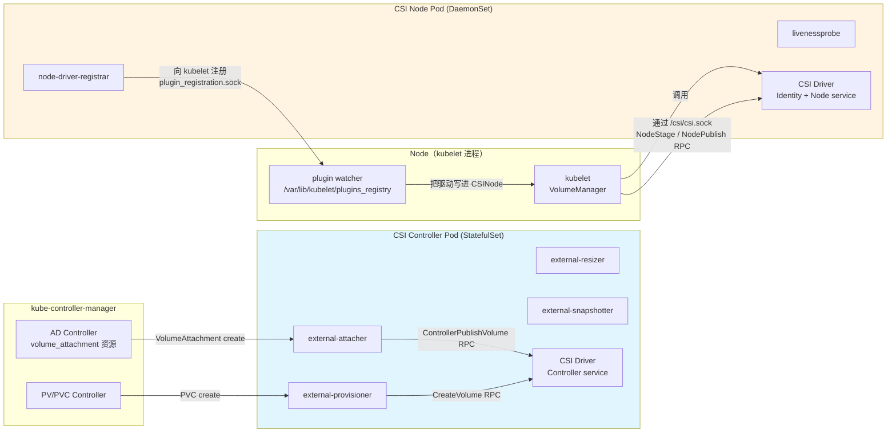
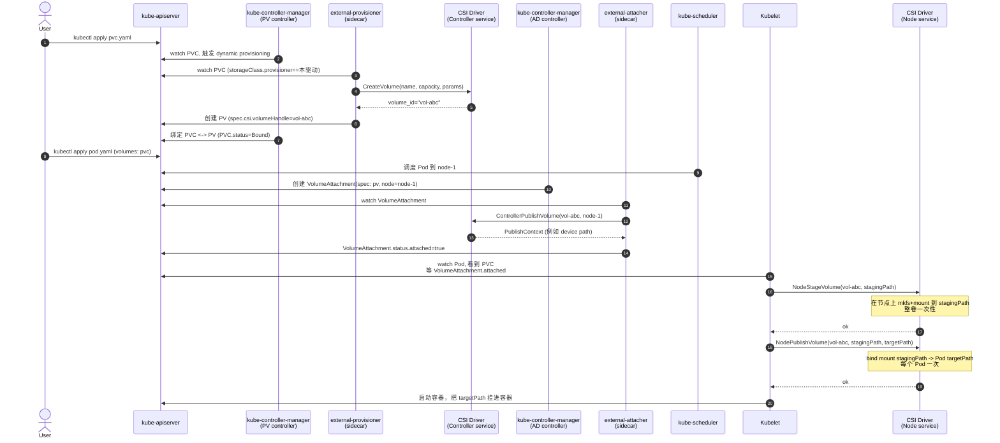
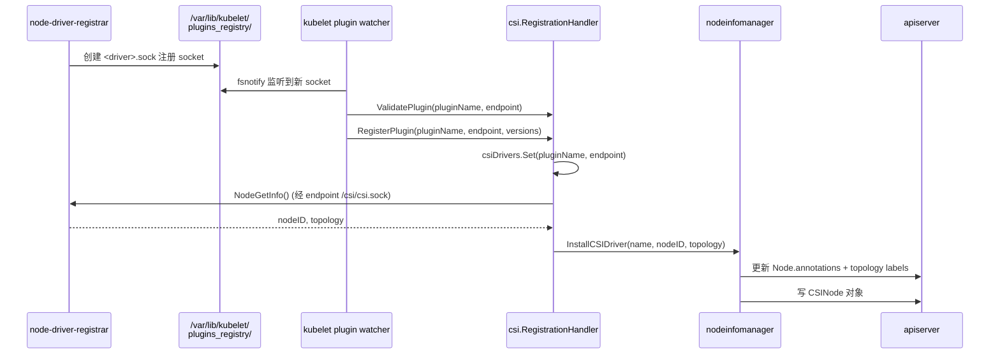
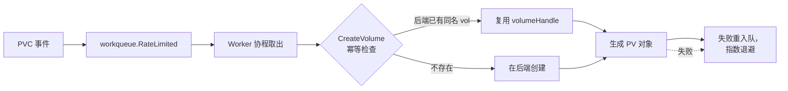

#kubernetes #csi #源码导读

相关笔记：[[csi]] | [[volume-lifecycle]] | [[csi-sidecars]] | [[csi-troubleshooting]] | [[ceph-csi]] | [[longhorn]] | [[openebs]] | [[k8s-development-roadmap]] | [[demo-csi-hostpath]] | [[k8s-interview]]

## 概述

本篇是 **Container Storage Interface（CSI）** 的源码导读笔记，覆盖两个层面：(1) 上游 CSI 规范本身（`github.com/container-storage-interface/spec`），定义了存储插件必须实现的 gRPC 接口；(2) Kubernetes 客户端实现（`pkg/volume/csi/`），即 kubelet 与 kube-controller-manager 如何通过 unix socket 调插件的 RPC。CSI 解决的核心问题是把"存储驱动"从 K8s 主干仓库里彻底拆出去——存储厂商写一个独立进程实现 gRPC service，K8s 主干通过统一接口调用，存储与编排器各自独立演进。每个 CSI 驱动需要实现 **三个 gRPC service**：`Identity`（自我描述）、`Controller`（卷的生命周期）、`Node`（节点上的挂载操作）；K8s 侧通过 **六个 sidecar** 容器（external-provisioner / external-attacher / external-resizer / external-snapshotter / node-driver-registrar / livenessprobe）把"K8s 对象事件"翻译成 CSI RPC 调用——这套设计让插件代码完全不需要 import client-go。同时 K8s 主干在 `pkg/volume/csi/` 维护了 **kubelet/AD-controller 侧的客户端代码**，负责发起 `NodeStageVolume` / `NodePublishVolume` / `Attach` 等真正进入插件的 RPC 调用。本文按"CSI 规范 → sidecar 体系 → 端到端时序 → K8s 客户端源码 → CSI proto 关键定义 → idempotency 设计 → 手写复现 → CSI Migration"的顺序通读，并在 `learning-plan/demos/csi-hostpath/` 给出一个最小可运行的 hostPath 风格 CSI 驱动骨架。



整张架构图最容易看漏的两点：
1. **Sidecar 是 K8s 侧的，不属于 CSI 规范**。CSI 规范只规定 gRPC 接口；sidecar 是 SIG Storage 给 K8s 写的"翻译层"，把 K8s 对象事件（PVC 创建、VolumeAttachment 创建）转成对插件 gRPC 接口的调用。
2. **CSI Driver 一般有两套 Pod**：Controller 侧是 StatefulSet（全集群一个），Node 侧是 DaemonSet（每节点一份）。同一个二进制按 `--mode=controller` / `--mode=node` 区分启动逻辑也常见。

## 一、CSI 规范：三大 service

CSI 协议在 `github.com/container-storage-interface/spec/csi.proto` 定义，K8s 主仓 vendor 进来在 `vendor/github.com/container-storage-interface/spec/lib/go/csi/csi.pb.go`。三个 service 互相独立——驱动可以只实现 Identity + Node（典型的 local volume / ephemeral volume），也可以三个全实现（远端块存储如 EBS、Ceph RBD）。

### Identity service：自我描述

```go
// 文件: vendor/github.com/container-storage-interface/spec/lib/go/csi/csi.pb.go:6252-6256
type IdentityServer interface {
    GetPluginInfo(context.Context, *GetPluginInfoRequest) (*GetPluginInfoResponse, error)
    GetPluginCapabilities(context.Context, *GetPluginCapabilitiesRequest) (*GetPluginCapabilitiesResponse, error)
    Probe(context.Context, *ProbeRequest) (*ProbeResponse, error)
}
```

| RPC | 用途 |
|-----|------|
| `GetPluginInfo` | 返回驱动名（如 `ebs.csi.aws.com`）+ 版本字符串。**这个名字是 K8s 侧的"全局唯一身份"**，StorageClass.provisioner、VolumeAttachment.spec.attacher、CSIDriver 对象名都以它为准。 |
| `GetPluginCapabilities` | 声明插件具备哪些 service：`CONTROLLER_SERVICE`（实现了 Controller service）、`VOLUME_ACCESSIBILITY_CONSTRAINTS`（拓扑感知）等。K8s 据此决定是否调用 Controller service。 |
| `Probe` | 健康检查；返回非 `Ready` 则 livenessprobe sidecar 会让 kubelet 重启 Pod。 |

Identity 必须由 **Controller Pod 和 Node Pod 都实现**——sidecar 在调用 Controller / Node 之前都会先 `Probe`。

### Controller service：卷生命周期

```go
// 文件: vendor/github.com/container-storage-interface/spec/lib/go/csi/csi.pb.go:6506-6521
type ControllerServer interface {
    CreateVolume(context.Context, *CreateVolumeRequest) (*CreateVolumeResponse, error)
    DeleteVolume(context.Context, *DeleteVolumeRequest) (*DeleteVolumeResponse, error)
    ControllerPublishVolume(context.Context, *ControllerPublishVolumeRequest) (*ControllerPublishVolumeResponse, error)
    ControllerUnpublishVolume(context.Context, *ControllerUnpublishVolumeRequest) (*ControllerUnpublishVolumeResponse, error)
    ValidateVolumeCapabilities(context.Context, *ValidateVolumeCapabilitiesRequest) (*ValidateVolumeCapabilitiesResponse, error)
    ListVolumes(context.Context, *ListVolumesRequest) (*ListVolumesResponse, error)
    GetCapacity(context.Context, *GetCapacityRequest) (*GetCapacityResponse, error)
    ControllerGetCapabilities(context.Context, *ControllerGetCapabilitiesRequest) (*ControllerGetCapabilitiesResponse, error)
    CreateSnapshot(context.Context, *CreateSnapshotRequest) (*CreateSnapshotResponse, error)
    DeleteSnapshot(context.Context, *DeleteSnapshotRequest) (*DeleteSnapshotResponse, error)
    ListSnapshots(context.Context, *ListSnapshotsRequest) (*ListSnapshotsResponse, error)
    ControllerExpandVolume(context.Context, *ControllerExpandVolumeRequest) (*ControllerExpandVolumeResponse, error)
    ControllerGetVolume(context.Context, *ControllerGetVolumeRequest) (*ControllerGetVolumeResponse, error)
    ControllerModifyVolume(context.Context, *ControllerModifyVolumeRequest) (*ControllerModifyVolumeResponse, error)
}
```

关键 RPC：

| RPC | 触发场景 | 实际做什么 |
|-----|----------|------------|
| `CreateVolume` | external-provisioner 监听到 PVC 需要 dynamic provisioning | 在存储后端创建实际的卷（EBS volume / Ceph RBD image / NFS subdir），返回 `volume_id`。K8s 用这个 id 创建 PV。 |
| `DeleteVolume` | PV 被删除且 reclaimPolicy=Delete | 删除后端卷 |
| `ControllerPublishVolume` | AD Controller 创建 VolumeAttachment | "把卷挂到目标节点上"——对 EBS 是 attach 到 EC2 实例；对网络存储常常 no-op |
| `ControllerUnpublishVolume` | VolumeAttachment 被删除 | 从节点 detach |
| `ControllerExpandVolume` | PVC 容量被改大 | 在存储后端扩容（块设备层面） |
| `CreateSnapshot` / `DeleteSnapshot` | VolumeSnapshot 对象事件 | 后端快照管理 |

Controller service 一般部署在**集群内独立的 StatefulSet Pod 里**——它操作的是云厂商 API / 存储集群管理面，不需要"在哪个节点跑"。

### Node service：节点挂载

```go
// 文件: vendor/github.com/container-storage-interface/spec/lib/go/csi/csi.pb.go:7166-7175
type NodeServer interface {
    NodeStageVolume(context.Context, *NodeStageVolumeRequest) (*NodeStageVolumeResponse, error)
    NodeUnstageVolume(context.Context, *NodeUnstageVolumeRequest) (*NodeUnstageVolumeResponse, error)
    NodePublishVolume(context.Context, *NodePublishVolumeRequest) (*NodePublishVolumeResponse, error)
    NodeUnpublishVolume(context.Context, *NodeUnpublishVolumeRequest) (*NodeUnpublishVolumeResponse, error)
    NodeGetVolumeStats(context.Context, *NodeGetVolumeStatsRequest) (*NodeGetVolumeStatsResponse, error)
    NodeExpandVolume(context.Context, *NodeExpandVolumeRequest) (*NodeExpandVolumeResponse, error)
    NodeGetCapabilities(context.Context, *NodeGetCapabilitiesRequest) (*NodeGetCapabilitiesResponse, error)
    NodeGetInfo(context.Context, *NodeGetInfoRequest) (*NodeGetInfoResponse, error)
}
```

`NodeStageVolume` vs `NodePublishVolume` 是 CSI 设计里最容易混的两个 RPC：

- **`NodeStageVolume`** — 在节点上做"**与 Pod 无关的、整卷一次性的**"准备工作。典型实现：把块设备 `mkfs` 成文件系统、`mount` 到一个**全局 stagingPath**（例如 `/var/lib/kubelet/plugins/<driver>/staging/<volId>`）。整卷只调一次。
- **`NodePublishVolume`** — 把已 stage 好的卷**绑定挂载（bind mount）到具体 Pod 的 targetPath**（`/var/lib/kubelet/pods/<podUID>/volumes/kubernetes.io~csi/<volName>/mount`）。每个使用该卷的 Pod 调一次。

这样多个 Pod 共用同一个 ReadWriteMany 卷时，stage 只做一次，publish 做多次——典型的"一次重操作 + N 次轻操作"分层。`NodeGetCapabilities` 返回 `STAGE_UNSTAGE_VOLUME` 才会触发 stage 流程；不声明则 K8s 跳过 stage 直接 publish。

`NodeGetInfo` 在 driver 注册阶段被 kubelet 调一次，返回 `node_id`（驱动眼中的节点标识，如 EC2 instance-id）和 topology key/value（如 `topology.ebs.csi.aws.com/zone=us-east-1a`），K8s 把这些写进 `CSINode` 对象 + Node label，调度器据此做拓扑感知。

## 二、Sidecar 体系

每个 sidecar 都是一个独立的容器进程，跟 CSI 驱动**共享 emptyDir 卷**（挂载到 `/csi`），通过 unix socket `/csi/csi.sock` 与驱动 gRPC 通信。它们的代码都在 `kubernetes-csi/external-*` / `kubernetes-csi/node-driver-registrar` 仓库。

| Sidecar | watch 哪个 K8s 对象 | 调插件的哪个 RPC | 部署位置 |
|---------|---------------------|-------------------|----------|
| **external-provisioner** | `PVC`（StorageClass.provisioner == 本驱动名） | `CreateVolume` / `DeleteVolume` | Controller Pod |
| **external-attacher** | `VolumeAttachment` | `ControllerPublishVolume` / `ControllerUnpublishVolume` | Controller Pod |
| **external-resizer** | `PVC` 容量字段变化 | `ControllerExpandVolume` / `NodeExpandVolume` | Controller Pod |
| **external-snapshotter** | `VolumeSnapshot` / `VolumeSnapshotContent` | `CreateSnapshot` / `DeleteSnapshot` | Controller Pod |
| **node-driver-registrar** | （不 watch K8s）通过 `/var/lib/kubelet/plugins_registry/` 向 kubelet 注册 | 启动时调 `GetPluginInfo` + `NodeGetInfo` | Node Pod |
| **livenessprobe** | （不 watch K8s）作为 HTTP /healthz 暴露给 kubelet liveness probe | 周期性调 `Probe` | Controller Pod + Node Pod |

工作模式总结成一句话：**sidecar 替插件作者写完了所有"与 K8s API 打交道"的代码**——这也是为什么 CSI 驱动本身一行 client-go 都不用 import，可以做到完全跨编排器（同一个驱动二进制理论上也能跑在 Mesos / Nomad 上，只要那边有等价的 sidecar）。

## 三、端到端时序：PVC 到容器挂载

下图给一次"PVC 动态供给 + 远端块存储 Pod 启动"的完整路径，涵盖 dynamic provisioning、attach、stage、publish 全流程：



要点：
- **Provision、Attach、Stage、Publish 是四个独立阶段**，分别由不同组件触发：provisioner 在 controller-manager 侧，attacher 在 controller-manager 侧，stage/publish 在 kubelet 侧。
- **VolumeAttachment 对象是 attach 阶段的"账本"**：AD Controller 创建它表示"想要把这个卷 attach 到那个节点"，external-attacher 看到后真正调 CSI；状态写回 `status.attached=true` 后 kubelet 才会开始 stage。
- **Stage 与 Publish 的 staging/target path 都由 kubelet 决定并传给 driver**——driver 不需要自己规划路径。

## 四、K8s 客户端源码（pkg/volume/csi）

这一节聚焦 K8s 主干**作为 CSI 客户端**的代码：kubelet / AD-controller 如何发起 `Attach` / `NodeStage` / `NodePublish` 等 RPC。路径相对 `kubernetes/kubernetes`，行号取自当前 master（2026-03，Go 1.26）。

### 4.1 csiPlugin 的注册与初始化

K8s 内部把 CSI 视作一个 **VolumePlugin**，统一通过 `pkg/volume/plugins.go` 的 `VolumePluginMgr` 管理。CSI 插件在 `pkg/volume/csi/csi_plugin.go` 注册：

```go
// 文件: pkg/volume/csi/csi_plugin.go:75-80
func ProbeVolumePlugins() []volume.VolumePlugin {
    p := &csiPlugin{
        host: nil,
    }
    return []volume.VolumePlugin{p}
}
```

`ProbeVolumePlugins()` 会被 kubelet / controller-manager 在启动时调用，把 `csiPlugin` 这一个全局单例注册进 `VolumePluginMgr`。注意整个进程只有一个 `csiPlugin` 实例——它内部通过 driverName 路由到具体驱动。

```go
// 文件: pkg/volume/csi/csi_plugin.go:431-433
func (p *csiPlugin) GetPluginName() string {
    return CSIPluginName  // "kubernetes.io/csi"
}
```

这个常量 `kubernetes.io/csi` 是 K8s 内部对所有 CSI 驱动的统一"插件名"——不要和具体 CSI 驱动名（如 `ebs.csi.aws.com`）混淆。后者保存在 `pvSrc.Driver` 字段里。

`Init` 是 plugin 真正与外部依赖装配的地方：

```go
// 文件: pkg/volume/csi/csi_plugin.go:281-358（节选）
func (p *csiPlugin) Init(host volume.VolumeHost) error {
    p.host = host

    csiClient := host.GetKubeClient()
    // ... 按 host 类型（KubeletVolumeHost / AttachDetachVolumeHost / CSIDriverVolumeHost）
    //     注入对应的 lister（CSIDriverLister / VolumeAttachmentLister）
    kletHost, ok := host.(volume.KubeletVolumeHost)
    if ok {
        p.csiDriverLister = kletHost.CSIDriverLister()
        p.serviceAccountTokenGetter = host.GetServiceAccountTokenFunc()
        p.volumeAttachmentLister = nil // kubelet 里不需要
        informerFactory := kletHost.GetInformerFactory()
        p.csiDriverInformer = informerFactory.Storage().V1().CSIDrivers().Informer()
    }

    // Initializing the label management channels
    nim = nodeinfomanager.NewNodeInfoManager(host.GetNodeName(), host, migratedPlugins)
    PluginHandler.csiPlugin = p

    // 阻止 kubelet 上报 Ready，直到 CSINode 对象已初始化
    if err := initializeCSINode(host, p.csiDriverInformer); err != nil {
        return errors.New(log("failed to initialize CSINode: %v", err))
    }
    return nil
}
```

关键设计：

1. **同一份 csiPlugin 代码在 kubelet 和 AD-controller 里都用**，靠 `host` 接口类型（`KubeletVolumeHost` vs `AttachDetachVolumeHost`）分支区分需要哪些能力。kubelet 关心 `CSIDriverLister`（决定要不要传 podInfo、要不要做 SELinux mount），AD-controller 关心 `VolumeAttachmentLister`（轮询 attach 状态）。
2. **`PluginHandler` 是 plugin watcher 的回调接口**：kubelet 启动后用 fsnotify 监听 `/var/lib/kubelet/plugins_registry/`，新 socket 出现时调 `PluginHandler.ValidatePlugin` / `RegisterPlugin`——这是 node-driver-registrar 与 kubelet 握手的入口。

### 4.2 注册握手：RegisterPlugin → NodeGetInfo → InstallCSIDriver

```go
// 文件: pkg/volume/csi/csi_plugin.go:118-164（节选）
func (h *RegistrationHandler) RegisterPlugin(pluginName string, endpoint string, versions []string, pluginClientTimeout *time.Duration) error {
    klog.Info(log("Register new plugin with name: %s at endpoint: %s", pluginName, endpoint))

    highestSupportedVersion, err := h.validateVersions("RegisterPlugin", pluginName, endpoint, versions)
    if err != nil {
        return err
    }

    // 把驱动 endpoint 记入全局 map，后续 CSI 调用按 pluginName 找 socket
    csiDrivers.Set(pluginName, Driver{
        endpoint:                endpoint,
        highestSupportedVersion: highestSupportedVersion,
    })

    // 从插件读 NodeGetInfo，把 nodeID + topology 写进 CSINode + Node label
    csi, err := newCsiDriverClient(csiDriverName(pluginName))
    ctx, cancel := context.WithTimeout(context.Background(), timeout)
    defer cancel()

    driverNodeID, maxVolumePerNode, accessibleTopology, err := csi.NodeGetInfo(ctx)
    // ...
    err = nim.InstallCSIDriver(pluginName, driverNodeID, maxVolumePerNode, accessibleTopology)
    return nil
}
```

注册流程一图：



`nodeinfomanager.InstallCSIDriver` 的核心逻辑：

```go
// 文件: pkg/volume/csi/nodeinfomanager/nodeinfomanager.go:112-133
func (nim *nodeInfoManager) InstallCSIDriver(driverName string, driverNodeID string, maxAttachLimit int64, topology map[string]string) error {
    if driverNodeID == "" {
        return fmt.Errorf("error adding CSI driver node info: driverNodeID must not be empty")
    }

    nodeUpdateFuncs := []nodeUpdateFunc{
        updateNodeIDInNode(driverName, driverNodeID),
        updateTopologyLabels(topology),
    }

    err := nim.updateNode(nodeUpdateFuncs...)
    if err != nil {
        return fmt.Errorf("error updating Node object with CSI driver node info: %v", err)
    }

    err = nim.updateCSINode(driverName, driverNodeID, maxAttachLimit, topology)
    if err != nil {
        return fmt.Errorf("error updating CSINode object with CSI driver node info: %v", err)
    }

    return nil
}
```

InstallCSIDriver 做了两件事：(1) 在 Node 对象上写一个 annotation `csi.volume.kubernetes.io/nodeid={"ebs.csi.aws.com":"i-1234..."}` 把驱动的 nodeID 映射到 K8s 节点名，并把 topology 写成 Node label（如 `topology.ebs.csi.aws.com/zone=us-east-1a`）；(2) 在 `CSINode` 对象（每节点一个）的 `spec.drivers[]` 数组里追加一条该驱动的记录（包含 max attach limit、topology key 列表）。调度器读 `CSINode` 做拓扑感知调度。

### 4.3 NewMounter 与 SetUpAt：Pod 启动时的挂载入口

kubelet 启动 Pod 时调 `csiPlugin.NewMounter` 构造 `csiMountMgr`，再由 VolumeManager 调它的 `SetUp` / `SetUpAt`：

```go
// 文件: pkg/volume/csi/csi_plugin.go:474-538（节选）
func (p *csiPlugin) NewMounter(
    spec *volume.Spec,
    pod *api.Pod) (volume.Mounter, error) {

    volSrc, pvSrc, err := getSourceFromSpec(spec)
    // ...

    var driverName, volumeHandle string
    switch {
    case volSrc != nil:
        // ephemeral inline volume：driverName 在 PodSpec.volumes[].csi.driver
        volumeHandle = makeVolumeHandle(string(pod.UID), spec.Name())
        driverName = volSrc.Driver
    case pvSrc != nil:
        // 普通 PV：driverName 在 PV.spec.csi.driver
        driverName = pvSrc.Driver
        volumeHandle = pvSrc.VolumeHandle
    }
    // ...

    mounter := &csiMountMgr{
        plugin:              p,
        k8s:                 k8s,
        spec:                spec,
        pod:                 pod,
        podUID:              pod.UID,
        driverName:          csiDriverName(driverName),
        volumeLifecycleMode: volumeLifecycleMode,
        volumeID:            volumeHandle,
        specVolumeID:        spec.Name(),
        readOnly:            readOnly,
        kubeVolHost:         kvh,
    }
    mounter.csiClientGetter.driverName = csiDriverName(driverName)
    // ...
    return mounter, nil
}
```

`csiMountMgr` 是"一次挂载操作的句柄"，持有 driverName、volumeID、pod 等上下文。`csiClientGetter` 是懒加载的 gRPC client（按 driverName 查 `csiDrivers` map 拿到 socket endpoint）。

```go
// 文件: pkg/volume/csi/csi_mounter.go:99-101
func (c *csiMountMgr) SetUp(mounterArgs volume.MounterArgs) error {
    return c.SetUpAt(c.GetPath(), mounterArgs)
}
```

```go
// 文件: pkg/volume/csi/csi_mounter.go:103-200（节选）
func (c *csiMountMgr) SetUpAt(dir string, mounterArgs volume.MounterArgs) error {
    klog.V(4).Info(log("Mounter.SetUpAt(%s)", dir))

    csi, err := c.csiClientGetter.Get()
    if err != nil {
        return volumetypes.NewTransientOperationFailure(log("mounter.SetUpAt failed to get CSI client: %v", err))
    }

    ctx, cancel := createCSIOperationContext(c.spec, csiTimeout)
    defer cancel()

    volSrc, pvSrc, err := getSourceFromSpec(c.spec)
    // ...

    // 检查 CSIDriver.Spec.Mode（Ephemeral / Persistent）与当前 volume 是否匹配
    if err := c.supportsVolumeLifecycleMode(); err != nil { /* ... */ }

    // 区分 ephemeral inline 与 PV 两种来源；这里只列 PV 分支
    if c.volumeLifecycleMode != storage.VolumeLifecyclePersistent { /* ... */ }
    fsType = pvSrc.FSType
    volAttribs = pvSrc.VolumeAttributes

    // 若驱动支持 STAGE_UNSTAGE，目标 stagingPath 已经在 MountDevice 阶段挂好
    stageUnstageSet, _ := csi.NodeSupportsStageUnstage(ctx)
    if stageUnstageSet {
        deviceMountPath, err = makeDeviceMountPath(c.plugin, c.spec)
    }

    // 最终的"挂载到 Pod targetPath"动作：发 NodePublishVolume RPC
    // （省略 publishContext 准备 / token 注入等代码，详见原文件 200-340 行）
}
```

`SetUpAt` 整体就是"准备 NodePublishVolume 请求 + 调 RPC"。`stageUnstageSet` 这个分支体现了 CSI 的分层：如果驱动声明了 `STAGE_UNSTAGE_VOLUME` capability，stage 阶段已经由 `csiAttacher.MountDevice` 做过（见 4.5），这里只剩 bind mount 到 Pod targetPath。

### 4.4 Attach 与 WaitForAttach：AD-controller 侧的入口

`Attach` 跑在 **kube-controller-manager 的 AD Controller** 里（kubelet 里没有 attacher）：

```go
// 文件: pkg/volume/csi/csi_attacher.go:63-139（节选）
func (c *csiAttacher) Attach(spec *volume.Spec, nodeName types.NodeName) (string, error) {
    _, ok := c.plugin.host.(volume.KubeletVolumeHost)
    if ok {
        return "", errors.New("attaching volumes from the kubelet is not supported")
    }

    pvSrc, err := getPVSourceFromSpec(spec)
    // ...

    node := string(nodeName)
    attachID := getAttachmentName(pvSrc.VolumeHandle, pvSrc.Driver, node)

    attachment, err := c.plugin.volumeAttachmentLister.Get(attachID)
    if err != nil && !apierrors.IsNotFound(err) {
        return "", errors.New(log("failed to get volume attachment from lister: %v", err))
    }

    if attachment == nil {
        // 创建 VolumeAttachment 对象——真正的 attach 由 external-attacher sidecar 看到后执行
        attachment := &storage.VolumeAttachment{
            ObjectMeta: metav1.ObjectMeta{Name: attachID},
            Spec: storage.VolumeAttachmentSpec{
                NodeName: node,
                Attacher: pvSrc.Driver,
                Source:   vaSrc,
            },
        }
        _, err = c.k8s.StorageV1().VolumeAttachments().Create(context.TODO(), attachment, metav1.CreateOptions{})
        // ...
    }

    // 阻塞等待 VolumeAttachment.status.attached=true（轮询 lister）
    if err := c.waitForVolumeAttachmentWithLister(spec, pvSrc.VolumeHandle, attachID, c.watchTimeout); err != nil {
        return "", err
    }
    return "", nil
}
```

精妙之处：**K8s 自己不调 `ControllerPublishVolume`，只创建一个 `VolumeAttachment` 对象**。真正调 RPC 的是 external-attacher sidecar——它 watch 这个对象、调插件、把结果写回 `status.attached`。`csiAttacher.Attach` 等的就是这个 status 字段。

```go
// 文件: pkg/volume/csi/csi_attacher.go:146-170
func (c *csiAttacher) WaitForAttach(spec *volume.Spec, _ string, pod *v1.Pod, _ time.Duration) (string, error) {
    source, err := getPVSourceFromSpec(spec)
    // ...
    attachID := getAttachmentName(source.VolumeHandle, source.Driver, string(c.plugin.host.GetNodeName()))

    attach, err := c.k8s.StorageV1().VolumeAttachments().Get(context.TODO(), attachID, metav1.GetOptions{})
    // ...
    successful, err := verifyAttachmentStatus(attach, source.VolumeHandle)
    if !successful {
        return "", fmt.Errorf("volume %v is not attached for volume attachment %v", source.VolumeHandle, attachID)
    }
    return attach.Name, nil
}
```

`WaitForAttach` 跑在 **kubelet 侧**，VolumeManager 在调 `MountDevice` / `SetUpAt` 之前先调它确认 attach 已经完成。kubelet 信任的是 `VolumeAttachment.status.attached` 字段——不会自己再发 RPC 验证。

### 4.5 MountDevice：stage 阶段

```go
// 文件: pkg/volume/csi/csi_attacher.go:264-300（节选）
func (c *csiAttacher) MountDevice(spec *volume.Spec, devicePath string, deviceMountPath string, deviceMounterArgs volume.DeviceMounterArgs) error {
    klog.V(4).Info(log("attacher.MountDevice(%s, %s)", devicePath, deviceMountPath))

    if deviceMountPath == "" {
        return errors.New(log("attacher.MountDevice failed, deviceMountPath is empty"))
    }
    csiSource, err := getPVSourceFromSpec(spec)
    // ...

    if c.csiClient == nil {
        c.csiClient, err = newCsiDriverClient(csiDriverName(csiSource.Driver))
        // ...
    }
    csi := c.csiClient

    ctx, cancel := createCSIOperationContext(spec, c.watchTimeout)
    defer cancel()
    // 后续是 NodeSupportsStageUnstage 检查 + NodeStageVolume RPC，详见原文件 300-416 行
}
```

`MountDevice` 是 **kubelet 侧** 的 stage 入口——尽管在 attacher 文件里，但只在 kubelet 上下文被调到。命名容易让人误会，记成"在节点上做 device 级别 mount"就对了。

### 4.6 csiDriverClient.NodePublishVolume：真正发 gRPC

```go
// 文件: pkg/volume/csi/csi_client.go:211-287（节选）
func (c *csiDriverClient) NodePublishVolume(
    ctx context.Context,
    volID string,
    readOnly bool,
    stagingTargetPath string,
    targetPath string,
    accessMode api.PersistentVolumeAccessMode,
    publishContext map[string]string,
    volumeContext map[string]string,
    secrets map[string]string,
    fsType string,
    mountOptions []string,
    fsGroup *int64,
) error {
    klog.V(4).InfoS(log("calling NodePublishVolume rpc"), "volID", volID, "targetPath", targetPath)
    if volID == "" {
        return errors.New("missing volume id")
    }
    if targetPath == "" {
        return errors.New("missing target path")
    }

    accessModeMapper, err := c.getNodeV1AccessModeMapper(ctx)
    nodeClient, closer, err := c.nodeV1ClientCreator(c.addr, c.metricsManager)
    defer closer.Close()

    req := &csipbv1.NodePublishVolumeRequest{
        VolumeId:       volID,
        TargetPath:     targetPath,
        Readonly:       readOnly,
        PublishContext: publishContext,
        VolumeContext:  volumeContext,
        Secrets:        secrets,
        VolumeCapability: &csipbv1.VolumeCapability{
            AccessMode: &csipbv1.VolumeCapability_AccessMode{
                Mode: accessModeMapper(accessMode),
            },
        },
    }
    if stagingTargetPath != "" {
        req.StagingTargetPath = stagingTargetPath
    }
    // ... AccessType 区分 Block / Mount

    _, err = nodeClient.NodePublishVolume(ctx, req)
    if err != nil && !isFinalError(err) {
        return volumetypes.NewUncertainProgressError(err.Error())
    }
    return err
}
```

`isFinalError` 决定错误是"确定失败"还是"不确定（可能 driver 还在做）"。返回 `UncertainProgressError` 时 VolumeManager 知道该重试但不能把卷标记成 unmounted——这是 CSI 客户端处理"网络中断/超时但驱动可能还在执行"的标准做法。

## 五、CSI proto 关键定义

K8s 主仓里 vendor 了 CSI spec：

- `vendor/github.com/container-storage-interface/spec/lib/go/csi/csi.pb.go` —— 自动生成的 gRPC Go 代码。
- 三大 service 的 `*Server` interface 行号已在第一节标注（Identity 6252、Controller 6506、Node 7166）。
- 同文件里 `Unimplemented<X>Server` 提供了所有 RPC 的默认 stub 实现（统一返回 `codes.Unimplemented`），CSI 驱动通常 embed 这些 stub，再覆盖自己实现的方法——这是 gRPC 推荐的 forward-compatible 模式（CSI spec 加新方法时旧驱动不需要改代码）。

K8s 客户端发 RPC 时统一通过 `pkg/volume/csi/csi_client.go` 里的 `csiDriverClient`（行 109），它持有 driver socket 地址（`addr csiAddr`），每次 RPC 用 `newGrpcConn` 建短连接：

```go
// 文件: pkg/volume/csi/csi_client.go:532-552（节选）
func newGrpcConn(addr csiAddr, metricsManager *MetricsManager) (*grpc.ClientConn, error) {
    network := "unix"
    return grpc.Dial(
        string(addr),
        grpc.WithTransportCredentials(insecure.NewCredentials()),
        grpc.WithContextDialer(func(ctx context.Context, target string) (net.Conn, error) {
            return (&net.Dialer{}).DialContext(ctx, network, target)
        }),
        grpc.WithUnaryInterceptor(metricsManager.RecordMetricsInterceptor),
    )
}
```

要点：CSI 通信永远走 unix domain socket（`unix:///csi/csi.sock`），不走 TCP——因为 socket 文件本身就是 sidecar 与 driver 共享 emptyDir 实现的"零配置发现"，且 unix socket 没有跨节点暴露风险。

## 六、Sidecar 实现的 idempotency / 重试设计

CSI 设计明文要求：**所有 RPC 必须幂等**——重复用同一个参数调任意次，结果与调一次相同。这是因为 sidecar 用 client-go 的 work queue 模式驱动调度，failure 时会被重新入队重试，没有"恰好一次"的语义。

幂等性的分工：

| 维度 | 谁负责 |
|------|--------|
| 重试时机 | sidecar 的 work queue（exponential backoff） |
| 幂等语义 | **插件作者实现 RPC 时必须保证** |
| 取消 / 删除的可见性 | 通过 K8s 对象的 finalizer + status 字段表达 |

举两个典型例子：

**external-provisioner 的 work queue 模型**（来自 `kubernetes-csi/external-provisioner` 设计）：



`CreateVolume` 必须幂等：参数中 `req.Name` 是 sidecar 用 PVC UID 算出的稳定字符串，**插件作者收到同一个 name 时必须返回同一个 volume_id**——这是 CSI spec 明文规定。EBS 驱动的实现是查询 EC2 的 tag `kubernetes.io/csi/volume-name`，存在就复用，不存在才 CreateVolume。如果不做幂等：sidecar 偶尔重试一次会泄漏一个未挂载的卷，谁也不知道。

**external-attacher 的 watch 模式**：直接 watch `VolumeAttachment` 对象。一个 attachment 的 lifecycle 完全由 K8s 对象表达（创建 → spec.attached=true → 删除前打 finalizer），attacher 只是"对象状态机的执行器"——只要 spec 没变，重复触发 reconcile 也只会让插件多做一次 `ControllerPublishVolume`（被驱动幂等处理掉），永远不会重复 attach 出 bug。

`NodeStageVolume` / `NodePublishVolume` 的幂等更直接：先检查 mount table（`/proc/mounts`），如果 stagingPath / targetPath 已经挂着同一个卷，直接返回成功。这是所有 hostPath 风格 CSI driver 的标配实现。

## 七、手写简化复现

下面这段 60 行的 Go 骨架展示了"启动一个最小 CSI gRPC server"的关键步骤：监听 unix socket、注册 Identity + Node service、信号处理。完整可编译版本在 `learning-plan/demos/csi-hostpath/`。

```go
package main

import (
    "context"
    "log"
    "net"
    "os"
    "os/signal"
    "syscall"

    csi "github.com/container-storage-interface/spec/lib/go/csi"
    "google.golang.org/grpc"
)

const driverName = "learning-plan.csi.k8s.io"
const sockPath = "/csi/csi.sock"

// identity 实现 csi.IdentityServer
type identity struct{ csi.UnimplementedIdentityServer }

func (s *identity) GetPluginInfo(_ context.Context, _ *csi.GetPluginInfoRequest) (*csi.GetPluginInfoResponse, error) {
    return &csi.GetPluginInfoResponse{Name: driverName, VendorVersion: "0.1.0"}, nil
}
func (s *identity) Probe(_ context.Context, _ *csi.ProbeRequest) (*csi.ProbeResponse, error) {
    return &csi.ProbeResponse{}, nil
}

// node 实现 csi.NodeServer
type node struct{ csi.UnimplementedNodeServer }

func (s *node) NodePublishVolume(_ context.Context, req *csi.NodePublishVolumeRequest) (*csi.NodePublishVolumeResponse, error) {
    // 这里只占位；真正实现见 demos/csi-hostpath/node.go
    if err := os.MkdirAll(req.GetTargetPath(), 0750); err != nil {
        return nil, err
    }
    return &csi.NodePublishVolumeResponse{}, nil
}
func (s *node) NodeUnpublishVolume(_ context.Context, req *csi.NodeUnpublishVolumeRequest) (*csi.NodeUnpublishVolumeResponse, error) {
    _ = os.RemoveAll(req.GetTargetPath())
    return &csi.NodeUnpublishVolumeResponse{}, nil
}
func (s *node) NodeGetInfo(_ context.Context, _ *csi.NodeGetInfoRequest) (*csi.NodeGetInfoResponse, error) {
    h, _ := os.Hostname()
    return &csi.NodeGetInfoResponse{NodeId: h}, nil
}

func main() {
    _ = os.Remove(sockPath) // 启动前清理旧 socket
    lis, err := net.Listen("unix", sockPath)
    if err != nil {
        log.Fatalf("listen: %v", err)
    }
    srv := grpc.NewServer()
    csi.RegisterIdentityServer(srv, &identity{})
    csi.RegisterNodeServer(srv, &node{})

    stop := make(chan os.Signal, 1)
    signal.Notify(stop, syscall.SIGINT, syscall.SIGTERM)
    go func() { <-stop; srv.GracefulStop() }()

    log.Printf("CSI driver %s listening on %s", driverName, sockPath)
    if err := srv.Serve(lis); err != nil {
        log.Fatalf("serve: %v", err)
    }
}
```

骨架价值：

1. **`UnimplementedIdentityServer` / `UnimplementedNodeServer` embed 技巧**——只覆盖自己实现的方法，其余 RPC 自动返回 `Unimplemented`，spec 升级不会让旧驱动编译失败。
2. **unix socket 启动前 `os.Remove(sockPath)`**——driver Pod 重启时旧 socket 文件会残留，不清理会导致 `bind: address already in use`。
3. **`srv.GracefulStop()` 处理信号**——k8s 滚动更新时给 driver 时间完成进行中的 RPC，避免 Pod 看到挂载抖动。

## 八、CSI vs in-tree volume vs CSI Migration

K8s 早期内置了一堆 in-tree volume plugin（`pkg/volume/awsebs/`、`pkg/volume/gce_pd/`、`pkg/volume/cinder/` 等），随着 CSI 成熟，社区目标是把它们全部迁移到外部 CSI 驱动并最终从主干删除。

迁移机制叫 **CSI Migration**，分三层：

1. **Feature gate `CSIMigration<X>`**：每个 in-tree plugin 各有一个 feature gate（如 `CSIMigrationAWS`），打开后 K8s 对该 plugin 的所有操作（包括存量 PV 的挂载）都重定向到对应的 CSI driver。1.27 之后 AWS、GCE、Azure、Cinder 等主流插件已经默认开启。
2. **Translation library `staging/src/k8s.io/csi-translation-lib`**：负责"对象格式翻译"——把老的 `PV.spec.awsElasticBlockStore` 字段在内存里翻译成 `PV.spec.csi`，让 CSI 客户端代码能直接处理。`InTreeToCSITranslator` 接口的实现按 driver 一对一注册（`plugins/aws_ebs.go`、`plugins/gce_pd.go` 等）。Translation 只发生在内存里，apiserver etcd 里的 PV 对象仍然是老格式——这保证了未升级集群里手动写的 in-tree PV 还能继续工作。
3. **`csiPlugin.Init` 中的 migratedPlugins map**：标记哪些 in-tree 插件已经迁走。kubelet / kcm 启动时根据 feature gate 填这张表（详见 `csi_plugin.go:325-347`）。

Migration 的最终目标：K8s 主干仓库里所有 in-tree volume plugin 都删除，只留 `pkg/volume/csi/` 作为统一入口。CSI driver 提供商负责自己驱动的兼容性，K8s 维护者不再被卷类型相关的 PR 淹没。

## 九、面试要点

**Q1：CSI 三大 service 各自的职责？**
> Identity 是自我描述：返回 driver name / 版本 / capabilities，Controller 和 Node Pod 都必须实现。Controller 管卷的生命周期：CreateVolume / DeleteVolume / ControllerPublishVolume（挂到节点）/ ControllerUnpublishVolume / ControllerExpandVolume / CreateSnapshot 等，跑在 StatefulSet 里全集群一份。Node 管节点上的挂载：NodeStageVolume / NodeUnstageVolume / NodePublishVolume / NodeUnpublishVolume / NodeGetInfo，必须以 DaemonSet 跑在**所有可能用该卷的节点**上。

**Q2：为什么需要 sidecar？K8s 不能直接调插件吗？**
> 能调但代价大。CSI spec 本身是编排器无关的——它只规定 gRPC 接口，不规定 PVC / VolumeAttachment 这些 K8s 对象。如果让插件作者直接 watch K8s 对象，每个驱动都要内置 client-go、要懂 PVC controller、要懂 VolumeAttachment 状态机——驱动作者会被淹没。Sidecar 把"K8s 对象事件 → CSI RPC"这层翻译写一遍，所有驱动复用——插件作者只需要专心实现 gRPC 接口，不 import client-go 也能跑在 K8s 上。

**Q3：NodeStageVolume vs NodePublishVolume 区别？**
> 一个卷整体 vs 单个 Pod。NodeStage 在节点上为整个卷做"一次性"准备：mkfs、把块设备 mount 到 stagingPath（全节点共享）。NodePublish 把 stagingPath bind mount 到具体 Pod 的 targetPath，每个使用该卷的 Pod 调一次。RWX 卷下 stage 只一次、publish N 次。如果驱动 NodeGetCapabilities 不声明 STAGE_UNSTAGE_VOLUME，K8s 跳过 stage 直接 publish——简单场景这样足够。

**Q4：Node service 为什么必须以 DaemonSet 跑？Controller 为什么不用？**
> Node service 操作"该节点的 mount 命名空间"——必须本地执行，不能远程，因此每个节点一份。Controller service 操作的是"存储后端的管理 API"（EC2 API / Ceph monitor / NFS server），跟它跑在哪个节点无关，所以一个 StatefulSet 就够。事实上 EBS driver 的 Controller Pod 直接跑在 master 上调 AWS API，对节点完全没有依赖。

**Q5：PVC 从创建到 Pod 容器看到挂载，中间发生了什么？**
> ① PV controller 看到 PVC 触发 dynamic provisioning。② external-provisioner sidecar watch 到 PVC（match 自己的 provisioner name），调 driver Controller 的 CreateVolume，把返回的 volume_id 写进新创建的 PV。③ PVC.status=Bound。④ Pod 被调度后，AD controller 创建 VolumeAttachment 对象。⑤ external-attacher 看到 VA，调 driver Controller 的 ControllerPublishVolume，写回 status.attached=true。⑥ kubelet 在节点上调 NodeStageVolume 把卷 mount 到 stagingPath。⑦ kubelet 调 NodePublishVolume bind mount 到 Pod targetPath。⑧ kubelet 把 targetPath 挂进容器。

**Q6：CSI Migration 是什么？为什么要做？**
> 早期 K8s 把 AWS EBS、GCE PD、Cinder 等存储驱动以 in-tree plugin 形式直接编译进主干（`pkg/volume/awsebs/` 等）。这让存储 bug 必须等 K8s 发版才能修、SIG-Storage 维护负担巨大。Migration 把它们逐个搬到外部 CSI driver，但**用户的老 PV / StorageClass 不需要改**——靠 `staging/src/k8s.io/csi-translation-lib` 在内存里把老对象翻译成 CSI 格式，配合 `CSIMigration<X>` feature gate 把读写操作重定向到 CSI driver。1.30+ 主流 cloud provider 都默认开启，目标是 1.32 前删光 in-tree 代码。

**Q7：CSI driver 怎么向 kubelet 注册？**
> 通过 node-driver-registrar sidecar。它读到 driver 的 GetPluginInfo 拿到 driverName，在 `/var/lib/kubelet/plugins_registry/<driver>-reg.sock` 起一个注册 socket。kubelet 用 fsnotify watch 这个目录，发现新 socket 后调用 `pkg/volume/csi/csi_plugin.go` 的 `RegistrationHandler.RegisterPlugin`：先 `ValidatePlugin` 验证版本，再调 driver 的 `NodeGetInfo` 拿 nodeID + topology，最后 `nodeinfomanager.InstallCSIDriver` 把信息写进 Node annotation + CSINode 对象。

**Q8：插件作者为什么要保证幂等？**
> 因为 sidecar 用 client-go 的 work queue 驱动调度——任何 RPC 失败都会被指数退避重新入队再调一次。如果 `CreateVolume(name=foo)` 不幂等，可能为同一个 PVC 在后端创建出多个孤儿卷。CSI spec 把幂等定义为契约：相同参数任意次调用 = 一次调用的效果。具体到 driver 实现，CreateVolume 要按 `req.Name` 在后端做查重，NodePublish/Stage 要先看 mount table 跳过已挂载的情况。
