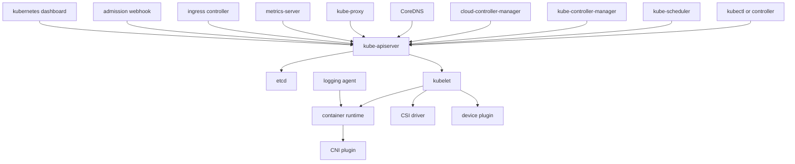

#kubernetes #components #learning-plan

相关笔记：[[component-note-standard]] | [[component-coverage-matrix]] | [[k8s-development-roadmap]] | [[kubernetes-basics]] | [[k8s-interview]] | [[client-go-source]] | [[scheduler-framework-source]] | [[kubelet-cri-source]] | [[cri-source]] | [[cni-source]] | [[csi-source]] | [[etcd-source]]

# Kubernetes 组件拆解

## 概述

这个目录把 Kubernetes 常见组件按「每个组件一个文件」拆开。范围分三层：

- **核心组件**：官方架构里的 control plane components 和 node components。
- **核心 addon**：DNS、Dashboard、resource monitoring、cluster logging。
- **研发扩展组件**：CNI、CSI、Device Plugin、Admission Webhook、Ingress Controller。

先看两份标准文档：

- [[component-note-standard]]：组件笔记写作标准，规定文件名、章节、源码、排障和面试要点格式。
- [[component-coverage-matrix]]：组件覆盖矩阵，区分官方标准组件和研发扩展组件。

学习顺序建议先走核心链路：`kubectl -> kube-apiserver -> etcd -> scheduler/controller-manager -> kubelet -> container runtime -> CNI/CSI`，再补 addon 与扩展。

每篇组件文档都按同一套结构组织：

- **职责边界**：这个组件负责什么，不负责什么。
- **核心链路**：请求、控制循环或节点执行流程。
- **源码导读**：关键仓库、源码路径、核心结构/函数、精简调用骨架。
- **深入源码路径**：围绕一个具体问题展开真实调用栈，例如 [[kubelet-component]] 的“kubelet 如何拉起一个容器”。
- **事故排查**：典型现象到组件层级、证据保全、排查路径的映射，并统一说明 Event 默认保留 `1h`、由 `kube-apiserver --event-ttl` 控制。
- **面试要点**：高频问题的短答案。

源码版本说明：

- Kubernetes 主仓源码参考本机 `/Users/mac/github.com/kubernetes`：`master`，`v1.36.0-alpha.0-35-gea0dce1df19`。
- 外部组件以各自上游仓库为准，例如 `coredns/coredns`、`kubernetes-sigs/metrics-server`、`kubernetes/ingress-nginx`、`fluent/fluent-bit`。
- Dashboard 作为 legacy 组件处理：原仓库已在 2026-01-21 归档，源码阅读以 `kubernetes-retired/dashboard` 为参考。

## 组件总览



## Control Plane

| 组件 | 文件 | 核心问题 |
| --- | --- | --- |
| kube-apiserver | [[kube-apiserver-component]] | 所有对象读写入口、认证鉴权、准入、watch |
| etcd | [[etcd-component]] | Kubernetes 持久化状态、revision、watch、raft |
| kube-scheduler | [[kube-scheduler-component]] | Pending Pod 如何选择 Node |
| kube-controller-manager | [[kube-controller-manager-component]] | 内置控制器如何把实际状态收敛到期望状态 |
| cloud-controller-manager | [[cloud-controller-manager-component]] | 云厂商 Node、Route、LoadBalancer、Volume 能力如何解耦 |

## Node Components

| 组件 | 文件 | 核心问题 |
| --- | --- | --- |
| kubelet | [[kubelet-component]] | Pod 如何在节点上真正运行起来 |
| container runtime | [[container-runtime-component]] | CRI 如何落到 containerd / CRI-O / OCI runtime |
| kube-proxy | [[kube-proxy-component]] | Service VIP 如何转发到后端 Pod |

## Networking And Storage

| 组件 | 文件 | 核心问题 |
| --- | --- | --- |
| CoreDNS | [[coredns-component]] | Service / Pod DNS 如何解析 |
| CNI plugin | [[cni-plugin-component]] | Pod IP、veth、路由、NetworkPolicy 如何落地 |
| CSI driver | [[csi-driver-component]] | PVC/PV 如何变成真实卷和节点挂载 |
| Ingress Controller | [[ingress-controller-component]] | 集群外 HTTP/HTTPS 流量如何进入 Service |

## Extensions And Addons

| 组件 | 文件 | 核心问题 |
| --- | --- | --- |
| Admission Webhook | [[admission-webhook-component]] | 写入对象前如何默认值注入和不变量校验 |
| Device Plugin | [[device-plugin-component]] | GPU/NIC/FPGA 等设备如何上报与分配 |
| Metrics Server | [[metrics-server-component]] | HPA/top 命令从哪里拿 CPU/Memory 指标 |
| Kubernetes Dashboard | [[kubernetes-dashboard-component]] | Web UI 如何通过 apiserver 管理资源 |
| Logging Agent | [[logging-agent-component]] | 节点日志如何采集到集群日志系统 |

## 源码阅读路线

### 1. 先读控制面写路径

从 [[kube-apiserver-component]] 开始，目标是理解一个对象如何从 HTTP request 变成 etcd 中的持久化状态：

```text
kubectl apply
  -> kube-apiserver handler chain
  -> authentication / authorization
  -> mutating admission
  -> schema validation
  -> validating admission
  -> REST storage
  -> etcd transaction
```

配套阅读：[[admission-webhook-component]]、[[etcd-component]]。

### 2. 再读调度和控制器

这一层回答“对象写进 apiserver 后，谁来推进状态”：

```text
controller-manager watches objects
  -> workqueue
  -> reconcile desired state

scheduler watches pending pods
  -> Filter / Score
  -> assume
  -> bind pod to node
```

配套阅读：[[kube-controller-manager-component]]、[[kube-scheduler-component]]。

### 3. 再读节点执行链路

这一层回答“Pod 绑定到 Node 后，怎么真的跑起来”：

```text
kubelet watches assigned pod
  -> volume setup through CSI
  -> device allocation through Device Plugin
  -> CRI RunPodSandbox
  -> runtime calls CNI
  -> CRI CreateContainer / StartContainer
```

配套阅读：[[kubelet-component]]、[[container-runtime-component]]、[[cni-plugin-component]]、[[csi-driver-component]]、[[device-plugin-component]]。

### 4. 最后读入口、DNS、指标和日志

这部分不是最小控制面必需，但生产集群绕不开：

- [[kube-proxy-component]] + [[coredns-component]]：Service 发现与转发。
- [[ingress-controller-component]]：集群外七层入口。
- [[metrics-server-component]]：HPA 和 `kubectl top`。
- [[logging-agent-component]]：日志采集与 metadata enrich。
- [[kubernetes-dashboard-component]]：legacy Web UI 和 RBAC 风险样本。

## 面试要点

### Q: Kubernetes 最小可运行集群需要哪些组件？

A: 控制面至少需要 kube-apiserver、etcd、kube-scheduler、kube-controller-manager；节点侧需要 kubelet、container runtime、CNI 插件。kube-proxy、CoreDNS 通常也会部署，否则 Service 转发和 DNS 体验不完整。

### Q: 所有组件都直接访问 etcd 吗？

A: 不是。只有 kube-apiserver 直接读写 etcd。scheduler、controller-manager、kubelet、CoreDNS、kube-proxy 等都通过 kube-apiserver watch 或 update 对象。

### Q: CNI、CSI、CRI 的边界是什么？

A: CRI 是 kubelet 与容器运行时的接口；CNI 是容器运行时创建 Pod sandbox 网络时调用的网络插件接口；CSI 是 Kubernetes 与存储驱动之间的卷生命周期和挂载接口。

### Q: 控制器和 scheduler 都 watch apiserver，它们的区别是什么？

A: scheduler 只负责给未绑定 Pod 选择 Node 并写入绑定结果；controller 负责各种资源的持续 reconcile，例如 Deployment 创建 ReplicaSet、NodeController 处理节点状态、EndpointSliceController 维护后端列表。

### Q: addon 和核心组件怎么区分？

A: 核心组件是 Kubernetes 集群控制循环和节点执行的基础；addon 是运行在集群里的普通 workload，用 Kubernetes API 提供附加能力，例如 DNS、Dashboard、metrics、logging。
