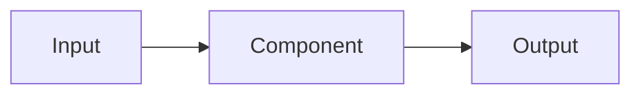

#kubernetes #components #standard

相关笔记：[[k8s-development-roadmap]] | [[kube-apiserver-component]] | [[etcd-component]] | [[kubelet-component]] | [[kube-proxy-component]]

# Kubernetes 组件笔记标准

## 概述

本标准用于 `learning-plan/topics/components/` 下所有 Kubernetes 组件笔记。目标不是“列概念”，而是让每篇组件笔记都能回答四件事：

1. 这个组件在 Kubernetes 架构中负责什么。
2. 它和其他组件的边界在哪里。
3. 它的关键流程如何走。
4. 读源码时从哪些文件、结构和函数切入。

组件清单按 Kubernetes 官方 Components 文档作为一级标准，再单独补充 Kubernetes 研发中必须掌握的扩展组件。

## 组件分层标准

### Tier 1: 官方标准组件

这层严格对齐 Kubernetes 官方 Components 文档。

| 分类 | 组件 |
| --- | --- |
| Control Plane Components | kube-apiserver、etcd、kube-scheduler、kube-controller-manager、cloud-controller-manager |
| Node Components | kubelet、kube-proxy、container runtime |
| Addons | DNS、Web UI、Container Resource Monitoring、Cluster-level Logging |

### Tier 2: Kubernetes 研发扩展组件

这层不是最小官方 components 清单，但属于 Kubernetes 研发、平台开发、面试和生产排障绕不开的组件。

| 分类 | 组件 |
| --- | --- |
| Networking | CNI plugin、Ingress Controller |
| Storage | CSI driver |
| Admission | Admission Webhook |
| Resource | Device Plugin |

### 不放在本目录的内容

| 内容 | 原因 | 建议位置 |
| --- | --- | --- |
| kubectl | 客户端工具，不是集群运行组件 | `cloud-native/kubernetes/infrastructure/` 或单独 CLI 笔记 |
| kubeadm | 集群安装工具，不是长期运行组件 | 部署/运维专题 |
| Helm / Argo CD | 交付工具，不是 Kubernetes 核心组件 | 平台工程专题 |
| Prometheus / Grafana | 常用可观测性系统，但不是官方 addon 必需项 | 可观测性专题 |

## 文件命名标准

组件文件统一使用：

```text
<component-name>-component.md
```

例外：

- 目录入口使用 `README.md`。
- 标准文档使用 `component-note-standard.md`。
- 覆盖矩阵使用 `component-coverage-matrix.md`。

命名要求：

- 全英文小写。
- 单词用连字符。
- 避免和已有概念笔记重名，例如已有 `kube-proxy.md`，组件笔记用 `kube-proxy-component.md`。

## 章节标准

每个组件文件必须按以下章节顺序组织：

```markdown
#标签

相关笔记：[[...]]

# Component Name

## 概述

## 职责边界

## 核心链路

## 关键机制

## 源码导读

## 深入：核心执行路径

## 源码阅读重点

## 故障信号

## 事故排查

## 排查命令

## 面试要点
```

### `## 概述`

必须回答：

- 组件一句话定义。
- 它在集群中的部署位置。
- 它的上游/下游组件。
- 一个明确的边界句式：`它负责 X，不负责 Y`。

### `## 职责边界`

必须使用表格，至少包含：

| 字段 | 要求 |
| --- | --- |
| 职责 | 组件负责的具体能力 |
| 说明 | 该职责的输入、输出或副作用 |

写法要求：

- 不写空泛词，例如“管理资源”。
- 要写对象、接口或状态，例如 “watch Service/EndpointSlice 并生成节点转发规则”。

### `## 核心链路`

必须包含 mermaid 图或 sequenceDiagram。目标是能白板复述。

推荐格式：



如果是请求路径，优先用 `sequenceDiagram`；如果是控制循环，优先用 `flowchart`。

### `## 关键机制`

必须列 5-8 条机制，每条只讲一个点。

要求：

- 说明不变量。
- 说明和其他组件的分工。
- 说明容易误解的地方。

### `## 源码导读`

必须包含源码表格，至少三列：

| 目标 | 源码位置 | 读什么 |
| --- | --- | --- |

必须包含一个精简代码骨架：

```go
func Example() error {
    return nil
}
```

注意：

- 核心组件优先使用本机 Kubernetes 主仓路径：`/Users/mac/github.com/kubernetes`。
- 外部组件必须写上游仓库名。
- 代码块是骨架，不复制大段源码。

### `## 深入：核心执行路径`

这是组件笔记是否真正达标的关键章节。必须围绕一个具体问题展开，而不是继续列概念。

示例：

| 组件 | 深入问题 |
| --- | --- |
| kubelet | kubelet 如何拉起一个容器 |
| kube-apiserver | 一个 create Pod 请求如何写入 etcd |
| kube-scheduler | 一个 Pending Pod 如何经过 Filter/Score/Bind |
| kube-controller-manager | Deployment 如何创建/滚动 ReplicaSet |
| kube-proxy | Service/EndpointSlice 如何变成 iptables/IPVS 规则 |
| CoreDNS | Service DNS 查询如何命中本地 cache 并返回记录 |

本章节必须包含：

- 真实函数调用栈。
- 每一段对应的源码文件。
- 关键数据结构。
- 精简源码骨架。
- 失败点与排查映射。

如果一篇组件文档没有这个章节，只能算 `outline-done`，不能算 `deep-done`。

### `## 源码阅读重点`

必须拆 2-4 个三级标题，每个标题回答一个源码问题。

示例：

```markdown
### Handler Chain

### Watch Cache

### REST Storage
```

### `## 故障信号`

必须使用表格：

| 现象 | 常见方向 |
| --- | --- |

要求从用户可观察现象出发，不从源码函数名出发。

### `## 事故排查`

必须回答生产事故中怎么定位，而不是只列命令。至少包含：

- **先定层级**：客户端、apiserver、etcd、scheduler、controller、kubelet、runtime、CNI、CSI、业务容器。
- **先保留证据**：Pod YAML、Event、组件日志、runtime 状态、Node condition、关键 metrics。
- **说明 Event 保留时间**：Kubernetes Event 默认保留 `1h`，由 `kube-apiserver --event-ttl` 控制；源码入口是 `pkg/controlplane/apiserver/options/options.go` 的 `EventTTL: 1 * time.Hour`，再传到 `pkg/controlplane/apiserver/apis.go` 和 `pkg/registry/core/rest/storage_core_generic.go` 的 Event storage TTL。
- **区分瞬时信号和持久证据**：Event 会过期，组件日志也可能轮转；事故复盘不能只依赖事后 `kubectl describe`。
- **给出现象到组件的映射**：例如 `Pending` 优先看 scheduler，`ContainerCreating` 优先看 kubelet/runtime/CNI/CSI，`forbidden` 优先看 authz/RBAC。

推荐结构：

```markdown
## 事故排查

### 先判断故障层级

### Event 保留时间

### 证据保全

### 常见事故路径
```

### `## 排查命令`

必须使用 `bash` 代码块。命令应该能直接复制执行，但允许使用 `<placeholder>`。

### `## 面试要点`

必须至少 5 个 Q&A。

写法：

```markdown
### Q: 问题？

A: 回答。
```

回答要短，但要讲边界和取舍。

## 质量标准

每篇组件笔记验收时至少满足：

- [ ] 文件名符合 `<component-name>-component.md`。
- [ ] 有 `相关笔记：[[...]]`。
- [ ] 有统一 10 个二级章节。
- [ ] 有 mermaid 核心链路图。
- [ ] 有源码路径表。
- [ ] 有 Go 代码骨架。
- [ ] 有 `## 深入：核心执行路径` 或等价的具体深挖章节。
- [ ] 有源码阅读重点。
- [ ] 有 `## 事故排查`，并说明 Event 默认保留 `1h` 与 `--event-ttl`。
- [ ] 有排查命令。
- [ ] 有至少 5 个面试 Q&A。
- [ ] wikilink 无断链。

## 面试要点

### Q: 为什么要区分官方标准组件和扩展组件？

A: 官方标准组件决定 Kubernetes 最小架构边界；扩展组件决定生产可用性和研发深度。混在一起会导致学习顺序混乱。

### Q: 为什么每篇都必须写源码入口？

A: 组件知识容易停留在概念层。源码入口能把“这个组件做什么”落到实际结构、函数和调用链，方便后续深入。

### Q: 为什么不用大段复制源码？

A: 大段源码不利于复习，也容易随版本漂移。笔记只保留调用骨架和关键路径，具体实现回到源码仓库看。

### Q: 为什么要统一章节？

A: 统一章节能让不同组件横向比较，例如 apiserver、scheduler、kubelet 都能按职责、链路、源码、故障四个维度复习。

### Q: 什么情况下需要新增组件笔记？

A: 只有当它是官方 components、生产常驻 addon、或 Kubernetes 研发扩展点时才新增。普通工具和生态产品不要塞进 components 目录。
