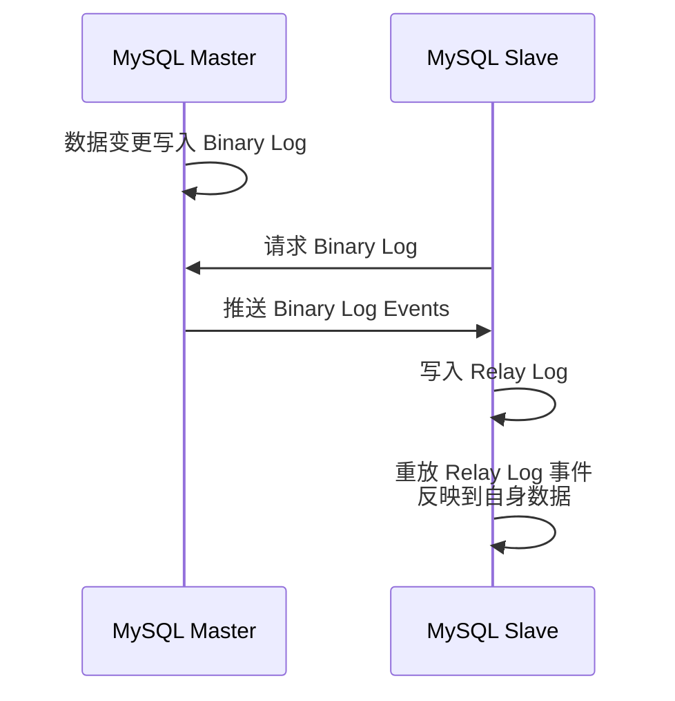
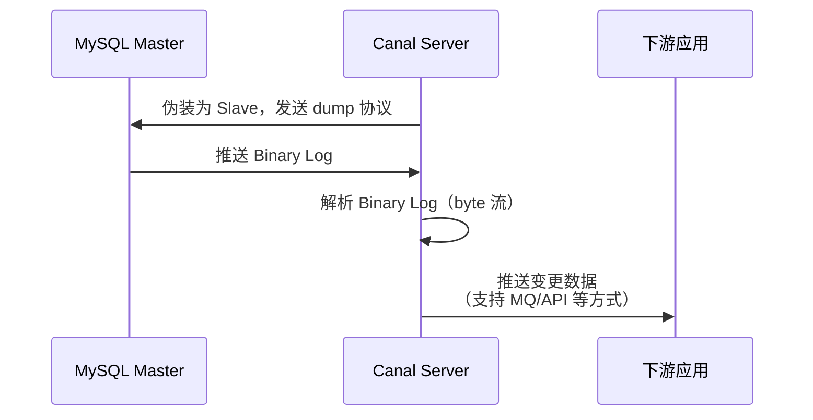
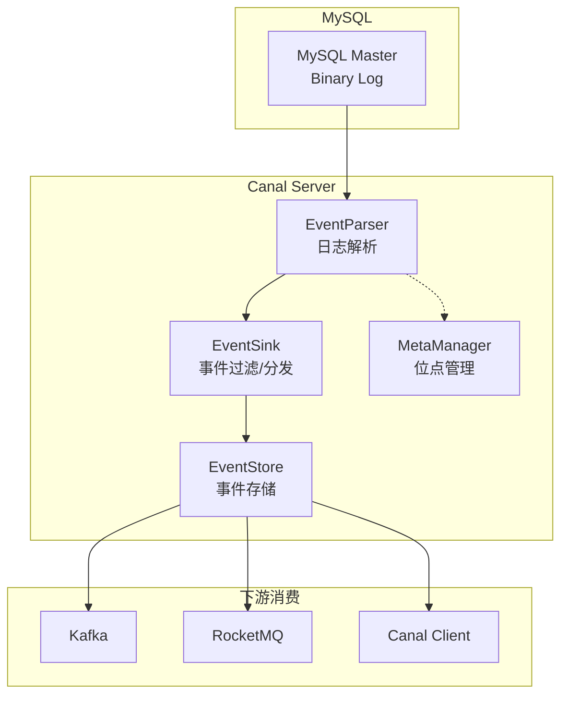
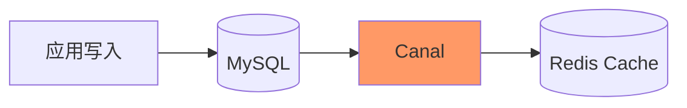
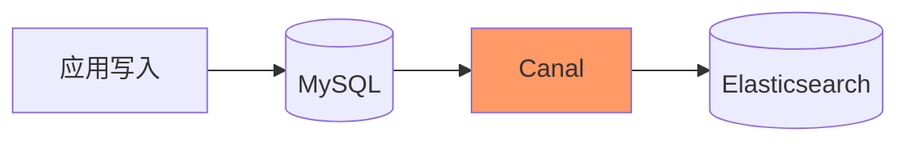
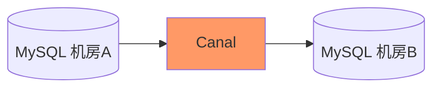

#canal

# Canal 数据同步中间件

相关笔记：[[kafka-basics]] | [[distributed-transaction]]

## 背景

早期阿里巴巴因为杭州和美国双机房部署，存在跨机房同步的业务需求，实现方式主要是基于业务 trigger 获取增量变更。从 2010 年开始，业务逐步尝试数据库日志解析获取增量变更进行同步，由此衍生出了 Canal。

基于日志增量订阅和消费的业务场景包括：
- 数据库镜像
- 数据库实时备份
- 索引构建和实时维护（拆分异构索引、倒排索引等）
- 业务 cache 刷新
- 带业务逻辑的增量数据处理

当前 Canal 支持源端 MySQL 版本：5.1.x、5.5.x、5.6.x、5.7.x、8.0.x

![[canal支持.png]]

## 工作原理

### MySQL 主备复制原理

1. MySQL Master 将数据变更写入 Binary Log（binlog events，可通过 `show binlog events` 查看）
2. MySQL Slave 将 Master 的 binary log events 拷贝到自己的 Relay Log
3. MySQL Slave 重放 Relay Log 中的事件，将数据变更反映到自身

### Canal 工作原理

Canal 的核心思路是**伪装成 MySQL Slave**：

1. Canal 模拟 MySQL Slave 的交互协议，伪装为 MySQL Slave，向 MySQL Master 发送 dump 协议
2. MySQL Master 收到 dump 请求，开始推送 Binary Log 给 Canal
3. Canal 解析 Binary Log 对象（原始为 byte 流），转换为结构化的变更数据

## Canal 整体架构

### 核心组件

| 组件 | 职责 |
|------|------|
| **EventParser** | 连接 MySQL，解析 Binary Log 事件 |
| **EventSink** | 事件过滤、路由和分发 |
| **EventStore** | 事件缓存，供下游消费 |
| **MetaManager** | 管理 binlog 消费位点信息 |

## 典型使用场景

### 数据库与缓存同步

### 搜索引擎索引同步

### 跨数据中心同步

