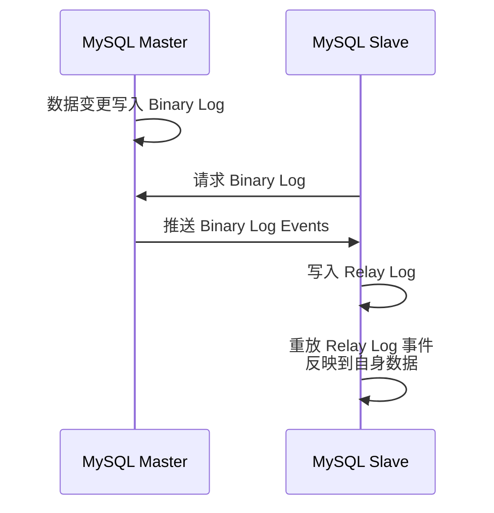
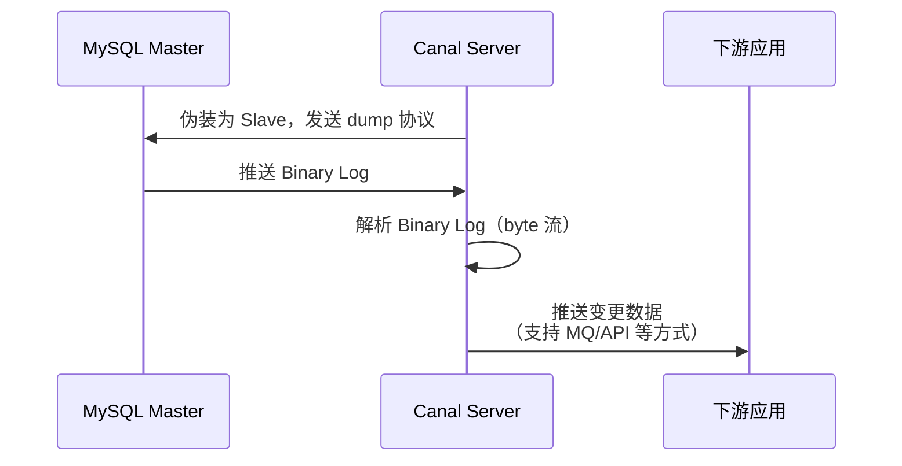
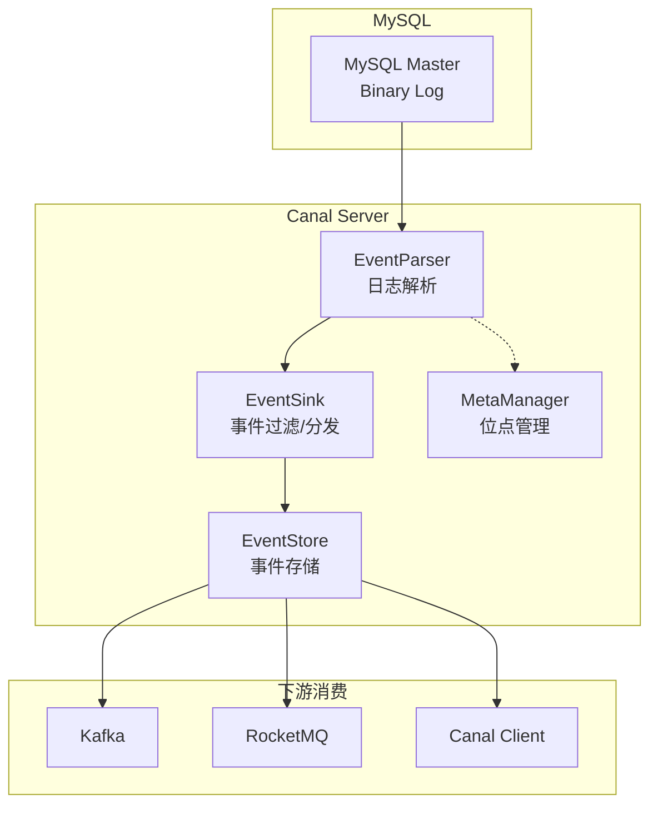
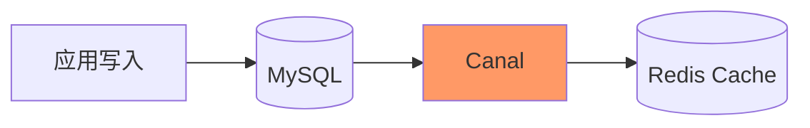
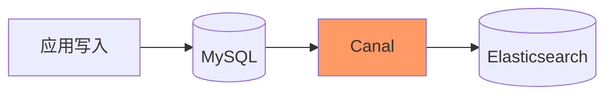
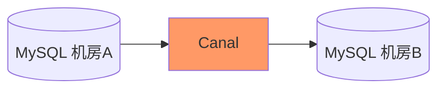

#canal

# Canal 数据同步中间件

相关笔记：[[kafka-basics]] | [[distributed-transaction]]

## 背景

早期阿里巴巴因为杭州和美国双机房部署，存在跨机房同步的业务需求，实现方式主要是基于业务 trigger 获取增量变更。从 2010 年开始，业务逐步尝试数据库日志解析获取增量变更进行同步，由此衍生出了 Canal。

基于日志增量订阅和消费的业务场景包括：
- 数据库镜像
- 数据库实时备份
- 索引构建和实时维护（拆分异构索引、倒排索引等）
- 业务 cache 刷新
- 带业务逻辑的增量数据处理

当前 Canal 支持源端 MySQL 版本：5.1.x、5.5.x、5.6.x、5.7.x、8.0.x

![[canal支持.png]]

## 工作原理

### MySQL 主备复制原理

1. MySQL Master 将数据变更写入 Binary Log（binlog events，可通过 `show binlog events` 查看）
2. MySQL Slave 将 Master 的 binary log events 拷贝到自己的 Relay Log
3. MySQL Slave 重放 Relay Log 中的事件，将数据变更反映到自身

### Canal 工作原理

Canal 的核心思路是**伪装成 MySQL Slave**：

1. Canal 模拟 MySQL Slave 的交互协议，伪装为 MySQL Slave，向 MySQL Master 发送 dump 协议
2. MySQL Master 收到 dump 请求，开始推送 Binary Log 给 Canal
3. Canal 解析 Binary Log 对象（原始为 byte 流），转换为结构化的变更数据

## Canal 整体架构

### 核心组件

| 组件 | 职责 |
|------|------|
| **EventParser** | 连接 MySQL，解析 Binary Log 事件 |
| **EventSink** | 事件过滤、路由和分发 |
| **EventStore** | 事件缓存，供下游消费 |
| **MetaManager** | 管理 binlog 消费位点信息 |

## 典型使用场景

### 数据库与缓存同步

### 搜索引擎索引同步

### 跨数据中心同步

## 面试要点

### 高频问题

**Q: Canal 的核心工作原理是什么？**

> [!question]- 参考答案（点击展开）
>
> Canal 伪装成 MySQL 的 Slave，向 Master 发送 dump 协议请求。Master 误以为它是从库，于是推送 Binary Log events 给它。Canal 解析这些原始 byte 流，转换为结构化的变更数据后推送给下游（MQ 或 Client）。本质上是复用了 MySQL 主备复制的协议链路，对源库无业务侵入。

**Q: 使用 Canal 需要 MySQL 做哪些前置配置？**

> [!question]- 参考答案（点击展开）
>
> 必须开启 binlog（`log_bin`），且 `binlog_format` 设为 `ROW`（STATEMENT/MIXED 拿不到完整的行变更数据）；需要为 Canal 单独创建一个具备 `REPLICATION SLAVE` 和 `REPLICATION CLIENT` 权限的账号；同时保证 Canal 实例使用的 `slaveId`（即对外呈现的 server_id）唯一，避免与真实从库或其它 Canal 实例冲突。

**Q: 为什么 binlog_format 一定要用 ROW 而不能用 STATEMENT？**

> [!question]- 参考答案（点击展开）
>
> STATEMENT 格式记录的是原始 SQL 语句，对于 `now()`、`uuid()` 等非确定性函数，或 `UPDATE ... LIMIT` 这类不确定影响行的语句，下游无法还原出每行真实的前后值；ROW 格式记录每一行变更前后的镜像（before/after image），Canal 才能精确解析出 INSERT/UPDATE/DELETE 的字段级数据。代价是 binlog 体积更大。

**Q: Canal Server 内部有哪几个核心组件，职责分别是什么？**

> [!question]- 参考答案（点击展开）
>
> 主要四个：EventParser 负责连接 MySQL 并解析 binlog 事件；EventSink 负责事件的过滤、路由和分发，是 Parser 与 Store 之间的链接器；EventStore 负责事件缓存供下游消费；MetaManager 负责管理 binlog 消费位点（position）等元数据。

**Q: Canal 如何保证位点不丢失、宕机后能续传？**

> [!question]- 参考答案（点击展开）
>
> 由 MetaManager 管理消费位点（binlog filename + position，或 GTID）。位点可保存在内存（FileMixed 模式会定期刷盘），或在集群模式下存到 ZooKeeper。Canal Server 重启后从已记录的位点继续 dump，从而做到断点续传。配合 HA 模式可在主实例故障时由备实例接管同一位点。

**Q: Canal 能否保证消息不重复（Exactly-Once）？下游如何应对？**

> [!question]- 参考答案（点击展开）
>
> 不能严格保证。Canal 在宕机切换、位点回退等场景下可能重复投递，本质是 At-Least-Once 语义。下游通常依赖业务主键 + binlog 的 offset/位点做幂等去重，例如用「主键覆盖写（upsert）」或基于 row 的最终一致来消化重复事件。

**Q: Canal 高可用是怎么实现的？**

> [!question]- 参考答案（点击展开）
>
> 通过 ZooKeeper 实现 HA。同一个 destination 同时只有一个 running 的 Canal instance（抢占式创建 EPHEMERAL 节点），其余作为 standby。当 running 实例失联，ZK 临时节点被释放，standby 抢占成为新的 running，并从 ZK 中记录的最新位点继续消费，实现故障自动切换。

**Q: 典型的使用场景有哪些？**

> [!question]- 参考答案（点击展开）
>
> 数据库与缓存同步（MySQL 变更刷新 Redis）、搜索引擎索引构建（同步到 Elasticsearch）、跨机房/异构数据库同步、数据库实时备份与镜像、带业务逻辑的增量数据处理等。本质都是「监听 MySQL 增量变更并下发」的 CDC 模式。

### 面试加分点

- 能区分 Canal 与同类 CDC 工具：Debezium 基于 Kafka Connect 生态、社区更活跃且原生对接 Kafka；Canal 更轻量、阿里系生态（canal-adapter 直接同步 ES/HBase/RDB，canal-deployer 配合 canal.mq 直投 Kafka/RocketMQ），可结合实际选型回答。
- 理解 binlog 三种格式权衡：ROW 精确但体积大，STATEMENT 紧凑但有非确定性风险，MIXED 折中；并知道 ROW 模式下可通过 `binlog_row_image`（`full`/`minimal`/`noblob`）控制记录的镜像列。
- 清楚 Canal 是 CDC（Change Data Capture）的一种实现，CDC 还有基于查询时间戳轮询、基于触发器（阿里早期方案）等方式，而基于 binlog 的日志方式对业务无侵入、延迟低、不丢数据。
- 了解 GTID 与 binlog position 两种位点定位方式的差异：GTID 在主从切换时更可靠，能避免传统 filename+position 在 failover 后定位错乱的问题。
- 能讲清 Canal 投递到 MQ 时的顺序性：同一张表/同一主键的变更需要路由到同一分区（按库表名或主键做 partition key），否则下游乱序消费会破坏数据最终一致。
- 注意大事务和 DDL 的处理：大事务会导致 EventStore 堆积、内存压力，DDL 变更需要下游同步感知表结构演进，Canal 会记录并解析 DDL 以维护表元数据。
