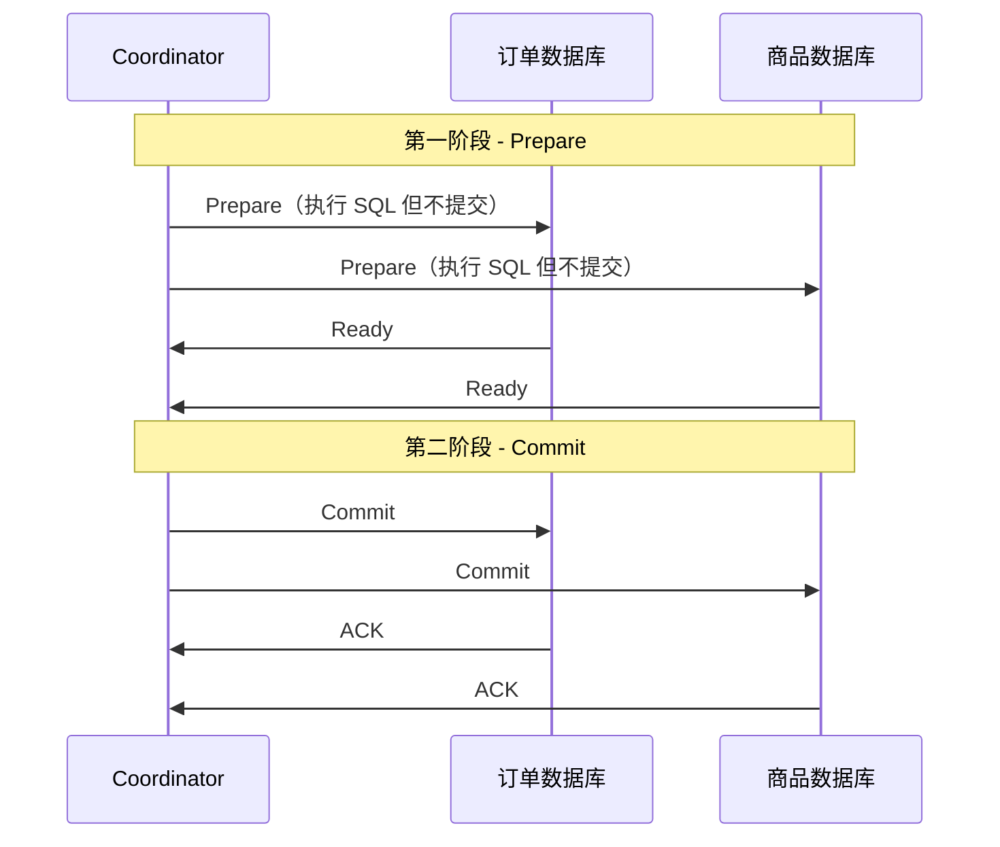
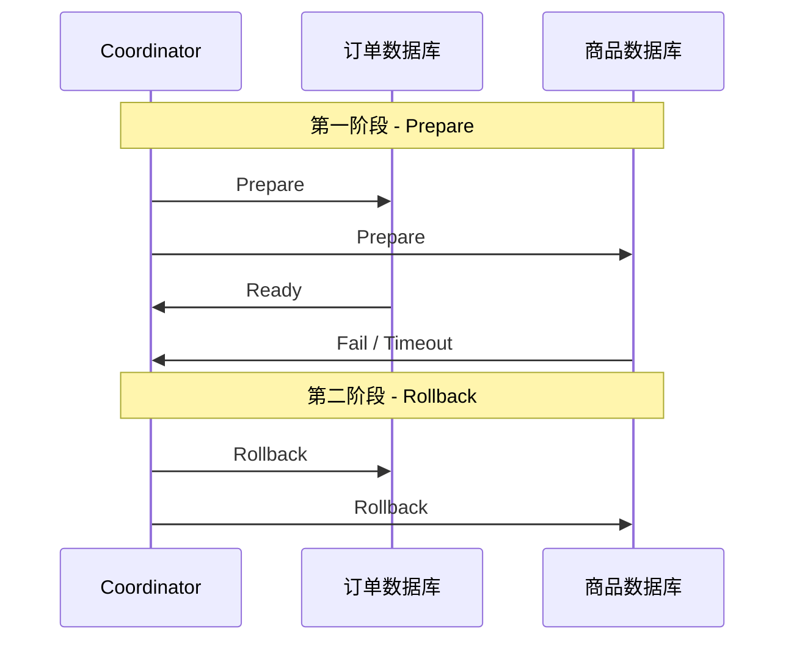
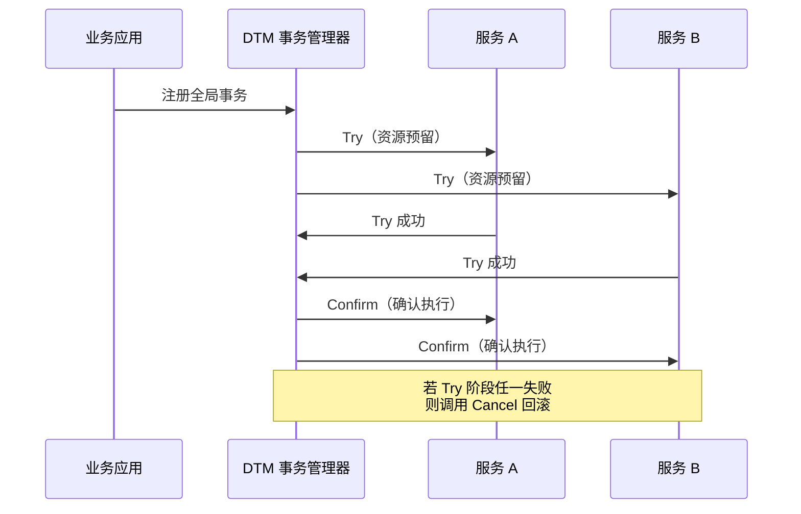
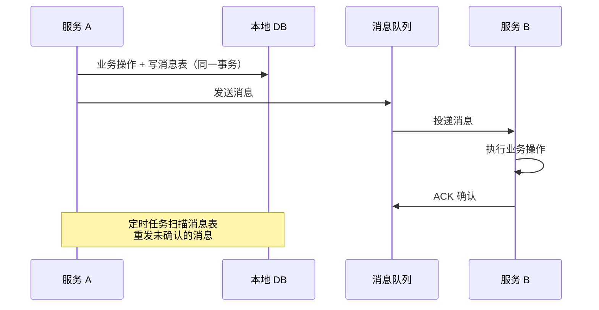

#分布式事务

# 分布式事务方案

相关笔记：[[kafka-basics]] | [[mysql-engine]]

## 传统分布式事务（2PC）

### 两阶段提交流程

![[传统分布式事务-成功.png]]
![[传统分布式事务-失败.png]]

传统分布式事务使用 **2PC（Two-Phase Commit）**，依赖于底层数据库的 XA 协议支持。MySQL InnoDB 支持 XA 协议，可以将 XA 理解为一个**强一致的中心化原子提交协议**。

### 第一阶段（Prepare）

Coordinator 向各个分布式事务参与者下达 Prepare 指令，各事务将 SQL 语句在数据库执行但**不提交**，并将准备就绪状态上报给 Coordinator。

### 第二阶段（Commit/Rollback）

- **全部就绪** -> Coordinator 下达 Commit 指令，各参与者提交本地事务
- **任一失败/超时** -> Coordinator 下达 Rollback 指令，各参与者回滚

### 2PC 的问题

| 问题 | 说明 |
|------|------|
| **同步阻塞** | Prepare 阶段锁定资源，直到第二阶段结束才释放，高并发下占用数据库连接 |
| **单点故障** | Coordinator 宕机会导致参与者一直阻塞等待 |
| **数据不一致** | 第二阶段若部分参与者宕机，可能出现部分提交、部分回滚 |

> 2PC 适合**并发量不大、一致性要求高**的场景。

## 分布式事务框架（DTM）

![[DTM分布式事务.png]]

DTM 基于 **TCC（Try-Confirm-Cancel）** 模式实现分布式事务，将事务拆分为三个阶段：

### TCC 三阶段

| 阶段 | 职责 | 示例（扣减库存） |
|------|------|------------------|
| **Try** | 资源检查和预留 | 冻结库存（available - N, frozen + N） |
| **Confirm** | 确认执行业务 | 扣减冻结库存（frozen - N） |
| **Cancel** | 取消预留，释放资源 | 解冻库存（frozen - N, available + N） |

### TCC 与 2PC 对比

| 维度 | 2PC | TCC |
|------|-----|-----|
| 实现层面 | 数据库层（XA 协议） | 业务层（应用代码） |
| 锁粒度 | 数据库行锁/表锁 | 业务自定义（更灵活） |
| 性能 | 较低（长时间持锁） | 较高（Try 阶段快速返回） |
| 侵入性 | 低（数据库自动处理） | 高（需编写 Try/Confirm/Cancel） |
| 适用场景 | 强一致、低并发 | 高并发、最终一致 |

## 其他分布式事务方案

### Saga 模式

将长事务拆分为多个本地短事务，每个本地事务有对应的补偿操作。正向执行失败时，逆序执行补偿操作。

### 本地消息表

利用本地数据库事务 + 消息队列实现最终一致性：

### 方案选型参考

| 方案 | 一致性 | 性能 | 复杂度 | 适用场景 |
|------|--------|------|--------|----------|
| **2PC/XA** | 强一致 | 低 | 低 | 传统数据库事务 |
| **TCC** | 最终一致 | 高 | 高 | 高并发核心链路 |
| **Saga** | 最终一致 | 高 | 中 | 长流程业务编排 |
| **本地消息表** | 最终一致 | 中 | 中 | 异步解耦场景 |
