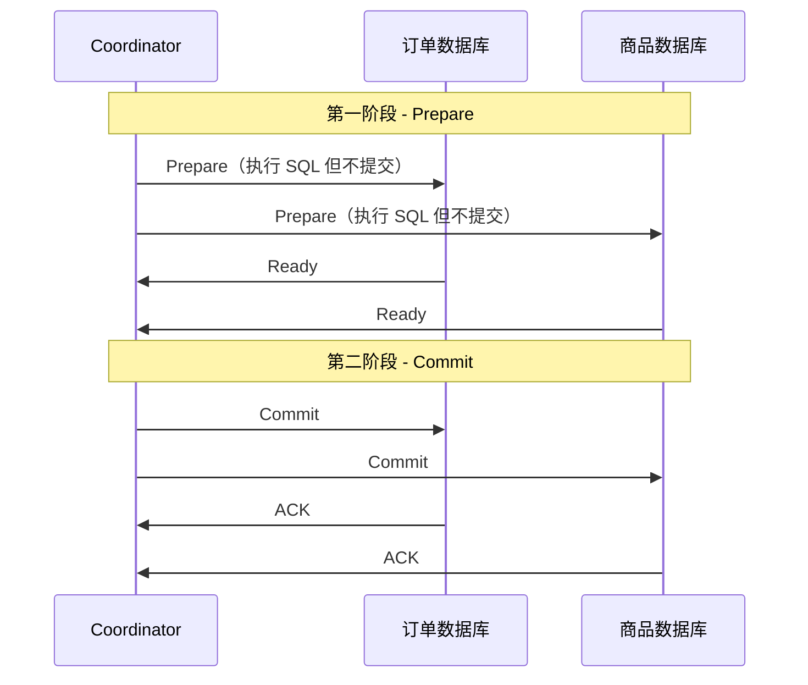
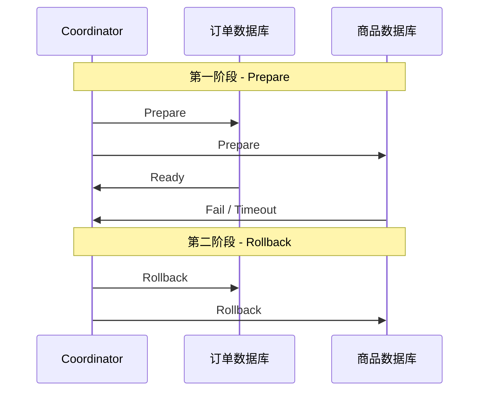
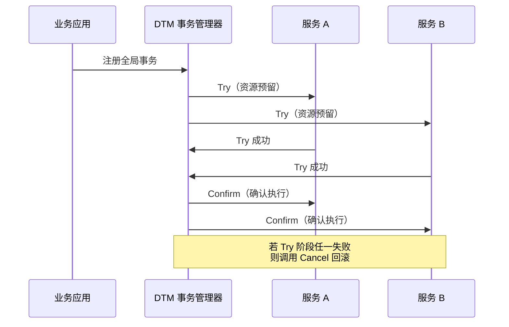
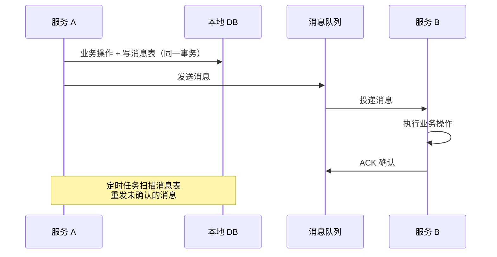

#分布式事务

# 分布式事务方案

相关笔记：[[kafka-basics]] | [[mysql-engine]]

## 传统分布式事务（2PC）

### 两阶段提交流程

![[传统分布式事务-成功.png]]
![[传统分布式事务-失败.png]]

传统分布式事务使用 **2PC（Two-Phase Commit）**，依赖于底层数据库的 XA 协议支持。MySQL InnoDB 支持 XA 协议，可以将 XA 理解为一个**强一致的中心化原子提交协议**。

### 第一阶段（Prepare）

Coordinator 向各个分布式事务参与者下达 Prepare 指令，各事务将 SQL 语句在数据库执行但**不提交**，并将准备就绪状态上报给 Coordinator。

### 第二阶段（Commit/Rollback）

- **全部就绪** -> Coordinator 下达 Commit 指令，各参与者提交本地事务
- **任一失败/超时** -> Coordinator 下达 Rollback 指令，各参与者回滚

### 2PC 的问题

| 问题 | 说明 |
|------|------|
| **同步阻塞** | Prepare 阶段锁定资源，直到第二阶段结束才释放，高并发下占用数据库连接 |
| **单点故障** | Coordinator 宕机会导致参与者一直阻塞等待 |
| **数据不一致** | 第二阶段若部分参与者宕机，可能出现部分提交、部分回滚 |

> 2PC 适合**并发量不大、一致性要求高**的场景。

## 分布式事务框架（DTM）

![[DTM分布式事务.png]]

DTM 基于 **TCC（Try-Confirm-Cancel）** 模式实现分布式事务，将事务拆分为三个阶段：

### TCC 三阶段

| 阶段 | 职责 | 示例（扣减库存） |
|------|------|------------------|
| **Try** | 资源检查和预留 | 冻结库存（available - N, frozen + N） |
| **Confirm** | 确认执行业务 | 扣减冻结库存（frozen - N） |
| **Cancel** | 取消预留，释放资源 | 解冻库存（frozen - N, available + N） |

### TCC 与 2PC 对比

| 维度 | 2PC | TCC |
|------|-----|-----|
| 实现层面 | 数据库层（XA 协议） | 业务层（应用代码） |
| 锁粒度 | 数据库行锁/表锁 | 业务自定义（更灵活） |
| 性能 | 较低（长时间持锁） | 较高（Try 阶段快速返回） |
| 侵入性 | 低（数据库自动处理） | 高（需编写 Try/Confirm/Cancel） |
| 适用场景 | 强一致、低并发 | 高并发、最终一致 |

## 其他分布式事务方案

### Saga 模式

将长事务拆分为多个本地短事务，每个本地事务有对应的补偿操作。正向执行失败时，逆序执行补偿操作。

### 本地消息表

利用本地数据库事务 + 消息队列实现最终一致性：

### 方案选型参考

| 方案 | 一致性 | 性能 | 复杂度 | 适用场景 |
|------|--------|------|--------|----------|
| **2PC/XA** | 强一致 | 低 | 低 | 传统数据库事务 |
| **TCC** | 最终一致 | 高 | 高 | 高并发核心链路 |
| **Saga** | 最终一致 | 高 | 中 | 长流程业务编排 |
| **本地消息表** | 最终一致 | 中 | 中 | 异步解耦场景 |

## 面试要点

### 高频问题

**Q: 什么是 2PC？它的两个阶段分别做什么？**

> [!question]- 参考答案（点击展开）
>
> 2PC（Two-Phase Commit）是依赖底层数据库 XA 协议的强一致中心化原子提交协议。第一阶段（Prepare）Coordinator 让各参与者执行 SQL 但不提交，并上报 Ready 就绪状态；第二阶段全部就绪则下达 Commit，任一失败或超时则下达 Rollback。MySQL InnoDB 支持 XA 协议。

**Q: 2PC 有哪些缺陷？**

> [!question]- 参考答案（点击展开）
>
> 主要有三点：①同步阻塞，Prepare 阶段就锁定资源，直到第二阶段结束才释放，高并发下占用大量数据库连接；②单点故障，Coordinator 宕机会导致参与者一直阻塞等待；③数据不一致，第二阶段若部分参与者宕机，可能出现部分提交、部分回滚。因此 2PC 适合并发量不大、一致性要求高的场景。

**Q: TCC 的三个阶段分别是什么？以扣减库存为例说明。**

> [!question]- 参考答案（点击展开）
>
> TCC 即 Try-Confirm-Cancel。Try 做资源检查和预留（如冻结库存 available - N、frozen + N）；Confirm 确认执行业务（扣减冻结库存 frozen - N）；Cancel 取消预留释放资源（解冻 frozen - N、available + N）。所有参与者 Try 都成功后才进入 Confirm，任一 Try 失败则对所有参与者调用 Cancel 回滚。

**Q: TCC 和 2PC 的本质区别是什么？**

> [!question]- 参考答案（点击展开）
>
> 最大区别在实现层面：2PC 在数据库层由 XA 协议自动处理，对业务侵入低但长时间持有行锁/表锁、性能较低；TCC 在业务层由应用代码实现 Try/Confirm/Cancel，锁粒度业务自定义（如用 frozen 字段而非数据库行锁），Try 阶段快速返回不长期持锁，性能更高，但侵入性强、需要为每个接口写三段逻辑。

**Q: Saga 模式是怎么工作的？和 TCC 有什么不同？**

> [!question]- 参考答案（点击展开）
>
> Saga 把长事务拆成多个本地短事务，每个本地事务配一个补偿操作，正向逐步执行并直接提交，失败时逆序执行补偿回滚。它没有 TCC 的资源预留（Try）阶段，第一步就直接提交，因此实现更简单但隔离性更弱（中间状态对外可见），适合长流程业务编排；TCC 有预留阶段、隔离性更好但侵入性更高。

**Q: 本地消息表如何保证最终一致性？**

> [!question]- 参考答案（点击展开）
>
> 核心是利用本地数据库事务把「业务操作」和「写消息表」放在同一个事务里，保证两者原子性；然后将消息投递到 MQ，下游消费并执行业务后 ACK。配合定时任务扫描消息表、重发未确认的消息，依靠下游接口幂等最终达成一致。它把分布式一致性问题转化成了本地事务 + 可靠投递问题。

**Q: 这几种方案怎么选型？**

> [!question]- 参考答案（点击展开）
>
> 2PC/XA 强一致、性能低、复杂度低，适合传统数据库事务；TCC 最终一致、性能高、复杂度高，适合高并发核心链路；Saga 最终一致、性能高、复杂度中等，适合长流程业务编排；本地消息表最终一致、性能中等、复杂度中等，适合异步解耦场景。整体是在一致性、性能、侵入性之间做权衡。

### 面试加分点

- 能讲清一致性取舍：2PC/XA 追求强一致，本质牺牲可用性（分区/Coordinator 故障时阻塞）；TCC/Saga/本地消息表则是 BASE 思想下的最终一致，用可用性换强一致——选型本质是按业务把这条取舍曲线落地。
- 理解 TCC 的三个经典坑：空回滚（Try 未执行就收到 Cancel）、悬挂（Cancel 先于 Try 到达，导致 Try 预留的资源无人确认/取消）、幂等（Confirm/Cancel 重试），生产实现需要事务记录表 + 状态机来防御。
- 说清 Saga 的两种编排方式：协调式（Orchestration，中心协调器统一驱动，如 DTM）和事件式（Choreography，各服务通过事件链式触发），以及 Saga 缺乏隔离性需要业务层加锁或语义补偿。
- 能讲 DTM 这类事务管理器的价值：统一管理全局事务状态、子事务屏障（防空回滚/悬挂/幂等）、自动重试与回滚，把 TCC/Saga/消息一致性等多种模式收敛到一个框架。
- 强调所有最终一致方案都依赖下游接口幂等，常用唯一业务 ID/去重表/状态机实现，否则重试会导致重复扣款、超卖。
- 了解 2PC 的演进——3PC 通过引入 CanCommit 预询问阶段和参与者超时机制缓解阻塞与单点问题，但增加了一轮 RTT，且网络分区下仍可能不一致。
