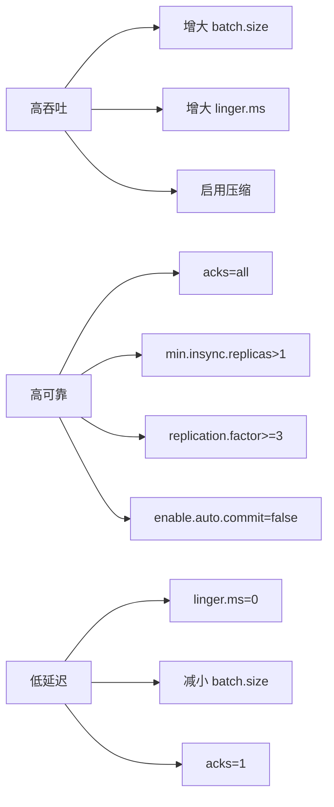

#kafka

# Kafka 集群参数配置

相关笔记：[[kafka-basics]] | [[kafka-interview]] | [[zero-message-loss]]

Kafka 集群的稳定运行依赖于合理的参数配置。以下是 Broker、Producer、Consumer 三端的关键参数说明。

![[kafka参数配置.png]]

## Broker 端关键参数

### 存储与日志

| 参数 | 默认值 | 说明 |
|------|--------|------|
| `log.dirs` | `/tmp/kafka-logs` | 日志存储目录，建议配置多个磁盘路径以提升吞吐 |
| `log.retention.hours` | `168`（7天） | 日志保留时长 |
| `log.segment.bytes` | `1GB` | 单个 Segment 文件最大大小 |
| `log.retention.check.interval.ms` | `60000` | 日志清理检查间隔 |

### 副本与可靠性

| 参数 | 推荐值 | 说明 |
|------|--------|------|
| `replication.factor` | `>=3` | 副本数，建议至少 3 个 |
| `min.insync.replicas` | `>1` | 最少同步副本数，建议 2 |
| `unclean.leader.election.enable` | `false` | 禁止落后副本当选 Leader |

### 网络与连接

| 参数 | 说明 |
|------|------|
| `listeners` | Broker 监听地址，如 `PLAINTEXT://0.0.0.0:9092` |
| `num.network.threads` | 网络线程数，默认 3 |
| `num.io.threads` | I/O 线程数，默认 8 |
| `message.max.bytes` | 单条消息最大字节数，默认约 1MB |

## Producer 端关键参数

| 参数 | 推荐值 | 说明 |
|------|--------|------|
| `acks` | `all` | 所有 ISR 副本确认后才返回成功 |
| `retries` | 较大值（如 `10`） | 发送失败时自动重试次数 |
| `compression.type` | `lz4` / `zstd` | 压缩算法，节省带宽 |
| `batch.size` | `16384` | 批次大小（字节），影响吞吐 |
| `linger.ms` | `5~100` | 批次等待时间，与 batch.size 配合使用 |
| `buffer.memory` | `33554432` | 生产者缓冲区总大小 |
| `max.in.flight.requests.per.connection` | `1`（严格顺序时） | 未确认请求的最大数量 |

## Consumer 端关键参数

| 参数 | 推荐值 | 说明 |
|------|--------|------|
| `enable.auto.commit` | `false` | 关闭自动提交，手动控制 offset |
| `auto.offset.reset` | `earliest` / `latest` | 无 offset 时的消费起点 |
| `max.poll.records` | `500` | 单次 poll 返回的最大记录数 |
| `max.poll.interval.ms` | `300000` | 两次 poll 最大间隔，超时触发 rebalance |
| `fetch.min.bytes` | `1` | 拉取请求的最小数据量 |
| `fetch.max.wait.ms` | `500` | 拉取请求的最大等待时间 |

## 参数配置最佳实践



### 常见配置组合

**高可靠场景**（金融、订单）：
```properties
# Broker
replication.factor=3
min.insync.replicas=2
unclean.leader.election.enable=false

# Producer
acks=all
retries=10
enable.idempotence=true

# Consumer
enable.auto.commit=false
```

**高吞吐场景**（日志采集）：
```properties
# Producer
acks=1
compression.type=lz4
batch.size=65536
linger.ms=50

# Consumer
fetch.min.bytes=1048576
max.poll.records=1000
```
