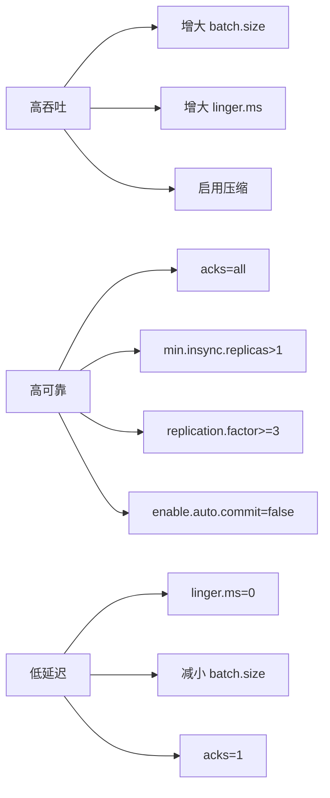

#kafka

# Kafka 集群参数配置

相关笔记：[[kafka-basics]] | [[kafka-interview]] | [[zero-message-loss]]

Kafka 集群的稳定运行依赖于合理的参数配置。以下是 Broker、Producer、Consumer 三端的关键参数说明。

![[kafka参数配置.png]]

## Broker 端关键参数

### 存储与日志

| 参数 | 默认值 | 说明 |
|------|--------|------|
| `log.dirs` | `/tmp/kafka-logs` | 日志存储目录，建议配置多个磁盘路径以提升吞吐 |
| `log.retention.hours` | `168`（7天） | 日志保留时长 |
| `log.segment.bytes` | `1GB` | 单个 Segment 文件最大大小 |
| `log.retention.check.interval.ms` | `60000` | 日志清理检查间隔 |

### 副本与可靠性

| 参数 | 推荐值 | 说明 |
|------|--------|------|
| `replication.factor` | `>=3` | 副本数，建议至少 3 个 |
| `min.insync.replicas` | `>1` | 最少同步副本数，建议 2 |
| `unclean.leader.election.enable` | `false` | 禁止落后副本当选 Leader |

### 网络与连接

| 参数 | 说明 |
|------|------|
| `listeners` | Broker 监听地址，如 `PLAINTEXT://0.0.0.0:9092` |
| `num.network.threads` | 网络线程数，默认 3 |
| `num.io.threads` | I/O 线程数，默认 8 |
| `message.max.bytes` | 单条消息最大字节数，默认约 1MB |

## Producer 端关键参数

| 参数 | 推荐值 | 说明 |
|------|--------|------|
| `acks` | `all` | 所有 ISR 副本确认后才返回成功 |
| `retries` | 较大值（如 `10`） | 发送失败时自动重试次数 |
| `compression.type` | `lz4` / `zstd` | 压缩算法，节省带宽 |
| `batch.size` | `16384` | 批次大小（字节），影响吞吐 |
| `linger.ms` | `5~100` | 批次等待时间，与 batch.size 配合使用 |
| `buffer.memory` | `33554432` | 生产者缓冲区总大小 |
| `max.in.flight.requests.per.connection` | `1`（严格顺序时） | 未确认请求的最大数量 |

## Consumer 端关键参数

| 参数 | 推荐值 | 说明 |
|------|--------|------|
| `enable.auto.commit` | `false` | 关闭自动提交，手动控制 offset |
| `auto.offset.reset` | `earliest` / `latest` | 无 offset 时的消费起点 |
| `max.poll.records` | `500` | 单次 poll 返回的最大记录数 |
| `max.poll.interval.ms` | `300000` | 两次 poll 最大间隔，超时触发 rebalance |
| `fetch.min.bytes` | `1` | 拉取请求的最小数据量 |
| `fetch.max.wait.ms` | `500` | 拉取请求的最大等待时间 |

## 参数配置最佳实践



### 常见配置组合

**高可靠场景**（金融、订单）：
```properties
# Broker
replication.factor=3
min.insync.replicas=2
unclean.leader.election.enable=false

# Producer
acks=all
retries=10
enable.idempotence=true

# Consumer
enable.auto.commit=false
```

**高吞吐场景**（日志采集）：
```properties
# Producer
acks=1
compression.type=lz4
batch.size=65536
linger.ms=50

# Consumer
fetch.min.bytes=1048576
max.poll.records=1000
```

## 面试要点

### 高频问题

**Q: `acks` 有哪几种取值？分别意味着什么？**
A: `acks=0` 表示 Producer 不等待任何确认，吞吐最高但可能丢消息；`acks=1` 表示 Leader 写入本地日志即返回，Leader 宕机且副本未同步时会丢数据；`acks=all`（即 `-1`）表示等待所有 ISR 副本确认，可靠性最高。高可靠场景必须配 `acks=all`，高吞吐/日志采集可用 `acks=1`。

**Q: `acks=all` 是不是就一定不丢消息了？**
A: 不一定，必须配合 `min.insync.replicas` 一起用。`acks=all` 只等待当前 ISR 中的副本确认，如果 ISR 收缩到只剩 Leader 一个，`acks=all` 就退化成 `acks=1`。所以高可靠场景要设 `min.insync.replicas>=2` 且 `replication.factor>=3`，保证消息至少落到 2 个副本，且还能容忍 1 个 Broker 宕机仍可写。注意：当存活同步副本数低于 `min.insync.replicas` 时，Producer 会直接收到 `NotEnoughReplicas` 异常而非静默丢数据。

**Q: `replication.factor` 和 `min.insync.replicas` 为什么推荐 3 和 2，而不是 3 和 3？**
A: `min.insync.replicas` 是写入成功需要的最小同步副本数。若设为 3（等于副本数），任何一个 Broker 宕机都会导致 ISR 不足而无法写入，可用性差。设为 2 时，既保证消息至少落到 2 个副本（容忍 1 个副本丢失不丢数据），又允许 1 个 Broker 故障仍能正常生产，是可靠性与可用性的平衡点。

**Q: `batch.size` 和 `linger.ms` 是怎么配合工作的？**
A: Producer 按 Partition 把消息攒成 batch 发送。`batch.size` 是单个 batch 的字节上限（默认 16384），`linger.ms` 是 batch 未满时的最大等待时间。两者满足其一即触发发送。增大它们能提升吞吐、提高压缩率，但增加延迟；低延迟场景应设 `linger.ms=0`。注意 `batch.size` 是字节而非条数。

**Q: 如何保证消息不丢失且不乱序？**
A: 不丢需要三端配合：Producer 端 `acks=all` + `retries` 大值 + `enable.idempotence=true`；Broker 端 `replication.factor>=3` + `min.insync.replicas>=2` + `unclean.leader.election.enable=false`；Consumer 端 `enable.auto.commit=false` 手动提交 offset。不乱序则需控制 `max.in.flight.requests.per.connection`——开启幂等后该值 `<=5` 时 Kafka 仍能保证单分区有序（未开幂等时则需设为 `1`）。

**Q: `unclean.leader.election.enable=true` 会带来什么风险？**
A: 它允许不在 ISR 中的、落后的副本被选为新 Leader。这样能在所有 ISR 副本都宕机时恢复可用性，但落后副本缺失的那部分消息会永久丢失，相当于牺牲一致性换可用性。生产环境一般设为 `false`，宁可短暂不可用也不丢数据。

**Q: Consumer 为什么要关闭 `enable.auto.commit`？`max.poll.interval.ms` 又是干什么的？**
A: 自动提交按固定周期（`auto.commit.interval.ms`，在 `poll()` 中触发）提交 offset，可能在消息真正处理完前就提交，导致消费者崩溃重启后这批消息被跳过（漏处理）。关闭后手动提交可保证「处理完再提交」。`max.poll.interval.ms`（默认 300000ms/5 分钟）是两次 `poll()` 的最大间隔，单批消息处理太慢超过该值会被判定为消费者失活，触发 rebalance，所以处理慢时要调大它或减小 `max.poll.records`。

### 面试加分点

- 能区分 ISR、OSR 与 `acks=all` 的真实语义：`acks=all` 只对当前 ISR 生效，必须用 `min.insync.replicas` 兜底，否则 ISR 收缩时退化为 `acks=1`，这是「以为配了 all 就不丢」的经典误区。
- 理解幂等（`enable.idempotence=true`）与 `max.in.flight.requests.per.connection` 的关系：开启幂等后 Producer 给每条消息带 PID + 序列号，Broker 端去重，即使 `max.in.flight` `<=5` 也能保证单分区有序且写入幂等（重试不产生重复），无需为了顺序强行设为 `1`；但这只是 Producer 单分区的「幂等写入」，跨「消费-处理-生产」的端到端 exactly-once 还需要事务（`transactional.id`）。
- 能按场景给出配置组合而非死记单参数：高可靠（金融/订单）用 `acks=all`+`min.insync.replicas=2`+幂等+手动提交；高吞吐（日志采集）用 `acks=1`+`compression.type=lz4/zstd`+增大 `batch.size`/`linger.ms`+增大 `fetch.min.bytes`。
- 了解压缩的端到端协同：Producer 端 `compression.type` 压缩后，消息在 Broker 端默认保持压缩存储、Consumer 端解压，全链路节省网络与磁盘；`zstd` 压缩比优于 `lz4`，CPU 开销略高。
- 清楚 `message.max.bytes`（Broker 单条消息上限，默认约 1MB）需要与 Producer `max.request.size` 及 Consumer `fetch.max.bytes`/`max.partition.fetch.bytes` 匹配，否则大消息会在某一端被拒绝。
- 知道 `log.dirs` 配置多磁盘路径可并行 I/O 提升吞吐，且新版 Kafka（3.3+ KRaft GA、4.0 起移除 ZK）已用 KRaft 替代 ZooKeeper 管理元数据，集群部署不再依赖 ZK。
